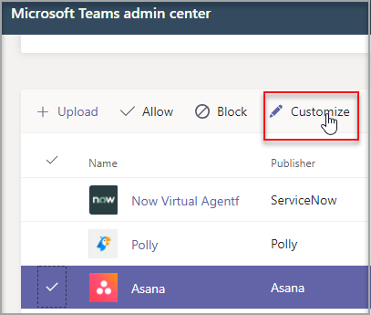
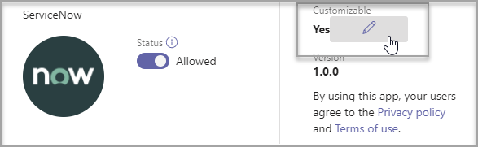
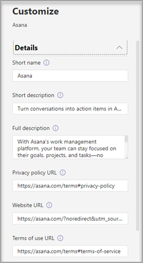
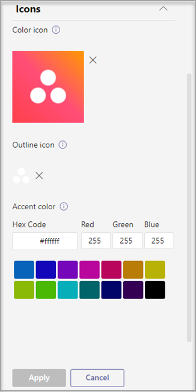
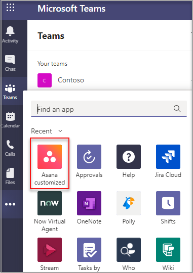
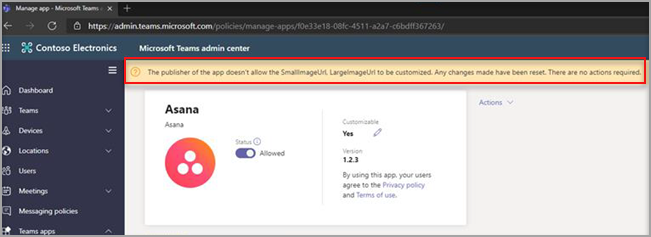
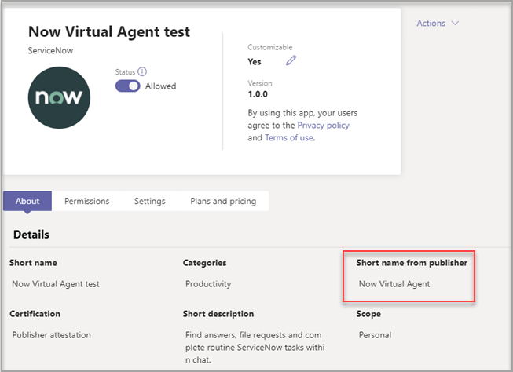

# Customize apps in Microsoft Teams

[!INCLUDE [preview-feature](includes/preview-feature.md)]

 The app developer allows an app to be customized by the admin. The admin can customize or rebrand the app based on the organizational needs from the Teams admin center **Manage apps** page. The details you can modify are:

- short name
- short description
- full description
- privacy policy URLs
- website URL
- terms of use URLs
- color icon
- outline icon
- accent color

> [!Note]
> Changes to branding might require up to 24 hours for the users to see the changes.

## Modify the app's details

1. Sign in to the Teams admin center.
2. Expand **Teams Apps** and select **Manage apps**.
3. Check the **Customizable** column of the apps list to find an app to customize.

   There are three ways to access the customize features:

   - Select next to the app that you want to modify, and then select **Customize**.

     

   - Select the app name and then **Customizable**.

     

   - Select the app name, and then select **Customize** from the **Actions** dropdown.

     

5. Expand the **Details** section and modify the following fields:

    - Short name
    - Short description
    - Full description
    - Website
    - Privacy policy URLs
    - Terms of use URLs

   

5. Expand the **Icon** section.

   a. Upload an icon. Use one full-color icon (192x192) pixel in PNG format.

   b. Choose an icon outline color. Use one transparent outline (32x32) pixel in PNG format.

   c. Select an app accent color that matches the icon.

    

6. Once your app has been customized, select **Apply**.

7. Select **Publish** to publish the modified app.

   The modified app is now listed in your **Manage apps** page. You'll have only one version of the app, since modifying the app features doesn't create a copy of the app.

8. Open your Teams client to see the modified app.

   

> [!Note]
> In case the app publisher no longer allows a field to be customizable, a message appears on the app details page notifying the admin about the fields that can't be customized any longer. All the changes made to that field will be reverted to the original values.

 

## Review app details

You might want to see the app details to review the information.

1. Sign in to the Teams admin center.

2. Expand **Teams Apps** and select **Manage apps**.

3. Select the app name.

4. View the app details, including the original app name **Short name from publisher**.

   

   The **Short name from publisher** remains unchanged even when you customize the app's short name.

## Reset app details to default

1. Sign in to the Teams admin center.

2. Expand **Teams Apps** and select **Manage apps**.

3. Select the app name.

4. Select **Reset to default** from the **Actions** dropdown.

## Related article

- [Manage apps](manage-apps.md)
- [Customize your app store](customize-your-app-store.md)
- [Publish a custom app](submit-approve-custom-apps.md)
