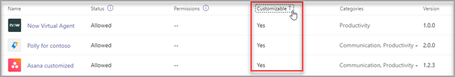

# Customize apps in Microsoft Teams

 Microsoft Teams provides app customization to enhance the Teams experience. Some app developers allow an app to be customized by the Teams admin. The admin can customize or rebrand the app properties based on the organizational needs using the Microsoft Teams admin center **Manage apps** page. The details you can customize are:

- Short name
- Short description
- Full description
- Privacy policy URL
- Website URL
- Terms of use URL
- Color icon
- Outline icon
- Accent color

See the [Teams Manifest schema](/microsoftteams/platform/resources/schema/manifest-schema) for details about the fields that you can customize.

> [!NOTE]
> Customizing apps isn't supported in Government Community Cloud High (GCCH) or Department of Defense (DoD) at this time.
> Currently, this feature is not available for sideloaded Microsoft Teams apps.

## Customize the app's details

To start customizing an app, complete the following steps:

1. Sign in to the [Teams admin center](https://admin.teams.microsoft.com/dashboard).

2. Expand **Teams Apps** and select **Manage apps**.

3. Check the **Customizable** column of the apps list and sort by apps that are customizable.

   

   There are three entry points to access the customize feature:

   - Select next to the app that you want to customize, and then select **Customize**.

     

   - Select the app name and then select the edit icon in **Customizable**.

     

   - Select the app name, click on **overflow menu** hover on **Actions** and select customize.

     

4. Expand the **Details** section and customize the following fields:

    - Short name
    - Short description
    - Full description
    - Website
    - Privacy policy URL
    - Terms of use URL

   

> [!Note]
> Only the fields that the app developer has assigned as customizable will be visible.

1. Expand the **Icon** section.

1. Upload an icon. Use one full-color icon (192x192) pixel in PNG format.

1. Choose an icon outline color. Use one transparent outline (32x32) pixel in PNG format.

1. Select an app accent color that matches the icon.

   

1. Once your app has been customized, select **Apply**.

1. Select **Publish** to publish the customized app.

   The customized app is now listed in your **Manage apps** page. You'll have only one version of the app, since customizing the app features doesn't create a copy of the app.

Now your Teams end users can open their Teams client to see the customized app.

   

### Special considerations for customizing an app

The following note includes important details about customizing an app.

> [!Note]
>
> - When you customize apps, and any description related to an app, ensure that you follow any customization guidelines if provided by the app publisher in their documentation or terms of use. You're also responsible for respecting the rights of others regarding any third-party images you might use.
> - Admin-provided customization data is stored in the nearest region.
> - You are responsible for ensuring that links to terms of use or privacy policy are valid.
> - In case the app publisher no longer allows a field to be customizable, a message appears on the app details page notifying the admin about the fields that can't be customized any longer. All the changes made to that field will be reverted to the original values.
> - We recommend testing app customization changes in a Teams test tenant before making these changes in your production environment.
> - Changes to branding might require up to 24 hours for the users to see the changes.

## Review app details

You might want to see the app details to review the information.

1. Sign in to the Teams admin center.

2. Expand **Teams apps** and select **Manage apps**.

3. Select the app name.

4. View the app details, including the original app name **Short name from publisher**.

   

   The **Short name from publisher** field is only visible if you've changed the app's short name.

## Reset app details to default

At any time, you can reset the app details to the original settings.

1. Sign in to the Teams admin center.

2. Expand **Teams Apps** and select **Manage apps**.

3. Select the app name.

4. Select **Reset to default** from the **Actions** dropdown.

   

## Frequently asked questions

**How long will it take for my users to see the customized app?**

Although the admin can immediately see the changes in Teams Admin Center, it might take up to 24 hours for the end users to see the changes.  

**Can the app provider customize the app for its customers?**

 No, the admin of a tenant needs to customize the app for their tenant using the Teams Admin Center.

**Will the customized app automatically get deployed to replace my current custom app in a tenant?**

No, the tenant admins will have to manually remove any custom app and publish the customized version of the app. If you have customized an app and published it as a custom app, the new app customized using the app customization feature won't replace the current custom app.  

**Will the app usage report also show the customized values such as customized short name?**

 No, the app usage report will still show the original name of the app sent from the publisher.

**Which apps can I customize using the app customization feature?**

You can only customize apps that have been allowed to be customizable by the app publisher. The app publisher will need to opt in to allow its customers to customize the app.

**Will the customized properties show up on the graph permission consent screen?**

No, the permission consent screen will still show the original value sent by the publisher.

## Related article

- [Manage apps](manage-apps.md)
- [Customize your app store](customize-your-app-store.md)
- [Rebrand your apps](https://techcommunity.microsoft.com/t5/microsoft-teams-blog/rebrand-apps-to-your-own-organization-s-branding-with-app/ba-p/2376296)
