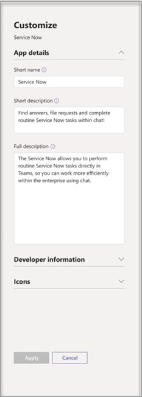
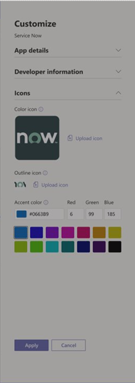

---
title: Customize Microsoft apps in Teams
author: cichur
ms.author: v-cichur
manager: serdars
ms.reviewer: vaagarw
ms.topic: article
ms.tgt.pltfrm: cloud
ms.service: msteams
audience: Admin
ms.collection: 
- M365-collaboration
- Teams_ITAdmin_Help
f1.keywords:
- NOCSH
appliesto: 
- Microsoft Teams
localization_priority: Normal
search.appverid: MET150
description: Learn how to customize apps in Microsoft Teams. 
ROBOTS: NOINDEX, NOFOLLOW
---

# Customize apps in Microsoft Teams

[!INCLUDE [preview-feature](includes/preview-feature.md)]

Now you can customize your organization's apps store in Microsoft Teams with your company branding by adding your logo, custom backgrounds, and custom text colors to make it more inviting to end users.

> [!Note]
> Changes to branding will require 24 hours to take effect.

## Modify the app's appearance

1. Sign in to the Teams admin center.
2. Expand **Teams Apps** and select **Manage apps**.
3. Select the app that you want to modify, and then select **Customize**.
   The **Customize** panel opens.

    

    The **App details** section includes the following:

    - Short name
    - Short description
    - Full description

4. Expand the **Developer** section. It includes the following:

   - Website
   - Privacy policy URLs
   - Terms of use URLs

5. Expand the **Icon** section.

    

    In this section, you have the option to upload an icon or create your own. In addition to the icon, you can choose an app display background color.

    

6. Once your app has been customized, select **Apply**.

## Related article

[Publish a custom app](http//docs.microsoft.com/MicrosoftTeams/manage-apps)
[Manage your apps](customize-your-app-store.md)
