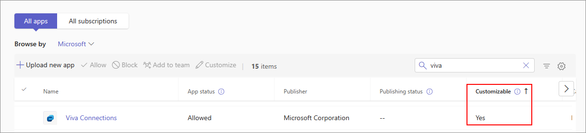

# Customize appearance of apps in your organization's Teams store

Microsoft Teams lets admins customize Teams app to enhance store experience and adhere to their organization's branding. An app developer can allow their app to be customized by a Teams admin. You can then update the app properties based on the organizational needs, in the Manage apps page in Teams admin center. The details you can customize are:

* Short name
* Short description
* Full description
* Privacy policy URL
* Website URL
* Terms of use URL
* App icon
* Outline color of the icon
* Accent color

For information about the various metadata fields of the app, see the [Teams Manifest schema](/microsoftteams/platform/resources/schema/manifest-schema) in the developer documentation.

> [!NOTE]
> You cannot customize sideloaded apps in any organization. You cannot customize any app in Government Community Cloud High (GCCH) or Department of Defense (DoD) clouds.

## Customize details of an app

To customize an app, complete the following steps:

1. Sign in to the Teams admin center.

1. Expand **Teams apps** and select **[Manage apps](https://admin.teams.microsoft.com/policies/manage-apps)**.

1. Check the **Customizable** column of the apps list and sort by apps that are customizable.

   

   There are three entry points to access the customize feature:

   * Select next to the app that you want to customize, and then select **Customize**.

     

   * Select the app name and then select the edit icon in **Customizable**.

     

   * Select the app name, click on **overflow menu** hover on **Actions** and select customize.

     

1. Expand the **Details** section and customize one or more of the following fields. The fields assigned as customizable by the developer are visible.

    * Short name
    * Short description
    * Full description
    * Website
    * Privacy policy URL
    * Terms of use URL

   

1. Expand the **Icon** section.

1. Upload an icon. Use one icon (192 x 192) pixel in PNG format.

1. Choose an icon outline color. Use one transparent outline (32x32) pixel in PNG format.

1. Select an app accent color that matches the icon.

   

1. After customizing the app, select **Apply**.

1. Select **Publish** to publish the customized app.

   The customized app is now listed in your **Manage apps** page. You'll have only one version of the app, since customizing the app features doesn't create a copy of the app.

Now your Teams end-users can see the customized app in their client.

   

Note the following details about customizing an app:

* When you customize apps, and any description related to an app, ensure that you follow any customization guidelines if provided by the app publisher in their documentation or terms of use. You're also responsible for respecting the rights of others regarding any third-party images you might use.

* Admin-provided customization data is stored in the nearest region.

* You are responsible to ensure that links to terms of use or privacy policy are valid.

* In case the app publisher no longer allows a field to be customizable, a message appears on the app details page notifying the admin about the fields that can't be customized any longer. All the changes made to that field will be reverted to the original values.

* We recommend testing app customization changes in a Teams test tenant before making these changes in your production environment.

* Changes to the branding may require up to 24 hours to propagate to all the users.

* For an app to become customizable, the developers can provide a new version of the app. You upload the new version and remove the previous version of the app. If you have customized an app and published it, the new app customized using the app customization feature won't replace the current app.

* The [app usage report](Teams/teams-analytics-and-reports/app-usage-report.md) displays the original name of the app that is provided by the publisher.

* The Microsoft Graph permission consent dialog displays the original name of the app that is provided by the publisher. It helps you to accurately identify an app while providing permissions to it.

## Review app details

You might want to see the app details to review the information.

1. Sign in to the Teams admin center.

1. Expand **Teams apps** and select **[Manage apps](https://admin.teams.microsoft.com/policies/manage-apps)**.

1. Select the app name.

1. View the app details, including the original app name **Short name from publisher**.

   

   The **Short name from publisher** field is only visible if you've changed the app's short name.

## Reset app details to default values

You can reset the app details to the original values provided by the app developer. The option is only available for app that you customize.

1. In Teams admin center, access **Teams Apps** > **[Manage apps](https://admin.teams.microsoft.com/policies/manage-apps)**.

1. Select the app name.

1. Select **Reset to default** from the **Actions** menu.

   

## Related article

* [Manage apps](manage-apps.md)
* [Customize your organization's app store](customize-your-app-store.md)
* [Rebrand your apps](https://techcommunity.microsoft.com/t5/microsoft-teams-blog/rebrand-apps-to-your-own-organization-s-branding-with-app/ba-p/2376296)
