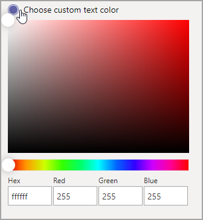

# Custom apps store in Microsoft Teams

[!INCLUDE [template](includes/preview-feature.md)]

Now you can customize the Teams Apps store with your organizational branding by adding your logo, custom backgrounds, and custom text colors to make it more inviting to end users.

> [!Note] 
> Changes to branding will require 24 hours to take effect.

## Customize your organization logo

<!-- Bookmark used by Context Sensitive Help (CSH). Do not delete. -->

<!-- Do not remove the bookmark link above. -->

Here you can upload your organization logo. The logo selected will appear in the Teams client in **Apps** > **Built for your tenant** page.

When you select the **Choose a picture** option, you can upload the file of your choice. The logo should be 240x60, or it will be scaled to that size. It should be no larger than 5MB. The supported formats are:

- .svg
- .png
- .jpg

The logo is shown in the top right corner of the tenant app catalog in the Teams store.

## Customize your small logo

<!-- Bookmark used by Context Sensitive Help (CSH). Do not delete. -->

<!-- Do not remove the bookmark link above. -->

Your organization logomark or small logo is an image or symbol that represents your organization brand and doesn't include your company name. The logomark helps team members identify the Apps store. The logo selected will appear in the Teams client in Apps page.

When you select the **Choose a picture** option, you can upload the file of your choice. The logomark should be 32x32 pixels, or it will be scaled to that size. It should be no larger than 5MB. The supported formats are:

- .svg
- .png
- .jpg

The small logo is shown next to the **Built for tenant** section title in the Teams store landing page.

## Customize the background color

<!-- Bookmark used by Context Sensitive Help (CSH). Do not delete. -->

<!-- Do not remove the bookmark link above. -->

The background should have enough contrast with the text so the users can read the text clearly. The background will appear in the Teams client in **Apps** > **Built for your tenant** header.

Your options are:

- Use Teams client default background theme
- Choose a picture. When you select the background picture, you can upload the file of your choice. The background should be 1212x100 pixels, or it will be scaled to that size. It should be no larger than 5MB. The supported formats are:
  - .svg
  - .png
  - .jpg
- Choose a custom background. When you select **Choose a custom color**, a color chooser opens. Select the color that you want by adjusting the scale of the color chooser.

The background image or color is used as the background for the top banner in the Teams tenant app catalog.

## Customize the text color of your name

<!-- Bookmark used by Context Sensitive Help (CSH). Do not delete. -->

<!-- Do not remove the bookmark link above. -->

The text color should have enough contrast with the background that the users can read the name of your organization clearly. The text will appear in the Teams client in **Apps** > **Built for your tenant** header.

When you select **Choose a custom color**, a color chooser opens. Select the color that you want by adjusting the scale of the color chooser.

 

## Complete the customization of your team apps store

When you've finished customizing your apps store, be sure to click **Save** to save your changes.
To preview your changes, click **Preview apps store** to see a representation of your customized apps store.

> [!Note]
> The representation might vary from the final version of your customized apps store because some default colors are based on your users' version of Teams client.

## Related article

[Manage your apps](manage-apps.md)
