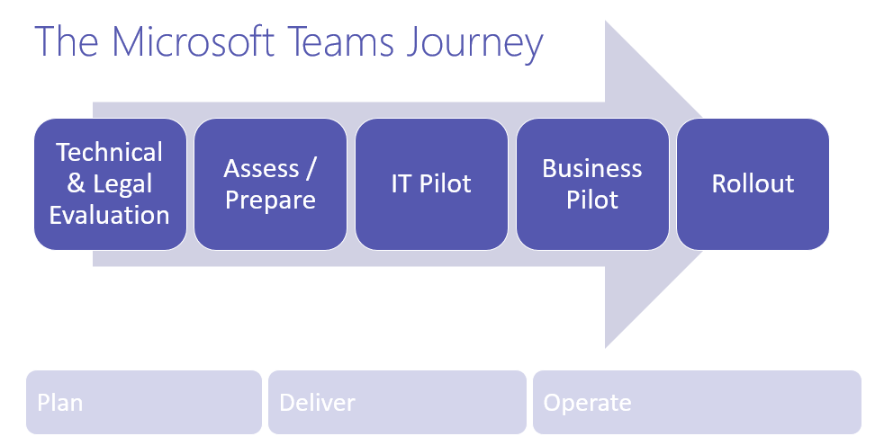
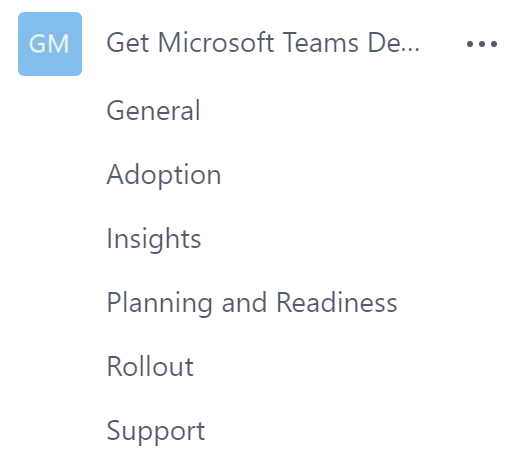

Overview of a Microsoft Teams deployment
========================================

New to Microsoft Teams? Read the [overview](teams-overview.md) to get up to speed first.

A typical Microsoft Teams journey may take the following form:

1.  Technical and legal assessment in the early stages to identify and define what controls are required to implement Microsoft Teams in your organization.

2.  Undertake a network assessment and prepare for the rollout. At this point you can start to create the adoption and change management strategy and key user stories that drive user engagement during and after the rollout.

3.  Test these change management and adoption strategies with an IT Pilot.

4.  Refine and run a business pilot in one or two business units leveraging these strategies.

5.  Refine and leverage the strategy and learnings for a wider rollout.

During the journey, one of the first uses of Microsoft Teams in your environment is the IT Pilot. Consider leveraging this pilot to help your team engage to plan, deliver, and operate Microsoft Teams and outreach to the business users.

Here’s an example of how you could set up a team / channel structure to help drive towards your goal of delighting your end users through the delivery of Microsoft Teams. To get your business units thinking of how to set up their own teams and channels, you could share how you set up your first team / channels to help them and perhaps encourage users to create a simple table like the one below to drive the conversation.

|Team name |Channels  |Tabs  |
|---------|---------|---------|
|Get teams deployed  Members:<ul><li>Project Sponsor</li><li>Business Analyst</li><li>Project Manager</li><li>Collaboration IT Pro</li><li>Networking IT Pro</li><li>Adoption Lead </li><li>Support Lead</li></ul>Owners: <ul><li>Project Manager</li><li>Collaboration IT Pro</li></ul>      |Planning  and Readiness   Adoption   Rollout   Support   Insights                        |Link practical guidance for Microsoft Teams web page ([https://docs.microsoft.com/MicrosoftTeams](https://docs.microsoft.com/MicrosoftTeams))                               |

This setup would look like this in Microsoft Teams:

||||
|---------|---------|---------|
|     |Decision Point         |What initial teams and channels do you want to create for your IT pilot?         |
|     |Next Steps         |Document what your initial teams/channels will be for your IT Pilot         |

To track these decision points, download the technical planning questionnaire in [Quick start: Successfully enabling Microsoft Teams](https://download.microsoft.com/download/F/3/9/F39B4F10-5720-4516-87E1-91E5A5678EFB/MicrosoftTeams-AdminQuickStart-EnableTeams.docx).

## How Microsoft deployed Teams

To see how Microsoft deployed and is using Microsoft Teams for collaboration, see:

- [Deploying Microsoft Teams streamlines collaboration and improves teamwork](https://www.microsoft.com/itshowcase/Article/Content/1013/Deploying-Microsoft-Teams-streamlines-collaboration-and-improves-teamwork)
- [Microsoft Teams increases collaboration in the modern workplace at Microsoft](https://www.microsoft.com/itshowcase/Article/Content/1012/Microsoft-Teams-increases-collaboration-in-the-modern-workplace-at-Microsoft)

