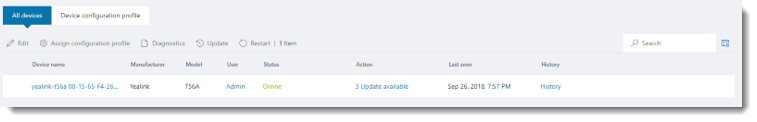
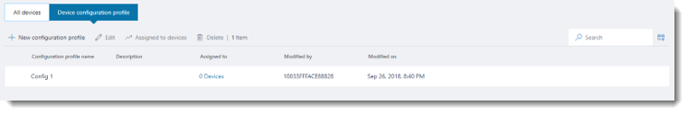
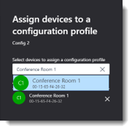

# Manage your devices in Microsoft Teams

 As an admin, you can easily manage all devices used with Teams in your organization from one place. In the Microsoft Teams & Skype for Business admin center, in the left navigation, go to **Devices** > **Manage Devices**. You can view and manage the device inventory for your organization and do tasks such as update and restart devices and monitor diagnostics for devices. You can also create and assign configuration profiles to a device or groups of devices. 

## What devices can you manage?
To manage devices in the Microsoft Teams & Skype for Business admin center, the device must be enrolled in Teams. A device is automatically enrolled the first time a user signs in to Teams on the device. The types of devices that you can manage include [NEED CONTENT HERE].

> [!NOTE]
> If you have Microsoft Intune, devices are automatically enrolled in Intune. After a device is enrolled, device compliance is confirmed and conditional access policies are applied to the device. 

## Manage devices in Teams

 Using the Microsoft Teams & Skype for Business admin center

1. In the left navigation, go to **Devices** > **Manage Devices**.
2. Select **All devices**.  

    

    From here, you can view and manage all devices enrolled in Teams in your organization. Information that's listed with each device includes the device name, manufacturer, model, user, status, action, last seen, and history.  You can customize the view to show the information that you want. 

    Here's how to 
    
    
    |To do this...  |Do this |
    |---------|---------|
    |Change information about a device    |         |
    |Manage software and firmware updates   |         |
    |Restart a device   |         |
    |View diagnostics   |         |
 

### Update devices
 Using the Microsoft Teams & Skype for Business admin center

1. In the left navigation, go to **Devices** > **Manage Devices**.
2. Select **All devices**.   

### Restart devices

## Work with configuration profiles in Teams

Use configuration profiles to manage settings and features for Teams devices in your organization. You can create or upload configuration profiles to include settings and features you want to enable or disable and then assign a profile to a device or groups of devices. 

 

Here's some examples of profiles and when to use them:[NEED CONTENT HERE]

### Create a configuration profile

 Using the Microsoft Teams & Skype for Business admin center

1. In the left navigation, go to **Devices** > **Manage Devices**.
2. Select **Configuration profiles**, and then select **New configuration profile**.
3. Enter a name for the profile and if you want, add a friendly description. 
4. Complete the following, and then click **Save**.
    
    |Area  |Setting |Description |
    |---------|---------|---------|
    |**General**  |  **Device lock**       |Turn on or turn off device lock. If you turn this on, set a timeout value and PIN.       |
    |     |    **Language**     |Set the language for the device.       |
    |    |     **Timezone**    |Set the timezone for the device.      |
    |     |  **Time DST**       |Control how the device handles Daylight saving time (DST).      |
    |     |   **Date format**      | Choose the date format.        |
    |     |    **Time format**     | Choose the time format.       |
    |**Hardware settings**  |  **Display screen saver**       |Turn on or turn off the screen saver. If you turn this on, set a timeout value.       |
    |     |    **Display backlight brightness**     |Control the backlight brightness.       |
    |    |     **Display backlight timeout**    |Set a timeout value for the backlight.     |
    |     |  **Display high contrast**       |Turn on or turn off high contrast display.    |
    |     |   **Silent mode**      | Turn on or turn off silent mode.       |
    |     |    **Bluetooth**     | Turn on or turn off Bluetooth.       |
    |   **Device settings**  |    **Logging enabled**     | Turn on or turn off logging.      |
    |     |    **Logging types**     | Set logging types.       |
    |     |    **Network DHCP**     | Set the network DHCP server.     |    
    |     |    **Network Wifi**     | Set the wifi network.      |
    |     |    **Network PC Port**     | Set the network PC port.        |
    |     |    **Device's default admin password**     | Set the admin password.      |
    |     |    **Screen capture**     | Turn on or turn off screen capture.       |
 
### Upload a configuration profile

 Using the Microsoft Teams & Skype for Business admin center

1. In the left navigation, go to **Devices** > **Manage Devices**.
2. Select **Configuration profiles**, and then select **[NEED CONTENT HERE]**.

### Assign a configuration profile

 Using the Microsoft Teams & Skype for Business admin center

1. In the left navigation, go to **Devices** > **Manage Devices**.
2. Select **Configuration profile**, and then under **Assigned to** in the profile you want to assign, click the link.  
3. In the **Assign devices to a configuration profile** pane, search for and select the devices you want to assign.

   
3. Click **Save**.