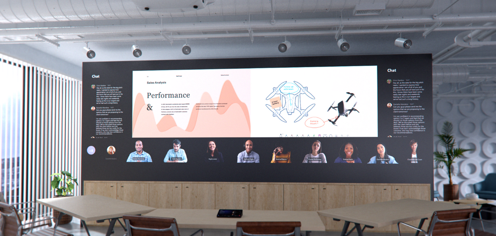
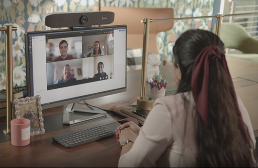
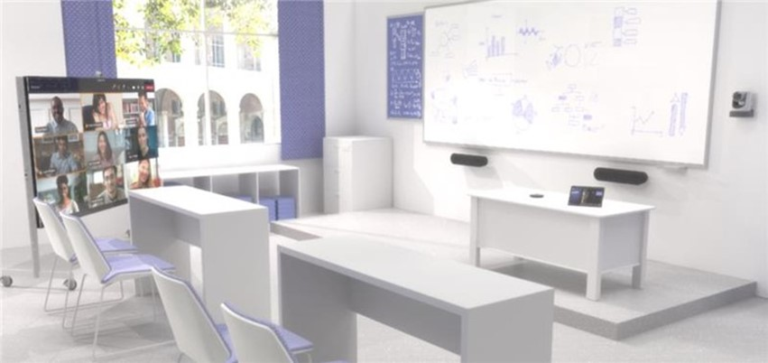
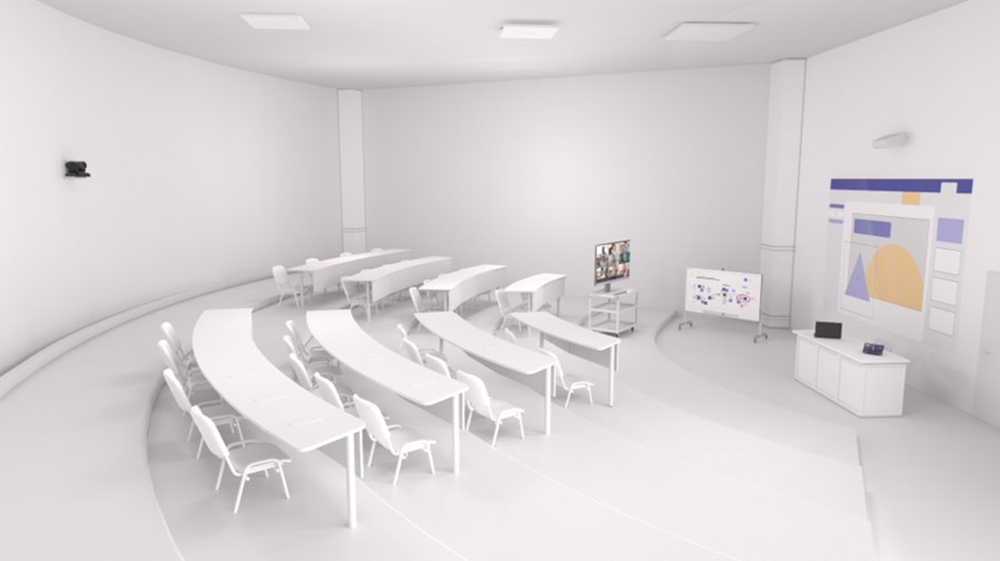

# Teams devices for Education

## Overview

### Hybrid and blended education is here to stay

Learning in the future will be hybrid and blended. Educators and students both require a fluid experience realized across a continuum of spaces, motivated by a need for flexibility when it comes to how and where learning takes place. Education won't be confined to a physical classroom or strictly virtual environments; remote participation will be just as dynamic as in-person learning. The flexibility that hybrid and blended learning offers, while not new to all, will be new to many and will have far-reaching impact.

The modern, hybrid classroom will be boundaryless. Students and educators will be empowered by synchronous and asynchronous learning as well as interactive, multi-modal engagement designed to meet the needs of every student in every circumstance. Teams devices have been designed to support a range of spaces so that no voice goes unheard.

### Student and educators alike excel with Microsoft Teams Rooms

- Microsoft Teams Rooms enable safe, secure, student-focused learning, from classroom integration to breakout rooms for more focused collaboration, and even one-on-ones to address specific student needs and questions.

- Using personal and shared devices in a digital or hybrid learning environment helps students socialize and gain key skills they'll use throughout their lives.

- Teams functionality is not restricted to the classroom. Educators and administrators can easily connect with other faculty and staff within the same school or within the entire school district from their home, office, or wherever else they've optimized their environment. With Teams, professional development is accessible from anywhere.

### Bring digital flexibility to physical spaces

To ensure students and educators working remotely can fully participate in group collaboration and meetings, education workspaces will need technology to help bridge the divide between the old, in-person models and the new, hybrid and remote spaces.

*This image represents future technology.*

## Why choose a native Teams experience?

Microsoft Teams certified peripherals and rooms are purpose-built, native calling and meeting solutions delivering a complete Teams meeting experience, with high-definition audio and video, on Teams-certified first- and third-party hardware.

When we say "purpose-built and native," we mean the experience is specifically and thoughtfully designed by Microsoft for the Teams user.

Teams Rooms go beyond what can be done with Teams on personal devices by providing unique in-room capabilities, like one-touch join, content cameras to share physical whiteboards into the meeting in an intelligent way, and proximity features like seamlessly transferring a Teams meeting from your personal device to the room.

Non-native and self-built systems that rely on external services, or a bring-your-own-device connection, will never truly match the ease of use or immersive quality of a native Teams Room.

**Purpose-built for Teams**:

Advanced audio and video and sharing

**Expansive device portfolio for any room**:

Select from fully modularized or integrated form factors across Android or Windows operating systems

**Reimagined room experiences**:

Join Teams meetings friction-free to engage in inclusive, collaborative meetings for students and educators alike

**Easily managed from one place**:

Fully manage and keep devices up to date and ready to go in Teams Admin Center and enable 24x7 proactive management from Microsoft with Microsoft Teams Rooms Premium

## Space considerations

### What is the role of the space?

Physical spaces are designed to accommodate the kinds of activities that will happen there. Different types of activities or connections may facilitate different meeting behaviors. A classroom is going to see much different behavior than that of a boardroom, for example.

Furniture helps define how a space is going to be used. Furniture and finishes will be important to think about for a classroom or meeting space to be effective.

For existing spaces, the technology should align to the room's existing layout. As an example, if tables and chairs are set up for presentations and in-person instruction, the technology should follow. Microphones and cameras need to be positioned optimally in the room, not simply added anywhere they fit without consideration of how the room is used. Remote participants need to see the presentation material as clearly as in-person participants.

For new spaces, the intended use of the room should drive both furniture and technology considerations. For example, when designing a room intended to facilitate multiple purposes (such as individual work and group interaction), the space should be separated into two separate zones for maximum efficiency.

The following pair of images illustrates optimized Teams setups in an existing classroom space (top) and in a new, multi-purpose space (bottom):

 

### What is the function of the space?

*Will the activities in the space focus on collaborative co-creation?*

Creativity requires a layout and a technology deployment that is designed around user collaboration. The right space facilitates work between users and the technology seamlessly and eliminate friction for even the most novice users. Teams devices are designed to be user-friendly enough for young students to navigate adeptly and for educators to control and customize from first use.

*What about spaces where content sharing with both in-person and remote participants is the priority?*

Content sharing and remote collaboration each demand a different physical layout and technology experience. The right space facilitates discussion and makes it easy for everyone to see and review shared content. No matter what space you are equipping, from a dorm flex space to a lecture hall, it needs to be Teams enabled.

## Technology considerations

The right audio and video technology choices will help users get the most out of their Microsoft Teams meetings.

*Audio*:

Audio considerations are critical to ensure both remote and in-room participants can be clearly heard and understood. Microphone and speaker coverage must include every seat in the room without leaving gaps.

### What are the right audio devices for each space?

Pairing the right microphone and speakers for each space will give the best possible results for being heard clearly without distraction.

- In potentially noisy spaces, such as a common room in the home or desks in a classroom, headsets offer the best possible experience by restricting sound only to the meeting participants. Headset microphones are designed to pick up only the meeting speech, and the speakers are contained so that only the meeting attendees can hear what is going on.

- In more private settings (for example, a student's bedroom), devices choice can expand to include things like personal speakerphones. These personal devices allow for the same level of conversation quality as on headsets, but without the restriction of having to wear the device.

- In shared spaces, the options expand, but the same principles remain: meeting participants need to be heard and hear others clearly.
  - All-in-one audio devices are easy-to-deploy, high-quality options for smaller spaces with a limited number of participants seated relatively close to the audio device.
  - In larger spaces, the microphones and speakers separate to ensure maximum coverage across all participants in the space. Many solutions for medium- to large-sized rooms are available as part of a kit that requires no configuration, only physical installation of microphones and speakers.
  - In the very largest and most complex spaces, solutions are available that allow for a variety of microphone and speaker types to be used together, such as capturing a lecturer and audience voice from a large hall while simultaneously bringing the call to everyone. These solutions are best achieved when deployed by a [Microsoft partner](https://cloudpartners.transform.microsoft.com/teams-mrpp) who has expertise in the design and deployment of more technically involved solutions.

*Video*:

Video is as important as audio. Capturing physical, non-verbal communication like facial expressions or gestures is as important as the classroom or meeting content to ensure maximum engagement and understanding. Rooms need to be equipped with the appropriate size of display so that everyone can experience the meeting properly, whether in the room or remote. Rooms also need to have the right camera coverage and field of view (FOV) to effectively capture all the in-room meeting participants for those joining remotely.

### What are the right cameras for each space?

High-quality video is a necessity for modern Teams collaboration. Technology for cameras has advanced significantly with high-quality cameras now available for all spaces.

- Included cameras in devices like laptops and tablets are a great starting point for use by individuals participating in video calls. For users looking to bring a richer video experience to a personal space, external cameras represent a step up from embedded devices and can be used in a greater number of scenarios and configurations, ensuring that call participants share the best quality view of themselves. These devices easily install with simple USB connections found on every PC.

- In shared spaces, the options and features expand. Smaller rooms may be covered by cameras included within all-in-one audio devices, such as soundbars. These cameras typically feature a wide field of view, ensuring that they capture every participant in the space in a single shot. Many of these cameras also feature things like intelligent framing of the image (so that the camera only shows the people in the meeting and not empty chairs) to track and understand space utilization.

- In larger rooms, cameras feature the technology needed to capture participants in a variety of locations at varying distances away. These cameras can capture groups or focus on specific individuals while maintaining great visual clarity. Devices that can track and feature only active speakers are regularly used in larger spaces so that many participants may be featured individually throughout a meeting as they contribute their thoughts.

### How do you interact virtually beyond video streams?

Teams meetings go beyond just audio and video calling for participants. There are a variety of ways to share and interact dynamically with content.

A common scenario is sharing content directly from a participant's device. Individual users can share the full audio and visual experience from individual applications or the entire contents of their screen directly to the meeting for everyone to view. This extends to all shared spaces with installed devices. Microsoft Teams Rooms also have the option to use a wired monitor connection to allow participants to share even if they lack the ability to join the meeting individually.

For content from the physical world, spaces with Microsoft Teams Rooms systems can handle a whiteboard or document camera that allows for the coordinated review and discussion of content from the space.

For a fully interactive experience, interactive displays (such as the Surface Hub family of products and the Microsoft digital Whiteboard) make it easy to interactively create content for in-person students as well as with remote students.

## Example spaces

### Public space

A public space, such as a common room in a family home or a table at a library, usually means users have to contend with noise, a lack of a permanent workspace, and other potential distractions.

*The solution shown is:*

A personal computer device used with a certified Teams headset.

*Why this layout and device type?*

A laptop running Teams ensures the user is not confined to one working area and can move their setup without having to sign in and out of any meetings. A headset with a built-in microphone restricts audio to meeting participants and filters background noise. The laptop's built-in camera ensures the user can be seen by all meeting participants.

*Example* *devices:*

- [HP Laptop – 14t-dq200](https://www.hp.com/shop/pdp/hp-laptop-14t-dq200-touch-optional-2d129av-1?jumpid=ma_intel-optane_product-tile_clamshell-laptops_1_2d129av-1_hp-laptop---14t-dq20)

- Alternate laptop options include:
  - [Microsoft Surface Laptop 4](https://www.microsoft.com/d/surface-laptop-4/946627FB12T1?OCID=AID2200083_SEM_6341646f18fa14c7e4d80565e0debe72%3aG%3as&ef_id=6341646f18fa14c7e4d80565e0debe72%3aG%3as&s_kwcid=AL!4249!10!79302431130415!79302713431201&msclkid=6341646f18fa14c7e4d80565e0debe72&activetab=pivot%3aoverviewtab) - Greater for Higher Education
  - [Microsoft Surface Go Laptop](https://www.microsoft.com/d/surface-laptop-go/94FC0BDGQ7WV?OCID=AID2200083_SEM_215e2d5fa8281476bdd84c555fcf1fad%3aG%3as&ef_id=215e2d5fa8281476bdd84c555fcf1fad%3aG%3as&s_kwcid=AL!4249!10!78890114459337!78890368468596&msclkid=215e2d5fa8281476bdd84c555fcf1fad&activetab=pivot%3aoverviewtab) – Great for K-12

- [EPOS Sennheiser Headset – Adapt 560](https://www.microsoft.com/microsoft-teams/across-devices/devices/product/epos-sennheiser-adapt-560/467)

*Installing or setting up this solution is:*

Very easy. This is something that can be handled entirely by end users by simply combing their PC with a certified headset for audio and video calling.

### Personal space

A personal space can be anything from a student's bedroom to an educator's office. Personal spaces generally mean the user has privacy within their working or learning environment, as well as a dedicated workspace.

*Example A:*

*The solution shown is:*

A personal PC with a high-quality USB camera and a separate USB speakerphone audio device.

*Why this layout and device type?*

A smaller, quieter, more focused personal space means the user doesn't have the distractions of public shared spaces or a traditional classroom. A PC running Teams allows for a dedicated workspace, and a USB camera ensures the user is seen within the meeting in high quality. A speakerphone device is best in private spaces where meeting audio doesn't have to compete with other noise and distractions.

*Devices shown:*

- Personal PC with Windows 10 and External Display

- [Yealink USB Webcam – UVC20](https://www.microsoft.com/microsoft-teams/across-devices/devices/product/yealink-uvc20/854)

- [Poly Speakerphone – Sync 20](https://www.microsoft.com/microsoft-teams/across-devices/devices/product/poly-sync-20/825)

*Example B:*

*The solution shown is:*

A personal PC with an all-in-one camera, microphone, and speaker soundbar.

*Why this layout and device type?*

Serving the same purpose as Example A, this solution addresses a focused personal space. A PC running Teams allows for a dedicated workspace in combination with a combination USB camera, microphone, and speaker soundbar.

*Devices shown:*

- Personal PC with Windows 10 and External Display

- [Poly Soundbar – Studio P15](https://www.microsoft.com/microsoft-teams/across-devices/devices/product/poly-studio-p15/821)

*Installing or setting up this solution is:*

Very easy. This can be handled entirely by end users by combing their PC with the certified USB peripherals. Cameras and personal soundbars can easily be mounted above the display.

### Classrooms

Classrooms, including traditional and reverse classrooms, require active engagement from everyone present. Effective instruction, discussion, and collaboration among many parties is key.

*The solution shown is:*

A classroom designed for both in-person and remote student participants with a layout that accommodates a single educator addressing both groups simultaneously.

*Why this layout and device type?*

A large display gives remote participants a physical presence within the room, along with front-of-the-room speakers that allow their voices to be heard by all, even by those at desks furthest from the source. Microphones are situated at the front of the room so teachers and students can be heard by all. A traditional whiteboard for analog content can be captured the room system and shared with both in-room and remote participants. The digital Microsoft Whiteboard is also a good solution for collaboration between remote and in-person students, as well as for post-class reference.

*Devices shown:*

- Teams Rooms system - [Microsoft Surface Hub 2S](https://www.microsoft.com/microsoft-teams/across-devices/devices/product/microsoft-surface-hub-2s/822)
  - Note that the Surface Hub solution represents a premium experience for collaboration and interactive usage. The [Microsoft Teams Rooms solution](https://www.microsoft.com/microsoft-teams/across-devices/devices/category/teams-rooms/20?page=1&filterIds=) paired with a large display can be used as an alternative in this same scenario.

- Analog Whiteboard capture – [Logitech Brio Content Camera Kit](https://www.microsoft.com/microsoft-teams/across-devices/devices/product/logitech-brio-content-camera-kit/349)

- Camera and Audio - [Logitech Rally Plus kit](https://www.logitech.com/products/video-conferencing/room-solutions/rally-ultra-hd-conferencecam.html)

- Touch Console for Room Control – [Logitech TAP](https://www.logitech.com/products/video-conferencing/room-solutions/tap.html?crid=1691)

*Installing or setting up this solution is:*

Complex. This room features a physical installation, including wiring, that requires a knowledgeable AV deployment partner to properly plan for and deploy the camera and audio solutions so that they work seamlessly for the end users in the space.

### Lecture halls

Much like classrooms, lecture halls contain numerous students who must focus on an educator and any information they're presenting. However, lecture halls generally don't require the same amount of interaction among students. The focus is on information, not collaboration.

*The solution shown is:*

A lecture hall designed for both in-person and remote student participants with a layout that accommodates a single educator addressing both groups simultaneously, as well as creating and annotating content from a touch surface.

*Why this layout and device type?*

Remote participants can see the same field of view that in-person participants have via the mounted camera. The lecturer can see the remote students via their cameras on a display screen. A dedicated presentation screen and a touch-surface screen for whiteboarding display the lecturer's educational material for all. Ceiling-tile microphones and powerful speakers make sure the lecturer and any student questions are heard clearly.

*Devices shown:*

- Teams Rooms system – [Crestron Flex C100 for Teams](https://www.crestron.com/Products/Workspace-Solutions/Unified-Communications/Crestron-Flex-Integrator-Kits/UC-C100-T) with both an installed projector and a cart-based display

- Optional Digital Whiteboard - [Microsoft Surface Hub 2S](https://www.microsoft.com/microsoft-teams/across-devices/devices/product/microsoft-surface-hub-2s/822)

- Camera – [AVer CAM520 Pro](https://www.microsoft.com/microsoft-teams/across-devices/devices/product/aver-cam520-pro-standard/575)

- Installed Audio – [QSC and Sennheiser for Large Rooms](https://www.microsoft.com/microsoft-teams/across-devices/devices/product/qsc-meeting-room-audio-in-ceiling-speakers/701)

*Installing or setting up this solution is:*

Highly complex. This room features a physical installation that will require a knowledgeable AV deployment partner to properly plan for and deploy the camera and audio solutions so that they work seamlessly for the end users in the space. The installation requires expertise as it relates to wiring, audio configuration, and correct configuration of both the Microsoft Teams Rooms system and the associated Surface Hub 2 device.

### Multi-purpose spaces

Teams can be implemented in almost any educational or multi-purpose space you can think of. Libraries, mixed-use presentation and collaboration spaces, café spaces, and open-air spaces can all be outfitted with a Teams system or Teams devices.

*This solution shown is:*

A room system with a large, projector-based front-of-room display, multiple touch consoles for operation, and multiple Surface Hub 2 devices for a wide range of uses.

*Devices shown:*

- Teams Rooms system – [Crestron Flex C100 for Teams](https://www.crestron.com/Products/Workspace-Solutions/Unified-Communications/Crestron-Flex-Integrator-Kits/UC-C100-T) with installed projector

- Optional Dual Digital Whiteboards - [Microsoft Surface Hub 2S](https://www.microsoft.com/microsoft-teams/across-devices/devices/product/microsoft-surface-hub-2s/822)

- Camera – [Yealink UVC84](https://www.yealink.com/product/camera-uvc84)

- Installed Audio – [QSC and Sennheiser for Large Rooms](https://www.microsoft.com/microsoft-teams/across-devices/devices/product/qsc-meeting-room-audio-in-ceiling-speakers/701)

*Installing or setting up this solution is:*

Highly complex. A multi-purpose space as described requires a knowledgeable AV deployment partner to properly plan for and deploy the projector-based display and camera and audio solutions, as well as to correctly configure both the Microsoft Teams Rooms system and the associated Surface Hub 2 devices so that they work seamlessly for the end users in the space.

## Don't forget security

It's vital to ensure your solutions are secure against cyber threats. Microsoft uses cutting-edge AI and automation to keep data and private information safe when using a Teams Rooms system or device. Protecting your school or institution starts with identity and access management (via the Azure Active Directory) and device management (via Intune/AutoPilot).

## More information

View the following pages to learn more about Teams devices and partners:

[Microsoft Teams for Education](https://www.microsoft.com/education/products/teams) – A great source of information for using Microsoft Teams in education

[Certified devices for Microsoft Teams](https://www.microsoft.com/microsoft-teams/across-devices/devices/product/poly-sync-20/825) – A comprehensive list of devices certified for Microsoft Teams

[Learn More about Microsoft Teams Rooms](/microsoftteams/rooms) – A guide to Microsoft Teams Rooms covering planning, deployment, and usage

[Microsoft Teams Rooms Partner program](https://cloudpartners.transform.microsoft.com/teams-mrpp) – A list of worldwide partners available to assist with planning and deploying Teams Rooms systems
