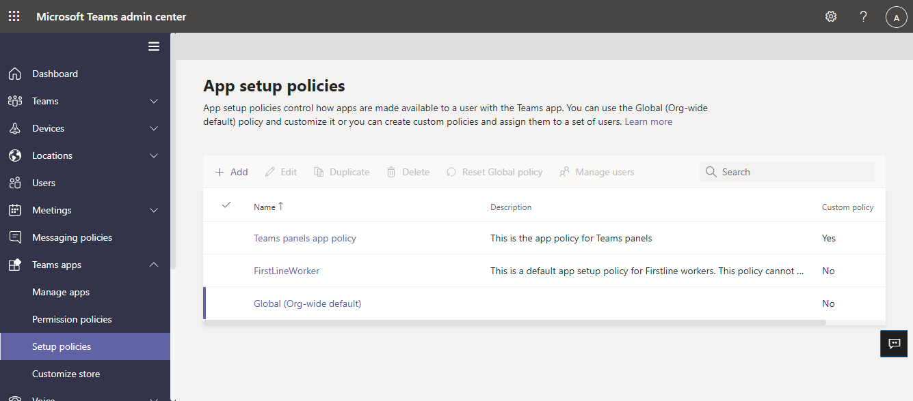

# Conditional Access and Intune compliance policies for Microsoft Teams Rooms

This article provides supported Conditional Access policies for Microsoft Teams Rooms on Windows and on Android, as well as best
practices and requirements for Teams Rooms devices that are used in shared spaces.

## Before you begin

Teams Rooms must already be deployed on the devices you want to assign
Conditional Access policies to. If you haven’t deployed Teams Rooms yet,
see [Deploy Microsoft Teams Rooms with Office 365](/rooms/with-office-365.md)
and [Deploy Microsoft Teams Rooms on Android](collab-bar-deploy.md)
for more information.

An Azure Active Directory P1 Service Plan is required to use Conditional
Access. It’s included in the Microsoft Teams Rooms license.

## Teams Rooms Conditional Access best practices 

When Teams Rooms are used in shared spaces, they need to be secured so
that they can be safely accessed by different users. Conditional Access
policies can be used to secure them. For an overview of Conditional
Access in Azure Active Directory (Azure AD), see [What is Conditional
Access in Azure Active Directory?](/azure/active-directory/conditional-access/overview).

When using Conditional Access to secure Teams Rooms, consider the
following best practices:

-   To simplify deployment and management, include all Microsoft 365
    room resources accounts associated with Teams Rooms in one user
    group.

-   Have a naming standard for all Teams Rooms resource accounts. For
    example, the account names ‘mtr-room1@contoso.com’ and
    ‘mtr-room2@contoso.com’ both start with the prefix ‘mtr-‘.
    Standardizign account names lets you use dynamic groups in Azure AD
    to automatically apply Conditional Access policies to all of these
    accounts at once. See [Rules for dynamically populated groups membership](/azure/active-directory/enterprise-users/groups-dynamic-membership) for more information on dynamic groups.

## Supported Conditional Access policies  

Not every Conditional Access policy is supported on Teams Rooms on
Windows and Teams Rooms on Android devices. Below is a list of the
supported Conditional Access policies for each OS: 

<table>
<colgroup>
<col style="width: 28%" />
<col style="width: 35%" />
<col style="width: 35%" />
</colgroup>
<thead>
<tr class="header">
<th><strong>Assignment</strong> </th>
<th><strong>Windows</strong> </th>
<th><strong>Android</strong> </th>
</tr>
</thead>
<tbody>
<tr class="odd">
<td>User or workload identities </td>
<td>
Supported

 

Add relevant Teams Rooms resource accounts. 
</td>
<td>
Supported 

 

Add relevant Teams Rooms resource accounts. 
</td>
</tr>
<tr class="even">
<td>Cloud apps or actions </td>
<td>
Supported   

 

Teams Rooms needs to access the following three Cloud apps when in
Teams only mode: Office 365 Exchange Online, Office 365 SharePoint
Online, and Microsoft Teams 
</td>
<td>
Supported  

 

Teams Android devices needs to access the following three Cloud apps:
Office 365 Exchange Online, Office 365 SharePoint Online, and Microsoft
Teams 
</td>
</tr>
<tr class="odd">
<td><strong>Conditions</strong> </td>
<td> </td>
<td> </td>
</tr>
<tr class="even">
<td>User risk </td>
<td>Supported </td>
<td>Supported </td>
</tr>
<tr class="odd">
<td>Sign-in risk </td>
<td>Supported </td>
<td>Supported </td>
</tr>
<tr class="even">
<td>Device platforms </td>
<td>
Supported  

 

Select Windows for Teams Rooms on Windows. 
</td>
<td>
Supported  

 

Select Android for Teams Rooms on Android. 
</td>
</tr>
<tr class="odd">
<td>Locations </td>
<td>Supported </td>
<td>Supported </td>
</tr>
<tr class="even">
<td>Client apps </td>
<td>Supported </td>
<td>Not supported </td>
</tr>
<tr class="odd">
<td>Filter for devices </td>
<td>Supported </td>
<td>Supported </td>
</tr>
<tr class="even">
<td><strong>Grant</strong> </td>
<td> </td>
<td> </td>
</tr>
<tr class="odd">
<td>Block access </td>
<td>Supported </td>
<td>Supported </td>
</tr>
<tr class="even">
<td>Grant Access </td>
<td> </td>
<td> </td>
</tr>
<tr class="odd">
<td>

Require multi-factor authentication 

</td>
<td>Not supported </td>
<td>Not supported </td>
</tr>
<tr class="even">
<td>

Require device to be marked as compliant 

</td>
<td>Supported </td>
<td>Supported </td>
</tr>
<tr class="odd">
<td>

Require Hybrid Azure AD joined device 

</td>
<td>Not supported </td>
<td>Not supported </td>
</tr>
<tr class="even">
<td>

Require approved client app 

</td>
<td>Not supported </td>
<td>Not supported </td>
</tr>
<tr class="odd">
<td>

Require app protection policy 

</td>
<td>Not supported </td>
<td>Not supported </td>
</tr>
<tr class="even">
<td>

Require password change 

</td>
<td>Not supported </td>
<td>Not supported </td>
</tr>
</tbody>
</table>

Note: Skype for Business Online is retired and not supported. Skype for
Business Online cloud app is not supported for device compliance based
Conditional Access policies.

Note: Microsoft Teams Rooms on Windows must meet the following
requirements to support device compliance grant controls.

-   Microsoft Teams Rooms application 4.8.19.0 or above

-   Windows 10 version 20H2 and above (10.0.19042)

## Example Conditional Access policy

\[Windows tab image\]

\[Android tab image\]

  
  
In this example, using some of the <u>policies recommended</u> above,
you can build a Conditional Access policy. In the example below, the
Conditional Access policy works as follows: 

1.  The account signing in must be a member of a specific user group, in
    this example, the “Shared devices” group.

2.  The account signing in must only be trying to access Exchange
    Online, Microsoft Teams, or SharePoint Online. Attempts to sign into
    any other client app will be rejected.

3.  The resource account must be signing in on the Windows device
    platform.

4.  The resource account must also sign in from a known, trusted
    location.

If these conditions are met successfully, and the user enters the
correct username and password, then the resource account will sign into
Teams.

Conditional Access with Microsoft Intune compliance for Teams Rooms

Compliance requirements are defined rules that devices must meet to be
marked as compliant, such as minimum operating system version. Devices
must be considered compliant before they can be used to sign into a
resource account. 

## Example (Windows only): Conditional Access with Intune device compliance 

Require that a firewall is running on Teams Rooms on Windows

1.  Also require that Microsoft Defender is running on Teams Rooms. 

2.  If either of these evaluates as false, immediately return a
    non-compliant designation 

3.  This compliance policy applies to all users, not just Teams Rooms
    Resource accounts. 

## Supported device compliance policies 

Microsoft Teams Rooms on Windows and Teams Rooms on Android support
different device compliance policies.

#### [Teams Rooms on Windows](#tab/mtr-w)

Below is a table of device compliance settings and recommendations for
their use with Teams Rooms.  

<table>
<colgroup>
<col style="width: 50%" />
<col style="width: 50%" />
</colgroup>
<thead>
<tr class="header">
<th><strong>Policy</strong> </th>
<th><strong>Notes</strong> </th>
</tr>
</thead>
<tbody>
<tr class="odd">
<td><a
href="https://docs.microsoft.com/en-us/mem/intune/protect/compliance-policy-create-windows%22%20/l%20%22device-health"><strong><u>Device
Health</u></strong></a> </td>
<td> </td>
</tr>
<tr class="even">
<td>Require BitLocker </td>
<td>
Supported  

 

Only use if you have first enabled BitLocker on Teams
Rooms. 
</td>
</tr>
<tr class="odd">
<td>Require Secure Boot to be enabled on the device </td>
<td>
Supported  

 

Secure Boot is already a requirement for Teams Rooms. 
</td>
</tr>
<tr class="even">
<td>Require code integrity </td>
<td>
Supported  

 

Code integrity is already a requirement for Teams Rooms. 
</td>
</tr>
<tr class="odd">
<td><a
href="https://docs.microsoft.com/en-us/mem/intune/protect/compliance-policy-create-windows%22%20/l%20%22device-properties"><strong><u>Device
Properties</u></strong></a> </td>
<td> </td>
</tr>
<tr class="even">
<td>Operating System Version (minimum, maximum) </td>
<td>
Not supported.  

 

Teams Rooms automatically updates to newer versions of
Windows<u>,</u> and setting values here could prevent successful sign in
after an OS update. 
</td>
</tr>
<tr class="odd">
<td>OS version for mobile devices (minimum, maximum) </td>
<td>Not supported. </td>
</tr>
<tr class="even">
<td>Valid operating system builds </td>
<td>Not supported </td>
</tr>
<tr class="odd">
<td><a
href="https://docs.microsoft.com/en-us/mem/intune/protect/compliance-policy-create-windows%22%20/l%20%22device-properties"><strong><u>Configuration
Manager Compliance</u></strong></a> </td>
<td> </td>
</tr>
<tr class="even">
<td>Require device compliance from Configuration Manager </td>
<td>Supported </td>
</tr>
<tr class="odd">
<td><a
href="https://docs.microsoft.com/en-us/mem/intune/protect/compliance-policy-create-windows%22%20/l%20%22system-security"><strong><u>System
Security</u></strong></a> </td>
<td> </td>
</tr>
<tr class="even">
<td>All password policies </td>
<td>
Not supported.  

 

Setting these can prevent the local Skype account from automatically
signing in. 
</td>
</tr>
<tr class="odd">
<td>
Require encryption of data storage on device. 

 
</td>
<td>
Supported  

 

Only use if you have first enabled encryption of data storage on
Teams Rooms. 
</td>
</tr>
<tr class="even">
<td>Firewall </td>
<td>
Supported  

 

Firewall is already a requirement for Teams Rooms 
</td>
</tr>
<tr class="odd">
<td>Trusted Platform Module (TPM) </td>
<td>
Supported  

 

Trusted Platform Module (TPM) is already a requirement for Teams
Rooms. 
</td>
</tr>
<tr class="even">
<td>Antivirus </td>
<td>
Supported  

 

Antivirus (Windows Defender) is already a requirement for Teams
Rooms. 
</td>
</tr>
<tr class="odd">
<td>Antispyware </td>
<td>
Supported  

 

Antispyware (Windows Defender) is already a requirement for Teams
Rooms. 
</td>
</tr>
<tr class="even">
<td>Microsoft Defender Antimalware </td>
<td>
Supported  

 

Microsoft Defender Antimalware is already a requirement for Teams
Rooms. 
</td>
</tr>
<tr class="odd">
<td>Microsoft Defender Antimalware minimum version </td>
<td>
Not supported.  

 

Teams Rooms automatically updates this component so there’s no need
to set compliance policies. 
</td>
</tr>
<tr class="even">
<td>Microsoft Defender Antimalware security intelligence
up-to-date </td>
<td>
Supported  

 

Validate that Microsoft Defender Antimalware is already a requirement
for Teams Rooms. 
</td>
</tr>
<tr class="odd">
<td>Real-time protection </td>
<td>
Supported 

 

 Real-time protections is already a requirement of Teams
Rooms. 
</td>
</tr>
<tr class="even">
<td><a
href="https://docs.microsoft.com/en-us/mem/intune/protect/compliance-policy-create-windohttps:/docs.microsoft.com/en-us/mem/intune/protect/compliance-policy-create-windows%22%20/l%20%22microsoft-defender-for-endpointws"><strong><u>Microsoft
Defender for Endpoint</u></strong></a> </td>
<td> </td>
</tr>
<tr class="odd">
<td>Require the device to be at or under the machine risk score. </td>
<td>Supported </td>
</tr>
</tbody>
</table>

#### [Teams Rooms on Android](#tab/mtr-a)

Below is a table of device compliance settings and recommendations for
their use with Teams Rooms.  

<table>
<colgroup>
<col style="width: 50%" />
<col style="width: 50%" />
</colgroup>
<thead>
<tr class="header">
<th>Policy </th>
<th>Notes </th>
</tr>
</thead>
<tbody>
<tr class="odd">
<td><a
href="https://docs.microsoft.com/mem/intune/protect/compliance-policy-create-android#microsoft-defender-for-endpoint"><u>Microsoft
Defender for Endpoint</u></a> </td>
<td> </td>
</tr>
<tr class="even">
<td>Require the device to be at or under the machine risk score. </td>
<td>Not supported </td>
</tr>
<tr class="odd">
<td><a
href="https://docs.microsoft.com/mem/intune/protect/compliance-policy-create-android%22%20/l%20%22device-health"><u>Device
Health</u></a> </td>
<td> </td>
</tr>
<tr class="even">
<td>Device managed with device administrator </td>
<td>
Not supported. 

 

Teams Android devices are managed with device
administrator. 
</td>
</tr>
<tr class="odd">
<td>Rooted devices </td>
<td>Supported </td>
</tr>
<tr class="even">
<td>Require the device to be at or under the device threat level </td>
<td>Not supported</td>
</tr>
<tr class="odd">
<td><a
href="https://docs.microsoft.com/mem/intune/protect/compliance-policy-create-android#device-health"><u>Google
Play Protect</u></a> </td>
<td> </td>
</tr>
<tr class="even">
<td>Google Play Services is configured </td>
<td>
Not supported 

 

 Google play is not installed on Teams Android
devices. 
</td>
</tr>
<tr class="odd">
<td>Up-to-date security provider </td>
<td>
Not supported  

 

Google play is not installed on Teams Android devices. 
</td>
</tr>
<tr class="even">
<td>Threat scan on apps </td>
<td>
Not supported  

 

Google play is not installed on Teams Android devices. 
</td>
</tr>
<tr class="odd">
<td>SafetyNet device attestation </td>
<td>
Not supported  

 

Google play is not installed on Teams Android devices. 
</td>
</tr>
<tr class="even">
<td><a
href="https://docs.microsoft.com/mem/intune/protect/compliance-policy-create-android#device-properties"><u>Device
Properties</u></a> </td>
<td> </td>
</tr>
<tr class="odd">
<td>Operating System Version (minimum, maximum) </td>
<td>Supported </td>
</tr>
<tr class="even">
<td><a
href="https://docs.microsoft.com/mem/intune/protect/compliance-policy-create-android#system-security"><u>System
Security</u></a> </td>
<td> </td>
</tr>
<tr class="odd">
<td>Encryption </td>
<td> </td>
</tr>
<tr class="even">
<td>
Require encryption of data storage on device. 

 
</td>
<td>Supported </td>
</tr>
<tr class="odd">
<td><a
href="https://docs.microsoft.com/mem/intune/protect/compliance-policy-create-android#device-security"><u>Device
Security</u></a> </td>
<td> </td>
</tr>
<tr class="even">
<td>Block apps from unknown sources </td>
<td>
Not supported.  

 

Teams Android devices can only have apps installed via Teams admin
center or OEM tools. 
</td>
</tr>
<tr class="odd">
<td>Company Portal app runtime integrity </td>
<td>Supported</td>
</tr>
<tr class="even">
<td>Restricted apps </td>
<td>Not supported.  </td>
</tr>
<tr class="odd">
<td>Block USB debugging on device </td>
<td>Supported</td>
</tr>
<tr class="even">
<td><a
href="https://docs.microsoft.com/mem/intune/protect/compliance-policy-create-android#all-android-devices"><u>All
Android devices</u></a> </td>
<td> </td>
</tr>
<tr class="odd">
<td>Maximum minutes of inactivity before password is required </td>
<td>Not supported </td>
</tr>
<tr class="even">
<td>Require a password to unlock mobile devices </td>
<td>Not supported </td>
</tr>
<tr class="odd">
<td><a
href="https://docs.microsoft.com/mem/intune/protect/compliance-policy-create-android#android-10-and-later"><u>Android
10 and later</u></a> </td>
<td> </td>
</tr>
<tr class="even">
<td><a
href="https://docs.microsoft.com/mem/intune/protect/compliance-policy-create-android#android-9-and-earlier-or-samsung-knox"><u>Android
9 and earlier or Samsung Knox</u></a> </td>
<td> </td>
</tr>
<tr class="odd">
<td>Required password type </td>
<td>Not supported </td>
</tr>
</tbody>
</table>

---

> [!NOTE]
> For further guidance on setting up Intune with Teams android devices, see [Configure Intune to enroll Teams Android-based devices](phones-displays-deploy.md#configure-intune-to-enroll-teams-android-based-devices).
