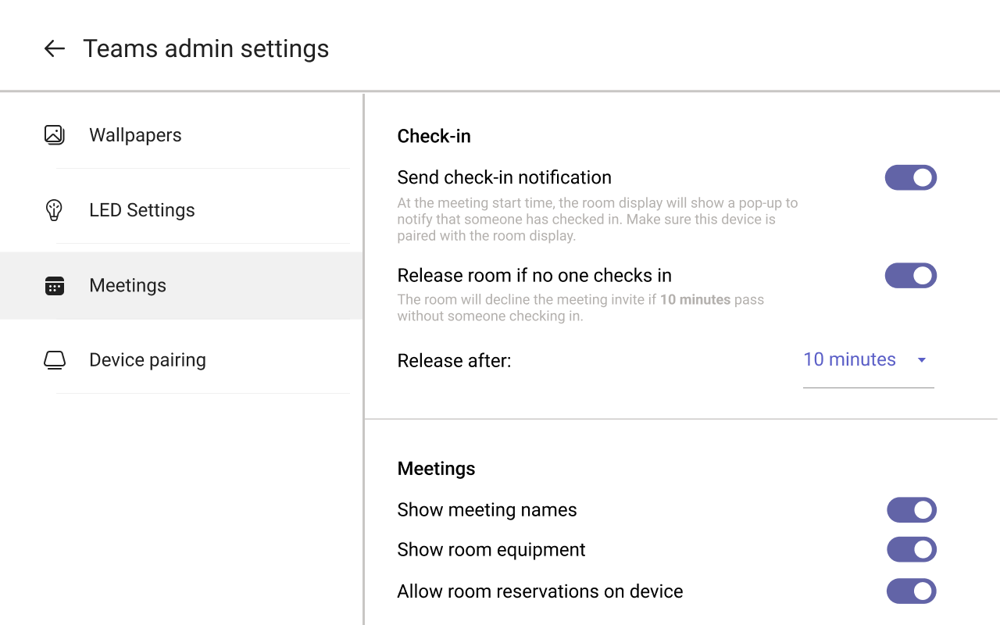
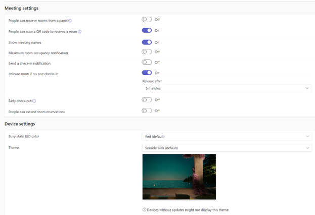
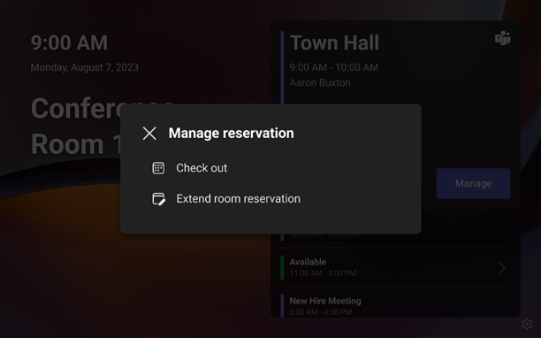
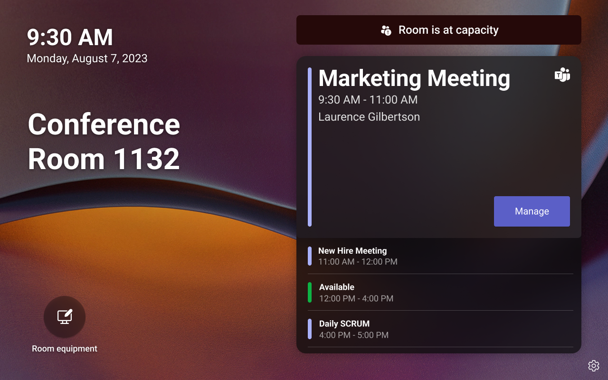

# Overview of Microsoft Teams panels

Turn every space into a Teams space. Teams panels are intelligent devices designed to enhance the efficiency of your office environment. They are a great solution to help your employees seamlessly navigate the workplace and for you to manage your meeting spaces. In just a few steps, you can deploy a [Certified for Teams device](https://www.microsoft.com/en-us/microsoft-teams/across-devices/devices/category/teams-panels/2351?rtc=1&page=1&filterIds=) in your building to make your spaces easier to find, book, and manage.

## Step 1: Consider the space Teams panel will be used in

Tailored to your unique needs, Teams panels offer a range of features that can be customized based on your space. Whether it's a meeting room, a huddle space, or even a non-tech room like a yoga room, Teams panels can be used in any bookable space. And when deciding on which Teams panel device to purchase, there is no dependency on the in-room device brand -- mix and match to deliver the perfect combination for your office.

## Step 2: Pick the license you will need for the space

With the flexibility to accommodate various environments, we offer two types of licenses: the [Microsoft Teams Rooms Pro license](/microsoftteams/rooms/rooms-licensing) and the [Teams Shared Device license](/microsoftteams/teams-add-on-licensing/teams-shared-device-license).

If your room is already equipped with a Surface Hub or Microsoft Teams Rooms device, go Pro! With your Teams Rooms Pro license, there is no other license required for Teams panels. With this license, you can also pair your Teams panel with Teams Rooms on Android and unlock features such as full-room alerts and check-in notifications. One room, one account, one license!

For spaces without a room device, you can purchase the Teams Shared Device license at an affordable price per room per month. Gain access to many of the Panel's features, such as booking with a QR code and auto-release of a room.

With either of these licenses, you can manage your devices remotely with Microsoft's device management services and admin portals, Teams Rooms Pro Management portal and the Teams admin center.

## Step 3: Setup the desired experience for your employees

Once you're signed in to Teams panels, you can pick from various features to help tailor the in-office experience for your employees. This can be done directly on the device or remotely through the Microsoft Teams admin center using [configuration profiles](/microsoftteams/devices/device-management).

  

*  
  
  
Teams admin settings on the device* 

*Configuration profile in Teams admin center*

**Let's take a look at the experiences you can unlock using Teams panels**

Effortlessly reserve a meeting room. Whether it's an impromptu call or a one-on-one meeting, simply tap 'Reserve' on Teams panels, select the end time, and the room is booked, free from interruptions. To seamlessly book the room for a new or scheduled meeting on your calendar, scan the [QR code](/microsoftteams/devices/reserving-rooms-with-a-qr-code) on the home screen using your mobile phone.

.png)

Maximize your space with the [check-in feature](/microsoftteams/devices/check-in-and-room-release). You can rest assured that a reserved room is being used, and if not, it is made available for others to reserve, helping you optimize space.

.png)

  
With Teams panels, you can make real-time adjustments to your bookings. Release the room early from your reservation or extend your room booking directly from the Teams panel.

Keep employees informed of what's happening inside the room without interruption. Teams panels show you whether the room is full, if it's occupied, and which room equipment is available. It can even alert the people inside the room that someone is waiting for the room. 

Empower your employees to use company apps anywhere by deploying [line of business apps](/microsoftteams/app-support-on-teams-panels) to Teams panels. This ensures that employees can use them throughout the office.

## Frequently ask questions about Teams panel

**Question: I already have a scheduling display. Do I need to buy new hardware to run Teams?**

**Answer:** Not necessarily! If you have one of our [Certified for Teams devices](https://www.microsoft.com/microsoft-teams/across-devices/devices/category/room-systems-accessories/73), you can simply create a room account, change service providers to Teams, and sign in. Depending on the hardware, you may need to factory reset to swap to Teams.

**Question:  Which clouds are Teams panels supported in?**

**Answer:** We support public, GCC, and GCC-H.

**Question:  Are there any differences in hardware companies?**

**Answer:** There are a few small differences such as whether the device supports occupancy sensor pairing or purple LEDs. Overall, we recommend picking the one that suits you and your office best.

**Question:  What are your suggestions for deployment?**

**Answer:** You need to work with your IT team to install Teams panels, which requires Power over Ethernet (PoE) and a network connection. We also recommend chatting with your chosen OEM about the best practices for installation depending on the type of wall such as drywall or glass.

**Question: Do I need to have a Teams Rooms device?**

**Answer:** You do not. Teams panels can also be deployed by themselves outside of rooms that don't have any in-room devices. Some examples we have heard of are nursing rooms and massage rooms. Any bookable space can have a panel.

**Question: How do I create an account?**

**Answer:** Just like other Teams devices! In Microsoft Teams admin center, you can create an account under 'Rooms & Equipment' or, if you have an in-room device, you simply re-use the same account for the panel. Once signed in, in the Teams admin center, you will see the device appear under **Teams Devices** > **Panels**. In the Teams Rooms Pro Management portal, the device will be visible on the Rooms and/or Inventory page. If the device is marked as unhealthy or non-urgent, it indicates that an update is available for installation. We recommend updating to the latest apps so your device is ready to go.

**Question:  Where do I go to remotely manage the device?**

**Answer:** You can use either Teams Rooms Pro Management portal or Teams admin center. In the Pro Management portal, you can view Teams Shared Device or Pro licensed Panels in the Rooms and Inventory pages. You can take actions like one could on a Teams Rooms on Android device such as restart the device, search and apply a configuration profile, file a ticket on the device, and more. In Teams admin center, you can create, edit, and apply a configuration profile and push updates to the device.

**Question: How frequently does the software need to be updated?**

**Answer:** We aim to release a few new apps each year. Hardware companies have their own release cycle for firmware as well. You can select for these updates to be applied automatically so you don't need to check. See best practices for more info.

**Question: Where can I go to learn more on Panels?**

**Answer:** You can learn more [here](/microsoftteams/devices/teams-panels), and make sure to stay up to date on all of our latest [releases]((https://support.microsoft.com/en-us/office/what-s-new-in-microsoft-teams-devices-eabf4d81-acdd-4b23-afa1-9ee47bb7c5e2#ID0EBD=Teams_panels)).

## Best practices

- Manage firmware and Teams app updates: To roll out updates in phases, enable auto updates of firmware and Teams apps via the Microsoft Teams admin center and assign devices to different rings (Validation, General, Final). You can assign the Validation ring to a small set of test panels and assign other panels to General and Final rings.

>[!NOTE]
> You can also decide to manually update if you want. You can learn more [here](/microsoftteams/devices/remote-update).

- Manage Authentication: For password management, review Authentication best practices. We offer the ability to sign in on the device, through web, or remotely.

- Optimize screen time: Enable office hours so that the device turns off outside of working hours to save on power.

- Secure panels: To provide secured access to settings on panels, set an Admin password via configuration profile. 
