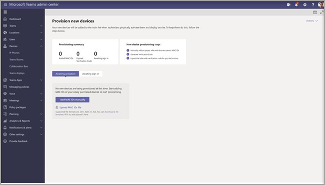

# Remote provisioning and sign in for Teams Android devices

IT admins can remotely provision and sign in to a Teams device. To provision a device remotely, the admin needs to upload the MAC IDs of the devices being provisioned and create a verification code. The entire process can be completed remotely from the Teams admin center.

## Review the supported devices

The following list shows the device firmware requirements.

|Device category|Manufacturer|Minimum firmware|
|-|-|-|
||||

## Add a device MAC address

Complete the following steps to provision a new device.

1. Sign in to the Teams admin center.
2. Expand **Devices**.
3. Select **Provision new device** from the **Actions** tab.

In the **Provision new devices** window, you can either add the MAC address manually or upload a file.

### Manually add a device MAC address

1. From the **Awaiting Activation** tab, select **Add MAC ID**.
2. Enter the MAC ID.
3. Enter a location, which helps technicians identify where to install the devices.
4. Select **Apply** when finished.

### Upload a file to add a device MAC address

1. From the **Awaiting Activation** tab, select **Upload MAC IDs**.
2. Download the file template.
3. Enter the MAC ID and location, and then save the file.
4. **Select file**, and then select **Upload**.

## Generate a verification code

You need a verification code for the devices. The verification code is generated in bulk or at the device level and is valid for 24 hours.

1. From the **Awaiting Activation** tab, select an existing MAC ID.
   A password is created for the MAC address and is shown in the **Verification Code** column.

2. Provide the list of MAC IDs and verification codes to the field technicians. You can export the detail directly in a file and share the file with the technician who is doing the actual installation work.

## Provision the device

When the device is powered on and connected to the network, the technician provisions the device. These steps are completed on the Teams device.

1. The technician selects **Provision device** from the **Settings**.  

   
  
2. The technician enters the device-specific verification code in the provided input field.

   

   Once the device is provisioned successfully, the tenant name appears on the sign-in page.

## Sign in remotely

The provisioned device appears in the **Awaiting sign in** tab. Start the remote sign-in process by selecting the individual device.

1. Select a device from the **Awaiting sign in** tab.

   

2. Follow the instructions in **Sign in a user**, and then select **Close**.

   

## Related article

- [Manage your devices in Teams](device-management.md)
- [Update Teams devices remotely](remote-update.md)
