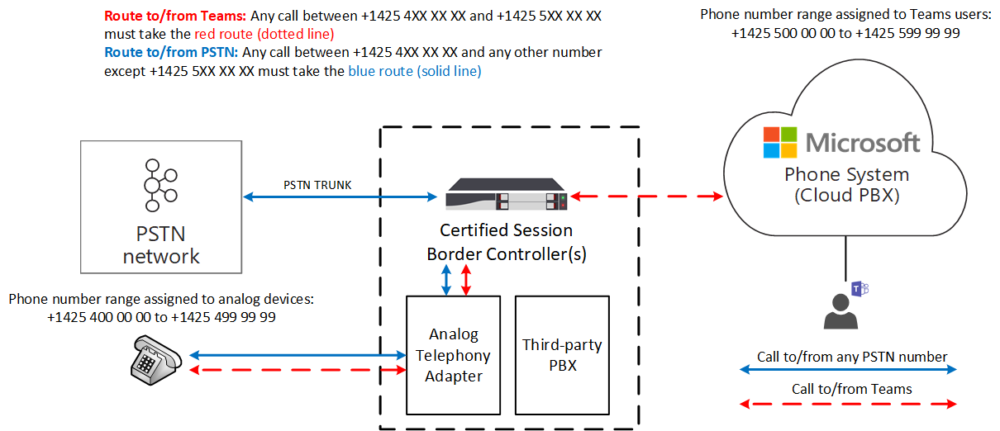

# How to use analog devices with Direct Routing

This article describes how to use analog devices with Direct Routing. To connect analog devices to Direct Routing, you must use an Analog Telephony Adapter (ATA), and this adapter must be supported by the certified Session Border Controller (SBC) vendor. 

When a user makes a call from an analog device, the signaling and media flow through the Analog Telephony Adapter (ATA) to the SBC.  The SBC sends the call to a Microsoft Teams endpoint or to the Public Switched Telephone Network (PSTN) based on the internal routing table.  When a device makes a call, the route it takes depends on the routing policies created for the device.

In the following diagram, Direct Routing is configured so that any Teams calls to and from the numbers between +1425 4XX XX XX and +1425 5XX XX XX must take the red route (dotted line), and any PSTN call to and from numbers between +1425 4XX XX XX and any other number except number range +1425 5XX XX XX must take the blue route (solid line). 

> [!div class="mx-imgBorder"]
> 

## Example: How to configure the use of analog devices with Direct Routing

To configure the use of analog devices with Direct Routing, you must connect the Analog Telephony Adapter to the SBC, and configure the SBC to work with Direct Routing. 

This example walks you through the following steps:

1. Connect the SBC to Direct Routing.
2. Create the PSTN Usage.
3. Create a voice route and associate it with the PSTN Usage.
4. Assign the voice route to the PSTN Usage.
5. Enable the online user.
6. Assign the voice route policy to the user.
7. Create a voice route for an analog device.

For information on how to connect an ATA to an SBC and configure the SBC, see your SBC manufacturer configuration guide:

- [AudioCodes configuration documentation](https://www.audiocodes.com/media/14278/connecting-audiocodes-sbc-with-analog-device-to-microsoft-teams-direct-routing-enterprise-model-configuration-note.pdf)

- [Ribbon configuration documentation](https://support.sonus.net/display/UXDOC81/Connect+SBC+Edge+to+Microsoft+Teams+Direct+Routing+to+Support+Analog+Devices)
- [Oracle configuration documentation](https://www.oracle.com/technical-resources/documentation/acme-packet.html#Link-MicrosoftTeams)

## Step 1. Connect the SBC to Direct Routing

The following command configures the SBC connection as follows:

- FQDN sbc.contoso.com
- Signaling port 5068
- Media bypass mode
- Call history information forwarded to the SBC-
- P-Asserted-Identity (PAI) header forwarded along with the call 

```powershell
PS C:\> New-CsOnlinePSTNGateway -FQDN sbc.contoso.com -SIPSignalingPort 5068 -ForwardCallHistory $true -ForwardPAI $true -MediaBypass $true -Enabled $true 
```

## Step 2: Create the PSTN usage 

The next command creates an empty PSTN usage. Online PSTN usages are string values that are used for call authorization. An online PSTN usage links an online voice policy to a route. This example adds the string "Interop" to the current list of available PSTN usages. 

```powershell
PS C:\> Set-CsOnlinePstnUsage -Identity global -Usage @{add="Interop"} 
```

## Step 3: Create a voice route and associate it with the PSTN usage

This command creates a new online voice route with the identity “analog-interop” for the number range +1425 XXX XX XX.  The voice route is applicable to a list of online gateways sbc.contoso.com and associates the route with online PSTN usage “Interop”. A voice route includes a regular expression that identifies which phone numbers will be routed through a given voice route:

```powershell
PS C:\> New-CsOnlineVoiceRoute -Identity analog-interop -NumberPattern "^\+1(425)(\d{7})$" -OnlinePstnGatewayList sbc.contoso.com -Priority 1 -OnlinePstnUsages "Interop"
```

## Step 4: Assign the voice route to the PSTN usage:

This command creates a new online per-user voice routing policy with the Identity “AnalogInteropPolicy”. This policy is assigned a single online PSTN usage: “Interop”.

```powershell
PS C:\> New-CsOnlineVoiceRoutingPolicy -Identity "AnalogInteropPolicy" -OnlinePstnUsages "Interop"
```

## Step 5: Enable the online user

This command modifies the user account with the Identity exampleuser@contoso.com. In this case, the account is modified to enable Enterprise Voice, the Microsoft implementation of VoIP, with enabled voice mail and assigns the number +14255000000 to this user.  This command should be run for each Teams user (excluding ATA device users) in the company tenant.

```powershell
PS C:\> Set-CsUser -Identity "exampleuser@contoso.com" -EnterpriseVoiceEnabled $True -HostedVoiceMail $True -OnPremLineUri "tel:+14255000000"
```

## Step 6: Assign the voice route policy to a user

This command assigns the per-user online voice routing policy AnalogInteropPolicy to the user with the identity exampleuser@contoso.com. This command should be run for each Teams user (excluding ATA device users) in the company tenant.

```powershell
PS C:\> Grant-CsOnlineVoiceRoutingPolicy -Identity "exampleuser@contoso.com" -PolicyName "AnalogInteropPolicy" 
```

## Step 7: Create a voice route for an analog device

This command creates an online voice route with identity “analog-interop” for number range +1425 4XX XX XX applicable to a list of online gateways sbc.contoso.com and associates it with online PSTN usage “Interop”.  This command should be run for each analog device with appropriate phone number pattern. Alternatively, a proper number pattern for analog devices can be used while configuring the online voice route during one of the previous steps.

```powershell
PS C:\> New-CsOnlineVoiceRoute -Identity analog-interop -NumberPattern "^\+1(4254)(\d{6})$"  -OnlinePstnGatewayList sbc.contoso.com -Priority 1 -OnlinePstnUsages "Interop"
```

## Considerations

- Unless otherwise note, an analog device is any device that can send DTMF digits to place a call. For example, analog phones, fax machines, and overhead pagers.

- Analog phones connected to an ATA are not searchable from Teams. Teams users must manually enter the phone number associated with the device to call that device.  
 

## See also

[Plan Direct Routing](direct-routing-plan.md)

[Configure Direct Routing](direct-routing-configure.md)
