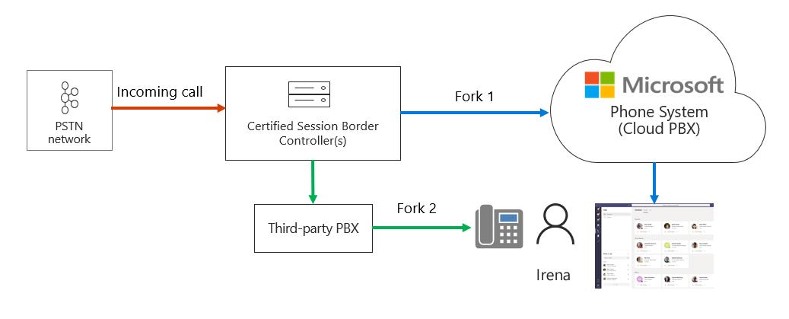
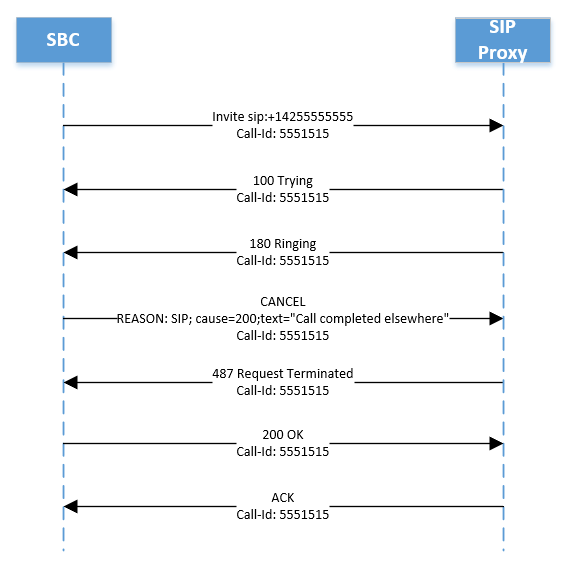

# Manage call notifications

This article describes how to manage call notifications for your users. You can configure call endpoints to both Teams and to a third-party Private Branch Exchange (PBX) or Session Border Controller (SBC).  This is useful, for example, if you want to send a call to a user's mobile and desk phones at the same time.   

In the following diagram, user Irena has two endpoints:

- A Teams endpoint
- A SIP phone connected to a third-party SBC

When a call arrives, the SBC forks the call between Phone System Direct Routing and the third-party SBC.

If the call is accepted on Fork 2 (by the third-party SBC), Teams will generate a “Missed Call” notification.  

You can prevent the “Missed Call” notification by configuring the SBC to send a Cancel on Fork 1 as follows:

REASON: SIP; cause=200;text”Call completed elsewhere” 

Note that the call will not be registered in the call detail records of Microsoft Phone System as a successful call. The call will be registered as an “Attempt” with Final SIP Code “487”, Final Microsoft subcode “540200”, and Final SIP Code Phrase “Call completed elsewhere”.   (To view the call detail records, go the Teams Admin portal, Analytics and Reports, Usage Reports, and select PSTN Usage.)

The diagram below illustrates the SIP ladder for Fork 1, explains the call flow, and the expected REASON in the Cancel message. 

