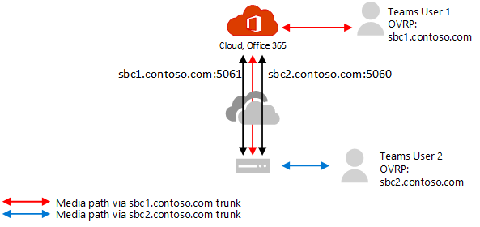

# Configure media bypass with Direct Routing

Before configuring media bypass with Direct Routing, be sure you have read [Plan for media bypass with Direct Routing](direct-routing-plan-media-bypass.md).

To turn on media bypass, the following conditions must be met:

1.	Make sure that your Session Border Controller (SBC) vendor of choice supports media bypass and provides instructions on how to configure bypass on the SBC. Please refer to the certification page to learn about SBCs, which ones support media bypass, and for instructions.

2.	You need to turn on media bypass on the trunk using the following command:  **Set-CSOnlinePSTNGateway -Identity <sbc_FQDN> -MediaBypass $true**.

3.	Make sure that the required ports are opened. 

## Migrate from non-bypassed trunks to bypass-enabled trunks

You can switch all users at once or you can implement a phased approached (recommended).

- **Switch all users at once.** If all conditions are met, you can turn bypass mode on. However, all your production users will be switched at the same time. Because you might experience some issues initially when you configure trunks and ports, your production user experience might be affected. 

- **Phased approach. (Recommended)**.  Create a new trunk for the same SBC (with a different port), test it, and change the online voice routing policy for the users to point to the new trunk. 

  This is the recommended approach because it allows for a smoother transition and uninterrupted user experience. This approach requires configuration of the SBC, a new FQDN name, and configuration of the firewall. Note you will need to make sure that your certificate supports both trunks. In SAN, you need to have two names (**sbc1.contoso.com** and **sbc2.contoso.com**) or have a wildcard certificate.

For instructions on how to configure the trunks and perform migration, see the documentation from your SBC vendor:

- AudioCodes
- Ribbon
- TE-Systems (AnyNode)    

For a list of Session Border Controllers (SBCs) certified for Direct Routing, see [List of Session Broder Controllers certified for Direct Routing](direct-routing-border-controllers.md).

## See also

[Plan media bypass with Direct Routing](direct-routing-plan-media-bypass.md)

