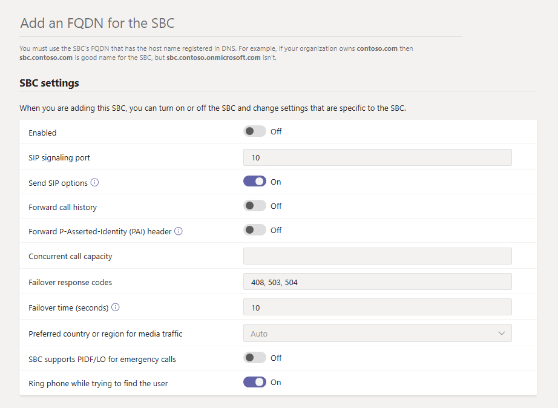

# Connect your Session Border Controller (SBC) to Direct Routing

This article describes how to configure a Session Border Controller (SBC) and connect it to  Direct Routing.  This is step 1 of the following steps to configure Direct Routing:

- **Step 1. Connect your SBC with Phone System and validate the connection** (This article)
- Step 2. [Enable users for Direct Routing](direct-routing-enable-users.md)
- Step 3. [Configure call routing](direct-routing-voice-routing.md)
- Step 4. [Translate numbers to an alternate format](direct-routing-translate-numbers.md)

For information on all the steps required to set up Direct Routing, see [Configure Direct Routing](direct-routing-configure.md).

You can use the [Microsoft Teams admin center](#using-the-microsoft-teams-admin-center) or [PowerShell](#using-powershell) to configure and connect an SBC to Direct Routing.

## Using the Microsoft Teams admin center

1. In the left navigation, go to **Voice** > **Direct Routing**, and then click the **SBCs** tab.

2. Click **Add**.

3. Enter an FQDN for the SBC. <br><br>Make sure the domain name portion of the FQDN matches a domain that's registered in your tenant and keep in mind that the `*.onmicrosoft.com` domain name isn't supported for the SBC FQDN domain name. For example, if you have two domain names, `contoso.com` and `contoso.onmicrosoft.com`, use `sbc.contoso.com` as the SBC name. If using a subdomain, make sure this subdomain is also registered in your tenant. For example, if you want to use `sbc.service.contoso.com`, then `service.contoso.com` needs to be registered.

4. Configure the following settings for the SBC, based on your organization's needs. For details on each of these settings, see [SBC settings](#sbc-settings).

    

5. When you're done, click **Save**.

## Using PowerShell

To connect your SBC to Direct Routing, you'll need to:

1. [Connect to Skype for Business Online by using PowerShell](#connect-to-skype-for-business-online-by-using-powershell).

2. [Connect the SBC to the tenant](#connect-the-sbc-to-the-tenant).

3. [Verify the SBC connection](#verify-the-sbc-connection).

### Connect to Skype for Business Online by using PowerShell

To pair the SBC to the Direct Routing interface, use a PowerShell session connected to the tenant. To open a PowerShell session, follow the steps outlined in [Set up your computer for Windows PowerShell](/SkypeForBusiness/set-up-your-computer-for-windows-powershell/set-up-your-computer-for-windows-powershell).
 
After you establish a remote PowerShell session, verify that you can see the commands to manage the SBC. To verify the commands, type or copy and paste the following command in the PowerShell session, and then press Enter: 

```PowerShell
Get-Command *onlinePSTNGateway*
```

The command returns the four functions shown here that will let you manage the SBC.

<pre>
CommandType    Name                       Version    Source 
-----------    ----                       -------    ------ 
Function       Get-CsOnlinePSTNGateway    1.0        tmp_v5fiu1no.wxt 
Function       New-CsOnlinePSTNGateway    1.0        tmp_v5fiu1no.wxt 
Function       Remove-CsOnlinePSTNGateway 1.0        tmp_v5fiu1no.wxt 
Function       Set-CsOnlinePSTNGateway    1.0        tmp_v5fiu1no.wxt
</pre>

### Connect the SBC to the tenant

To connect the SBC to the tenant, use the [New-CsOnlinePSTNGateway](/powershell/module/skype/new-csonlinepstngateway) cmdlet. In a PowerShell session, type the following, and then press Enter:

```PowerShell
New-CsOnlinePSTNGateway -Fqdn <SBC FQDN> -SipSignalingPort <SBC SIP Port> -MaxConcurrentSessions <Max Concurrent Sessions the SBC can handle> -Enabled $true
```

  > [!NOTE]
  > 1. We recommend that you set a maximum call limit in the SBC using information that can be found in the SBC documentation. The limit will trigger a notification if the SBC is at the capacity level.
  > 2. You can only connect the SBC if the domain portion of its FQDN matches one of the domains registered in your tenant, except \*.onmicrosoft.com. Using \*.onmicrosoft.com domain names is not supported for the SBC FQDN name. For example, if you have two domain names, **contoso**.com and **contoso**.onmicrosoft.com, you can use sbc.contoso.com for the SBC name. If you try to connect the SBC with a name such as sbc.contoso.abc, the system won't let you, as the domain is not owned by this tenant.<br/>
  > In addition to the domain registered in your tenant, it's important that there's a user with that domain and an assigned E3 or E5 license. If not, you'll receive the following error:<br/>
  `Can not use the "sbc.contoso.com" domain as it was not configured for this tenant`.
  > 3. ⁠Multiple IPs mapped with the same FQDN on the SBC side are not supported.

Here's an example:

```PowerShell
New-CsOnlinePSTNGateway -Identity sbc.contoso.com -Enabled $true -SipSignalingPort 5067 -MaxConcurrentSessions 100 
```

Which returns:

<pre>
Identity              : sbc.contoso.com 
Fqdn                  : sbc.contoso.com 
SipSignalingPort     : 5067 
FailoverTimeSeconds   : 10 
ForwardCallHistory    : False 
ForwardPai            : False 
SendSipOptions        : True 
MaxConcurrentSessions : 100 
Enabled               : True   
</pre>

> [!NOTE]
> This example shows only the minimum required parameters. There are additional parameters that you can set  with the [New-CsOnlinePSTNGateway](/powershell/module/skype/new-csonlinepstngateway) cmdlet during the connection process. To learn more, see [SBC settings](#sbc-settings).
 
### Verify the SBC connection

To verify the connection:

- [Check whether the SBC is on the list of paired SBCs](#check-whether-the-sbc-is-on-the-list-of-paired-sbcs).
- [Validate SIP options](#validate-sip-options).
 
#### Check whether the SBC is on the list of paired SBCs

After you connect the SBC, use the [Get-CsOnlinePSTNGateway](/powershell/module/skype/get-csonlinepstngateway) cmdlet to verify that the SBC is present in the list of paired SBCs. Type the following in a remote PowerShell session, and then press Enter:

```PowerShell
Get-CsOnlinePSTNGateway -Identity sbc.contoso.com  
```

The paired gateway should appear in the list as shown in the example below, and the **Enabled** parameter should display a value of **True**.

Which returns:

<pre>
Identity              : sbc.contoso.com  
Fqdn                  : sbc.contoso.com
SipSignalingPort     : 5067
CodecPriority         : SILKWB,SILKNB,PCMU,PCMA
ExcludedCodecs        :  
FailoverTimeSeconds   : 10
ForwardCallHistory    : False
ForwardPai            : False
SendSipOptions        : True
MaxConcurrentSessions : 100
Enabled               : True
</pre>

#### Validate SIP options

To validate the pairing using outgoing SIP options, use the SBC management interface and confirm that the SBC receives 200 OK responses to its outgoing OPTIONS messages.

When Direct Routing sees incoming OPTIONS, it will start sending outgoing SIP Options messages to the SBC FQDN configured in the Contact header field in the incoming OPTIONS message. 

To validate the pairing using incoming SIP options, use the SBC management interface and see that the SBC sends a reply to the OPTIONS messages coming in from Direct Routing and that the response code it sends is 200 OK.

## SBC settings

This table lists the options that you can set for the SBC in the Microsoft Teams admin center and by using the [New-CsOnlinePSTNGateway](/powershell/module/skype/new-csonlinepstngateway) cmdlet.

|Required?|Teams admin center setting|PowerShell parameter|Description|Default|Possible values|Type and restrictions|
|:-----|:-----|:-----|:-----|:-----|:-----|:-----|
|Yes|**Add an FQDN for the SBC**|FQDN |None|FQDN name, limit 63 characters|String, see the list of allowed and disallowed characters on [Naming conventions in Active Directory for computers, domains, sites, and OUs](https://support.microsoft.com/help/909264)|
|No|**Enabled**|Enabled|Use to turn on the SBC for outbound calls. You can use this to temporarily remove the SBC from service while it's being updated or during maintenance. |False|True<br/>False|Boolean|
|Yes|**SIP signaling port**|SipSignalingPort |This is the listening port that's used to communicate with Direct Routing by using the Transport Layer (TLS) protocol.|None|Any port|0 to 65535 |
|No|**Send SIP options**|SendSIPOptions |Defines whether the SBC will send SIP options messages. We highly recommend that you turn on this setting. When this setting is off, the SBC is excluded from the Monitoring and Alert system.|True|True<br/>False|Boolean|
|No|**Forward call history**|ForwardCallHistory |Indicates whether call history information is forwarded through the trunk. When you turn this on, the Microsoft 365 proxy sends a History-info and Referred-by header. |False|True<br/>False|Boolean|
|No|**Forward P-Asserted-identity (PAI) header**|ForwardPAI|Indicates whether the PAI header is forwarded along with the call. The PAI header provides a way to verify the identity of the caller. If this setting is on, the Privacy:ID header is also sent.|False|True<br/>False|Boolean|
|No|**Concurrent call capacity**|MaxConcurrentSessions |When you set a value, the alerting system will notify you when the number of concurrent sessions is 90 percent or higher than this value. If you don't set a value, alerts aren't generated. However, the monitoring system will report the number of concurrent sessions every 24 hours. |Null|Null<br/>1 to 100,000 ||
|No|**Failover response codes**|FailoverResponseCodes<br>|If Direct Routing receives any 4xx or 6xx SIP error code in response to an outgoing Invite, the call is considered completed by default. Outgoing means a call from a Teams client to the PSTN with traffic flow: Teams client -> Direct Routing -> SBC -> telephony network). When you specify a failover response code, this forces Direct Routing to try another SBC (if another SBC exists in the voice routing policy of the user) when it receives the specified codes if the SBC can't make a call because of network or other issues. To learn more, see [Failover of specific SIP codes received from the Session Border Controller (SBC)](direct-routing-trunk-failover-on-outbound-call.md).|408, 503, 504||Int|
|No|**Failover times (seconds)**|FailoverTimeSeconds |When you set a value, outbound calls that aren't answered by the gateway within the time that you set are routed to the next available trunk. If there are no additional trunks, the call is automatically dropped. The default value is 10 seconds. In an organization with slow networks and gateway responses, this could potentially result in calls being dropped unnecessarily.|10|Number|Int|
|No|**Preferred country or region for media traffic**|MediaRelayRoutingLocationOverride | Not applicable to Direct Routing. This parameter is reserved for use with managed carriers in Calling Plans |None|||
|No|**SBC supports PIDF/LO for emergency calls**|PidfloSupported|Specify whether the SBC supports Presence Information Data Format Location Object (PIDF/LO) for emergency calls.||||
|No| - |MediaBypass|This setting indicates whether the SBC supports media bypass and whether you want to use it for this SBC. |None|True<br/>False|Boolean|

## See also

[Plan Direct Routing](direct-routing-plan.md)

[Configure Direct Routing](direct-routing-configure.md)

[Teams PowerShell overview](teams-powershell-overview.md)
