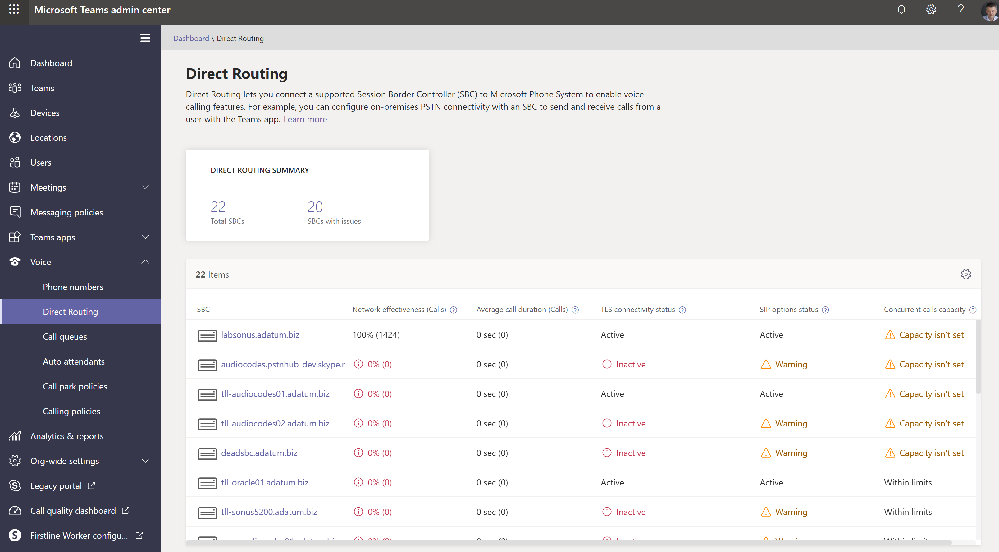
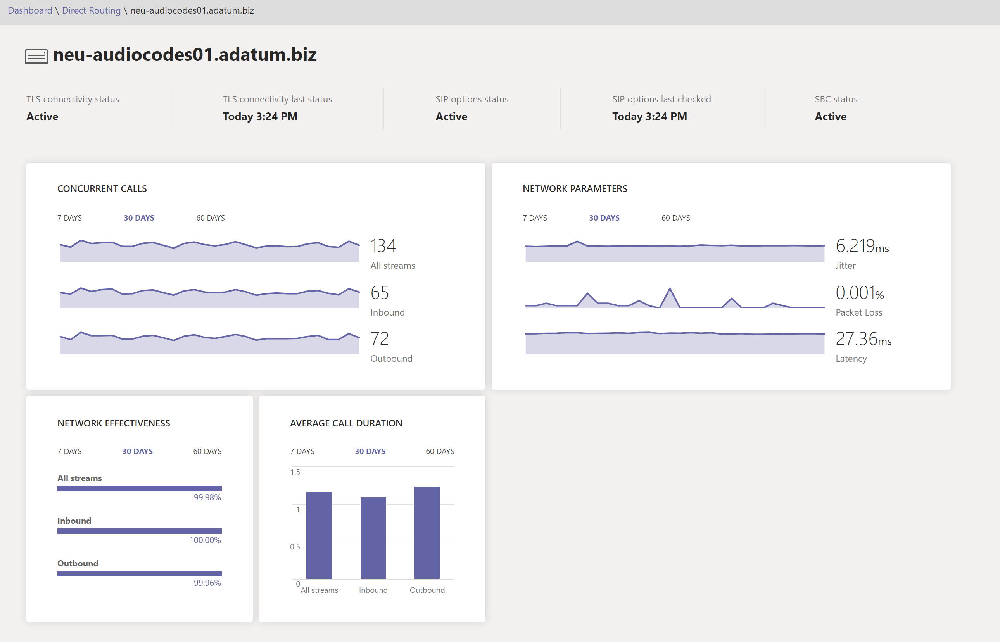

# Health Dashboard for Direct Routing

Health Dashboard for Direct Routing lets you monitor the connection between your Session Border Controller (SBC) and the Direct Routing interface.  With Health Dashboard, you can monitor information about your SBC, the telephony service, and the network parameters between your SBC and the Direct Routing interface. This information can help you identify issues, including the reason for dropped calls. For example, the SBC might stop sending calls if a certificate on the SBC has expired or if there are network issues.  

Health Dashboard monitors two levels of information:

- Overall health of the connected SBCs
- Detailed information about the connected SBCs

You can view Health Dashboard in the Microsoft Teams and Skype for Business Admin Center.

## Overall health

Health Dashboard provides the following information related to overall health of the connected SBCs:

 

- **Direct Routing summary** - Shows the total number of SBCs registered in the system. Registration means that the tenant administrator added an SBC by using the New-CsOnlinePSTNGateway command. If the SBC was added in PowerShell, but never connected, the Health Dashboard shows it in an unhealthy status.

- **SBC** - The FQDN of the paired SBC.

- **Network Effectiveness Ratio (NER)** - The NER measures the ability of a network to deliver calls by measuring the number of calls sent versus the number of calls delivered to a recipient.  

   The NER measures the ability of networks to deliver calls to the far-end terminal--excluding user actions resulting in call rejections.  If the recipient rejected a call or sent the call to voicemail,the call is counted as a successful delivery. This means that an answer message, a busy signal, or a ring with no answer are all considered successful calls. 
  
   Assume Direct Routing sent a call to the SBC and the SBC returns SIP code “504 Server Time-out - The server attempted to access another server in attempting to process the request and did not receive a prompt response”. This response indicates there is an issue on the SBC side, and this will decrease the NER on the Health Dashboard for this SBC. 
  
   Because the action you take might depend on the number of calls affected, Health Dashboard shows how many calls were analyzed to calculate a parameter. If the number of calls is less than 100, the NER might be quite low, but still be normal. 

   The formula used to calcuate NER is:

   NER = Answered calls + User Busy + Ring no Answer + Terminal Reject Seizures x 100

 
- **Average call duration** - Information about average call duration can help you monitor the quality of calls. The average duration of a 1:1 PSTN call is four to five minutes.  However, for each company, this average can differ.  Microsoft recommends establishing a baseline for the average call duration for your company. If this parameter goes significantly below the baseline, it might indicate that your users are having issues with call quality or reliability and are hanging up earlier than usual. If you start seeing extremely low average call duration, for example 15 seconds, callers might be hanging up because your service is not performing reliably. 

   Because the action you take might depend on the number of calls affected, Health Dashboard shows how many calls were analyzed to calculate a parameter.

- **TLS connectivity status** - TLS (Transport Layer Security) connectivity shows the status of the TLS connections between Direct Routing and the SBC. Health Dashboard also analyzes the certificate expiration date and warns if a certificate is set to expire within 30 days so that administrators can renew the certificate before service is disrupted.

   By clicking on the Warning message you can see a detailed issue description in a popup window on the right and recommendations for how to fix the issue.

- **SIP options status** – By default, the SBC sends options messages every minute. This configuration can vary for different SBC vendors. Direct Routing warns if the SIP options are not sent or are not configured. For more information about SIP options monitoring, and conditions when an SBC can be marked as not functional, see [Monitor and troubleshoot Direct Routing](direct-routing-monitor-and-troubleshoot.md).

- **Detailed SIP options status** - In addition to showing that there is an issue with SIP options flow, the Health Dashboard also provides detailed descriptions of the errors. You can access the description by clicking  “Warning” message. A pop up window on the right will show the detailed error description.

   Possible values for SIP options status messages are as follows:

    - Active – means that the SBC is active; Microsoft Direct Routing service sees the Options flowing on a regular interval.

    - Warning, no SIP options - The Session Border Controller exists in the database (your administrator created it using the command New-CsOnlinePSTNGateway). It is configured to send SIP options, but the Direct Routing service never saw the SIP options coming back from this SBC.

    - Warning, SIP Messages aren't configured - Trunk monitoring using SIP options isn’t turned on. Microsoft Calling System uses SIP Options and Transport Layer Security (TLS) handshake monitoring to detect the health of the connected Session Border Controllers (SBCs) at the application level. You’ll have problems if this trunk can be reached at the network level (by ping), but the certificate has expired or the SIP stack doesn’t work. To help identify such problems early, Microsoft recommends enabling sending SIP options. Check your SBC manufacturer documentation to configure sending SIP options. 

- **Concurrent calls capacity** - You can specify the limit of concurrent calls that an SBC can handle by using the New- or Set-CsOnlinePSTNGateway command with the -MaxConcurrentSessions parameter. This parameter calculates how many calls were sent or received by Direct Routing using a specific SBC and compares it with the limit set. Note:  If the SBC also handles calls to different PBXs, this number will not show the actual concurrent calls.

## Detailed information for each SBC

You can also view the detailed information for a specific SBC as shown in the following screenshot:

The detailed view shows the following additional parameters:

- **TLS Connectivity status** – this is the same metric as on the “Overall Health” page;

- **TLS Connectivity last status** – shows time when the SBC made a TLS connection to the Direct Routing service;

- **SIP Options status** – the same metric as on the “Overall Health” page;

- **SIP Options last checked** – time when the SIP Options were received last time;

- **SBC Status** – overall status of the SBC, based on all monitored parameters;

- **Concurrent call**- shows you how many concurrent call SBC handled. This information is useful to predict number of concurrent channels you need and see the trend. You can slide the data by number of days and call direction (inbound/outbound/All Streams)

- **Network parameters** - All network parameters are measured from the Direct Routing Interface to the Session Border Controller. The recommended values are documented on this page https://docs.microsoft.com/en-us/microsoftteams/prepare-network. Please look at the Customer Edge to Microsoft Edge recommended values.

   - Jitter – Jitter is the millisecond measure of variation in network propagation delay time computed between two endpoints using RTCP(The RTP Control Protocol).

   - Packet Loss – Packet Loss is a measure of packet that failed to arrive, it is computed between two endpoints.

   - Latancy - Latency (also known as round trip time) is the length of time it takes for a signal to be sent plus the length of time it takes for the acknowledgement of that signal to be received. This time delay therefore consists of the propagation times between the two points of a signal.

   You can slide the data by number of days and call direction (inbound/outbound/All streams).

**Network Effectiveness ratio** - This is the same parameter that appears on the “Overall Health” dashboard, but with the option to slice the data by time series or call direction.

