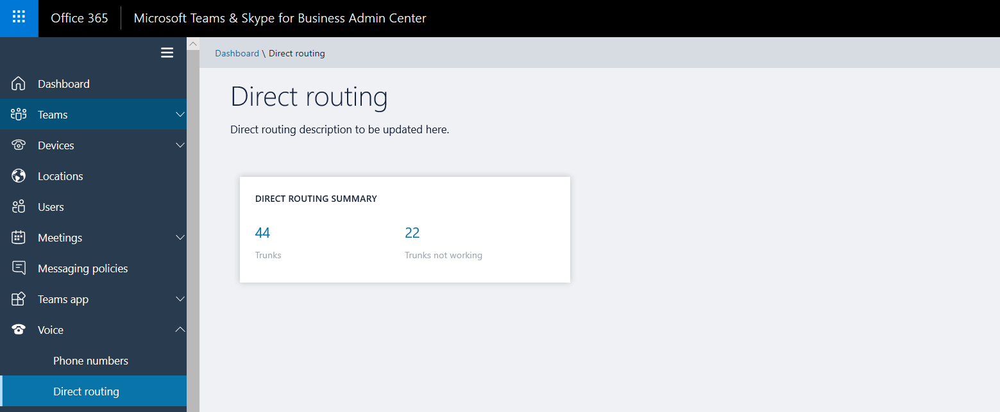
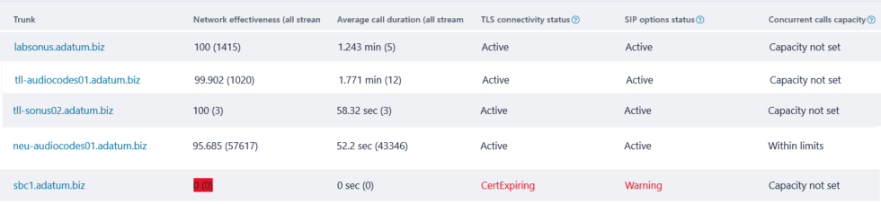
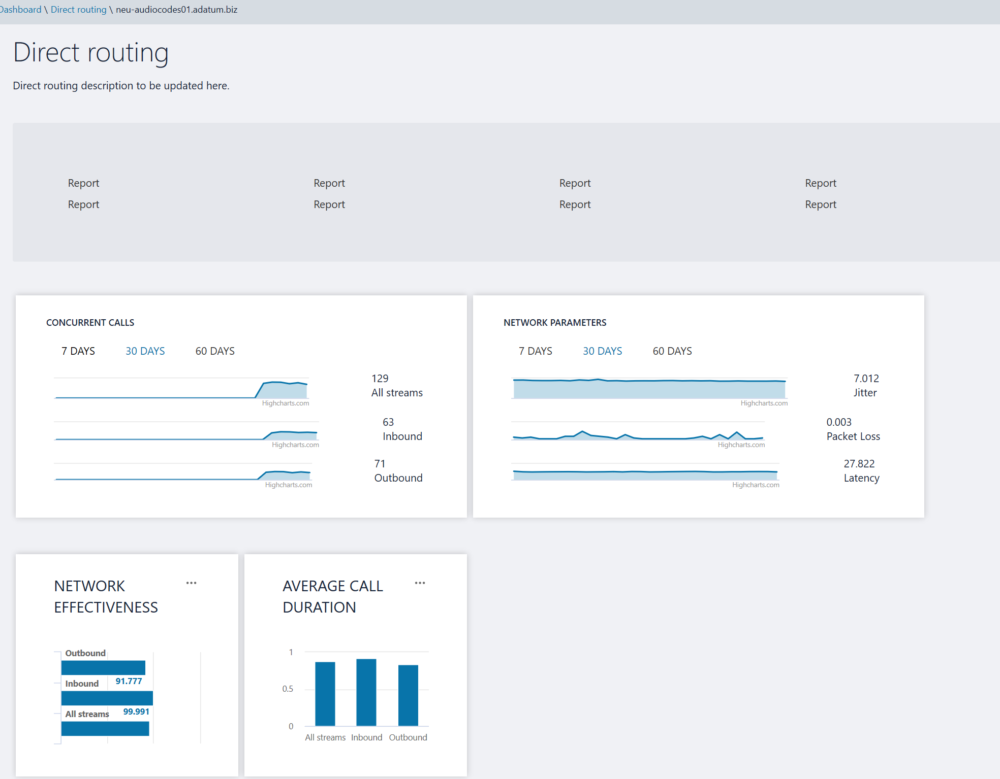

# Health Dashboard for Direct Routing

Health Dashboard for Direct Routing lets you monitor the connection between your Session Border Controller (SBC) and the Direct Routing interface.  With Health Dashboard, you can monitor information about your SBC, the telephony service, and the network between your SBC and the Direct Routing interface. This information can help you identify issues, including the reason for dropped calls. For example, the SBC might stop sending calls if a certificate on the SBC has expired or if there are network issues.  

Health Dashboard monitors two levels of information:

- Overall health of the connected SBCs
- Detailed information about the connected SBCs

You can view Health Dashboard in the Microsoft Teams and Skype for Business Admin Center:

 

## Overall health

Health Dashboard provides the following information related to overall health of the connected SBCs:

 

- **Trunk** - The FQDN of the paired trunk.

- **Network Effectiveness Ratio (NER)** - The NER measures the ability of a network to deliver calls by measuring the number of calls sent versus the number of calls delivered to a recipient.  

  The NER measures the ability of networks to deliver calls to the far-end terminal--excluding user actions resulting in call rejections.  If the recipient rejected a call or sent the call to voicemail, the call is counted as a successful delivery. This means that an answer message, a busy signal, or a ring with no answer are all considered successful calls. 
  
  Assume Direct Routing sent a call to the SBC and the SBC returns SIP code “504 Server Time-out - The server attempted to access another server in attempting to process the request and did not receive a prompt response”. This response indicates there is an issue on the SBC side, and this will decrease the NER on the Health Dashboard for this SBC. 
  
  Because the action you take might depend on the number of calls affected, Health Dashboard shows how many calls were analyzed to calculate a parameter.
 
- **Average call duration** - Information about average call duration can help you monitor the quality of calls. The average duration of a 1:1 PSTN call is four to five minutes.  However, for each company, this average can differ.  Microsoft recommends establishing a baseline for the average call duration for your company. If this parameter goes significantly below the baseline, it might indicate that your users are having issues with call quality or reliability and are hanging up earlier than usual. If you start seeing extremely low average call duration, for example 15 seconds, callers might be hanging up because your service is not performing reliably. 

  Because the action you take might depend on the number of calls affected, Health Dashboard shows how many calls were analyzed to calculate a parameter.

- **TLS connectivity status** - TLS connectivity shows the status of the TLS connections between Direct Routing and the SBC. Health Dashboard also analyzes the certificate expiration date and warns if a certificate is set to expire within 30 days so that administrators can renew the certificate before service is disrupted.

- **SIP options status** – By default, the SBC sends options messages every minute. This configuration can vary for different SBC vendors. Direct Routing warns if the SIP options are not sent or are not configured. For more information about SIP options monitoring, and conditions when an SBC can be marked as not functional, see [Monitor and troubleshoot Direct Routing](direct-routing-monitor-and-troubleshoot.md)

- **Concurrent calls capacity** - You can specify the limit of concurrent calls that an SBC can handle by using the New- or Set-CSOnlinePSTNGateway command with the -MaxConcurrentSessions parameter. This parameter calculates how many calls were sent or received by Direct Routing using a specific SBC and compares it with the limit set. Note:  If the SBC also handles calls to different PBXs, this number will not show the actual concurrent calls.

## Detailed view for each SBC

You can also view the detailed information for a specific SBC as shown in the following screenshot:

