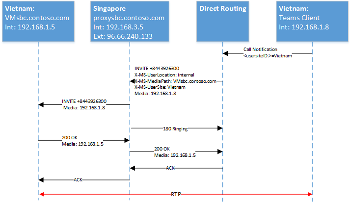
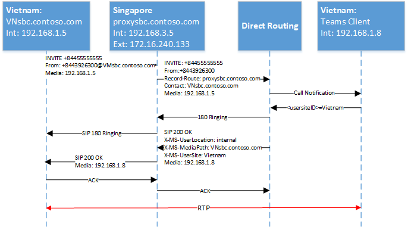
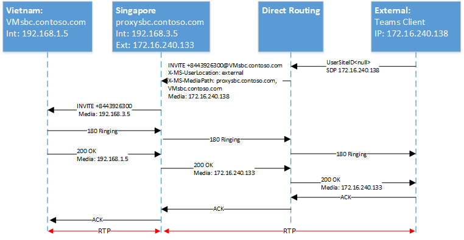
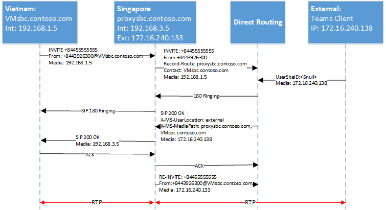
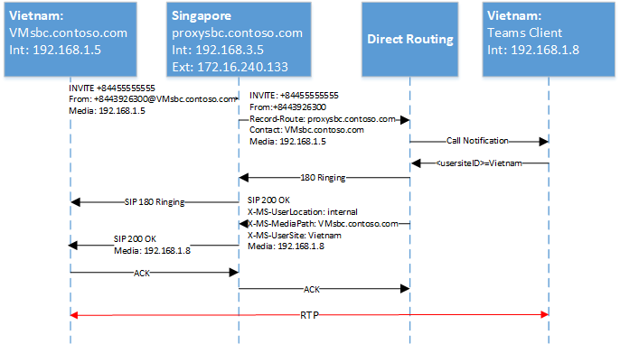
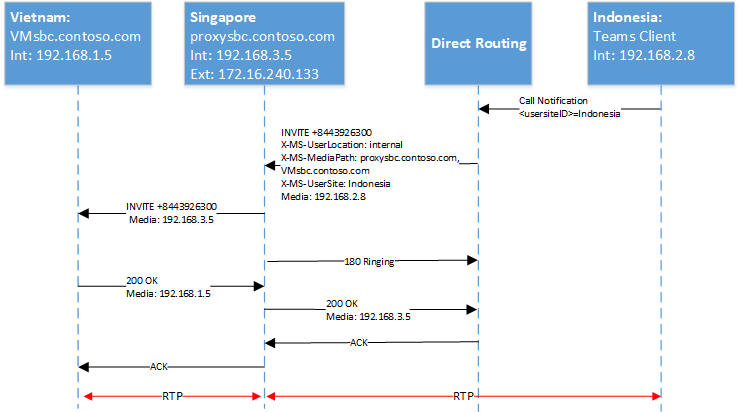
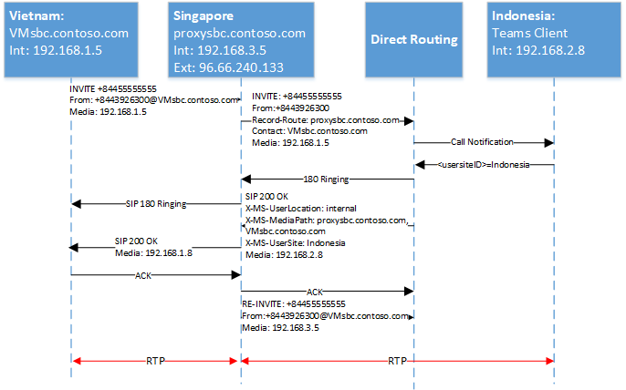

# Configure Local Media Optimization for Direct Routing

Configuration for Local Media Optimization is based on network settings that are common to other cloud voice features, such as Location-Based Routing and dynamic emergency calling. To learn more about network regions, network sites, network subnets, and trusted IP addresses, see [Network settings for cloud voice features](cloud-voice-network-settings.md).

Before you configure Local Media Optimization, see [Local media Optimization for Direct Routing](direct-routing-media-optimization.md).

To configure Local Media Optimization, the following steps are required. You can use the Teams Admin Center or PowerShell. For details, see [Manage your network topology](manage-your-network-topology.md).

1. Configure the user and the SBC sites (as described in this article).
2. Configure the SBCs for Local Media Optimization (according to your SBC vendor specification).

The following diagram shows the network setup used in the examples throughout this article.

> [!div class="mx-imgBorder"]
> 

## Configure the user and the SBC sites

To configure the user and the SBC sites, you will need to:

1. [Manage external trusted IP addresses](#manage-external-trusted-ip-addresses).

2. [Define the network topology](#define-the-network-topology) by configuring the network regions, network sites, and network subnets.

3. [Define the virtual network topology](#define-the-virtual-network-topology) by assigning SBC(s) to site(s) with relevant modes and proxy SBC values.

> [!NOTE]
> Local Media Optimization relies on client locations being detected as external or internal relative to the company networks with reach to a Direct Routing (DR) Session Border Controller (SBC) internal interface.
> In split-tunnel VPN scenarios when the client endpoint is detected as external to the customer's network, Microsoft will signal the external location to the SBC even though the client can reach the internal interface of the customer's Direct Routing SBC. Direct Routing customers using Local Media Optimization may experience prolonged call setup times and in some cases no audio when receiving calls from the PSTN.
> To avoid this, VPN administrators must block access between remote VPN users and Direct Routing SBC internal interface.

## Configure SBC(s) for Local Media Optimization according to the SBC vendor specification

This article describes configuration for Microsoft components. For information on SBC configuration, see your SBC vendor documentation. For information on which SBC vendors support Local Media Optimization, see [Session Border Controllers Certified for Direct Routing](direct-routing-border-controllers.md).

## Manage external trusted IP addresses

External trusted IPs are the Internet external IPs of the enterprise network. These IP's are the IP addresses used by Microsoft Teams clients when they connect to Microsoft 365. You need to add these external IPs for each site where you have users using Local Media Optimization.

To add the public IP addresses for each site, use the New-CsTenantTrustedIPAddress cmdlet. You can define an unlimited number of trusted IP addresses for a tenant. If the external IPs seen by Microsoft 365 are both IPv4 and IPv6 addresses, you need to add both types of IP addresses. For IPv4, use mask 32. For IPv6, use mask 128. You can add both individual external IP addresses and external IP subnets by specifying different MaskBits on the cmdlet.

```powershell
New-CsTenantTrustedIPAddress -IPAddress <External IP address> -MaskBits <Subnet bitmask> -Description <description>
```

Example of adding trusted IP addresses.

```powershell
New-CsTenantTrustedIPAddress -IPAddress 172.16.240.110 -MaskBits 32 -Description "Vietnam site trusted IP"
New-CsTenantTrustedIPAddress -IPAddress 172.16.240.120 -MaskBits 32 -Description "Indonesia site trusted IP"
New-CsTenantTrustedIPAddress -IPAddress 172.16.240.130 -MaskBits 32 -Description "Singapore site trusted IP"
```

## Define the network topology

This section describes how to define the network regions, network sites, and network subnets for your network topology.

All parameters are case sensitive so you need to ensure that you use the same case that was used during setup.  (For example, GatewaySiteID values "Vietnam" and "vietnam" will be treated as different sites.)

### Define network regions

To define network regions, use the New-CsTenantNetworkRegion cmdlet. The RegionID parameter is a logical name that represents the geography of the region and has no dependencies or restrictions. The CentralSite `<site ID>` parameter is optional.

```powershell
New-CsTenantNetworkRegion -NetworkRegionID <region ID>
```

The following example creates a network region named APAC:

```powershell
New-CsTenantNetworkRegion -NetworkRegionID "APAC"
```

### Define network sites

To define network sites, use the New-CsTenantNetworkSite cmdlet. Each network site must be associated with a network region.

```powershell
New-CsTenantNetworkSite -NetworkSiteID <site ID> -NetworkRegionID <region ID>
```

The following example creates three new network sites, Vietnam, Indonesia, and Singapore in the APAC region:

```powershell
New-CsTenantNetworkSite -NetworkSiteID "Vietnam" -NetworkRegionID "APAC"
New-CsTenantNetworkSite -NetworkSiteID "Indonesia" -NetworkRegionID "APAC"
New-CsTenantNetworkSite -NetworkSiteID "Singapore" -NetworkRegionID "APAC"
```

### Define network subnets

To define network subnets and associate them to network sites, use the New-CsTenantNetworkSubnet cmdlet. Each network subnet can only be associated with one site.

```powershell
New-CsTenantNetworkSubnet -SubnetID <Subnet IP address> -MaskBits <Subnet bitmask> -NetworkSiteID <site ID>
```

The following example defines three network subnets and associates them with the three network sites:  Vietnam, Indonesia, and Singapore:

```powershell
New-CsTenantNetworkSubnet -SubnetID 192.168.1.0 -MaskBits 24 -NetworkSiteID "Vietnam"
New-CsTenantNetworkSubnet -SubnetID 192.168.2.0 -MaskBits 24 -NetworkSiteID "Indonesia"
New-CsTenantNetworkSubnet -SubnetID 192.168.3.0 -MaskBits 24 -NetworkSiteID "Singapore"
```

## Define the virtual network topology

First, the tenant administrator creates a new SBC configuration for each relevant SBC by using the New-CsOnlinePSTNGateway cmdlet.
The tenant administrator defines the virtual network topology by specifying the network sites for the PSTN gateway objects using the Set-CsOnlinePSTNGateway cmdlet:

```powershell
PS C:\> Set-CsOnlinePSTNGateway -Identity <Identity> -GatewaySiteID <site ID> -MediaBypass <true/false> -BypassMode <Always/OnlyForLocalUsers> -ProxySBC  <proxy SBC FQDN or $null>
```

Note the following:

- If the customer has a single SBC, the -ProxySBC parameter must be either mandatory $null or SBC FQDN value (Central SBC with centralized trunks scenario).
- The -MediaBypass parameter must be set to $true in order to support Local Media Optimization.
- If the SBC doesn't have the -BypassMode parameter set, X-MS headers will not be sent.
- All parameters are case sensitive so you need to ensure that you use the same case that was used during setup.  (For example, GatewaySiteID values "Vietnam" and "vietnam" will be treated as different sites.)

The following example adds three SBCs to the network sites Vietnam, Indonesia, and Singapore in the APAC region with mode Always bypass:

```powershell
Set-CSOnlinePSTNGateway -Identity "proxysbc.contoso.com" -GatewaySiteID "Singapore" -MediaBypass $true -BypassMode "Always" -ProxySBC $null

Set-CSOnlinePSTNGateway -Identity "VNsbc.contoso.com" -GatewaySiteID "Vietnam" -MediaBypass $true -BypassMode "Always" -ProxySBC "proxysbc.contoso.com"

Set-CSOnlinePSTNGateway -Identity "IDsbc.contoso.com" -GatewaySiteID "Indonesia" -MediaBypass $true -BypassMode "Always" -ProxySBC "proxysbc.contoso.com"
```

> [!NOTE]
> To ensure uninterrupted operations when Local Media Optimization and Location-Based Routing (LBR) are configured at the same time, downstream SBCs must be enabled for LBR by setting the GatewaySiteLbrEnabled parameter to $true for each downstream SBC. (This setting is not mandatory for the proxy SBC.)

Based on the information above, Direct Routing will include three proprietary SIP Headers to SIP Invites and Re-invites as shown  in the following table.

X-MS Headers introduced in Direct Routing on Invites and Re-Invites if BypassMode is defined:

|Header name|Values|Comments|
|---|---|---|
|X-MS-UserLocation|internal/external|Indicates if user is internal or external|
|Request-URI INVITE sip: +84439263000@VNsbc.contoso.com SIP /2.0|SBC FQDN|The FQDN which is targeted for the call even if the SBC is not directly connected to Direct Routing|
|X-MS-MediaPath|Example: proxysbc.contoso.com, VNsbc.contoso.com|Order of SBCs that should be used for Media path between the user and target SBC. The final SBC is always last|
|X-MS-UserSite|usersiteID|String defined by tenant administrator|

## Call flows

The following shows call flows for two modes:

- [Always Bypass](#always-bypass-mode)
- [Only for local users](#only-for-local-users-mode)

### Always Bypass mode

Always Bypass mode is the simplest option to configure. The tenant administrator can configure a single site for all users and SBCs if all SBCs are reachable from any site.

The examples show Always bypass mode for the following scenarios:

- [Outbound calls and the user is in the same location as the SBC](#outbound-calls-and-the-user-is-in-the-same-location-as-the-sbc-with-always-bypass)
- [Inbound calls and the user is in the same location as the SBC](#inbound-calls-and-the-user-is-in-the-same-location-as-the-sbc-with-always-bypass)
- [Outbound calls and the user is external](#outbound-calls-and-the-user-is-external-with-always-bypass)
- [Inbound calls and the user is external](#inbound-calls-and-the-user-is-external-with-always-bypass)

The following table shows the FQDN and IP addresses used in the examples:

|FQDN|SBC external IP address|SBC internal IP Address|Internal subnet|Location|External NAT (Trusted IP)|
|---|---|---|---|---|---|
|VNsbc.contoso.com|None|192.168.1.5|192.168.1.0/24|Vietnam|172.16.240.110|
|IDsbc.contoso.com|None|192.168.2.5|192.168.2.0/24|Indonesia|172.16.240.120|
|proxysbc.contoso.com|172.16.240.133|192.168.3.5|192.168.3.0/24|Singapore|172.16.240.130|

#### Outbound calls and the user is in the same location as the SBC with Always Bypass

|Mode|User|Location|Call direction|
|---|---|---|---|
|AlwaysBypass|Internal|The same site as SBC|Outbound|

The following table shows the end user configuration and action:

|User physical location|User makes or receives a call to/from number|User phone number|Online Voice Routing Policy|Mode configured for SBC|
|---|---|---|---|---|
|Vietnam|+84 4 3926 3000|+84 4 5555 5555|Priority 1: ^\+84(\d{9})$ -VNsbc.contoso.com <br> Priority 2: .* - proxysbc.contoso.com|VNsbc.contoso.com – Always Bypass <br> proxysbc.contoso.com – Always Bypass|

The following diagram shows the SIP ladder for an outbound call with Always bypass mode, and the user in the same location as the SBC.

> [!div class="mx-imgBorder"]
> 

The following table shows the X-MS headers sent by Direct Routing:

|Parameter|Explanation|
|---|---|
|Invite +8443926300@VNsbc.contoso.com|The target FQDN of the SBC as defined in the Online Voice Routing Policy is sent in the Request URI|
|X-MS-UserLocation: internal|The field indicated that user is located inside the corporate network|
|X-MS-MediaPath: VNsbc.contoso.com|Specifies which SBC the client must traverse to the target SBC. In this case as we have Always Bypass, and the client is internal the target name sent as the only name in the header.|
|X-MS-UserSite: Vietnam|The field indicated within the site the user is located.|

#### Inbound calls and the user is in the same location as the SBC with Always Bypass

|Mode|User|Location|Call direction|
|---|---|---|---|---|
|AlwaysBypass|Internal|The same site as SBC|Inbound|

On an inbound call, the location of the user is unknown, and the SBC must guess where the user is. If the guess is not correct, a re-invite will be required. This case assumes user is internal, media can flow directly, and no further actions are required (re-invite).
The SBC connected to the Direct Routing service reports the originating SBC location by providing Record-Route and Contact fields. Based on these fields, the media path is calculated by Direct Routing.

Note: Given that a user can have multiple endpoints, support of 183 is not possible. The Direct Routing will always use 180 Ringing in this case.

The following diagram shows the SIP ladder for in inbound call with AlwaysBypass mode, and the user is in the same location as the SBC.

> [!div class="mx-imgBorder"]
> 

#### Outbound calls and the user is external with Always Bypass

|Mode|User|Site|Call direction
|---|---|---|---|
|AlwaysBypass|External|N/A|Outbound|

The following diagram shows the SIP ladder for an outbound call with AlwaysBypass mode, and the user is external:

> [!div class="mx-imgBorder"]
> 

The following table shows the X-MS headers sent by the Direct Routing service:

|Parameter|Explanation|
|---|---|
|Invite +8443926300@VNsbc.contoso.com|The target FQDN of the SBC as defined in the Online Voice Routing Policy is sent in the Request URI.|
|X-MS-UserLocation: external|The field indicated that user is located outside the corporate network.|
|X-MS-MediaPath: proxysbc.contoso.com, VNsbc.contoso.com|Specifies which SBC the client must traverse to the target SBC. In this case as we have Always Bypass, and the client is external.|

#### Inbound calls and the user is external with Always Bypass

|Mode|User|Site|Call direction|
|---|---|---|---|
|AlwaysBypass|External|N/A|Inbound|

For an inbound call, the SBC connected to Direct Routing needs to send a re-invite (by default, local media candidates are always offered) if the location of the user is external.  The X-MediaPath is calculated based on Record-Route and the SBC user specified.

The following diagram shows the SIP ladder for an inbound call with AlwaysBypass mode, and the user is external.

> [!div class="mx-imgBorder"]
> 

### Only for local users mode

Local media candidates of the target SBC will be offered only if a user is in the same location as the SBC. In all other cases, media will flow through either an internal or external IP of the proxy SBC.

The following scenarios are described:

- [Outbound calls and the user is in the same location as the SBC](#outbound-calls-and-the-user-is-in-the-same-location-as-the-sbc-with-only-for-local-users)
- [Inbound calls and the user is in the same location as the SBC](#inbound-calls-and-the-user-is-in-the-same-location-as-the-sbc-with-only-for-local-users)
- [User is not at the same location as the SBC but is in the corporate network](#user-is-not-at-the-same-location-as-the-sbc-but-is-in-the-corporate-network-with-only-for-local-users)
- [Inbound calls and the user is internal but is not at the same location as the SBC](#inbound-call-and-the-user-is-internal-but-is-not-at-the-same-location-as-the-sbc-with-only-for-local-users)

The following table shows end user configuration and action:

|User physical location|User makes or receives a call to/from number|User phone number|Online Voice Routing Policy|Mode configured for SBC|
|---|---|---|---|---|
|Vietnam|+84 4 3926  3000|+84 4 5555 5555|Priority 1: ^\+84(\d{9})$ -VNsbc.contoso.com <br> Priority 2: .* - proxysbc.contoso.com|VNsbc.contoso.com – OnlyForLocalUsers Proxysbc.contoso.com – Always Bypass|

#### Outbound calls and the user is in the same location as the SBC with Only for local users

|Mode|User|Site|Call direction|
|---|---|---|---|
|OnlyForLocalUsers|Internal|Same as SBC|Outbound|

The following diagram shows an outbound call with OnlyForLocalUsers mode, and the user is in the same location as the SBC. This is the same flow shown in [Outbound calls when the user is in the same location as the SBC](#outbound-calls-and-the-user-is-in-the-same-location-as-the-sbc-with-always-bypass).

> [!div class="mx-imgBorder"]
> 

#### Inbound calls and the user is in the same location as the SBC with Only for local users

|Mode|User|Site|Call direction|
|---|---|---|---|
|OnlyForLocalUsers|Internal|Same as SBC|Inbound|

The following diagram shows an inbound call with OnlyForLocalUsers mode, and the user is in the same location as the SBC. This is the same flow as shown in [Inbound calls when the user is in the same location as the SBC](#inbound-calls-and-the-user-is-in-the-same-location-as-the-sbc-with-always-bypass).

> [!div class="mx-imgBorder"]
> 

#### User is not at the same location as the SBC but is in the corporate network with Only for local users

|Mode|User|Site|Call direction|
|---|---|---|---|
|OnlyForLocalUsers|Internal|Different from SBC|Outbound|

Direct routing calculates X-MediaPath based on the reported location of the user and mode configured on the SBC.

The following diagram shows an outbound call with OnlyForLocalUsers mode, and an internal user who is not at the same location as the SBC.

> [!div class="mx-imgBorder"]
> 

#### Inbound call and the user is internal but is not at the same location as the SBC with Only for local users

|Mode|User|Site|Call direction|
|---|---|---|---|
|OnlyForLocalUsers|Internal|Different from SBC|Inbound|

The following diagram shows an inbound call with OnlyForLocalUsers mode, and an internal user who is not at the same location as the SBC.

> [!div class="mx-imgBorder"]
> 
