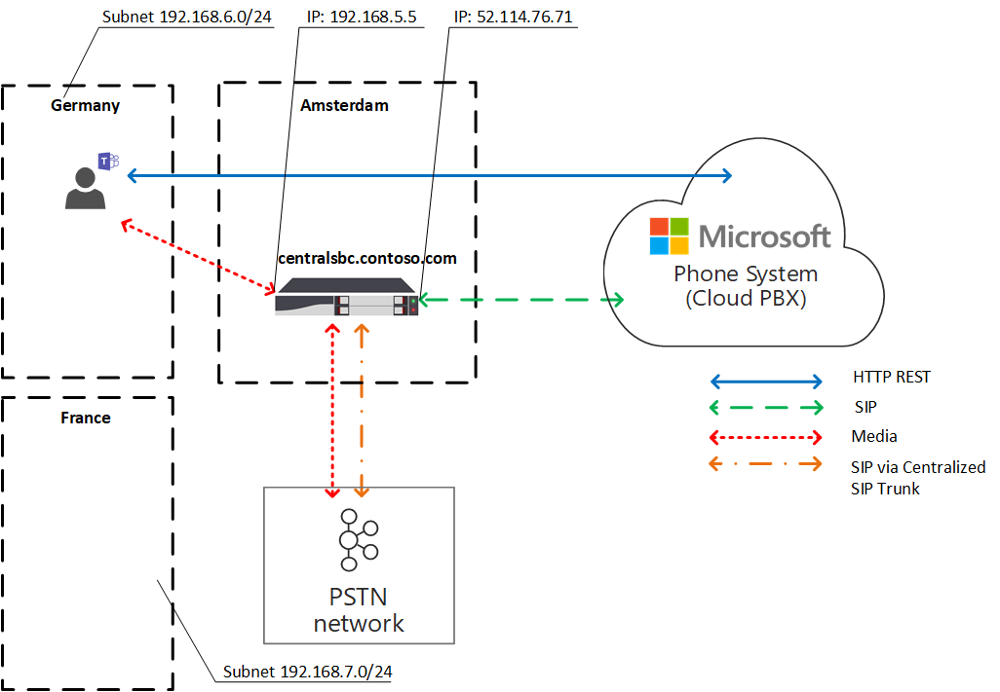
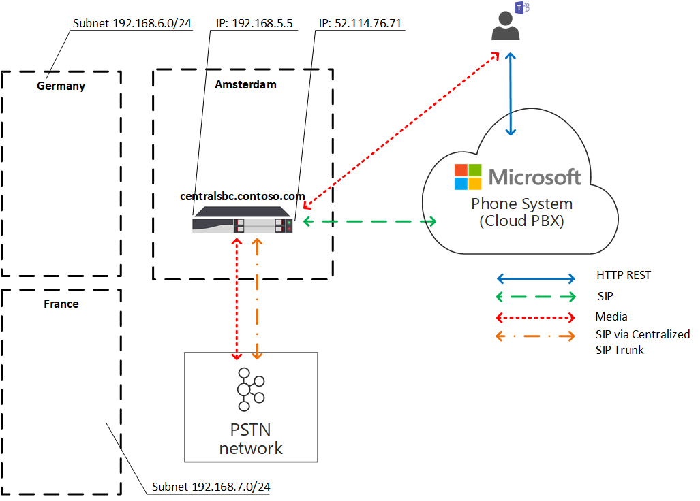

# Plan for Local Media Optimization for Direct Routing

Public Switched Telephone Network (PSTN) voice is considered a business-critical application with high expectations for voice quality. Direct Routing lets you control media traffic flows to accommodate a multitude of network topologies and local telephony setups for various enterprises all over the world.

Local Media Optimization for Direct Routing lets you manage voice quality by:

- Controlling how media traffic flows between the Teams clients and the customer Session Border Controllers (SBCs).
- Keeping media local within the boundaries of corporate network subnets.
- Allowing media streams between the Teams clients and the SBCs even if the SBCs are behind corporate firewalls with private IPs and not visible to Microsoft directly.

Local Media Optimization supports two scenarios:

- Centralization of all local trunks through a centralized SBC connected to the main Session Initiation Protocol (SIP) trunk--providing telephony services to all local branch offices of the company.

- Building a virtual network topology of SBCs--where the SBCs in the local branch offices are connected to a centralized proxy SBC that is visible to, and communicating with, Microsoft Phone System through its external IP address. In a virtual network topology, downstream SBCs are communicating through internal IPs and are not directly visible to Phone System.

This article describes feature functionality, and customer scenarios and solutions. For details on configuration, see [Configure Local Media Optimization](direct-routing-media-optimization-configure.md).

  > [!NOTE]
  > If you want to keep media local within the boundaries of your intranet, Local Media Optimization is recommended. If you already have Media Bypass and you use only the public IP addresses of your SBCs, it is not mandatory to move to Local Media Optimization. You can continue to use Media Bypass. For more information, see [Plan Media Bypass](direct-routing-plan-media-bypass.md).

For information on which SBC vendors support Local Media Optimization, see [Session Border Controllers Certified for Direct Routing](direct-routing-border-controllers.md).

## Supported customer scenarios

For this discussion, assume that Contoso runs multiple businesses across the globe as follows. (Note that Europe and APAC regions are used as examples only. A company might have several different regions with similar requirements.)

- **In Europe**, Contoso has offices in approximately 30 countries. Each office has its own Private Branch Exchange (PBX).

  Contoso was offered an option to centralize the trunks in one location--Amsterdam--for all 30 European offices. Contoso deployed the SBC in Amsterdam, provided enough bandwidth to run calls through the centralized location, connected a central SIP trunk to the centralized location, and started serving all European locations from Amsterdam.

- **In the APAC region**, Contoso has multiple offices in different countries.

  In many countries, the company still has time-division multiplexing (TDM) trunks in local branch offices. Centralization of the TDM trunks is not an option in the APAC region, so switching to SIP is not possible. Assume there are more than 50 Contoso branch offices across the APAC region with hundreds of gateways (SBCs). In this scenario, it is not possible to pair all gateways to the Direct Routing interface because of a lack of public IP addresses and/or local internet breakouts. In addition, some countries impose regulatory requirements that cannot be fulfilled without having local PSTN network connectivity.

Based on their business requirements, Contoso implemented two solutions with Local Media Optimization for Direct Routing:

- **In Europe**, all trunks are centralized and media flows between the central SBC and the users, based on the user location.

  - If a user is connected to the local subnet of a corporate network (that is, the user is internal), media flows between the internal IP of the central SBC and the user's Teams client.

  - If a user is outside the boundaries of the corporate network--for example, if the user is using a public wireless Internet connection--then the user is considered to be external. In this case, the media flows between the external IP of the central SBC and the Teams client.

- **In the APAC region**, a centralized proxy SBC is paired to Microsoft Direct Routing, which directs media between the Direct Routing interface and the downstream SBCs in local branch offices.

  The downstream SBCs in the local branch offices are not directly visible to Direct Routing in APAC, but they are paired by using the Set-CSOnlinePSTNGateway cmdlet to create a virtual network topology within Microsoft Phone System. Media always stays local when possible. External users have media flowing between the Teams client and the public IP of the proxy SBC.

## Central SBC with centralized trunks

To build a solution where PSTN services are provided to all local branch offices through a single central SBC with a connected centralized SIP trunk, the Contoso tenant administrator pairs one SBC (centralsbc.contoso.com) to the service; the SBC has a centralized SIP trunk connected to it.

- When a user is in the internal network of the company, the SBC provides the internal IP of the SBC for media.

- When a user is outside of the corporate network, the SBC provides the external (public) IP of the SBC.

> [!NOTE]
> All values within examples, tables, or diagrams are presented for illustration purposes only.

Table 1. Example network parameters for SBCs

| Location | SBC FQDN | Internal subnet | External NAT (Trusted IP) | SBC external IP address | SBC internal IP address |
|:------------|:-------|:-------|:-------|:-------|:-------|
| Amsterdam | centralsbc.contoso.com | 192.168.5.0/24 | 172.16.76.73 | 172.16.76.71 | 192.168.5.5 |
| Germany | Not deployed | 192.168.6.0/24 | 172.16.76.74 | Not deployed |  Not deployed |
| France | Not deployed | 192.168.7.0/24 | 172.16.76.75 | Not deployed |  Not deployed |

### Internal user

The following diagram shows the traffic flow when a user is connected to the corporate network in the user's home branch office or site.

While on premises, the user is assigned to the local branch office in Germany. The user makes a Direct Routing phone call through Teams.

- The user's Teams client communicates to Phone System directly through the REST API, but the media generated during the call flows to the central SBC's internal IP address.

- The SBC redirects the flow to Phone System and the connected PSTN network.

- The central SBC is visible to Phone System through the external IP address only.

Diagram 1. Traffic flow when the user is in the 'home' site with a centralized SBC and with a connected centralized SIP Trunk

### External user

The following diagram shows the traffic flow when a user is not on premises and is not connected to the corporate network (that is, the user's device is connected to the Internet through a mobile device or public Wi-Fi). The user makes a Direct Routing phone call through Teams:

- The user's Teams client communicates to Phone System directly through the REST API, but, in this case, the media generated during the call flows to the central SBC's external IP address.

- The SBC redirects the flow to Phone System and the connected PSTN network.

- The central SBC is visible to Phone System through the external IP address only.

In this case, the behavior is similar whether the user is local to the branch office in Germany or to any other branch office. The user is considered external because the user is outside the boundaries of the corporate network.

Diagram 2. Traffic flow when the user is external with a centralized SBC and with a connected centralized SIP Trunk

## Proxy SBC with connected downstream SBCs

To build a solution where PSTN services are provided in all local branch offices in the APAC region where centralization of the TDM trunks is not an option, the Contoso administrator pairs one SBC (proxysbc.contoso.com), also called the proxy SBC, to the Direct Routing service.

Afterwards, the Contoso administrator adds some downstream SBCs indicating that they can be reached through the proxy SBC proxysbc.contoso.com. Downstream SBCs do not have public IPs, however, they can be assigned to voice routes. The table below shows example network parameters and configuration.

When a user is in the local branch office where the downstream SBC is located, the media traffic flows between the user and the local downstream SBC directly. If a user is outside of the office (on a public internet), the media flows from the user to the public IP of the Proxy SBC, which proxies it to the relevant downstream SBC(s).

Table 2. Example SBC network information

| Location | SBC FQDN | Internal subnet | External NAT (Trusted IP) | SBC external IP address  | SBC internal IP address |
|:------------|:-------|:-------|:-------|:-------|:-------|
| Vietnam | VNsbc.contoso.com | 192.168.1.0/24 | 172.16.240.110 | None |  192.168.1.5 |
| Indonesia  | IDsbc.contoso.com | 192.168.2.0/24 | 172.16.240.120 | None |  192.168.2.5 |
| Singapore | proxysbc.contoso.com |   192.168.3.0/24 | 172.16.240.130 | 172.16.240.133 | 192.168.3.5 |

### Internal user

The following diagram shows the high-level traffic flow for the scenario when a user is inside the office in the APAC region.
The user, who is assigned to a local branch office in Vietnam, and is on premises, makes a Direct Routing phone call through Teams.

- The user's Teams client communicates with Phone System directly through the REST API, but media generated during the call flows to local SBC's internal IP address.

- The local SBC redirects the flow to the proxy SBC in Singapore and to the connected local PSTN network.

-  The proxy SBC is visible to Phone System through the external IP address only and routes the flow from the downstream SBC (in this case the local SBC in Vietnam) to Phone System.

- The downstream SBC in the local branch office is not visible to Phone System directly but is mapped within the virtual network topology that is defined by the Contoso administrator while setting up Local Media Optimization.

> [!NOTE]
> The behavior might be different for local users and non-local users depending on the configured Local Media Optimization mode.

For more information on possible modes and relevant behavior, see Configure Local Media Optimization.

Diagram 3. Traffic flow when the user is in the "home" network with a proxy SBC and with connected downstream SBCs

### External user

The following diagram shows the traffic flow when a user is outside of the corporate network boundaries. The user is not on premises (is not within the boundaries of corporate network). The user makes a Direct Routing phone call through Teams to a phone number in Vietnam.

- The user's Teams client communicates with Phone System directly through the REST API, but the  media generated during the call flows first to the external IP address of the proxy SBC in Singapore.

- Based on configuration and voice policies (see [Configure Local Media Optimization](direct-routing-media-optimization-configure.md) for details), the proxy SBC redirects the flow to the downstream SBC in Vietnam.

- The downstream SBC in Vietnam redirects the flow to the connected local PSTN network.

- The proxy SBC is visible to Phone System through the external IP address only.

-  The downstream SBC in the local branch office is not visible to Phone System directly, but is mapped within the virtual network topology that is defined by the Contoso administrator while setting up Local Media Optimization. In the example, the user is considered external because the user is outside the boundaries of the corporate network.

Diagram 4. Traffic flow when the user is external with a proxy SBC and with connected downstream SBCs

## Local Media Optimization modes

Local Media Optimization supports two modes:

- **Mode 1: Always bypass**. In this case, if the user is internal, the media will flow through the local downstream SBC's internal IP address regardless of the actual location of the internal user; for example, within the same branch office where the downstream SBC is located or in some other branch office.

- **Mode 2: Only for local users**. In this mode, media will flow directly to the local downstream SBC's internal IP address only when generated by the internal user located in the same branch office as the downstream SBC.

To distinguish between Local Media Optimization modes, the tenant administrator needs to set the -BypassMode parameter to either 'Always' or 'OnlyForLocalUsers' for every SBC by using the  Set-CSonlinePSTNGateway cmdlet. For more information, see [Configure Local Media Optimization](direct-routing-media-optimization-configure.md).

> [!NOTE]
> When users are internal, media connectivity between the user and the SBC over the internal IP address is **required**. There is no fallback to public transport relays for media in this case as the SBC will be providing an internal IP for media connectivity.

### Mode 1: Always bypass

If you have good connection between branch offices, the recommended mode is Always bypass.

For example, assume a company has a centralized SIP trunk in Amsterdam, which serves 30 countries and has good connectivity between all 30 sites and local users. There is also a branch in Germany where a local SBC is deployed.

The SBC in Germany can be configured in "Always bypass" mode. Users, regardless of their location, will connect to the SBC directly through the internal IP address of the SBC (for example from France to Germany; see the diagram below for reference).

The following describes two scenarios:

- Scenario 1. The user is in the same location as the SBC defined in the Online Voice Routing Policy.

- Scenario 2. The user and gateways are in different sites.

#### Scenario 1. The user is in the same location as the SBC defined in the Online Voice Routing Policy

The SBC in Amsterdam is configured to be a proxy SBC for a local downstream SBC in Germany. The user is in Germany within the same subnet as the corporate network of the local SBC. Both SBCs (proxy and downstream) are configured for Always Bypass mode. Online voice routing policies specify that in case of calls within Germany (with area code +49) they should be routed to the local SBC in Germany. All other calls--and in case the SBC in Germany fails, calls in Germany--should be routed to the proxy SBC in Amsterdam. The following table summarizes the example configuration.

Table 3. Example configuration for Scenario 1

| User physical location | User makes a call to a number | Online Voice Routing Policy | Mode configured for SBC | Media Flow |
|:------------|:-------|:-------|:-------|:-------|
| Germany | +49 1 437 2800 | Priority 1: ^\+49(\d{8})$ -DEsbc.contoso.com Priority 2: .* - proxysbc.contoso.com| DEsbc.contoso.com – Always Bypass  proxysbc.contoso.com – Always Bypass | Teams User <–> DEsbc.contoso.com |

The diagram below shows the high-level traffic flow for the internal user in Germany making a Direct Routing phone call through Teams to the number in Germany.

- The user's Teams client communicates with Phone System directly through the REST API.

- The media generated during the call flows to the local SBC's internal IP address.

- The local SBC redirects the flow to the proxy SBC in Amsterdam and to the connected local PSTN network.

- The proxy SBC is visible to Phone System through the external IP address only and routes the flow from the downstream SBC (in this case, the local SBC in Germany) to Phone System.

- The downstream SBC in the local branch office is not visible to Phone System directly but is mapped within the virtual network topology that is defined by the Contoso administrator while setting up Local Media Optimization.

Diagram 5.  Traffic flow with "Always Bypass" mode and the user is in the "home" site

#### Scenario 2: The user and gateways are in different sites

The SBC in Amsterdam is configured to be a proxy SBC for a local downstream SBC in Germany. Both SBCs (proxy and downstream) are configured for Always Bypass mode. The internal user in France, located in the local branch office, is making a Direct Routing call to Germany. Online voice routing policies specify that calls to Germany (with area code +49) should be routed to the local SBC in Germany. All other calls--and, in case the SBC in Germany fails, all calls in Germany--should be routed to the proxy SBC in Amsterdam. The following table summarizes the example configuration.

Table 4. Example configuration for Scenario 2

| User physical location | User makes a call to a number | Online Voice Routing Policy | Mode configured for SBC | Media Flow |
|:------------|:-------|:-------|:-------|:-------|
| France | +49 1 437 2800 | Priority 1: ^\+49(\d{8})$ -DEsbc.contoso.com  Priority 2: .* - proxysbc.contoso.com |  DEsbc.contoso.com  – Always Bypass proxysbc.contoso.com – Always Bypass | Teams User <– > DEsbc.contoso.com  |

The following diagram shows the high-level traffic flow when the internal German user located in France makes a Direct Routing phone call through Teams to the number in Germany.

- The user's Teams client communicates with Phone System directly through the REST API.

- The media generated during the call flows directly to the SBC in Germany's internal IP address.

- The SBC in Germany redirects the flow to the proxy SBC in Amsterdam and to the connected local PSTN network.

Diagram 6.  Traffic flow with "Always Bypass" mode and the user is not in "home" site but in the internal network

### Mode 2: Only for local users

If there are bad connections between local branch offices but good connections between each local branch office and regional office, then the recommended mode is "Only For Local Users".

For example, in the APAC region, assume Contoso has multiple offices in different countries. For many countries, switching to SIP is not possible because the company still has TDM trunks in many local branch offices. Centralization of the TDM trunks is not an option in the APAC region. Moreover, there are more than 50 Contoso branch offices across the APAC region with hundreds of gateways (SBCs).

To build a solution where PSTN services are provided in all local branch offices in the APAC region where centralization of the TDM trunks is not an option, the Contoso administrator pairs one regional SBC in Singapore as the proxy SBC to the Direct Routing service. The direct connection between the local branch offices is not good, but there is a good connection between each local branch office and the regional SBC in Singapore. For the regional SBC, the administrator chooses 'Always Bypass' mode, and for the local downstream SBCs, the administrator chooses 'Only For Local Users' mode.

The following describes two scenarios:

- Scenario 1. The user is in the same location as the SBC defined in the Online Voice Routing Policy

- Scenario 2. The user and gateways are in different sites

#### Scenario 1. The user is in the same location as the SBC defined in Online Voice Routing Policy

Assume the SBC in Singapore is configured to be a proxy SBC for the local downstream SBCs in Vietnam and Indonesia. The user is in Vietnam within the same location as the local SBC. Online voice routing policies specify that calls in Vietnam (with area code +84) should be routed to the local SBC in Vietnam. All other calls--and, if the SBC in Vietnam fails, calls in Vietnam--should be routed to the proxy SBC in Singapore. The following table summarizes the example configuration.

Table 5. Example configuration for 'Only For Local Users' mode Scenario 1

| User physical location | User makes a call to a number | Online Voice Routing Policy | Mode configured for SBC | Media Flow |
|:------------|:-------|:-------|:-------|:-------|
| Vietnam | +84 4 3926 3000 | Priority 1: ^\+84(\d{9})$ -VNsbc.contoso.com  Priority 2: .* - proxysbc.contoso.com | VNsbc.contoso.com – Only For Local Users   proxysbc.contoso.com – Always Bypass | Teams User <–> VNsbc.contoso.com |

In the following diagram, a user assigned to the local branch office in Vietnam, while on premises, makes a Direct Routing phone call through Teams.

- The user's Teams client communicates with Phone System directly through the REST API.

- Media generated during the call flows to the local SBC's internal IP address.

- The local SBC redirects the flow to the proxy SBC in Singapore and to the connected local PSTN network.

- The proxy SBC is visible to Phone System through the external IP address only and routes the flow from the downstream SBC (in this case, the local SBC in Vietnam) to Phone System.

- The downstream SBC in the local branch office is not visible to Phone System directly but is mapped within the virtual network topology.

Diagram 7. Traffic flow with "Only For Local Users" mode and the user is in "home" site

#### Scenario 2. The user and gateways are in different sites

Assume the SBC in Singapore is configured to be a proxy SBC for the local downstream SBCs in Vietnam and Indonesia. The internal user in Indonesia, located in the local branch office, is making a Direct Routing call to Vietnam. Online Voice routing policies specify that calls to Vietnam (with area code +84) should be routed to the local SBC in Vietnam. All other calls--and, in case the SBC in Vietnam fails, calls to Vietnam--should be routed to the proxy SBC in Singapore. The proxy SBC in Singapore is set to 'Always Bypass' mode, and the local SBC in Vietnam is set to 'Only For Local Users' mode. The following table summarizes the example configuration.

Table 6. User configuration

| User physical location | User makes a call to a number | Online Voice Routing Policy | Mode configured for SBC | Media Flow |
|:------------|:-------|:-------|:-------|:-------|
| Indonesia | +84 4 3926 3000 | Priority 1: ^\+84(\d{9})$ -VNsbc.contoso.com   Priority 2: .* - proxysbc.contoso.com |VNsbc.contoso.com – Only For Local Users   proxysbc.contoso.com – Always Bypass | Teams User <–> proxysbc.contoso.com <–> VNsbc.contoso.com |

In the following diagram, the internal user, while on premises in the Indonesian branch office, makes a Direct Routing phone call through Teams to a number in Vietnam.

- The user's Teams client communicates with Phone System directly through the REST API.

- Media generated during the call flows to proxy SBC's internal IP address first.

- The proxy SBC in Singapore redirects the flow to the internal IP address of the downstream SBC in Vietnam and to Phone System.

- The Downstream SBC in Vietnam routes the flow to the connected local PSTN network.

- The proxy SBC is visible to Phone System through the external IP address only.

- The downstream SBCs in local branch offices are not visible to Phone System directly but are mapped within the virtual network topology.

Diagram 8.  Traffic flow with "Only For Local Users" mode, and the user is not in "home" site but in the internal network

## Known issues

The following is a list of known issues that are currently present in Local Media Optimization. Microsoft is working on addressing these issues.

| Issue | Workaround |
| :--- | :--- |
| Teams client is not identified as **internal** when the Teams client Public IP matches the customer Trusted IP list. | Local Media Optimization requires that the Teams client subnet matches a tenant configured [network subnet](/powershell/module/skype/new-cstenantnetworksubnet)|
| Call escalations result in dropped calls when the Teams client is identified as internal.| Disable Local Media Optimization on the Direct Routing SBC.|
| Call escalations from 1 to 1 call between internal customers to multiparty call with external customer/resource result in dropped calls | Work in progress on a fix. Alternatively, disable Local Media Optimization on the Direct Routing SBC.|
| Teams user puts the call On Hold. Music plays on the PSTN end and Local Media Optimization is working. The Teams user resumes the call. The call to PSTN resumes but Local Media Optimization is not working and the call continues via Central (Proxy) SBC | When a user parks a call to initiate music on hold (MoH), it is being escalated from 1:1 to a multiparty call by the Call Controller to invoke Media Controller and Media Processor (serving as AVMCU mixer) through which MoH reaches a user who has been put on hold. De-escalation to a 1:1 call after the call resumes never happens as per design. Disable Local Media Optimization on the Direct Routing SBC.|
|While a call is being established for a few seconds, the user might hear silence.| Due to the complexity of Local Media Optimization architecture, this might occur in some cases.|
|Voice apps (e.g. Auto Attendant, Call Queue) do not work.| LMO does not support Voice Apps, as they reside in the cloud and require external connectivity. No workaround for now.|
