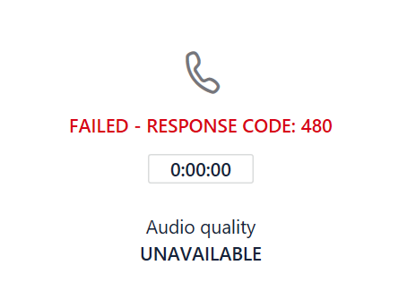

# Monitor and troubleshoot Direct Routing

This article describes how to monitor and troubleshoot your Direct Routing configuration. 

The ability to make and receive calls by using Direct Routing involves the following components: 

- Session Border Controllers (SBCs) 
- Direct Routing components in the Microsoft Cloud 
- Telecom trunks 

If you have difficulties troubleshooting issues, please open a support case with your SBC vendor or Microsoft. 

Microsoft is working on providing more tools for troubleshooting and monitoring. Please check the documentation periodically for updates. 

## Monitoring availability of Session Border Controllers using Session Initiation Protocol (SIP) options messages

Direct Routing uses SIP options sent by the Session Border Controllers to monitor SBC health. There are no actions required from the tenant administrator to enable the SIP options monitoring. The collected information is taken into consideration when routing decisions are made. 

For example, if, for a specific user, there are several SBCs available to route a call, Direct Routing considers the SIP options information received from each SBC to determine routing. 

The following diagram shows an example of the configuration: 

When a user makes a call to number +1 425 \<any seven digits>, Direct Routing evaluates the route. There are two SBCs in the route: sbc1.contoso.com and sbc2.contoso.com. Both SBCs have equal priority in the route. Before picking an SBC, the routing mechanism evaluates the health of the SBCs based on when the SBC sent the SIP options last time. 

An SBC is considered healthy if statistics at the moment of sending the call shows that the SBC sends Options every minute.  

When a call is made, the following logic applies:

- The SBC was paired at 11.00 AM.  
- The SBC sends options at 11.01 AM, 11.02 AM, and so on.  
- At 11.15, a user makes a call and the routing mechanism selects this SBC. 

Direct Routing takes the regular interval options three times (the regular interval is one minute). If options were send during the last three minutes, the SBC is considered healthy.

If the SBC in the example sent options at any period between 11.12 AM and 11.15 AM (the time the call was made), it is considered healthy. If not, the SBC will be demoted from the route. 

Demotion means that the SBC will not be tried first. For example, we have sbc1.contoso.com and sbc2.contoso.com with equal priority.  

If sbc1.contoso.com does not send SIP options on a regular interval as described above, it is demoted. Next, sbc2.contoso.com tries for the call. If sbc2.contoso.con cannot deliver the call, the sbc1.contoso.com (demoted) is tried again before a failure is generated. 

If two (or more) SBCs in one route concidered healthy and equal, Fisher-Yates shuffle applied to distrubute the calls between the SBCs.

## Monitor Call Quality Analytics dashboard and SBC logs 
 
In some cases, especially during the initial pairing, there might be issues related to misconfiguration of the SBCs and/or the Direct Routing service. 

You can use the following tools to monitor your configuration:  
 
- Call Quality Dashboard 
- SBC logs 

The Direct Routing service has very descriptive error codes reported to either Call Analytics or the SBC logs. 

The Call Quality Dashboard provides information about call quality and reliability. To learn more about how to troubleshoot issues using Call Analytics, see [Turning on and using Call Quality Dashboard for Microsoft Teams and Skype for Business Online](https://docs.microsoft.com/SkypeForBusiness/using-call-quality-in-your-organization/turning-on-and-using-call-quality-dashboard) and [Use Call Analytics to troubleshoot poor call quality](https://docs.microsoft.com/SkypeForBusiness/using-call-quality-in-your-organization/use-call-analytics-to-troubleshoot-poor-call-quality). 

In case of call failures, Call Analytics provides standard SIP codes to help you with troubleshooting. 

However, Call Analytics can only help when calls reach the internal components of Direct Routing and fail. In case of issues with SBC pairing or issues where SIP “Invite” was rejected (for example, the name of the trunk FQDN is misconfigured), Call Analytics will not help. In this case, please refer to the SBC logs. Direct Routing sends a detailed description of issues to the SBCs; these issues can be read from the SBC logs. 
