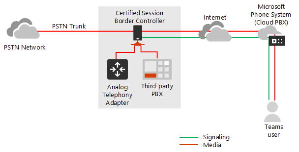
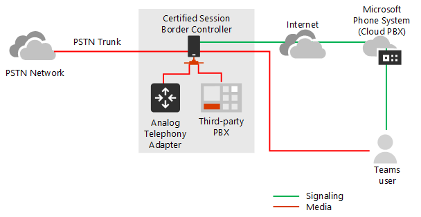
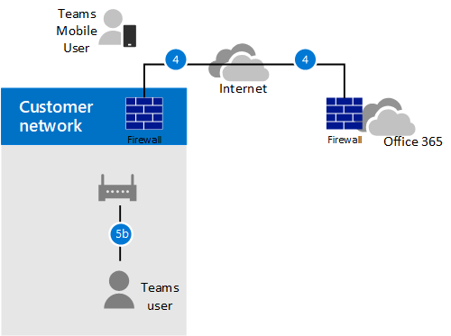
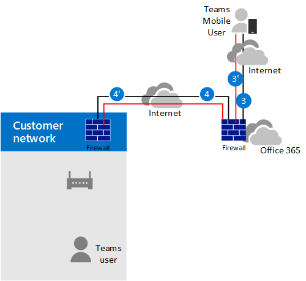
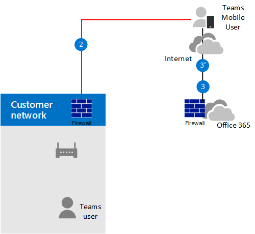
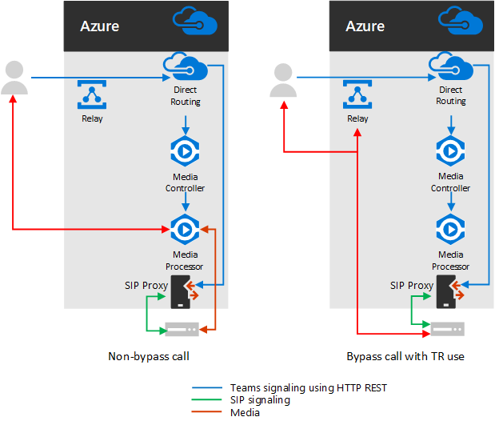
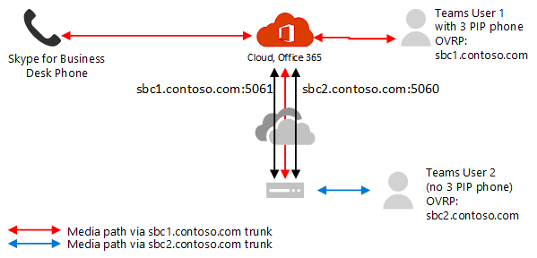

# Plan for media bypass with Direct Routing

## About media bypass with Direct Routing

Media bypass enables you to shorten the path of media traffic and reduce the number of hops in transit for better performance. With media bypass, media is kept between the Session Border Controller (SBC) and the client instead of sending it via the Microsoft Phone System. To configure media bypass, the SBC and the client must be in the same location or network.

You can control media bypass for each SBC by using the **Set-CSOnlinePSTNGateway** command with the **-MediaBypass** parameter set to true or false. If you enable media bypass, this does not mean that all media traffic will stay within the corporate network. This article describes the call flow in different scenarios.    

The diagrams below illustrate the difference in call flow with and without media bypass.

Without media bypass, when a client makes or receives a call, both signaling and media flow between the SBC, the Microsoft Phone System, and the Teams client, as shown in the following diagram:

But let's assume that a user is in the same building or network as the SBC. For example, assume a user who is in a building in Frankfurt makes a call to a PSTN user: 

- **Without media bypass**, media will flow via either Amsterdam or Dublin (where Microsoft datacenters are deployed) and back to the SBC in Frankfurt. 

  The datacenter in Europe is selected because the SBC is in Europe, and Microsoft uses the datacenter closest to the SBC. While this approach does not affect call quality due to optimization of traffic flow within Microsoft networks in most geographies, the traffic has an unnecessary loop.     

- **With media bypass**, the media is kept directly between the Teams user and the SBC as shown in the following diagram:

Media bypass leverages protocols called Interactive Connectivity Establishment (ICE) on the Teams client and ICE lite on the SBC. These protocols enable Direct Routing to use the most direct media path for optimal quality. ICE and ICE Lite are WebRTC standards. For detailed information about these protocols, see RFC 5245.

## Call flow and firewall planning

Call flow and firewall planning depends on whether the user has direct access to the public IP address of the SBC, and whether the user is inside or outside of the network.

### Call flow if the user has direct access to the public IP address of the SBC

If the user has direct access to the public IP address of the SBC, the call flow is as follows:

- For media bypass, the Teams client must have access to the public IP address of the SBC even from an internal network. If direct media is not desired, the media can flow via Transport Relays.

- This is the recommended solution when a user is in the same building and/or network as the SBC – remove Microsoft Cloud components from the media path.

- Signaling always flows via the Microsoft cloud.

The following diagram shows call flow when media bypass is enabled, the client is internal, and the client can reach the public IP address of the SBC (direct media): 

- The arrows and numeric values of the paths are in accordance with the [Microsoft Teams call flows](https://docs.microsoft.com/microsoftteams/microsoft-teams-online-call-flows) article.

- The SIP signaling always takes paths 4 and 4’ (depending on the direction of the traffic). Media stays local and takes path 5b.

### Call flow if the user does not have access to the public IP address of the SBC

The following describes call flow if the user does not have access to the public IP address of the SBC. 

For example, assume the user is external, and the tenant administrator decided not to open the public IP address of the SBC to everyone in the Internet, but only to the Microsoft Cloud. The internal components of traffic can flow via the Teams Transport Relays. This is the recommended configuration for users outside of the corporate network. Consider the following:

- Teams Transport Relays are used.

- For media bypass, Microsoft uses a version of Transport Relays that requires opening ports 50 000 to 59 999 between the Teams Transport Relays and the SBC (in the future we plan to move to the version which requires only 3478 and 3479 ports).

- For media optimization purposes, Microsoft recommends opening the public IP address of the SBC only to Teams Transport Relays. For clients outside of the corporate network, Microsoft recommends using Transport Relays instead of reaching the public IP address of the SBC directly.

The following diagram shows call flow when media bypass is enabled, the client is external, and the client cannot reach the public IP address of the Session Border Controller (media is relayed by Teams Transport Relay).

- The arrows and numeric values of the paths are in accordance with the [Microsoft Teams call flows](https://docs.microsoft.com/microsoftteams/microsoft-teams-online-call-flows) article.

- Media is relayed via paths 3, 3', 4 and 4'

### Call flow if a user is outside the network and has access to the public IP of the SBC

> [!NOTE]
> This is not a recommended configuration because it does not take advantage of Teams Transport Relays. Instead, you should consider the previous scenario where the user does not have access to the public IP address of the SBC. 

The following diagram shows call flow when media bypass is enabled, the client is external, and the client can reach the public IP address of the SBC (direct media).

- The arrows and numeric values of the paths are in accordance with the [Microsoft Teams call flows](https://docs.microsoft.com/microsoftteams/microsoft-teams-online-call-flows) article.

- The SIP signaling always takes paths 3 and 3’ (depending on the direction of the traffic). Media flows using path 2.

## Use of Media Processors and Transport Relays

There are two components in the Microsoft Cloud that can be in the path of media traffic: Media Processors and Transport Relays. 

- The Media Processor is a public facing component that handles media in non-bypass cases and handles media for voice applications.

   Media Processors are always in the path for end user non-bypassed calls, but never in the path for bypassed calls. Media Processors are always in the path for all voice applications such as Call Park, Organizational Auto Attendant, and Call Queues.

- The Transport Relay is used to connect to the closest Transport Service to send real time traffic.

   Transport Relays might or might not be in the path for bypassed calls--originating from or destined to end users--depending on where the user is and how the network is configured .

The following diagram shows two call flows – one with media bypass enabled and the second with media bypass disabled. Note the diagram only illustrates traffic originating from--or destined to--end users.  
- The Media Controller is a microservice in Azure that assigns Media Processors and creates Session Description Protocol (SDP) offers.

- The SIP Proxy is a component that translates HTTP REST signaling used in Teams to SIP.    

The table below summarizes the difference between Media Processors and Transport Relays.

|    | Media Processors | Transport Relays|
| :--------------|:---------------|:------------|
In media path for non-bypassed calls for end users | Always | Never | 
In media path for bypassed calls for end users | Never | If client cannot reach the SBC on the public IP address | 
In media path for voice applications | Always | Never | 
Can do transcoding (B2BUA)\* | Yes | No, only relays audio between endpoints | 
Number of instances worldwide and location | 8 total: 2 in US East and West; 2 in Amsterdam and Dublin; 2 in Hong Kong and Singapore; 2 in Japan (being added in Q1CY2019)  | Multiple

The IP range is 52.112.0.0 /14 (IP addresses from 52.112.0.1 to 52.115.255.254). 

\* Transcoding explanation: 

- Media Processor is B2BUA, which means it can change a codecs (for example, SILK from Teams client to MP and G.711 between MP and SBC).

- Transport Relays are not B2BUA, which means the codec is never changed between the client and the SBC--even if traffic flows via relays.

### Use of Teams Transport Relays in escalation scenarios if trunk is configured for media bypass

Teams Transport Relays are always in the media path in the following scenarios:

- Call is escalated from 1:1 to a group call
- Call is going to a federated Teams user
- Call is forwarded or transferred to a Skype for Business user

Ensure your SBC has access to the Transport Relays as described below.    

## SIP Signaling: FQDNs

For SIP signaling, the FQDN and firewall requirements are the same as for non-bypassed cases. 

Direct Routing is offered in the following Office 365 environments:
- Office 365
- Office 365 GCC
- Office 365 GCC High;
- Office 365 DoD
Learn more about [Office 365 and US Government environments](https://docs.microsoft.com/office365/servicedescriptions/office-365-platform-service-description/office-365-us-government/office-365-us-government) such as GCC, GCC High, and DoD.

### Office 365 and Office 365 GCC envirionments

The connection points for Direct Routing are the following three FQDNs:

- **sip.pstnhub.microsoft.com** – Global FQDN – must be tried first. When the SBC sends a request to resolve this name, the Microsoft Azure DNS servers return an IP address pointing to the primary Azure datacenter assigned to the SBC. The assignment is based on performance metrics of the datacenters and geographical proximity to the SBC. The IP address returned corresponds to the primary FQDN.

- **sip2.pstnhub.microsoft.com** – Secondary FQDN – geographically maps to the second priority region.

- **sip3.pstnhub.microsoft.com** – Tertiary FQDN – geographically maps to the third priority region.

You must place these three FQDNs in order to:

- Provide optimal experience (less loaded and closest to the SBC datacenter assigned by querying the first FQDN).

- Provide failover when a connection from an SBC is established to a datacenter that is experiencing a temporary issue. For more information, see Failover mechanism below.

The FQDNs **sip.pstnhub.microsoft.com**, **sip2.pstnhub.microsoft.com**, and **sip3.pstnhub.microsoft.com** will be resolved to one of the following IP addresses:
- 52.114.148.0
- 52.114.132.46
- 52.114.75.24
- 52.114.76.76
- 52.114.7.24
- 52.114.14.70

You will need to open ports for all these IP addresses in your firewall to allow incoming and outgoing traffic to and from the addresses for signaling. If your firewall supports DNS names, the FQDN **sip-all.pstnhub.microsoft.com** resolves to all the IP addresses above. 

### Office 365 GCC DoD envirionment

The connection point for Direct Routing is the following FQDN:

**sip.pstnhub.dod.teams.microsoft.us** – Global FQDN. Note as the Office 365 DoD envirionment exists only in the US datacenters, there is no secondary and tertiary FQDNs

The FQDNs – sip.pstnhub.dod.teams.microsoft.us will be resolved to one of the following IP addresses:

- 52.127.64.33
- 52.127.68.34

You will need to open ports for all these IP addresses in your firewall to allow incoming and outgoing traffic to and from the addresses for signaling.  If your firewall supports DNS names, the FQDN  sip.pstnhub.dod.teams.microsoft.us resolves to all the IP addresses above. 

### Office 365 GCC High envirionment

The connection point for Direct Routing is the following FQDN:

**sip.pstnhub.gov.teams.microsoft.us** – Global FQDN. Note as the GCC High envirionment exists only in the US datacenters, there is no secondary and tertiary FQDNs

The FQDNs – sip.pstnhub.gov.teams.microsoft.us will be resolved to one of the following IP addresses:

- 52.127.88.59
- 52.127.92.64

You will need to open ports for all these IP addresses in your firewall to allow incoming and outgoing traffic to and from the addresses for signaling.  If your firewall supports DNS names, the FQDN  sip.pstnhub.gov.teams.microsoft.us resolves to all the IP addresses above. 

## SIP Signaling: Ports

Prt requiremtns are the same for all Office 365 envirionments, where Direct Routing is offered:
- Office 365;
- Office 365 GCC;
- Office 365 GCC High;
- Office 365 DoD

You must use the following ports:

| Traffic | From | To | Source port | Destination port|
| :-------- | :-------- |:-----------|:--------|:---------|
SIP/TLS| SIP Proxy | SBC | 1024 - 65535 | Defined on the SBC |
| SIP/TLS | SBC | SIP Proxy | Defined on the SBC | 5061 |

## Media traffic: IP and Port ranges

Media traffic flows between the SBC and Teams client if direct connectivity is available or via Teams Transport Relays if the client cannot reach the SBC using the public IP address.

### Requirements for direct media traffic (between the Teams client and the SBC) 

The client must have access to the specified ports (see table) on the public IP address of the SBC. 

Note: If the client is in an internal network, the media flows to the public IP address of the SBC. You can configure hairpinning on your NAT device so traffic never leaves the enterprise network equipment.

| Traffic | From | To | Source port | Destination port|
| :-------- | :-------- |:-----------|:--------|:---------|
UDP/SRTP | Client | SBC | 50 000 – 50 019  | Defined on the SBC |
| UDP/SRTP | SBC | Client | Defined on the SBC | 50 000 – 50 019  |

Note: If you have a network device that translates the client's source ports, please make sure that translated ports are opened between the network equipment and the SBC. 

### Requirements for using Transport Relays

Transport Relays are in the same range as Media Processors (for non-bypass cases): 

### Office 365 and Office 365 GCC envirionments

-52.112.0.0 /14 (IP addresses from 52.112.0.1 to 52.115.255.254)

## Office 365 GCC DoD envirionment

- 52.127.64.0/21

### Office 365 GCC High envirionment

- 52.127.88.0/21

The port range of the Teams Transport Relays (applicable to all envirionments) is shown in the following table:

| Traffic | From | To | Source port | Destination port|
| :-------- | :-------- |:-----------|:--------|:---------|
UDP/SRTP | Transport Relay | SBC | 50 000 -59 999    | Defined on the SBC |
| UDP/SRTP | SBC | Transport Relay | Defined on the SBC | 50 000 – 59 999, 3478, 3479     |

Note: Microsoft recommends at least two ports per concurrent call on the SBC. Because Microsoft has two versions of Transport Relays, the following are required:

- v4, which can only work with port range 50 000 to 59 999

- v6, which works with ports 3478, 3479

At this time, media bypass only supports v4 version of Transport Relays. We will introduce support of v6 in the future. 

You need to open ports 3478 and 3479 for transitioning. When Microsoft introduces support for v6 Transport Relays with Media Bypass, you will not need to reconfigure your network equipment or SBCs. 

### Requirements for using media processors

Media Processors are always in the media path for voice applications and for Web cleints (for exampe, Teams cleint in Edge or Google Chrome). The requirements are the same as for non-bypass configuration.

The IP range for media traffic is 

### Office 365 and Office 365 GCC envirionments

-52.112.0.0 /14 (IP addresses from 52.112.0.1 to 52.115.255.254)

## Office 365 GCC DoD envirionment

- 52.127.64.0/21

### Office 365 GCC High envirionment

- 52.127.88.0/21

The port range of the Media Processors (applicable to all envirionments) is shown in the following table:

| Traffic | From | To | Source port | Destination port|
| :-------- | :-------- |:-----------|:--------|:---------|
UDP/SRTP | Media Processor | SBC | 49 152 – 53 247    | Defined on the SBC |
| UDP/SRTP | SBC | Media Processor | Defined on the SBC | 49 152 – 53 247     |

## Considerations if you have Skype for Business phones in your network  

If you have any Skype for Business end points in your network that are using Direct Routing--for example, a Teams user can have a 3PIP phone that is based on Skype for Business client--the media bypass on the trunk that serves these users must be turned off.

You can create a separate trunk for these users and assign it an Online Voice Routing policy.

High-level configuration steps:

- Split users by type – depending on whether the user has a 3PIP phone or not.

- Create two separate trunks with different FQDNs: one enabled for media bypass; the other not. 

  Both trunks point to the same SBC. The ports for TLS SIP signaling must be different. The ports for media must be the same.

- Assign the correct trunk depending on the type of the user in the Online Voice Routing policy.

The example below illustrates this logic.

| Set of users | Number of users | Trunk FQDN assigned in OVRP | Media bypass enabled |
| :------------ |:----------------- |:--------------|:--------------|
Users with Teams clients and 3PIP phones | 20 | sbc1.contoso.com:5061 | false | 
Users with only Teams end points (including new phones certified for Teams) | 980 | sbc2.contoso.com:5060 | true

Both trunks can point to the same SBC with the same public IP address. The TLS signaling ports on the SBC must be different, as shown in the following diagram. Note you will need to make sure that your certificate supports both trunks. In SAN, you need to have two names (**sbc1.contoso.com** and **sbc2.contoso.com**) or have a wildcard certificate.

For information about how to configure two trunks on the same SBC, see the documentation provided by your SBC vendor:

 - [AudioCodes deployment documentation](https://www.audiocodes.com/solutions-products/products/products-for-microsoft-365/direct-routing-for-microsoft-teams)
- [Oracle deployment documentation](https://www.oracle.com/industries/communications/enterprise-session-border-controller/microsoft.html)
- [Ribbon Communications deployment documentation](https://ribboncommunications.com/solutions/enterprise-solutions/microsoft-solutions/direct-routing-microsoft-teams-calling)
- [TE-Systems (anynode) deployment documentation](https://www.anynode.de/anynode-and-microsoft-teams/)

## Client endpoints supported with media bypass

Media bypass is supported with all Teams endpoints.

Note for webcleints (Teams Web app in Microsoft Edge, Google Chrome or Mozilla Firefox) we will covert the call to non-bypass even of it started as a bypass call. This happens automatically and does not require any actions on the administrator. 
 
## See also

[Configure media bypass with Direct Routing](direct-routing-configure-media-bypass.md)

