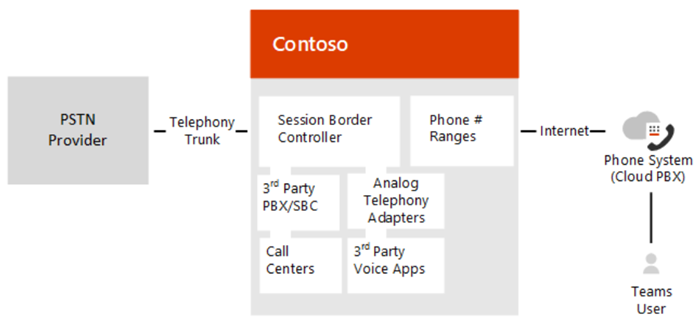

# Plan Direct Routing

> [!Tip]
> Watch the following session to learn about the benefits of Direct Routing, how to plan for it, and how to deploy it: [Direct Routing in Microsoft Teams](https://aka.ms/teams-direct-routing)

Microsoft Phone System Direct Routing lets you connect a supported, customer-provided Session Border Controller (SBC) to Microsoft Phone System.  With this capability, for example, you can configure on-premises PSTN connectivity with Microsoft Teams client, as shown in the following diagram: 

  > [!NOTE]
  > Skype for Business Online also lets you pair a customer-provided SBC, but this requires an on-premises Skype for Business Server deployment or a special edition of Skype for Business, called Cloud Connector, in between the SBC and the Microsoft Cloud. This scenario is known as hybrid voice. In contrast, Direct Routing allows a direct connection between the supported SBC and the Microsoft Cloud. 

With Direct Routing, you can connect your SBC to almost any telephony trunk or interconnect with third-party Public Switched Telephone Network (PSTN) equipment. Direct Routing enables you to: 

- Use virtually any PSTN trunk with Microsoft Phone System. 
- Configure interoperability between customer-owned telephony equipment, such as a third-party private branch exchange (PBX), analog devices, and Microsoft Phone System.

Microsoft also offers all-in-the-cloud voice solutions, such as Calling Plan.  However, a hybrid voice solution might be best for your organization if: 

- Microsoft Calling Plan is not available in your country. 
- Your organization requires connection to third-party analog devices, call centers, and so on. 
- Your organization has an existing contract with a PSTN carrier.

Direct Routing also supports users who have the additional license for the Microsoft Calling Plan. For more information, see [Phone System and Calling Plans](calling-plan-landing-page.md). 

With Direct Routing, when users participate in a scheduled conference, the dial-in number is provided by Microsoft Audio Conferencing service, which requires proper licensing.  When dialing out, the Microsoft Audio Conferencing service places the call using online calling capabilities, which requires proper licensing. (Note that dialing out does not route through Direct Routing.) For more information, see [Online Meetings with Teams](https://products.office.com/microsoft-teams/online-meeting-solutions). 
 
Planning your deployment of Direct Routing is key to a successful implementation. This article describes infrastructure and licensing requirements and provides information about SBC connectivity: 

- [Infrastructure requirements](#infrastructure-requirements)
- [Licensing and other requirements](#licensing-and-other-requirements)
- [SBC domain names](#sbc-domain-names)
- [Public trusted certificate for the SBC](#public-trusted-certificate-for-the-sbc)
- [SIP Signaling: FQDNs and firewall ports](#sip-signaling-fqdns-and-firewall-ports)
- [Media traffic: port ranges](#media-traffic-port-ranges)
- [Supported SBCs](#supported-session-border-controllers-sbcs)

For detailed information about configuring Direct Routing, see [Configure Direct Routing](direct-routing-configure.md).

## Infrastructure requirements
The infrastructure requirements for the supported SBCs, domains, and other network connectivity requirements to deploy Direct Routing are listed in the following table:  

|**Infrastructure requirement**|**You need the following**|
|:--- |:--- |
|Session Border Controller (SBC)|A supported SBC. For more information, see [Supported SBCs](#supported-session-border-controllers-sbcs).|
|Telephony trunks connected to the SBC|One or more telephony trunks connected to the SBC. On one end, the SBC connects to the Microsoft Phone System via Direct Routing. The SBC can also connect to third-party telephony entities, such as PBXs, Analog Telephony Adapters, and so on. Any PSTN connectivity option connected to the SBC will work. (Note: For configuration of the PSTN trunks to SBC, please refer to the SBC vendors or trunk providers.)|
|Office 365 tenant|An Office 365 tenant that you use to home your Microsoft Teams users, and the configuration and connection to the SBC.|
|User registrar|User must be homed in Office 365. If your company has an on-premises Skype for Business or Lync environment with hybrid connectivity to Office 365, you cannot enable voice in Teams for a user homed on-premises.  To check the registrar of a user, use the following Skype for Business Online PowerShell cmdlet: <code>Get-CsOnlineUser -Identity \<user> \| fl HostingProvider</code>   The output of the cmdlet should show: <code>HostingProvider : sipfed.online.lync.com</code>|
|Domains|One or more domains added to your Office 365 tenants.  **Note:** You cannot use the default domain, *.onmicrosoft.com, that is automatically created for your tenant.  To view the domains, you can use the following Skype for Business Online PowerShell cmdlet: <code>Get-CsTenant \| fl Domains</code>  For more information about domains and Office 365 tenants, see [Domains FAQ](https://support.office.com/article/Domains-FAQ-1272bad0-4bd4-4796-8005-67d6fb3afc5a).|
|Public IP address for the SBC|A public IP address that can be used to connect to the SBC. Based on the type of SBC, the SBC can use NAT.|
|Fully Qualified Domain Name (FQDN) for the SBC|A FQDN for the SBC, where the domain portion of the FQDN is one of the registered domains in your Office 365 tenant. For more information, see [SBC domain names](#sbc-domain-names).|
|Public DNS entry for the SBC |A public DNS entry mapping the SBC FQDN to the public IP Address. |
|Public trusted certificate for the SBC |A certificate for the SBC to be used for all communication with Direct Routing. For more information, see [Public trusted certificate for the SBC](#public-trusted-certificate-for-the-sbc).|
|Connection points for Direct Routing |The connection points for Direct Routing are the following three FQDNs:  `sip.pstnhub.microsoft.com` – Global FQDN, must be tried first. `sip2.pstnhub.microsoft.com` – Secondary FQDN, geographically maps to the second priority region. `sip3.pstnhub.microsoft.com` – Tertiary FQDN, geographically maps to the third priority region.  For information on configuration requirements, see [SIP Signaling: FQDNs and firewall ports](#sip-signaling-fqdns-and-firewall-ports).|
|Firewall IP addresses and ports for Direct Routing media |The SBC communicates to the following services in the cloud:  SIP Proxy, which handles the signaling Media Processor, which handles media -except when Media Bypass is on  These two services have separate IP addresses in Microsoft Cloud, described later in this document.  For more information, see the [Microsoft Teams section](https://docs.microsoft.com/office365/enterprise/urls-and-ip-address-ranges#skype-for-business-online-and-microsoft-teams) in [Office 365 URLs and IP address ranges](https://docs.microsoft.com/office365/enterprise/urls-and-ip-address-ranges). |
|Media Transport Profile|TCP/RTP/SAVP  UDP/RTP/SAVP|
Firewall IP addresses and ports for Microsoft Teams media |For more information, see [Office 365 URLs and IP address ranges](https://docs.microsoft.com/office365/enterprise/urls-and-ip-address-ranges). |
|||

## Licensing and other requirements 

Users of Direct Routing must have the following licenses assigned in Office 365: 

- Microsoft Phone System 
- Microsoft Teams 
- Microsoft Audio Conferencing 

> [!IMPORTANT]
>  In the case that you would like to add external participants to scheduled meetings, either by dialing out to them or by providing the dial-in number, the audio conferencing license is *required*.

> [!NOTE]
> The audio conferencing license is *required* to:
> - Escalate from 1:1 call to a group call.
> - Add external participants to scheduled meetings, by either dialing out or providing the dial-in number. 

In addition, you must ensure the following:
 
- CsOnlineVoiceRoutingPolicy is assigned to the user. 
- Allow Private Calling is enabled at the tenant level for Microsoft Teams. 

Direct Routing also supports users who are licensed for Microsoft Calling Plan. Microsoft Phone System with Calling Plan can route some calls using the Direct Routing interface. However, the users' phone numbers must be either acquired online or ported to Microsoft.  

Mixing Calling Plan and Direct Routing connectivity for the same user is optional, but could be useful, for example, when the user is assigned a Microsoft Calling Plan but wants to route some calls via SBC. One of the most common scenarios are calls to third-party PBXs.  With third-party PBXs, all calls, except calls to the phones connected to that PBXs, are routed via Microsoft Calling Plan; but calls to the phones connected to third-party PBXs go to the SBC, therefore stay within the enterprise network and not to the PSTN. 

For more information about Phone System licensing, see [Get the most from Office with Office 365](https://products.office.com/compare-all-microsoft-office-products?tab=2) and [Office 365 Plan Options](https://technet.microsoft.com/library/office-365-plan-options.aspx). 

For more information about Phone System licensing, see [Microsoft Teams add-on licensing](teams-add-on-licensing/microsoft-teams-add-on-licensing.md). 

## SBC domain names

The SBC domain name must be from one of the names registered in “Domains” of the tenant. You cannot use the *.onmicrosoft.com tenant for the FQDN name of the SBC.

The following table shows examples of DNS names registered for the tenant, whether the name can be used as a FQDN for the SBC, and examples of valid FQDN names:

|**DNS name**|**Can be used for SBC FQDN**|**Examples of FQDN names**|
|:--- |:--- |:--- |
contoso.com|Yes|**Valid names:** sbc1.contoso.com ssbcs15.contoso.com europe.contoso.com|
|contoso.onmicrosoft.com|No| Using *.onmicrosoft.com domains is not supported for SBC names

Assume you want to use a new domain name. For example, your tenant has contoso.com as a domain name registered in your tenant, and you want to use sbc1.sip.contoso.com. Before you can pair an SBC with the name sbc1.sip.contoso.com, you must register the domain name sip.contoso.com in "Domains" in your tenant. If you try pairing an SBC with sbc1.sip.contoso.com before registering the domain name, you will get the following error: "Cannot use the "sbc1.sip.contoso.com" domain as it was not configured for this tenant."
After you add the domain name, you also need to create a user with UPN user@sip.contoso.com and assign a "Teams" license. It might take up to 24 hours to fully provision the domain name after it is added to "Domains" of your tenant, a user with a new name is created, and a license is assigned to the user. 

It is possible that a company might have several SIP address spaces in one tenant. For example, a company might have contoso.com as a SIP address space and fabrikam.com as the second SIP address space. Some users have address user@contoso.com and some users have address user@fabrikam.com. 

The SBC only needs one FQDN and can service users from any address space in the paired tenant. For example,  an SBC with the name sbc1.contoso.com can receive and send the PSTN traffic for users with addresses user@contoso.com and user@fabrikam.com as long as these SIP address spaces are registered in the same tenant.  

## Public trusted certificate for the SBC

Microsoft strongly recommends that you request the certificate for the SBC by generating a certification signing request (CSR). For specific instructions on generating a CSR for an SBC, refer to the interconnection instructions or documentation provided by your SBC vendors. 

  > [!NOTE]
  > Most Certificate Authorities (CAs) require the private key size to be at least 2048. Keep this in mind when generating the CSR.

The certificate needs to have the SBC FQDN in the subject, common name, or subject alternate name fields.

Alternatively, Direct Routing  supports a wildcard in SAN, and the wildcard needs to conform to standard [RFC HTTP Over TLS](https://tools.ietf.org/html/rfc2818#section-3.1). 
An example would be using *.contoso.com in the SAN, which would match the SBC FQDN sbc.contoso.com, but wouldn’t match with sbc.test.contoso.com.

The certificate needs to be generated by one of the following root certificate authorities:

- AffirmTrust
- AddTrust External CA Root
- Baltimore CyberTrust Root
- Buypass
- Cybertrust
- Class 3 Public Primary Certification Authority
- Comodo Secure Root CA
- Deutsche Telekom 
- DigiCert Global Root CA
- DigiCert High Assurance EV Root CA
- Entrust
- GlobalSign
- Go Daddy
- GeoTrust
- Verisign, Inc. 
- Starfield 
- Symantec Enterprise Mobile Root for Microsoft 
- SwissSign
- Thawte Timestamping CA
- Trustwave
- TeliaSonera 
- T-Systems International GmbH (Deutsche Telekom)
- QuoVadis

Microsoft is working on adding additional certification authorities based on customer requests. 

## SIP Signaling: FQDNs 

Direct Routing is offered in the following Office 365 envirionments:
- Office 365;
- Office 365 GCC;
- Office 365 GCC High;
- Office 365 DoD

Learn more about [Office 365 and US Government environments](https://docs.microsoft.com/office365/servicedescriptions/office-365-platform-service-description/office-365-us-government/office-365-us-government) such as GCC, GCC High, and DoD.

### Office 365 and Office 365 GCC envirionments

The connection point for Direct Routing are the following three FQDNs:

- **sip.pstnhub.microsoft.com** – Global FQDN – must be tried first. When the SBC sends a request to resolve this name, the Microsoft Azure DNS servers return an IP address pointing to the primary Azure datacenter assigned to the SBC. The assignment is based on performance metrics of the datacenters and geographical proximity to the SBC. The IP address returned corresponds to the primary FQDN.
- **sip2.pstnhub.microsoft.com** – Secondary FQDN – geographically maps to the second priority region.
- **sip3.pstnhub.microsoft.com** – Tertiary FQDN – geographically maps to the third priority region.

Placing these three FQDNs in order is required to:

- Provide optimal experience (less loaded and closest to the SBC datacenter assigned by querying the first FQDN).
- Provide failover when connection from an SBC is established to a datacenter that is experiencing a temporary issue. For more information, see [Failover mechanism](#failover-mechanism-for-sip-signaling) below.  

The FQDNs – sip.pstnhub.microsoft.com, sip2.pstnhub.microsoft.com and sip3.pstnhub.microsoft.com – will be resolved to one of the following IP addresses:

- 52.114.148.0
- 52.114.132.46 
- 52.114.75.24 
- 52.114.76.76 
- 52.114.7.24 
- 52.114.14.70

You will need to open ports for all these IP addresses in your firewall to allow incoming and outgoing traffic to and from the addresses for signaling.  If your firewall supports DNS names, the FQDN sip-all.pstnhub.microsoft.com resolves to all the IP addresses above. 

### Office 365 GCC DoD envirionment

The connection point for Direct Routing is the following FQDN:

**sip.pstnhub.dod.teams.microsoft.us** – Global FQDN. Note as the Office 365 DoD envirionment exists only in the US datacenters, there is no secondary and tertiary FQDNs

The FQDNs – sip.pstnhub.dod.teams.microsoft.us will be resolved to one of the following IP addresses:

- 52.127.64.33
- 52.127.68.34

You will need to open ports for all these IP addresses in your firewall to allow incoming and outgoing traffic to and from the addresses for signaling.  If your firewall supports DNS names, the FQDN  sip.pstnhub.dod.teams.microsoft.us resolves to all the IP addresses above. 

### Office 365 GCC High envirionment

The connection point for Direct Routing is the following FQDN:

**sip.pstnhub.gov.teams.microsoft.us** – Global FQDN. As the GCC High environment exists only in the US data centers, there is no secondary and tertiary FQDNs.

The FQDNs – sip.pstnhub.gov.teams.microsoft.us will be resolved to one of the following IP addresses:

- 52.127.88.59
- 52.127.92.64

You will need to open ports for all these IP addresses in your firewall to allow incoming and outgoing traffic to and from the addresses for signaling.  If your firewall supports DNS names, the FQDN  sip.pstnhub.gov.teams.microsoft.us resolves to all the IP addresses above. 

## SIP Signaling: Ports

Port requirements are the same for all Office 365 environments where Direct Routing is offered:
- Office 365
- Office 365 GCC
- Office 365 GCC High;
- Office 365 DoD

You must use the following ports:

|**Traffic**|**From**|**To**|**Source port**|**Destination port**|
|:--- |:--- |:--- |:--- |:--- |
|SIP/TLS|SIP Proxy|SBC|1024 – 65535|Defined on the SBC|
SIP/TLS|SBC|SIP Proxy|Defined on the SBC|5061|
||||||

### Failover mechanism for SIP Signaling

The SBC makes a DNS query to resolve sip.pstnhub.microsoft.com. Based on the SBC location and the datacenter performance metrics, the primary datacenter is selected. If the primary datacenter experiences an issue, the SBC will try the sip2.pstnhub.microsoft.com, which resolves to the second assigned datacenter, and, in the rare case that datacenters in two regions are not available, the SBC retries the last FQDN (sip3.pstnhub.microsoft.com), which provides the tertiary datacenter IP.

The table below summarizes the relationships between primary, secondary, and tertiary datacenters:

|**If the primary datacenter is**|**EMEA**|**NOAM**|**ASIA**|
|:--- |:--- |:--- |:--- |
|The secondary datacenter (sip2.pstnhub.microsoft.com)|US|EU|US|
|The tertiary datacenter (sip3.pstnhub.microsoft.com)|ASIA|ASIA|EU|
|||||

## Media traffic: Port ranges
Note that the requirements below apply if you want to deploy Direct Routing without Media Bypass. For firewall requirements for Media Bypass, please refer to [Plan for media bypass with Direct Routing](https://docs.microsoft.com/en-us/microsoftteams/direct-routing-plan-media-bypass).

The media traffic flows to and from a separate service in the Microsoft Cloud. The IP range for Media traffic:

### Office 365 and Office 365 GCC envirionments

- 52.112.0.0 /14 (IP addresses from 52.112.0.1 to 52.115.255.254).

### Office 365 GCC DoD environment

- 52.127.64.0/21

### Office 365 GCC High envirionment

- 52.127.88.0/21

### Port range (applicable to all envirionments)
The port range of the Media Processors is shown in the following table: 

|**Traffic**|**From**|**To**|**Source port**|**Destination port**|
|:--- |:--- |:--- |:--- |:--- |
|UDP/SRTP|Media Processor|SBC|49 152 – 53 247|Defined on the SBC|
|UDP/SRTP|SBC|Media Processor|Defined on the SBC|49 152 – 53 247|
|

  > [!NOTE]
  > Microsoft  recommends at least two ports per concurrent call on the SBC.

## Media traffic: Codecs

### Leg between SBC and Cloud Media Processor or Microsoft Teams client.
Applies to both media bypass case and non-bypass cases

The Direct Routing interface on the leg between the Session Border Controller and Cloud Media Processor (without media bypass) or between the Teams client and the SBC (if Media Bypass enabled) can use the following codecs:
- Non-Media bypass (SBC to Cloud Media Processor): SILK, G.711, G.722, G,729
- Media Bypass (SBC to Teams client):  SILK, G.711, G.722, G,729, OPUS

You can force use of the specific codec on the Session Border Controller by excluding undesirable codecs from the offer.

### Leg between Microsoft Teams Client  and Cloud Media Processor
Applies to non-media bypass case only. With Media Bypass media flows directly between Teams client and SBC

On the leg between the Cloud Media Processor and Microsoft Teams client either SILK or G.722 used. The codec choice on this leg  based on Microsoft algorithms, which take into consideration multiple parameters. 

## Supported Session Border Controllers (SBCs)

Microsoft only supports certified SBCs to pair with Direct Routing. Because Enterprise Voice is critical for businesses, Microsoft runs intensive tests with the selected SBCs, and works with the SBC vendors to ensure the two systems are compatible. 

Devices that have been validated are listed as Certified for Teams Direct Routing. The certified devices are guaranteed to work in all scenarios. 

For more information about supported SBCs, see [List of Session Border Controllers certified for Direct Routing](direct-routing-border-controllers.md).

 
## See also

[Configure Direct Routing](direct-routing-configure.md)

