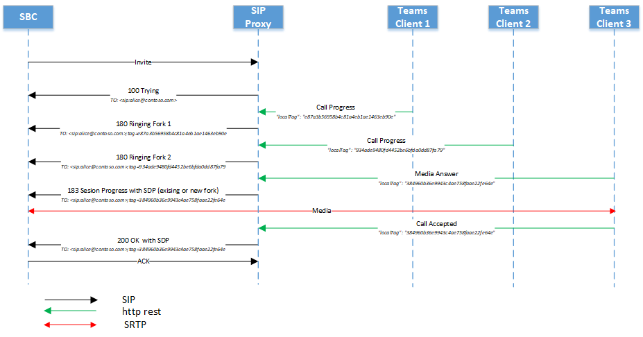
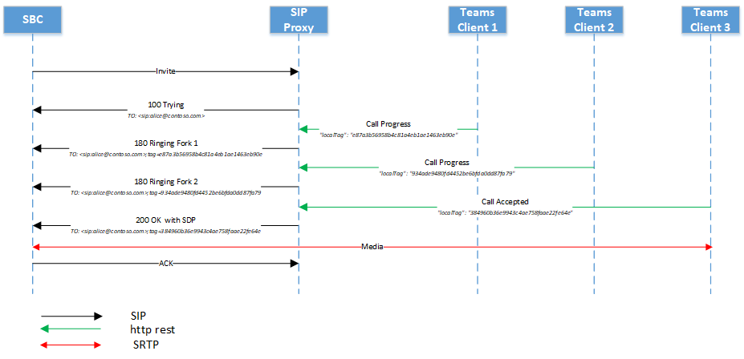
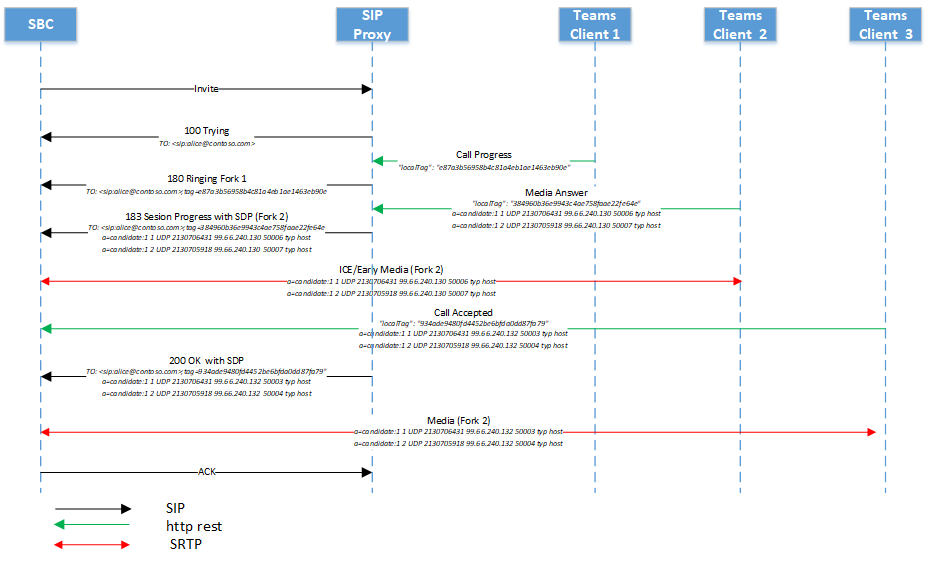
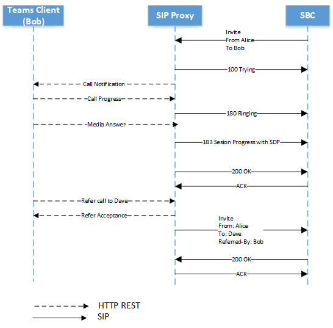
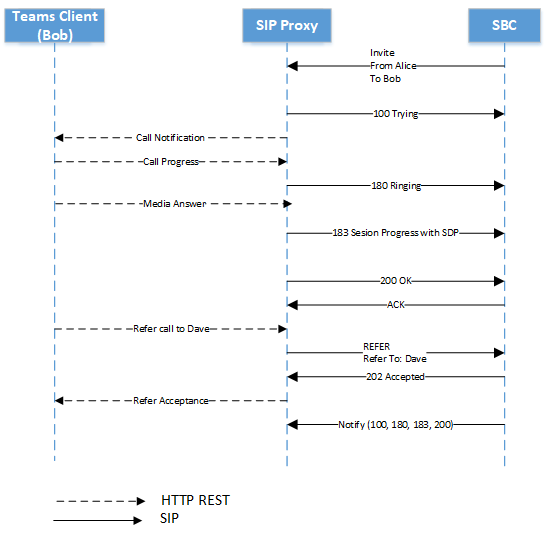

# Direct Routing - SIP protocol

This article describes how Direct Routing implements the Session Initiation Protocol (SIP). To properly route traffic between a Session Border Controller (SBC) and the SIP proxy, some SIP parameters must have specific values. This article is intended for voice administrators who are responsible for configuring the connection between the on-premises SBC and the SIP proxy service.

## Processing the incoming request: finding the tenant and user

Before an incoming or outbound call can be processed, OPTIONS messages are exchanged between SIP Proxy and the SBC. These OPTIONS messages allow SIP Proxy to provide the allowed capabilities to SBC. It is important for OPTIONS negotiation to be successful (200OK response), allowing for further communication between SBC and SIP Proxy for establishing calls. The SIP headers in an OPTIONS messages to SIP Proxy are provided as an example below:

| Parameter name | Example of the value | 
| :---------------------  |:---------------------- |
| Request-URI | OPTIONS sip:sip.pstnhub.microsoft.com:5061 SIP /2.0 |
| Via Header | Via: SIP/2.0/TLS sbc1.adatum.biz:5058;alias;branch=z9hG4bKac2121518978 | 
| Max-Forwards header | Max-Forwards:68 |
| From Header | From: <sip:sbc1.adatum.biz:5058> |
| To Header | To: <sip:sip.pstnhub.microsoft.com:5061> |
| CSeq header | CSeq: 1 INVITE | 
| Contact Header | Contact: <sip:sbc1.adatum.biz:5058;transport=tls> |

> [!NOTE]
> The SIP headers do not contain userinfo in the [SIP URI](https://datatracker.ietf.org/doc/html/rfc3261#section-19.1) in use. As per [RFC 3261, section 19.1.1](https://tools.ietf.org/html/rfc3261#section-19.1.1), the userinfo part of a URI is optional and MAY be absent when the destination host does not have a notion of users or when the host itself is the resource being identified. If the @ sign is present in a SIP URI, the user field MUST NOT be empty.

On an incoming call, the SIP proxy needs to find the tenant to which the call is destined and, find the specific user within this tenant. The tenant administrator might configure non-DID numbers, for example +1001, in multiple tenants. Therefore, it is important to find the specific tenant on which to perform the number lookup because the non-DID numbers might be the same in multiple Microsoft 365 or Office 365 organizations.  

This section describes how the SIP proxy finds the tenant and the user, and performs authentication of the SBC on the incoming connection.

The following is an example of the SIP Invite message on an incoming call:

| Parameter name | Example of the value | 
| :---------------------  |:---------------------- |
| Request-URI | INVITE sip:+18338006777@sip.pstnhub.microsoft.com SIP /2.0 |
| Via Header | Via: SIP/2.0/TLS sbc1.adatum.biz:5058;alias;branch=z9hG4bKac2121518978 | 
| Max-Forwards header | Max-Forwards:68 |
| From Header | From: <sip:+7168712781@sbc1.adatum.biz;transport=udp;tag=1c747237679 |
| To Header | To: sip:+183338006777@sbc1.adatum.biz | 
| CSeq header | CSeq: 1 INVITE | 
| Contact Header | Contact: <sip:+7168712781@sbc1.adatum.biz:5058;transport=tls> | 

On receiving the invite, the SIP proxy performs the following steps:

1. Check the certificate. On the initial connection, the Direct Routing service takes the FQDN name presented in the Contact header and matches it to the Common Name or Subject Alternative name of the presented certificate. The SBC name must match one of the following options:

   - Option 1. The full FQDN name presented in the Contact header must match the Common Name/Subject Alternative name of the presented certificate.  

   - Option 2. The domain portion of the FQDN name presented in the Contact header (for example adatum.biz of the FQDN name sbc1.adatum.biz) must match the wildcard value in Common Name or Subject Alternative Name entry (for example *.adatum.biz).

2. Try to find a tenant using the full FQDN name presented in the Contact header.  

   Check if the FQDN name from the Contact header (sbc1.adatum.biz) is registered as a DNS name in any Microsoft 365 or Office 365 organization. If found, the lookup of the user is performed in the tenant that has the SBC FQDN registered as a Domain name. If not found, Step 3 applies.   

3. Step 3 only applies if Step 2 failed. 

   Remove the host portion from the FQDN, presented in the Contact header (FQDN: sbc12.adatum.biz, after removing the host portion: adatum.biz), and check if this name is registered as a DNS name in any Microsoft 365 or Office 365 organization. If found, the user lookup is performed in this tenant. If not found, the call fails.

4. Using the phone number presented in the Request-URI, perform the reverse number lookup within the tenant found in Step 2 or 3. Match the presented phone number to a user SIP URI within the tenant found on the previous step.

5. Apply trunk settings. Find the parameters set by the tenant admin for this SBC.

   Microsoft does not support having a third-party SIP proxy or User Agent Server between the Microsoft SIP proxy and the paired SBC, which might modify the Request URI created by the paired SBC.

   The requirements for the two lookups (steps 2 and 3) needed for the scenario where one SBC is interconnected to many tenants (carrier scenario) are covered later in this article.

### Detailed requirements for Contact header, Request-URI, To and From SIP headers

#### [Contact header](https://datatracker.ietf.org/doc/html/rfc3261#section-8.1.1.8)

The Contact header provides a SIP URI that can be used  to contact a specific instance of the UA for subsequent requests. For all incoming SIP messages (OPTIONS, INVITE) to the Microsoft SIP proxy, the Contact header must have the paired SBC FQDN in the URI hostname as follows:

Syntax: Contact:  <sip:E.164phone or sip address@FQDN of the SBC:port;transport=tls> - if willing to transmit the address of record (phone or sip address) of the resource the caller is trying to reach out to (recommended).

Syntax: Contact: <sip:FQDN of the SBC:port;transport=tls> - if simply referring to the specific instance of the SBC to be used for subsequent requests. (normally used with REFER SIP messages)

As per [RFC 3261, section 11.1](https://tools.ietf.org/html/rfc3261#section-11.1), a Contact header field MAY be present in an OPTIONS message. In Direct Routing the contact header is required. For INVITE messages in format above, for OPTIONS messages the userinfo can be removed from SIP URI and only FQDN sent in format as follows:

Syntax: Contact:  <sip:FQDN of the SBC:port;transport=tls>

A fully qualified domain name (FQDN) defined in the Common Name, must match a Subject Alternative name entry of the SBC's (Session Border Controller) public certificate connecting to Teams SIP Proxy. Microsoft also supports using a wildcard value in the Common Name of the certificate as explained below. The wildcard value must be present as a Subject Alternative Name entry on the certificate.     

The support for wildcards is described in [RFC 2818, section 3.1](https://tools.ietf.org/html/rfc2818#section-3.1). Specifically:

*"Names may contain the wildcard character \* which is considered to match any single domain name component or component fragment. E.g., \*.a.com matches foo.a.com but not bar.foo.a.com. f\*.com matches foo.com but not bar.com."*

Teams works over [sip: using TLS over TCP](https://datatracker.ietf.org/doc/html/rfc3261#section-19.1.2), hence requires that the SBC FQDN to be used to populate the SIP URI contained in the Contact, Record-Route and Request-URI SIP headers. An incoming INVITE or OPTIONS message to SIP Proxy with a Contact header where hostname is represented by IP and not FQDN, results in refused connection with 403 Forbidden.

#### Request-URI, To and From headers

For a new incoming call, per [RFC3261](https://datatracker.ietf.org/doc/html/rfc3261#section-8.1.1.1) the initial Request-URI of the message SHOULD be set to the value of the SIP URI in the To header field. One notable exception is the REGISTER method (not applicable here).

The [To](https://datatracker.ietf.org/doc/html/rfc3261#section-8.2.2.1) header as per RFC, specifies the desired "logical" recipient of the request, or the address-of-record of the user or resource that is the target of the SIP request.

The affinity between To and Request-Uri headers can be defined too, by looking into the same [RFC3261](https://datatracker.ietf.org/doc/html/rfc3261#section-8.2.2.1):
The To header field identifies the original recipient of the request as defined by the user identified in the From field. The original recipient may or may not be the UAS processing the request, due to call forwarding or other proxy operations, however the Request-URI identifies the UAS that is to process the SIP request specified.
 
The [From](https://datatracker.ietf.org/doc/html/rfc3261#section-8.1.1.3) header field indicates the logical identity of the initiator of the request, possibly the user's address-of-record. (...) The From header field allows for a display name. A UAC SHOULD use the display name "Anonymous", along with a syntactically correct, but otherwise meaningless URI (like sip:thisis@anonymous.invalid), if the identity of the caller is to remain hidden. Usually, the value that populates the From header field in requests generated by a particular UA is pre-provisioned by the user or by the administrators of the user's local domain (in this case the users enabled for Direct Routing, or for example a mobile phone caller calling a Direct Routing enabled Teams user).

The phone number (address of record) must be in E.164 format, as shown in the following example: 

```console
INVITE sip:+18338006777@sip.pstnhub.microsoft.com SIP /2.0
```
If using non-DID number like 1001, admins can either use the reference at [Configure the phone number and enable enterprise voice and voicemail online](https://docs.microsoft.com/en-us/microsoftteams/direct-routing-enable-users#configure-the-phone-number-and-enable-enterprise-voice-and-voicemail-online) and set <tel:+E.164phonenumber;ext=1001@SBC FQDN>, or assign the non-DID directly using the same cmdlet hwoever with the value <tel:+1001>.


## Contact and Record-Route headers considerations

To calculate the next hop FQDN for new in-dialog client transactions (for example Bye or Re-Invite) or when replying to SIP Options, the Contact or Record-Route SIP headers are used. 

According to [RFC 3261, section 8.1.1.8](https://tools.ietf.org/html/rfc3261#section-8.1.1.8):
The Contact header field provides a SIP URI that can be used to contact that specific instance of the UA for subsequent requests. The Contact header field MUST be present and contain exactly one SIP URI in any request that can result in the establishment of a dialog.

The [Record-Route](https://tools.ietf.org/html/rfc3261#section-20.30) header field is inserted by proxies in a request to force future requests in the dialog to be routed through the proxy. This is the case with [Local Media Optimization for Direct Routing (LMO)](./direct-routing-media-optimization.md), where a Record-Route header value will be populated with the proxy SBC FQDN, forcing that same proxy SBC to stay on the path of future requests in the dialog.

Microsoft recommends using Contact header only when LMO is not used. To calculate the next hop, the Microsoft Teams SIP proxy uses:

- Priority 1. Record-Route. If a Record-Route header contains the SBC FQDN, that SBC FQDN is used to make the secured outbound in-dialog connection.

- Priority 2. Contact header. If a Record-Route does not exist, the SIP proxy will look at the SIP URI of the Contact header and use the FQDN (Right-hand side of @ symbol in the URI), to make the secured outbound connection to the SBC. (This is the recommended configuration.)

If both Contact and Record-Route are used in a non-LMO scenario, the SBC administrator must keep their values identical, which may cause administrative overhead. 

Use of an IP address is not supported in either Record-Route or Contact. The only supported option is a SIP URI containing a FQDN, which must match either the Common Name or a Subject Alternative Name entry of the publicly published SBC certificate.

- If an IP address is presented in Record-route or Contact, the certificate check fails and the call fails.

- If the FQDN does not match the value of the Common or Subject Alternative Name in the presented certificate, the call fails. 

## Inbound call: SIP dialog description

The following table below summarizes the call flow differences and similarities between non-bypass and bypass modes:

| Parameter name | Non-bypass mode | Bypass mode
| :---------------------  |:---------------------- |:----------------|
| Media candidates in 183 and 200 messages coming from | Media processors | Clients | 
| Number of 183 messages SBC can receive | One per session | Multiple | 
| Call can be with provisional answer (183) | Yes | Yes |
| Call can be without provisional answer (183) | Yes | Yes |

###  Non-media bypass flow

A Teams user might have multiple endpoints at the same time. For example, Teams for Windows client, Teams for iPhone client, and Teams Phone (Teams Android client). Each endpoint might signal an HTTP rest as follows:

-   Call progress – converted by the SIP proxy to the SIP message 180. On receiving message 180, the SBC must generate local ringing.

-   Media answer – converted by the SIP proxy to message 183 with media candidates in Session Description Protocol (SDP). On receiving message 183, the SBC expects to connect to the media candidates received in the SDP message. 

    > [!NOTE]
    > In some cases the Media answer might not be generated, and the end point might answer with “Call Accepted” message.

-   Call accepted – converted by the SIP proxy to SIP message 200 with SDP. On receiving message 200, the SBC is expected to send and receive media to and from the provided SDP candidates.

    > [!NOTE]
    > Direct Routing does not support Delayed Offer Invite (Invite without SDP).

#### Multiple endpoints ringing with provisional answer

1.  On receiving the first Invite from the SBC, the SIP proxy sends the message "SIP SIP/2.0 100 Trying" and notifies all end user endpoints about the incoming call. 

2.  Upon notification, each endpoint will start ringing and sending "Call progress” messages to the SIP proxy. Because a Teams user can have multiple end points, the SIP proxy might receive multiple Call Progress messages.

3.  For every Call Progress message received from the clients, the SIP proxy converts the Call Progress message to the SIP message "SIP SIP/2.0 180 Trying". The interval for sending such messages is defined by the interval of the receiving messages from the Call Controller. In the following diagram, there are two 180 messages generated by the SIP proxy. These messages come from the two Teams endpoints of the user. The clients each have a unique Tag ID.  Every message coming from a different endpoint will be a separate session (the parameter “tag” in the “To” field will be different). But an endpoint might not generate message 180 and send message 183 right away as shown in the following diagram.

4.  Once an endpoint generates a Media Answer message with the IP addresses of endpoint’s media candidates, the SIP proxy converts the message received to a "SIP 183 Session Progress" message with the SDP from the client replaced by the SDP from the Media Processor. In the following diagram, the endpoint from Fork 2 answered the call. If the trunk is non-bypassed, the 183 SIP message is generated only once (either Ring Bot or Client End Point). The 183 might come on an existing fork or start a new one.

5.  A Call Acceptance message is sent with the final candidates of the endpoint that accepted the call. The Call Acceptance message is converted to SIP message 200. 

> [!div class="mx-imgBorder"]
> 

#### Multiple endpoints ringing without provisional answer

1.  On receiving the first Invite from the SBC, the SIP proxy sends the message "SIP SIP/2.0 100 Trying" and notifies all end user endpoints about the incoming call. 

2.  Upon notification, each endpoint will start ringing and sending the message "Call progress” to the SIP proxy. Because a Teams user can have multiple end points, the SIP proxy might receive multiple Call Progress messages.

3.  For every Call Progress message received from the clients, the SIP proxy converts the Call Progress message to the SIP message "SIP SIP/2.0 180 Trying".  The interval for sending the messages is defined by the interval of receiving the messages from the Call Controller. On the picture below there are two 180 messages generated by the SIP proxy, meaning that user logged into three Teams clients and each client send the call progress. Every message will be a separate session (parameter “tag” in “To” field is different)

4.  A Call Acceptance message is sent with the final candidates of the endpoint that accepted the call. The Call Acceptance message is converted to SIP message 200. 

> [!div class="mx-imgBorder"]
> 

### Media bypass flow

The same messages (100 Trying, 180, 183) are used in the media bypass scenario. 

The schema below shows an example of the bypass call flow. 

> [!NOTE]
> The media candidates can come from different endpoints. 

> [!div class="mx-imgBorder"]
> 

## Replaces option

The SBC must support Invite with Replaces.

## Size of SDP considerations

The Direct Routing interface might send a SIP message exceeding 1,500 bytes.  The size of SDP primarily causes this. However, if there is a UDP trunk behind the SBC, it might reject the message if it is forwarded from the Microsoft SIP proxy to the trunk unmodified. Microsoft recommends stripping some values in SDP on the SBC when sending the message to the UDP trunks. For example, the ICE candidates or unused codecs can be removed.

## Call transfer

Direct Routing supports two methods for call transfer:

- Option 1. SIP proxy processes Refer from the client locally and acts as a Referee as described in section 7.1 of RFC 3892.

  With this option, the SIP proxy terminates the transfer and adds a new Invite. 


- Option 2. SIP proxy sends the Refer to the SBC and acts as a Transferor as describing in Section 6 of RFC 5589.

  With this option, the SIP proxy sends a Refer to the SBC and expects the SBC to handle the Transfer fully.

The SIP proxy selects the method based on the capabilities reported by the SBC. If the SBC indicates that it supports the method “Refer”, the SIP proxy will use Option 2 for call transfers.

The following is an example of an SBC sending the message that the Refer method is supported:

```console
ALLOW: INVITE, OPTIONS, INFO, BYE, CANCEL, ACK, PRACK, UPDATE, REFER, SUBSCRIBE, NOTIFY
```

If the SBC doesn’t indicate that Refer as a supported method, Direct Routing will use Option 1 (SIP proxy acts as a Referee) . The SBC  must also signal that it supports the Notify method:

Example of SBC indicating that Refer method is not supported:

```console
ALLOW: INVITE, ACK, CANCEL, BYE, INFO, NOTIFY, PRACK, UPDATE, OPTIONS
```

### SIP proxy processes Refer from the client locally and acts as a Referee

If the SBC indicated that the Refer method is not supported, the SIP proxy acts as a Referee. 

The Refer request that comes from the client will be terminated on the SIP proxy. (The Refer request from the client is shown as “Call transfer to Dave” in the following diagram.  For more information, see section 7.1 of [RFC 3892](https://www.ietf.org/rfc/rfc3892.txt). 

> [!div class="mx-imgBorder"]
> 

### SIP proxy send the Refer to the SBC and acts as a Transferor

This is the preferred method for call transfers, and it is mandatory for devices seeking media bypass certification. Call Transfer without the SBC being able to handle Refer is not supported in media bypass mode. 

The standard is explained in Section 6 of RFC 5589. The related RFCs are:

- [Session Initiation Protocol (SIP) Call Control - Transfer](https://tools.ietf.org/html/rfc5589)

- [Session Initiation Protocol (SIP) "Replaces" Header](https://tools.ietf.org/html/rfc3891)

- [Session Initiation Protocol (SIP) "Referred-By" mechanism](https://tools.ietf.org/html/rfc3892)

This option assumes that the SIP proxy acts as a Transferor and sends a Refer message to the SBC. The SBC acts as a Transferee and handles the Refer to generate a new offer for transfer. There are two possible cases:

- The call is transferred to an external PSTN participant. 
- The call is transferred from one Teams user to another Teams user in the same tenant via the SBC. 

If the call is transferred from one Teams user to another via the SBC, the SBC is expected to issue a new invite (start a new dialog) for the transfer target (the Teams user) using the information received in the Refer message. 

To populate the To/Transferor fields for the transaction of the request internally, the SIP proxy needs to convey this information  inside the REFER-TO/REFERRED-BY headers. 

The SIP proxy will form the REFER-TO as a SIP URI comprised of a SIP proxy FQDN in the hostname and either one of the following:

- An E.164 phone number in the username part of the URI in case the transfer target is a phone number, or

- x-m and x-t parameters encoding the full transfer target MRI and tenant ID respectively 

The REFERRED-BY header is a SIP URI with transferor MRI encoded in it as well as transferor tenant ID and other transfer context parameters as shown in the following table:

| Parameter | Value | Description |  
|:---------------------  |:---------------------- |:---------------------- |
| x-m | MRI | Full MRI of transferor/transfer target as populated by CC |
| x-t | Tenant ID | x-t Tenant ID Optional Tenant ID as populated by CC |
| x-ti | Transferor Correlation Id | Correlation ID of the call to the transferor |
| x-tt | Transfer target call URI | Encoded call replacement URI |

The size of the Refer Header can be up to 400 symbols in this case. The SBC must support handling Refer messages with size up to 400 symbols.

> [!div class="mx-imgBorder"]
> 

## Session timer

The SIP proxy supports (always offers) the Session Timer on non-bypass calls but does not offer it on bypass calls. Use of the Session Timer by the SBC is not mandatory.

##  Use of Request-URI parameter user=phone

The SIP proxy analyses the Request-URI and if the parameter user=phone is present, the service will handle the Request-URI as a phone number, matching the number to a user. If parameter is not present the SIP proxy applies heuristics to determine  the Request-URI user type (phone number or a SIP address).

Microsoft recommends always applying the user=phone parameter to simplify the call setup process.

## History-Info header

The History-Info header is used for retargeting SIP requests and “provide(s) a standard mechanism for capturing the request history information to enable a wide variety of services for networks and end-users.” For more information, see [RFC 4244 – Section 1.1](http://www.ietf.org/rfc/rfc4244.txt). For Microsoft Phone System, this header is used in Simulring and Call Forwarding scenarios.  

If sending, the History-Info is enabled as follows:

- The SIP proxy will insert a parameter containing the associated phone number in individual History-Info entries that comprise the History-Info header sent to the PSTN Controller.  Using only entries that have the phone number parameter, the PSTN Controller will rebuild a new History-Info header, and pass it on to the SIP trunk provider via SIP proxy.

- History-Info header will be added for simultaneous ring and call forwarding cases.

- History-Info header will not be added for call transfer cases.

- An individual history entry in the reconstructed History-Info header will have the phone number parameter provided combined with the Direct Routing FQDN (sip.pstnhub.microsoft.com) set as the host part of the URI; a parameter of ‘user=phone’ will be added as part of the SIP URI.  Any other parameters associated with the original History-Info header, except for phone context parameters, will be passed through in the re-constructed History-Info header.  

  > [!NOTE]
  > Entries that are private (as determined by the mechanisms defined in Section 3.3 of RFC 4244) will be forwarded as is because  the SIP trunk provider is a trusted peer.

- Inbound History-Info is ignored.

Following is the format of the History-info header sent by the SIP proxy:

```console
<sip:UserB@sip.pstnhub.microsoft.com?Privacy=history&Reason=SIP%3B\cause%3D486>;index=1.2,
```

If the call was redirected several times, information about every redirect is included with the appropriate reason in chronological order.


Header Example:

```console
History-info: 
<sip:+14257123456@sip.pstnhub.microsoft.com;user=phone?Reason=SIP;cause=302;text=”Move Temporarily”>;index=1
<sip:+14257123457@sip.pstnhub.microsoft.com;user=phone?Reason=SIP;cause=496;text=”User Busy”>;index=1.1
```

The History-Info is protected by a mandatory TLS mechanism. 

## SBC connection to Direct Routing and failover mechanism

See the section Failover mechanism for SIP signaling in [Plan for Direct Routing](direct-routing-plan.md#failover-mechanism-for-sip-signaling).

## Retry-After

If a Direct Routing datacenter is busy, the service can send a Retry-After message with a one-second interval to the SBC. 
When the SBC receives a 503 message with a Retry-After header in response to an INVITE, the SBC must terminate that connection and try the next available Microsoft datacenter.

## Handling retries (603 response)
If an end user observes several missed calls for one call after declining the incoming call, it means that the SBC or PSTN trunk provider's retry mechanism is misconfigured. The SBC must be reconfigured to stop the retry efforts on the 603 response.

## ICE Restart: Media bypass call transferred to an endpoint that does not support media bypass

The SBC must support ICE restarts as described in [RFC 5245, section 9.1.1.1](https://tools.ietf.org/html/rfc5245#section-9.1.1.1).

The restart in Direct Routing is implemented according to the following paragraphs of the RFC:

*To restart ICE, an agent MUST change both the ice-pwd and the ice-ufrag for the media stream in an offer.  Note that it is permissible to use a session-level attribute in one offer, but to provide the same ice-pwd or ice-ufrag as a media-level attribute in a subsequent offer.  This is not a change in password, just a change in its representation, and does not cause an ICE restart.*

*An agent sets the rest of the fields in the SDP for this media stream as it would in an initial offer of this media stream (see
Section 4.3).  Consequently, the set of candidates MAY include some, none, or all of the previous candidates for that stream and MAY include a totally new set of candidates gathered as described in Section 4.1.1.*

If the call was initially established with media bypass, and the call is transferred to a Skype for Business client, Direct Routing needs to insert a Media Processor--this is because Direct Routing cannot be used with a Skype for Business client with media bypass. Direct Routing starts the ICE restart process by  changing the ice-pwd and ice-ufrag and offering new media candidates in a reinvite.
