# Configure a Session Border Controller for multiple tenants

Direct Routing supports configuring one Session Border Controller (SBC) to serve multiple tenants.

> [!NOTE]
> This scenario is designed for Microsoft partners and/or PSTN carriers, referred to as carriers later in this document. A carrier sells telephony services delivered to Microsoft Teams to their customers. 

A carrier:
- Deploys and manages an SBC in their datacenter (customers do not need to implement an SBC, and they receive telephony services from the carrier in the Teams client).
- Interconnects the SBC to multiple tenants.
- Provides PSTN services to customers.
- Manages call quality end to end.
- Charges separately for PSTN services.

Microsoft does not manage carriers. Microsoft offers a PBX (Microsoft Phone System) and a Teams client, certifies phones, and certifies SBCs that can be used with the Microsoft Phone System. Before choosing a carrier, please ensure that your choice has a certified SBC and can manage voice quality end to end.

The following are the technical implementation steps to configure the scenario.

**Carrier only:**
1. Deploy the SBC and configure it for the hosting scenario according to the [instructions from the certified SBC vendors](#deploy-and-configure-the-sbc).
2. Register a base domain name in the carrier tenant and request a wildcard certificate.
3. Register a subdomain for every customer, which is part of the base domain.

**Carrier with a Customer Global Administrator:**
1. Add the subdomain name to the customer tenant.
2. Activate the subdomain name.
3. Configure the trunk from the carrier to the customer tenant and provision users.

*Please make sure you understand DNS basics and how the domain name is managed in Office 365. Review [Get help with Office 365 domains](https://support.office.com/article/Get-help-with-Office-365-domains-28343f3a-dcee-41b6-9b97-5b0f4999b7ef) before proceeding further.*

## Deploy and configure the SBC

For the detailed steps on how to deploy and configure SBCs for an SBC hosting scenario, please refer to the SBC vendor's documentation.

- **AudioCodes:** [Direct Routing Configuration notes](https://www.audiocodes.com/solutions-products/products/products-for-microsoft-365/direct-routing-for-Microsoft-Teams), the configuration of the SBC hosting scenario described in “Connecting AudioCodes SBC to Microsoft Teams Direct Routing Hosting Model Configuration Note.” 
- **Ribbon Communications:**  Please refer to the [Ribbon Communications SBC Core Microsoft Teams Configuration Guide](https://support.sonus.net/display/IOT/PBXs+-+SBC+5k7kSWe) for documentation on how to configure Ribbon Core Series SBCs and to this page [Ribbon Best Practice - Configuring Carriers for Microsoft Teams Direct Routing SBC Edge](https://support.sonus.net/display/UXDOC70/Best+Practice+-+Configuring+Carriers+for+Microsoft+Teams+Direct+Routing)

> [!NOTE]
> Please pay attention to how to configure the “Contact” header. The Contact header is used to find the customer tenant on the incoming invite message. 

## Register a base domain and subdomains

For the hosting scenario, you need to create:
- One base domain name owned by the carrier.
- A subdomain that is part of the base domain name in every customer tenant.

In the following example:
- Adatum is a carrier that serves several customers by providing Internet and telephony services.
- Woodgrove Bank, Contoso, and Adventure Works are three customers that have Office 365 domains but receive the telephony services from Adatum.

Subdomains **MUST** match the FQDN name of the trunk that will be configured for the customer and the FQDN in the Contact header when sending the Invite to Office 365. 

When a call arrives at the Office 365 Direct Routing interface, the interface uses the Contact header to find the tenant where the user should be looked up. Direct Routing does not use phone number lookup on the Invite, as some customers might have non-DID numbers that can overlap in several tenants. Therefore, the FQDN name in the Contact header is required to identify the exact tenant to look up the user by the phone number.

*Please review  [Get help with Office 365 domains](https://support.office.com/article/Get-help-with-Office-365-domains-28343f3a-dcee-41b6-9b97-5b0f4999b7ef) for more information about creating domain names in Office 365 tenants.*

The following diagram summarizes the requirements to base domain, subdomains, and Contact header.

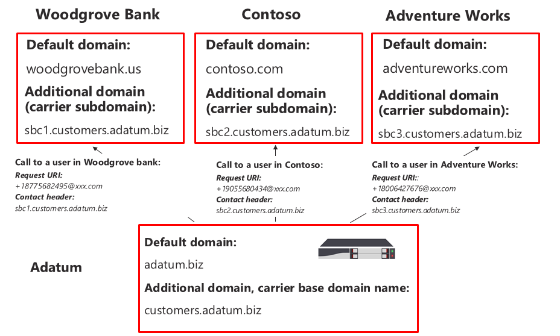

The SBC requires a certificate to authenticate the connections. For the SBC hosting scenario, the carrier needs to request a certificate with SAN *\*.base_domain (for example, \*customers.adatum.biz)*. This certificate can be used to authenticate connections to multiple tenants served from a single SBC.

The following table is an example of one configuration.

|New domain name |Type|Registered  |Certificate SAN for SBC  |Tenant default domain in the example  |FQDN name that SBC must present in the Contact header when sending calls to users|
|---------|---------|---------|---------|---------|---------|
|customers.adatum.biz|    Base     |     In carrier tenant  |    \*.customers.adatum.biz  |   adatum.biz      |NA, this is a service tenant, no users |
|sbc1.customers.adatum.biz|    Subdomain  |    In a customer tenant  |    \*.customers.adatum.biz  | woodgrovebank.us  |  sbc1.customers.adatum.biz|
|sbc2.customers.adatum.biz  |   Subdomain | In a customer tenant   |   \*.customers.adatum.biz   |contoso.com   |sbc2.customers.adatum.biz |
|sbc3.customers.adatum.biz |   Subdomain | In a customer tenant |   \*.customers.adatum.biz  |  adventureworks.com | sbc3.customers.adatum.biz |
||         |         |         |         |         |

To configure the base and subdomains, please follow the steps described below. In the example, we will configure a base domain name (customers.adatum.biz) and a subdomain for one customer (sbc1.customers.adatum.biz in Woodgrove Bank tenant).

## Register a base domain name in the carrier tenant

**These actions are performed in the carrier tenant.**

### Ensure that you have appropriate rights in the carrier tenant

You can only add new domains if you signed in to the Microsoft 365 admin center as a Global Administrator. 

To validate the role you have, please sign in to the Microsoft 365 admin center (https://portal.office.com), go to **Users** > **Active Users**, and then verify that you have a Global Administrator role. 

For more information about admin roles and how to assign a role in Office 365, see [About Office 365 admin roles](https://support.office.com/article/About-Office-365-admin-roles-da585eea-f576-4f55-a1e0-87090b6aaa9d).

### Add a base domain to the tenant and verify it

1.	In the Microsoft 365 admin center, go to **Setup** > **Domains** > **Add domain**.
2.	In the **Enter a domain you own** box, type the FQDN of the base domain. In the following example, the base domain is *customers.adatum.biz*.

    ![Screen shot showing the Add a domain page]](media/direct-routing-2-sbc-add-domain.png)

3. Click **Next**.
4. In the example, the tenant already has adatum.biz as a verified domain name. The wizard will not ask for additional verification because customers.adatum.biz is a subdomain for the already registered name. However, if you add an FQDN that has not been verified before, you will need to go through the process of verification. The process of verification is [described below](#add-a-subdomain-to-the-customer-tenant-and-verify-it).

    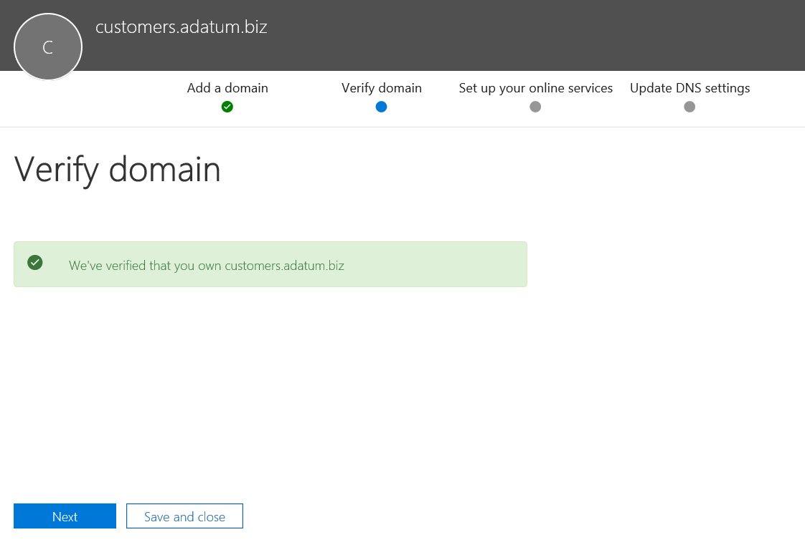

5.	Click **Next**, and on the **Update DNS Settings** page, select **I’ll add the DNS records myself** and click **Next**.
6.	On the next page, clear all values (unless you want to use the domain name for Exchange, SharePoint, or Teams/Skype for Business), click **Next**, and then click **Finish**. Make sure your new domain is in the Setup complete status.

    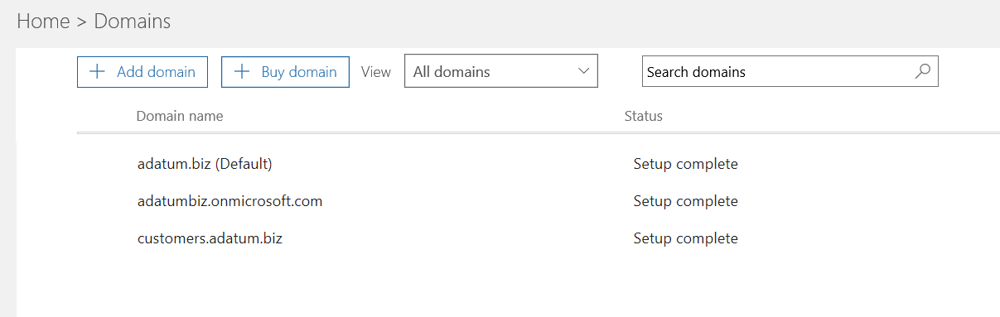

### Activate the domain name

After you have registered a domain name, you need to activate it by adding at least one E1, E3, or E5 licensed user and assigning a SIP address with the FQDN portion of the SIP address matching the created base domain. 

*Please review [Get help with Office 365 domains](https://support.office.com/article/Get-help-with-Office-365-domains-28343f3a-dcee-41b6-9b97-5b0f4999b7ef) for more information about adding users in Office 365 tenants.*

For example: test@customers.adatum.biz

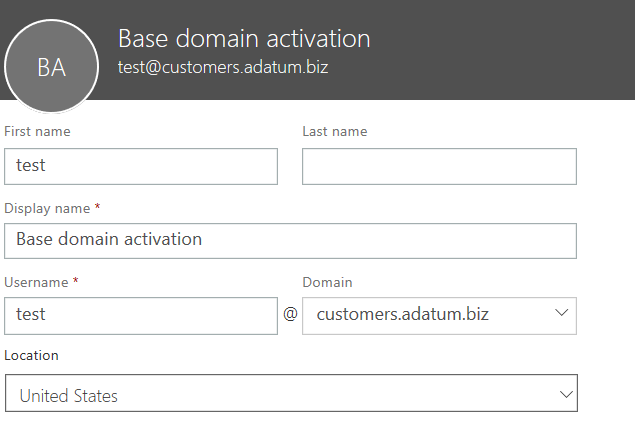

## Register a subdomain name in a customer tenant

You will need to create a unique subdomain name for every customer. In this example, we will create a subdomain sbc1.customers.adatum.biz in a tenant with the default domain name woodgrovebank.us.

**All actions below are in the customer tenant.**

### Ensure that you have appropriate rights in the customer tenant

You can only add new domains if you signed in to the Microsoft 365 admin center as a Global Administrator. 

To validate the role you have, please sign in to the Microsoft 365 admin center (https://portal.office.com), go to **Users** > **Active Users**, and then verify that you have a Global Administrator role. 

For more information about admin roles and how to assign a role in Office 365, see [About Office 365 admin roles](https://support.office.com/article/About-Office-365-admin-roles-da585eea-f576-4f55-a1e0-87090b6aaa9d).

### Add a subdomain to the customer tenant and verify it
1. In the Microsoft 365 admin center, go to **Setup** > **Domains** > **Add domain**.
2. In the **Enter a domain you own** box, type the FQDN of the subdomain for this tenant. In the example below, the subdomain is sbc1.customers.adatum.biz.

    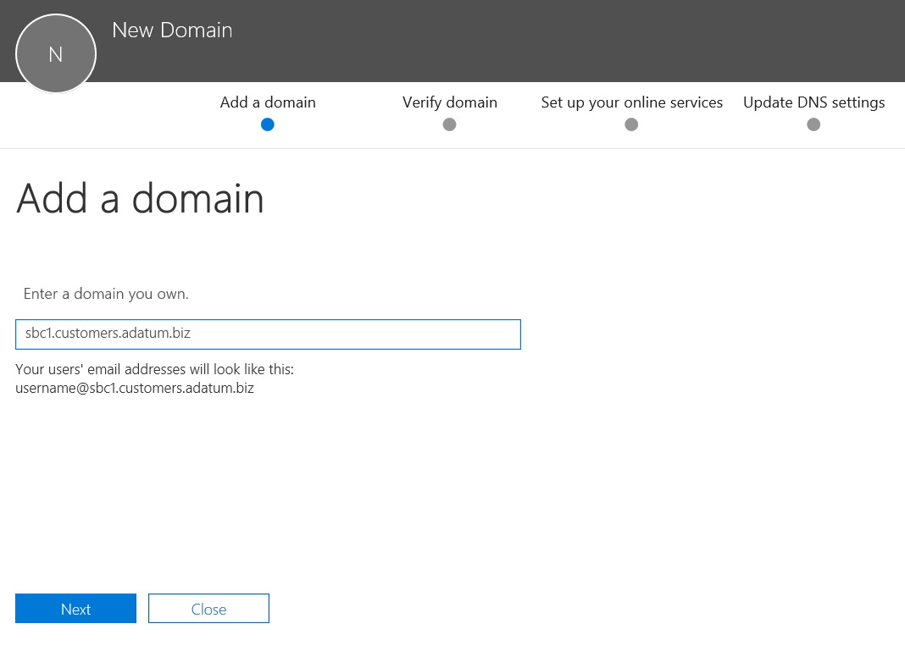

3. Click **Next**.
4. The FQDN has never been registered in the tenant. In the next step, you will need to verify the domain. Select **Add a TXT record instead**. 

    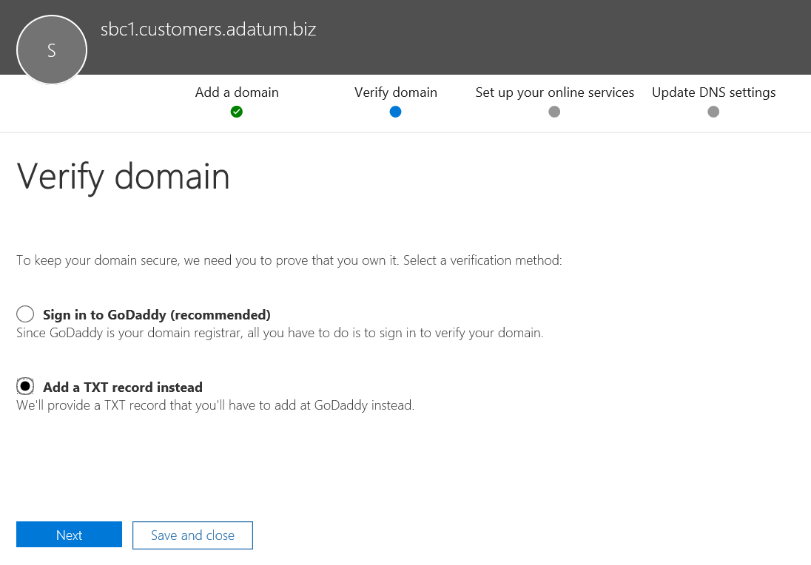

5. Click **Next**, and note the TXT value generated to verify the domain name.

    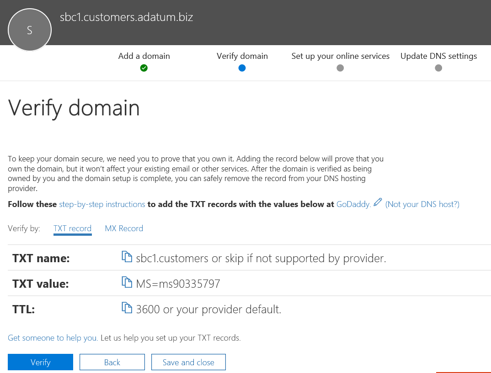

6. Create the TXT record with the value from the previous step in carrier’s DNS hosting provider.

    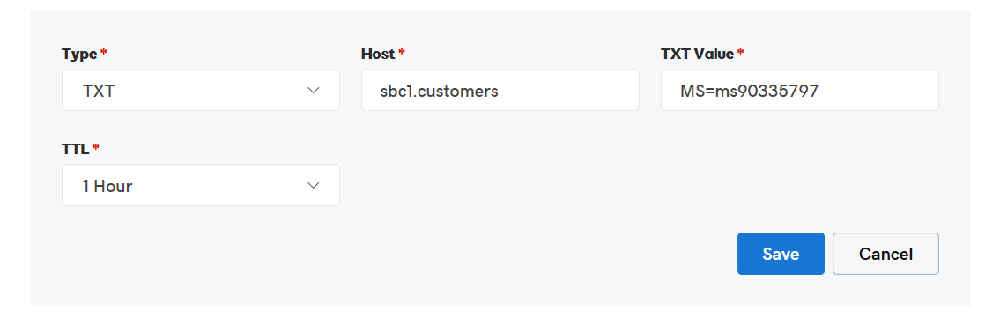

    For more information, refer to [Create DNS records at any DNS hosting provider for Office 365](https://support.office.com/article/create-dns-records-at-any-dns-hosting-provider-for-office-365-7b7b075d-79f9-4e37-8a9e-fb60c1d95166).

7. Go back to the customer's Microsoft 365 admin center and click **Verify**. 
8. On the next page, select **I’ll add the DNS records myself** and click **Next**.

    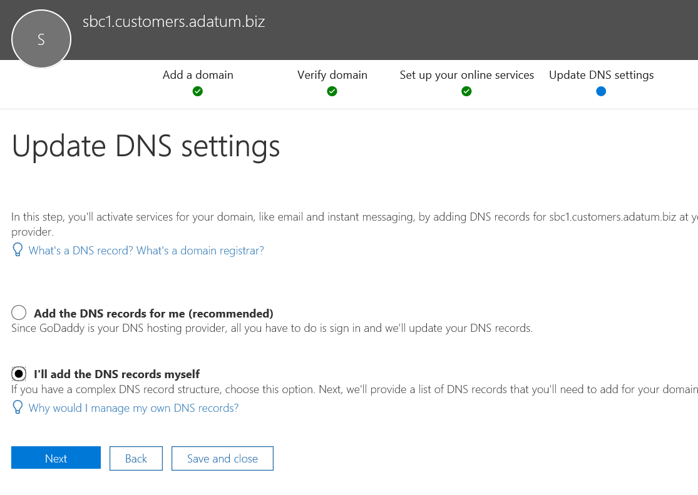

9. On the **Choose your online services** page, clear all options and click **Next**.

    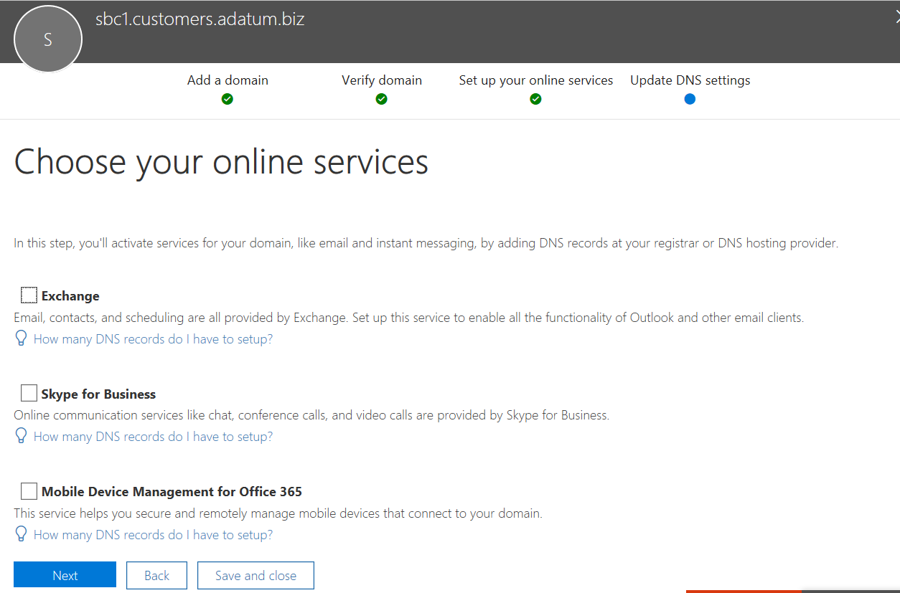

10. Click **Finish** on the **Update DNS settings** page.

    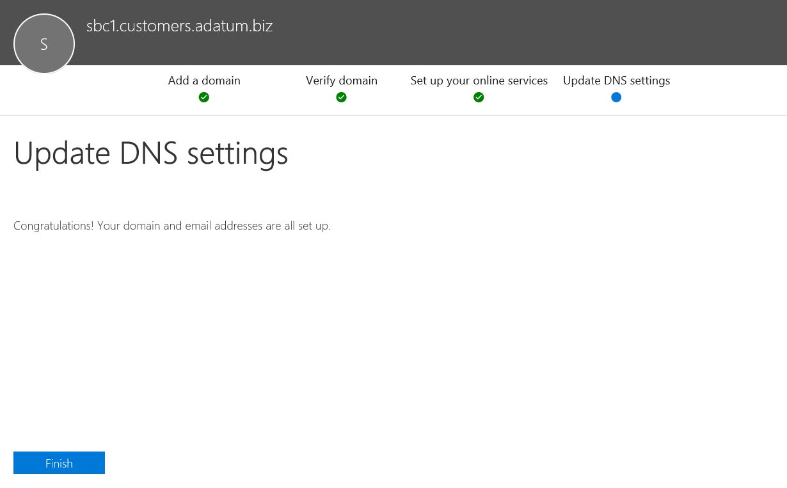

11. Ensure that the status is **Setup complete**. 
    
    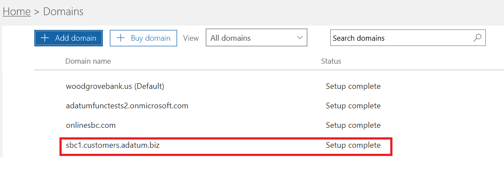

### Activate the subdomain name

After you register a domain name, you need to activate it by adding at least one user and assign a SIP address with the FQDN portion of the SIP address matching the created subdomain in the customer tenant.

*Please review [Get help with Office 365 domains](https://support.office.com/article/Get-help-with-Office-365-domains-28343f3a-dcee-41b6-9b97-5b0f4999b7ef) for more information about adding users in Office 365 tenants.*

For example: test@sbc1.customers.adatum.biz

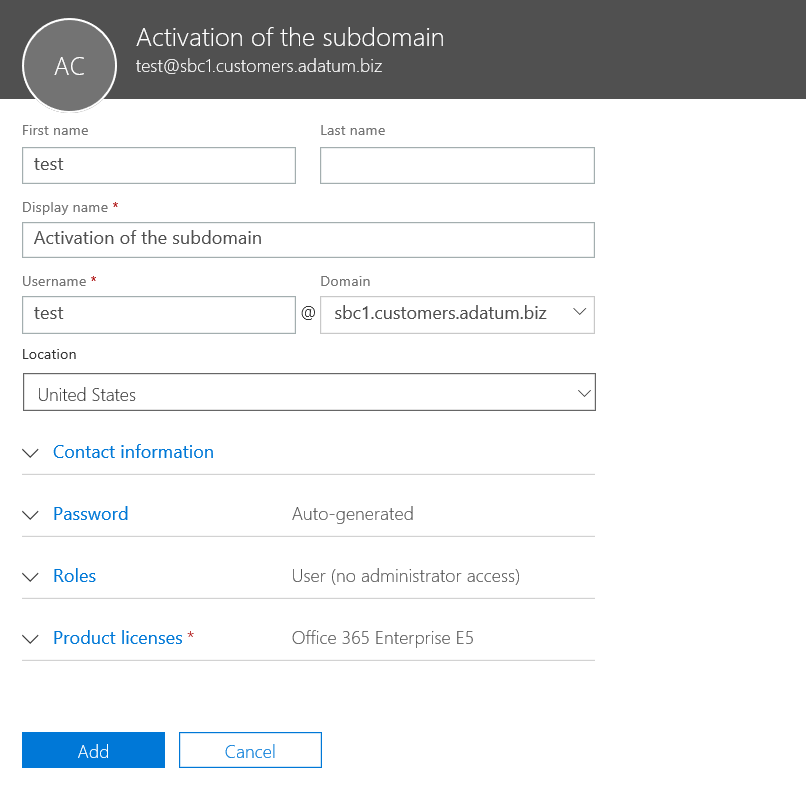

### Create a trunk and provision users

With the initial release of Direct Routing, Microsoft required a trunk to be added to each served tenant (customer tenant) using New-CSOnlinePSTNGateway.

However, this has not proved optimal for two reasons:
 
• **Overhead management**. Offloading or draining an SBC, for example, changes some parameters, like enabling or disabling media bypass. Changing the port requires changing parameters in multiple tenants (by running Set-CSonlinePSTNGateway), but it is in fact the same SBC. 
• **Overhead processing**. Gathering and monitoring trunk health data - SIP options collected from multiple logical trunks that are, in reality, the same SBC and the same physical trunk, slows down processing of the routing data.
 

Based on this feedback, Microsoft is bringing in a new logic to provision the trunks for the customer tenants.

Two new entities were introduced:
•	A carrier trunk registered in the carrier tenant using the command New-CSOnlinePSTNGateway, for example New-CSOnlinePSTNGateway -FQDN customers.adatum.biz -SIPSignallingport 5068 -ForwardPAI $true.
•	A derived trunk, that does not require registration. It is simply a desired host name added in from of the carrier trunk. It derives all of its configuration parameters from the carrier trunk. The derived trunk doesn't need to be created in PowerShell, and the association with the carrier trunk is based on the FQDN name (see details below).

Provisioning logic and example.

•	Carriers only need to set up and manage a single trunk  (carrier trunk in the carrier domain), using the Set-CSOnlinePSTNGateway command. In the example above it is adatum.biz;
•	In the customer tenant, the carrier need only to add the derived trunk FQDN to the voice routing policies of the users. There is no need to run New-CSOnlinePSTNGateway for a trunk.
•	 The derived trunk, as the name suggests, inherits or derives all the configuration parameters from the carrier trunk. 
Examples:
•	Customers.adatum.biz – the carrier trunk which needs to be created in the carrier tenant.
•	Sbc1.customers.adatum.biz – the derived trunk in a customer tenant that does not need to be created in PowerShell.  You can simply add the name of the derived trunk in the customer tenant in the online voice routing policy without creating it.

•	Any changes made on a carrier trunk (on carrier tenant) is automatically applied to derived trunks. For example, carriers can change an SIP port on the carrier trunk, and this change applies to all derived trunks. New logic to configure the trunks simplifies the management as you don’t need to go to every tenant and change the parameter on every trunk.
•	The options are sent only to the carrier trunk FQDN. The health status of the carrier trunk is applied to all derived trunks and is used for routing decisions. Find out more about [Direct Routing options](https://docs.microsoft.com/microsoftteams/direct-routing-monitor-and-troubleshoot).
•	The carrier can drain the carrier trunk, in which case all derived trunks will be drained as well. 
 

Migration from the previous model to the carrier trunk
 
For migration from the current implementation of the carrier hosted model to the new model, the carriers will need to reconfigure the trunks for customer tenants. Remove the trunks from the customer tenants using Remove-CSOnluinePSTNGateway (leaving the trunk in the carrier tenant).

We highly encourage migrating to the new solution as soon as possible as we will be enhancing monitoring and provisioning using the carrier and derived trunk model.
 

Please refer to the [SBC vendor instructions](#deploy-and-configure-the-sbc) on configuring sending the FQDN name of subdomains in the Contact header.

