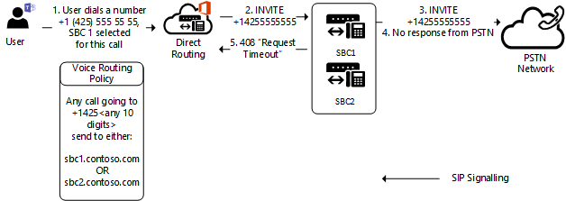
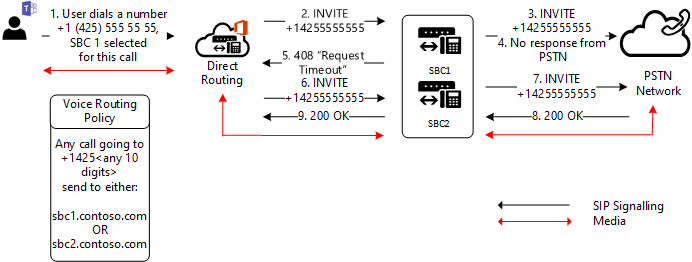

# Trunk failover on outbound calls

This topic describes how to avoid trunk failovers on outbound calls--from Teams to the Session Border Controller (SBC).

## Failover on network errors

If a trunk cannot be connected for any reason, the connection to the same trunk will be tried from a different Microsoft Datacenter. A trunk might not be connected, for example, if a connection is refused, if there is a TLS timeout, or if there are any other network level issues.
For example, a connection might fail if an administrator limits access to the SBC only from well-known IP addresses, but forgets to put the IP addresses of all Microsoft Direct Routing datacenters on the Access Control List (ACL) of the SBC. 

## Failover of specific SIP codes received from the Session Border Controller (SBC)

If Direct Routing receives any 4xx or 6xx SIP error codes in response to an outgoing Invite, the call is considered completed by default. Outgoing means a call from a Teams client to the Public Switched Telephone Network (PSTN) with the following traffic flow: Teams Client -> Direct Routing -> SBC -> Telephony network.

The list of SIP Codes can be found in [Session Initiation Protocol (SIP) RFC](https://tools.ietf.org/html/rfc3261).

Assume a situation where an SBC replied on an incoming invite with the code "408 Request Timeout: 
The server could not produce a response within a suitable amount of time, for example, if it could not determine the location of the user in time. The client MAY repeat the request without modifications at any later time."

This particular SBC might be having difficulties connecting to the callee--perhaps because of a network misconfiguration or other error. However, there is one more SBC in the route which might be able to reach the callee.

In the following diagram, when a user makes a call to a phone number, there are two SBCs in the route that can potentially deliver this call. Initially, SBC1.contoso.com is selected for the call, but SBC1.contoso.com isn't able to reach a PTSN network due to a network issue.
By default, the call will be completed at this moment. 
 

But there is one more SBC in the route which potentially can deliver the call.
If you configure the parameter `Set-CSOnlinePSTNGateway -Identity sbc1.contoso.com -FailoverResponseCodes "408"`, the second SBC will be tried-- SBC2.contoso.com in the following diagram:

Setting the parameter -FailoverResponseCodes and specifying the codes helps you fine tune your routing and avoid potential issues when an SBC cannot make a call due to network or other issues.

Default values:  408, 503, 504

