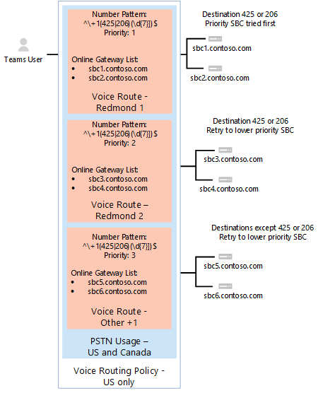
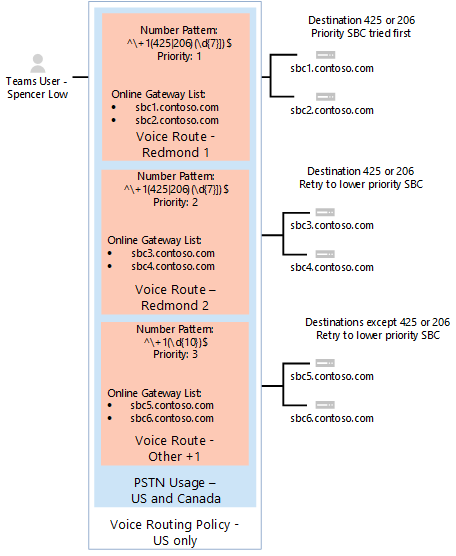
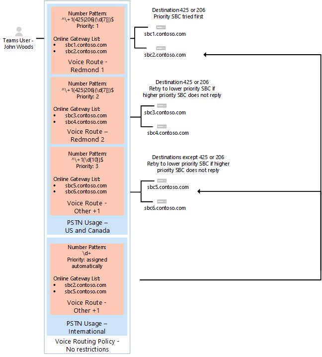

# Configure call routing for Direct Routing

This article describes how to configure call routing for Direct Routing. This is step 3 of the following steps for configuring Direct Routing:

- Step 1. [Connect the SBC with Microsoft Phone System and validate the connection](direct-routing-connect-the-sbc.md) 
- Step 2. [Enable users for Direct Routing, voice, and voicemail](direct-routing-enable-users.md)
- **Step 3. Configure call routing** (This article)
- Step 4. [Translate numbers to an alternate format](direct-routing-translate-numbers.md) 

For information on all the steps required for setting up Direct Routing, see [Configure Direct Routing](direct-routing-configure.md).

## Call routing overview

Microsoft Phone System has a routing mechanism that allows a call to be sent to a specific Session Border Controller (SBC) based on: 

- The called number pattern 
- The called number pattern plus the specific user who makes the call
 
SBCs can be designated as active and backup. When the SBC that is configured as active is not available for a specific call route, then the call will be routed to a backup SBC.
 
Call routing is made up of the following elements: 

- **Call routing policy** – Also called a voice routing policy. A container for PSTN usages, which can be assigned to a user or to multiple users. 

- **PSTN usages** – A container for voice routes and PSTN usages, which can be shared in different voice routing policies. 

- **Voice routes** – A number pattern and set of online PSTN gateways to use for calls where the calling number matches the pattern.

- **Online PSTN gateway** - A pointer to an SBC that also stores the configuration that is applied when a call is placed through the SBC, such as forward P-Asserted-Identity (PAI) or Preferred Codecs; can be added to voice routes.

## Voice routing policy considerations

If a user has a Calling Plan license, that user’s outgoing calls are automatically routed through the Microsoft Calling Plan PSTN infrastructure. If you configure and assign an online voice routing policy to a Calling Plan user, that user’s outgoing calls are checked to determine whether the dialed number matches a number pattern defined in the online voice routing policy. If there’s a match, the call is routed through the Direct Routing trunk. If there’s no match, the call is routed through the Calling Plan PSTN infrastructure.

> [!CAUTION]
> If you configure and apply the global (Org-wide default) online voice routing policy, all voice-enabled users in your organization will inherit that policy, which may result in PSTN calls from Calling Plan users being inadvertently routed to a Direct Routing trunk. If you don't want all users to use the global online voice routing policy, configure a custom online voice routing policy and assign it to individual voice-enabled users.

## Example 1: Voice routing with one PSTN usage

The following diagram shows two examples of voice routing policies in a call flow.

**Call Flow 1 (on the left):** If a user makes a call to +1 425 XXX XX XX or +1 206 XXX XX XX, the call is routed to SBC sbc1.contoso.biz or sbc2.contoso.biz. If neither sbc1.contoso.biz nor sbc2.contoso.biz are available, the call is dropped. 

**Call Flow 2 (on the right):** If a user makes a call to +1 425 XXX XX XX or +1 206 XXX XX XX, the call is first routed to SBC sbc1.contoso.biz or sbc2.contoso.biz. If neither SBC is available, the route with lower priority will be tried (sbc3.contoso.biz and sbc4.contoso.biz). If none of the SBCs are available, the call is dropped. 


In both examples, while the voice route is assigned priorities, the SBCs in the routes are tried in random order.

  > [!NOTE]
  > Unless the user also has a Microsoft Calling Plan license, calls to any number except numbers matching the patterns +1 425 XXX XX XX or +1 206 XXX XX XX in the example configuration are dropped. If the user has a Calling Plan license, the call is automatically routed according to the policies of the Microsoft Calling Plan. The Microsoft Calling Plan applies automatically as the last route to all users with the Microsoft Calling Plan license and does not require additional call routing configuration.

In the example shown in the following diagram, a voice route is added to send calls to all other US and Canadian numbers (calls that go to called number pattern +1 XXX XXX XX XX).



For all other calls, if a user has both licenses (Microsoft Phone System and Microsoft Calling Plan), the automatic route is used. If nothing matches the number patterns in the administrator-created online voice routes, then the call is routed through Microsoft Calling Plan. If the user only has Microsoft Phone System, the call is dropped because no matching rules are available.

  > [!NOTE]
  > The Priority value for route "Other +1" doesn't matter in this case because there is only one route that matches the pattern +1 XXX XXX XX XX. If a user makes a call to +1 324 567 89 89 and both sbc5.contoso.biz and sbc6.contoso.biz are unavailable, the call is dropped.

The following table summarizes the configuration using three voice routes. In this example, all three routes are part of the same PSTN usage, "US and Canada".  All routes are associated with the "US and Canada" PSTN usage  and the PSTN usage is associated with the "US Only" voice routing policy.

|**PSTN usage**|**Voice route**|**Number pattern**|**Priority**|**SBC**|**Description**|
|:-----|:-----|:-----|:-----|:-----|:-----|
|US and Canada|"Redmond 1"|^\\+1(425\|206)(\d{7})$|1|sbc1.contoso.biz<br/>sbc2.contoso.biz|Active route for called numbers +1 425 XXX XX XX or +1 206 XXX XX XX|
|US and Canada|"Redmond 2"|^\\+1(425\|206)(\d{7})$|2|sbc3.contoso.biz<br/>sbc4.contoso.biz|Backup route for called numbers +1 425 XXX XX XX or +1 206 XXX XX XX|
|US and Canada|"Other +1"|^\\+1(\d{10})$|3|sbc5.contoso.biz<br/>sbc6.contoso.biz|Route for called numbers +1 XXX XXX XX XX (except +1 425 XXX XX XX or +1 206 XXX XX XX)|
|||||||

## Example 1: Configuration steps

The following example shows how to:

1. Create a single PSTN usage.
2. Configure three voice routes.
3. Create a voice routing policy.
4. Assign the policy to a user named Spencer Low.

You can use the [Microsoft Teams admin center](#admincenterexample1) or [PowerShell](#powershellexample1) to perform these steps.

### Using the Microsoft Teams admin center
<a name="admincenterexample1"></a>

#### Step 1: Create the "US and Canada" PSTN usage

1. In the left navigation of the Microsoft Teams admin center, go to **Voice** > **Direct Routing**, and then in the upper-right corner, select **Manage PSTN usage records**.
2. Click **Add**, type **US and Canada**, and then click **Apply**.

#### Step 2: Create three voice routes (Redmond 1, Redmond 2, and Other +1)

The following steps describe how to create a voice route. Use these steps to create the three voice routes named Redmond 1, Redmond 2, and Other +1 for this example by using the settings outlined in the earlier table.

1. In the left navigation of the Microsoft Teams admin center, go to **Voice** > **Direct Routing**, and then select the **Voice routes** tab.
2. Click **Add**, and then enter a name and description for the voice route.
3. Set the priority and specify the dialed number pattern.
4. To enroll an SBC with the voice route, under **SBCs enrolled (optional)**, click **Add SBCs**, select the SBCs you want to enroll, and then click **Apply**.
5. To add PSTN usage records, under **PSTN usage records (optional)**, click **Add PSTN usage**, select the PSTN records you want to add, and then click **Apply**.
6. Click **Save**.

#### Step 3: Create a voice routing policy named "US Only" and add the "US and Canada" PSTN usage to the policy

1. In the left navigation of the Microsoft Teams admin center, go to **Voice** > **Voice routing policies**, and then click **Add**.
2. Type **US Only** as the name and add a description.
3. Under **PSTN usage records**, click **Add PSTN usage**, select the "US and Canada" PSTN usage record, and then click **Apply**.
4. Click **Save**.

To learn more, see [Manage voice routing policies](manage-voice-routing-policies.md).

#### Step 4: Assign the voice routing policy to a user named Spencer Low

1. In the left navigation of the Microsoft Teams admin center, go to **Users**, and then click the user.
2. Click **Policies**, and then next to **Assigned policies**, click **Edit**.
3. Under **Voice routing policy**, select the "US Only" policy, and then click **Save**.

To learn more, see [Manage voice routing policies](manage-voice-routing-policies.md).

### Using PowerShell
<a name="powershellexample1"></a>


#### Step 1: Create the "US and Canada" PSTN usage

In a remote PowerShell session in Skype for Business Online, type:

```PowerShell
Set-CsOnlinePstnUsage -Identity Global -Usage @{Add="US and Canada"}
```

Verify that the usage was created by entering:

```PowerShell
Get-CSOnlinePSTNUsage
``` 

Which returns a list of names that may be truncated:

```console
Identity    : Global
Usage        : {testusage, US and Canada, International, karlUsage. . .}
```

The following example shows the result of running the `(Get-CSOnlinePSTNUsage).usage` PowerShell command to display full names (not truncated):

```console
 testusage
 US and Canada
 International
 karlUsage
 New test env
 Tallinn Lab Sonus
 karlUsage2
 Unrestricted
 Two trunks
```

#### Step 2: Create three voice routes (Redmond 1, Redmond 2, and Other +1)

To create the "Redmond 1" route, in a PowerShell session in Skype for Business Online, enter:

```PowerShell
New-CsOnlineVoiceRoute -Identity "Redmond 1" -NumberPattern "^\+1(425|206)
(\d{7})$" -OnlinePstnGatewayList sbc1.contoso.biz, sbc2.contoso.biz -Priority 1 -OnlinePstnUsages "US and Canada"
```

Which returns:

```console
Identity                : Redmond 1
Priority                : 1
Description             :
NumberPattern           : ^\+1(425|206) (\d{7})$
OnlinePstnUsages        : {US and Canada}
OnlinePstnGatewayList   : {sbc1.contoso.biz, sbc2.contoso.biz}
Name                    : Redmond 1
```

To create the Redmond 2 route, enter:

```PowerShell
New-CsOnlineVoiceRoute -Identity "Redmond 2" -NumberPattern "^\+1(425|206)
(\d{7})$" -OnlinePstnGatewayList sbc3.contoso.biz, sbc4.contoso.biz -Priority 2 -OnlinePstnUsages "US and Canada"
```

To create the Other +1 route, enter:

```PowerShell
New-CsOnlineVoiceRoute -Identity "Other +1" -NumberPattern "^\+1(\d{10})$"
-OnlinePstnGatewayList sbc5.contoso.biz, sbc6.contoso.biz -OnlinePstnUsages "US and Canada"
```

  > [!CAUTION]
  > Make sure that your regular expression in the NumberPattern attribute is a valid expression. You can test it using this website: [https://www.regexpal.com](https://www.regexpal.com)

In some cases, there is a need to route all calls to the same SBC; use -NumberPattern ".*"

Route all calls to the same SBC.

```PowerShell
Set-CsOnlineVoiceRoute -id "Redmond 1" -NumberPattern ".*" -OnlinePstnGatewayList sbc1.contoso.biz
```

Verify that you've correctly configured the route by running the `Get-CSOnlineVoiceRoute` PowerShell command using options as shown:

```PowerShell
Get-CsOnlineVoiceRoute | Where-Object {($_.priority -eq 1) -or ($_.priority -eq 2) or ($_.priority -eq 4) -Identity "Redmond 1" -NumberPattern "^\+1(425|206) (\d{7})$" -OnlinePstnGatewayList sbc1.contoso.biz, sbc2.contoso.biz -Priority 1 -OnlinePstnUsages "US and Canada"
```
Which should return:

```console
Identity            : Redmond 1 
Priority               : 1
Description         : 
NumberPattern         : ^\+1(425|206) (\d{7})$
OnlinePstnUsages     : {US and Canada}     
OnlinePstnGatewayList    : {sbc1.contoso.biz, sbc2.contoso.biz}
Name             : Redmond 1
Identity        : Redmond 2 
Priority               : 2
Description         : 
NumberPattern         : ^\+1(425|206) (\d{7})$
OnlinePstnUsages     : {US and Canada}     
OnlinePstnGatewayList    : {sbc3.contoso.biz, sbc4.contoso.biz}
Name             : Redmond 2
    
Identity        : Other +1 
Priority               : 4
Description         : 
NumberPattern         : ^\+1(\d{10})$
OnlinePstnUsages     : {US and Canada}     
OnlinePstnGatewayList    : {sbc5.contoso.biz, sbc6.contoso.biz}
Name             : Other +1
```

In the example, the route "Other +1" was automatically assigned priority 4. 

#### Step 3: Create a voice routing policy named "US Only" and add the "US and Canada" PSTN usage to the policy

In a PowerShell session in Skype for Business Online, type:

```PowerShell
New-CsOnlineVoiceRoutingPolicy "US Only" -OnlinePstnUsages "US and Canada"
```

The result is shown in this example:

```console
Identity            : Tag:US only
OnlinePstnUsages    : {US and Canada}
Description         :
RouteType           : BYOT
```

#### Step 4: Assign the voice routing policy to a user named Spencer Low

In a PowerShell session in Skype for Business Online, type:

```PowerShell
Grant-CsOnlineVoiceRoutingPolicy -Identity "Spencer Low" -PolicyName "US Only"
```

Validate the policy assignment by entering this command:

```PowerShell
Get-CsOnlineUser "Spencer Low" | select OnlineVoiceRoutingPolicy
```

The command returns the following:

```console
OnlineVoiceRoutingPolicy
---------------------
US Only
```

## Example 2: Voice routing with multiple PSTN usages

The voice routing policy created in Example 1 only allows calls to phone numbers in the US and Canada--unless the Microsoft Calling Plan license is also assigned to the user.

In the example that follows, you can create the "No Restrictions" voice routing policy. The policy reuses the "US and Canada" PSTN usage created in Example 1, as well as the new "International" PSTN usage. This policy routes all other calls to the SBCs sbc2.contoso.biz and sbc5.contoso.biz.

The examples that are shown assign the US Only policy to user Spencer Low, and the No Restrictions policy to the user John Woods so that routing occurs as follows:

- Spencer Low – US Only policy.  Calls are allowed only to US and Canadian numbers. When calling to the Redmond number range, the specific set of SBCs must be used. Non-US numbers will not be routed unless the Calling Plan license is assigned to the user.

- John Woods – International policy.  Calls are allowed to any number. When calling to the Redmond number range, the specific set of SBCs must be used. Non-US numbers will be routed using sbc2.contoso.biz and sbc5.contoso.biz.



For all other calls, if a user has both licenses (Microsoft Phone System and Microsoft Calling Plan), automatic route is used. If nothing matches the number patterns in the administrator-created online voice routes, then the call is routed using Microsoft Calling Plan.  If the user has only Microsoft Phone System, the call is dropped because no matching rules are available.



The following table summarizes routing policy "No Restrictions" usage designations and voice routes. 

| PSTN usage | Voice route | Number pattern | Priority | SBC | Description |
|:-----|:-----|:-----|:-----|:-----|:-----|
|US and Canada|"Redmond 1"|^\\+1(425\|206)(\d{7})$|1|sbc1.contoso.biz<br/>sbc2.contoso.biz|Active route for callee numbers +1 425 XXX XX XX or +1 206 XXX XX XX|
|US and Canada|"Redmond 2"|^\\+1(425\|206)(\d{7})$|2|sbc3.contoso.biz<br/>sbc4.contoso.biz|Backup route for callee numbers +1 425 XXX XX XX or +1 206 XXX XX XX|
|US and Canada|"Other +1"|^\\+1(\d{10})$|3|sbc5.contoso.biz<br/>sbc6.contoso.biz|Route for callee numbers +1 XXX XXX XX XX (except +1 425 XXX XX XX or +1 206 XXX XX XX)|
|International|International|\d+|4|sbc2.contoso.biz<br/>sbc5.contoso.biz|Route for any number pattern |

  > [!NOTE]
  > - The order of PSTN usages in voice routing policies is critical. The usages are applied in order, and if a match is found in the first usage, then other usages are never evaluated. The "International" PSTN usage must be placed after the  "US and Canada" PSTN usage. To change the order of the PSTN usages, run the `Set-CSOnlineVoiceRoutingPolicy` command. <br/>For example, to change the order from "US and Canada" first and "International" second to the reverse order run:<br/> `Set-CsOnlineVoiceRoutingPolicy -id tag:"no Restrictions" -OnlinePstnUsages @{Replace="International", "US and Canada"}`
 > - The priority for "Other +1" and "International" voice routes are assigned automatically. They don't matter as long as they have lower priorities than "Redmond 1" and "Redmond 2."

## Example 2: Configuration steps

The following example shows how to:

1. Create a new PSTN usage called International.
2. Create a new voice route called International.
3. Create a voice routing policy called No Restrictions.
4. Assign the policy to user John Woods.

You can use the [Microsoft Teams admin center](#admincenterexample2) or [PowerShell](#powershellexample2) to perform these steps.

### Using the Microsoft Teams admin center
<a name="admincenterexample2"></a>

#### Step 1: Create the "International" PSTN usage

1. In the left navigation of the Microsoft Teams admin center, go to **Voice** > **Direct Routing**, and then in the upper-right corner, select **Manage PSTN usage records**.
2. Click **Add**, type **International**, and then click **Apply**.

#### Step 2: Create the "International" voice route

1. In the left navigation of the Microsoft Teams admin center, go to **Voice** > **Direct Routing**, and then select the **Voice routes** tab.
2. Click **Add**, enter "International" as the name, and then add the description.
3. Set the priority to 4, and then set the dialed number pattern to \d+.
4. Under **SBCs enrolled (optional)**, click **Add SBCs**, select sbc2.contoso.biz and sbc5.contoso.biz, and then click **Apply**.
5. Under **PSTN usage records (optional)**, click **Add PSTN usage**, select the "International" PSTN usage record, and then click **Apply**.
6. Click **Save**.

#### Step 3: Create a voice routing policy named "No Restrictions" and add the "US and Canada" and "International" PSTN usages to the policy

The PSTN usage "US and Canada" are reused in this voice routing policy to preserve special handling for calls to number "+1 425 XXX XX XX" and "+1 206 XXX XX XX" as local or on-premises calls.

1. In the left navigation of the Microsoft Teams admin center, go to **Voice** > **Voice routing policies**, and then click **Add**.
2. Type **No Restrictions** as the name and add a description.
3. Under **PSTN usage records**, click **Add PSTN usage**, select the "US and Canada" PSTN usage record, and then select the "International" PSTN usage record. Click **Apply**.

    Take note of the order of PSTN usages:

    - If a call made to number "+1 425 XXX XX XX" with the usages configured as in this example, the call follows the route set in "US and Canada" usage and the special routing logic is applied. That is, the call is routed using sbc1.contoso.biz and sbc2.contoso.biz first, and then sbc3.contoso.biz and sbc4.contoso.biz as the backup routes.

    - If "International" PSTN usage is before "US and Canada," calls to +1 425 XXX XX XX are routed to sbc2.contoso.biz and sbc5.contoso.biz as part of the routing logic.

4. Click **Save**.

To learn more, see [Manage voice routing policies](manage-voice-routing-policies.md).

#### Step 4: Assign the voice routing policy to a user named John Woods

1. In the left navigation of the Microsoft Teams admin center, go to **Users**, and then click the user.
2. Click **Policies**, and then next to **Assigned policies**, click **Edit**.
3. Under **Voice routing policy**, select the "No Restrictions" policy, and then click **Save**.

The result is that the voice policy applied to John Woods' calls is unrestricted and will follow the logic of call routing available for US, Canada, and International calling.

### Using PowerShell
<a name="powershellexample2"></a>

#### Step 1: Create the "International" PSTN usage

In a remote PowerShell session in Skype for Business Online, enter:

```PowerShell
Set-CsOnlinePstnUsage -Identity Global -Usage @{Add="International"}
```

#### Step 2:  Create a new voice route named "International"

```PowerShell
New-CsOnlineVoiceRoute -Identity "International" -NumberPattern ".*" -OnlinePstnGatewayList sbc2.contoso.biz, sbc5.contoso.biz -OnlinePstnUsages "International"
```

Which returns:

```console
Identity                  : International
Priority                  : 5
Description               :
NumberPattern             : .*
OnlinePstnUsages          : {International}
OnlinePstnGatewayList     : {sbc2.contoso.biz, sbc5.contoso.biz}
Name                      : International
```

#### Step 3: Create a voice routing policy named "No Restrictions"

The PSTN usage "Redmond 1" and "Redmond" are reused in this voice routing policy to preserve special handling for calls to number "+1 425 XXX XX XX" and "+1 206 XXX XX XX" as local or on-premises calls.

  ```PowerShell
  New-CsOnlineVoiceRoutingPolicy "No Restrictions" -OnlinePstnUsages "US and Canada", "International"
  ```

Take note of the order of PSTN usages:

  - If a call made to number "+1 425 XXX XX XX" with the usages configured as in the following example, the call follows the route set in "US and Canada" usage and the special routing logic is applied. That is, the call is routed using sbc1.contoso.biz and sbc2.contoso.biz first, and then sbc3.contoso.biz and sbc4.contoso.biz as the backup routes.

  - If "International" PSTN usage is before "US and Canada," calls to +1 425 XXX XX XX are routed to sbc2.contoso.biz and sbc5.contoso.biz as part of the routing logic. Enter the command:

  ```PowerShell
  New-CsOnlineVoiceRoutingPolicy "No Restrictions" -OnlinePstnUsages "US and Canada", "International"
  ```

Which returns:

```console
    Identity              : International 
    OnlinePstnUsages : {US and Canada, International}     
    Description         :  
    RouteType               : BYOT
```

#### Step 4: Assign the voice routing policy to the user named John Woods

```PowerShell
Grant-CsOnlineVoiceRoutingPolicy -Identity "John Woods" -PolicyName "No Restrictions"
```

Then verify the assignment using the command: 

```PowerShell
Get-CsOnlineUser "John Woods" | Select OnlineVoiceRoutingPolicy
```

Which returns:

```console
OnlineVoiceRoutingPolicy
------------------------
No Restrictions
```

The result is that the voice policy applied to John Woods' calls is unrestricted, and will follow the logic of call routing available for US, Canada, and International calling.

## Run a Self-diagnostics tool

Microsoft 365 admin users have access to diagnostics that can be run within the tenant to verify a user is correctly configured for Direct Routing. 

> [!NOTE]
>This feature isn't available for Microsoft 365 Government, Microsoft 365 operated by 21Vianet, or Microsoft 365 Germany.

Select Run Tests, as follows. This will populate the diagnostic in the Microsoft 365 Admin Center.
>> [!div class="nextstepaction"]
>> [Run Tests: Teams Direct Routing](https://aka.ms/TeamsDirectRoutingDiag)

The diagnostic performs a large range of verifications.

## See also

[Plan Direct Routing](direct-routing-plan.md)

[Configure Direct Routing](direct-routing-configure.md)
