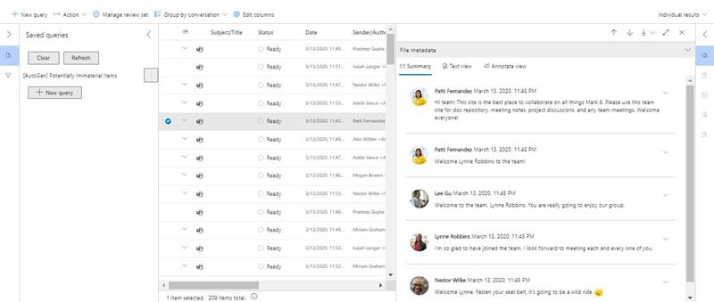
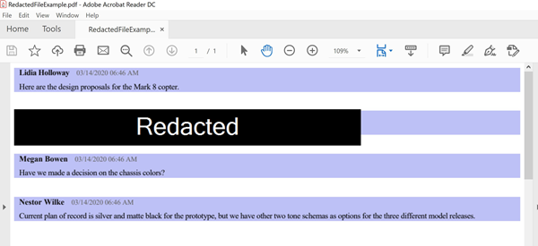

# Conduct an eDiscovery investigation of content in Microsoft Teams

Large Enterprises are often exposed to high penalty legal proceedings that demand submission of all Electronically Stored Information (ESI). Microsoft Teams content can be searched and used during eDiscovery investigations.

## Overview

All Microsoft Teams 1:1 or group chats are journaled through to the respective users' mailboxes. All standard channel messages are journaled through to the group mailbox representing the team. Files uploaded in standard channels are covered under the eDiscovery functionality for SharePoint Online and OneDrive for Business.

eDiscovery of messages and files in [private channels](private-channels.md) works differently than in standard channels. To learn more, see [eDiscovery of private channels](#ediscovery-of-private-channels).

Not all Teams content is eDiscoverable. The following table shows the content types that you can search for using Microsoft eDiscovery tools:

| Content type | eDiscoverable | Notes |
|:--- | :--- |:--- |
|Audio recordings | No | |
|Card content|Yes|See [Search for card content](#search-for-card-content) for more information.|
|Chat links | Yes | |
|Chat messages | Yes |This includes content in Teams channels, 1:1 chats, 1:N group chats, and chats with guest user participants.  |
|Code snippets | No | |
|Edited messages | Yes | If the user is on hold, previous versions of edited messages are also preserved. |
|Emojis, GIFs, and stickers | Yes | |
|Inline images | Yes | |
|Meeting IM conversations | Yes | |
|Meeting metadata<sup>1</sup> | Yes |  |
|Name of channel | No | |
|Private channel messages | Yes | |
|Quotes | Yes | Quoted content is searchable. However, search results don't indicate that the content was quoted. |
|Reactions (such as likes, hearts, and other reactions) | No | |
|Subject | Yes | |
|Tables | Yes | |
|Feed Notifications | No | |
|||

<sup>1</sup> Meeting (and call) metadata includes the following:

- Meeting start and end time, and duration
- Meeting join and leave events for each participant
- VOIP join/calls
- Anonymous join
- Federated user join
- Guest user join

  The image shows an example of meeting metadata.

  > [!div class="mx-imgBorder"]
  > 

Here's an example of an IM conversation between participants during the meeting.


> [!div class="mx-imgBorder"]
> 

For more information about conducting an eDiscovery investigation, see [Get started with Core eDiscovery](https://docs.microsoft.com/microsoft-365/compliance/get-started-core-ediscovery).

Microsoft Teams data will appear as IM or Conversations in the Excel eDiscovery export output. You can open the `.pst` file in Outlook to view those messages after you export them.

When viewing the .pst file for the team, all conversations are kept in the Team Chat folder under Conversation History. The title of the message contains the team name and channel name. For example, the image below shows a message from Bob who messaged the Project 7 standard channel of the Manufacturing Specs team.


Private chats in a user's mailbox are stored in the Team Chat folder under Conversation History.

## eDiscovery of private channels

Records for messages sent in a private channel are delivered to the mailbox of all private channel members, rather than to a group mailbox. The titles of the records are formatted to indicate which private channel they were sent from.

Because each private channel has its own SharePoint site that's separate from the parent team site, files in a private channel are managed independently of the parent team.

Teams doesn't support eDiscovery search of a single channel within a team, so the whole team must be searched. To perform an eDiscovery search of content in a private channel, search across the team, the site collection associated with the private channel (to include files), and mailboxes of private channel members (to include messages).

Use the following steps to identify files and messages in a private channel to include in your eDiscovery search.

### Include private channel files in an eDiscovery search

Before you perform these steps, install the [SharePoint Online Management Shell and connect to  SharePoint Online](https://docs.microsoft.com/powershell/sharepoint/sharepoint-online/connect-sharepoint-online).

1. Run the following to get a list of all SharePoint site collections associated with private channels in the team.

    ```PowerShell
    Get-SPOSite
    ```

2. Run the following PowerShell script to get a list of all SharePoint site collection URLs associated with private channels in the team and the parent team group ID.

    ```PowerShell
    $sites = get-sposite -template "teamchannel#0"
    foreach ($site in $sites) {$x= get-sposite -identity $site.url -detail; $x.relatedgroupID; $x.url}
    ```

3. For each team or group ID, run the following PowerShell script to identify all relevant private channel sites, where $groupID is the group ID of the team.

    ```PowerShell
    $sites = get-sposite -template "teamchannel#0"
    $groupID = "e8195240-4a70-4830-9106-80193cf717cb"
    foreach ($site in $sites) {$x= Get-SpoSite -Identity $site.url -Detail; if ($x.RelatedGroupId -eq $groupID) {$x.RelatedGroupId;$x.url}}
    ```

### Include private channel messages in an eDiscovery search

Before you perform these steps, make sure you have the [latest version of the Teams PowerShell module](teams-powershell-overview.md) installed.

1. Run the following command to get a list of private channels in the team.

    ```PowerShell
    Get-TeamChannel -GroupId <GroupID> -MembershipType Private
    ```

2. Run the following command to get a list of private channel members.

    ```PowerShell
    Get-TeamChannelUser -GroupId <GroupID> -DisplayName "Engineering" -Role Member
    ```

3. Include the mailboxes of all members from each private channel in the team as part of your [eDiscovery search query](https://docs.microsoft.com/microsoft-365/compliance/search-for-content-in-core-ediscovery).

## Search for content for guest users

You can use eDiscovery tools to search for Teams content related to guest users in your organization. Teams chat content that's associated with a guest user is preserved in a cloud-based storage location and can be searched for using eDiscovery. This includes searching for content in 1:1 and 1:N chat conversations in which a guest user is a participant with other users in your organization. You can also search for private channel messages in which a guest user is a participant and search for content in *guest:guest* chat conversations where the only participants are guest users.

To search for content for guest users:

1. Connect to Azure AD PowerShell. For instructions, see the "Connect with the Azure Active Directory PowerShell" section in [Connect to Microsoft 365 with PowerShell](https://docs.microsoft.com/microsoft-365/enterprise/connect-to-microsoft-365-powershell#connect-with-the-azure-active-directory-powershell-for-graph-module). Be sure to complete Step 1 and Step 2 in the previous topic.

2. After you successfully connect to Azure AD PowerShell, run the following command to display the user principal name (UPN) for all guest users in your organization. You have to use the UPN of the guest user when you create the search in step 4.

   ```powershell
   Get-AzureADUser -Filter "userType eq 'Guest'" -All $true | FL UserPrincipalName
   ```

   > [!TIP]
   > Instead of displaying a list of user principal names on the computer screen, you can redirect the output of the command to a text file. You can do this by appending `> filename.txt` to the previous command. The text file with the user principal names will be saved to the current folder.

3. In a different Windows PowerShell window, connect to Security & Compliance Center PowerShell. For instructions, see [Connect to Security & Compliance Center PowerShell](https://docs.microsoft.com/powershell/exchange/connect-to-scc-powershell). You can connect with or without using multi-factor authentication.

4. Create a content search that searches for all content (such as chat messages and email messages) in which the specified guest user was a participant by running the following command.

   ```powershell
   New-ComplianceSearch <search name> -ExchangeLocation <guest user UPN>  -AllowNotFoundExchangeLocationsEnabled $true -IncludeUserAppContent $true
   ```

   For example, to search for content associated with the guest user Sara Davis, you would run the following command.

   ```powershell
   New-ComplianceSearch "Sara Davis Guest User" -ExchangeLocation "sara.davis_hotmail.com#EXT#@contoso.onmicrosoft.com" -AllowNotFoundExchangeLocationsEnabled $true -IncludeUserAppContent $true
   ```

    For more information about using PowerShell to create content searches, see [New-ComplianceSearch](https://docs.microsoft.com/powershell/module/exchange/new-compliancesearch).

5. Run the following command to start the content search that you created in step 4:

   ```powershell
   Start-ComplianceSearch <search name>
   ```

6. Go to [https://compliance.microsoft.com](https://compliance.microsoft.com) and then click **Show all** > **Content search**.

7. In the list of searches, select the search that you created in step 4 to display the flyout page.

8. On the flyout page, you can do the following things:

   - Click **View results** to view the search results and preview the content.

   - Next to the **Query** field, click **Edit** to edit and then rerun the search. For example, you can add a search query to narrow the results.

   - Click **Export results** to export and download the search results.

## Search for card content

Card content generated by apps in Teams channels, 1:1 chats, and 1xN chats is stored in mailboxes and can be searched. A *card* is a UI container for short pieces of content. Cards can have multiple properties and attachments, and can include buttons that can trigger card actions. For more information, see [Cards](https://docs.microsoft.com/microsoftteams/platform/task-modules-and-cards/what-are-cards)

Like other Teams content, where card content is stored is based on where the card was used. Content for cards used in a Teams channel is stored in the Teams group mailbox. Card content for 1:1 and 1xN chats are stored in the mailboxes of the chat participants.

To search for card content, you can use the `kind:microsoftteams` or `itemclass:IPM.SkypeTeams.Message` search conditions. When reviewing search results, card content generated by bots in a Teams channel has the **Sender/Author** email property as `<appname>@teams.microsoft.com`, where `appname` is the name of the app that generated the card content. If card content was generated by a user, the value of **Sender/Author** identifies the user.

When viewing card content in Content search results, the content appears as an attachment to the message. The attachment is named `appname.html`, where `appname` is the name of the app that generated the card content. The following screenshots show how card content (for an app named Asana) appears in Teams and in the results of a search.

**Card content in Teams**


**Card content in search results**
  


> [!NOTE]
> To display images from card content in search results at this time (such as the checkmarks in the previous screenshot), you have to be signed into Teams (at https://teams.microsoft.com) in a different tab in the same browser session that you use to view the search results. Otherwise, image placeholders are displayed.

## Advanced eDiscovery

Some Microsoft Teams content can also be searched and preserved using the [Advanced eDiscovery workflow](https://docs.microsoft.com/microsoft-365/compliance/overview-ediscovery-20). While eDiscovery provides a range of search, hold, and export functionality, Advanced eDiscovery gives compliance administrators more tools to identify data sources and analyze their contents.

### Advanced eDiscovery custodian workflow for Teams content

Custodians might be a member of various teams. You can capture Teams content that is relevant to these custodians. For instructions on the custodian workflow, see [Add custodians to an Advanced eDiscovery case](https://docs.microsoft.com/microsoft-365/compliance/add-custodians-to-case).

After adding a custodian, click the **Next** button, then the **Add** button. A window then displays that prompts you to select additional locations, which will show you all of the custodian's memberships and the corresponding SharePoint site locations for their data. From all of these data sources and teams, you can choose the content you want to use for eDiscovery, then place that user and all the data sources that you've identified on hold.

You can select whether to include their Exchange content, their OneDrive content, or both. Exchange content includes all of the application content in the user's mailboxes, such as their email, the Teams content that is stored in their mailbox, and so on. The OneDrive content includes not only the user's content, but also all of the Teams content that is stored in OneDrive, such as 1:1 chats, 1:N chats, and files shared in chats.

You also have the option to associate any team the custodian is a member of so that channel chat messages and files the custodian has access to are included. Additionally, any other team can be associated with a custodian.

> [!NOTE]
> eDiscovery of messages and files in [private channels](private-channels.md) works differently than in standard channels. To learn more, see [eDiscovery of private channels](#ediscovery-of-private-channels).

### Placing a data source on hold

If there is no specific user to designate as a custodian, you can place an entire data source on hold. For more information on holds, see [Manage holds in Advanced eDiscovery](https://docs.microsoft.com/microsoft-365/compliance/managing-holds).

When creating a hold for Teams content, you can choose all of the locations you wish to include in your hold. Even if users are deleting or changing content, the hold will maintain copies of all previous versions of that content.

You can also use an optional query to set conditions for the hold based on keywords, date range, author, and many other criteria. If you specify no keywords, then everything from that data source will be subject to the hold.

### Advanced eDiscovery searches

Teams content can also be searched. For more information on searches, see [Collect data for a case in Advanced eDiscovery](https://docs.microsoft.com/microsoft-365/compliance/collecting-data-for-ediscovery). A search will return an entire conversation if even one message matches the search query.

When creating a search query, you can choose custodians so that all the sources that you've already selected will be searched. You can also search non-custodial sources such as a Teams site that is not mapped to a user. Optional queries are also available to narrow your search within the Teams content.

After you've created a search and selected it, a window displays with additional details and actions that you can take on the selected search. If you click the **Statistics** button, you can view statistics about your search, including breakdowns according to location types, the original source for the content, and whether the content is located in a group mailbox, the individual user mailbox, or a SharePoint site. Thus, you can see a breakdown of what sources are contributing to your search results. There is also a **Queries** view available so you can see which individual keywords are contributing to your results.

After you finalize your search, you can click the **Add results to review set** button and add it to a review set. For more information about review sets, see [Manage review sets in Advanced eDiscovery](https://docs.microsoft.com/microsoft-365/compliance/managing-review-sets) and [Review Sets workflow](#review-sets-workflow) later in this article.

#### Normal review sets and conversation review sets

When adding a search to a review set, you can choose from a normal review set or a conversation review set.

A normal review set is similar to an export; it provides the individual `.msg` files for the Teams content and presents the content in a basic view. You would typically use a normal review set when you plan to use other software tools to reprocess the files later.

A conversation review set provides a more intuitive, threaded view of the conversations; it displays related messages together in the proper order.

> [!div class="mx-imgBorder"]
> 

Functionality such as redaction is available in both types of review sets. For more information about review sets, see [Review conversations in advanced eDiscovery](https://docs.microsoft.com/microsoft-365/compliance/conversation-review-sets).

#### Collection options

When adding to a review set, there are several options available as checkboxes under the **Collection Options** section of the window, including **Conversation Retrieval Options** and **Teams Conversations**. If you enable these options, any individual Teams messages that are part of your review set will also be shown with additional messages surrounding them for context. For example, if your query is specific and only one message is returned as a result, enabling these options will also return several messages leading up to and following the message that matched your query.

Many logical criteria are used to determine whether additional messages provide context to messages that match your query. For example, for Teams content, enabling these options will retrieve the parent message and all the child messages because of the way the messages are threaded.

Message time stamps are also checked. If a message matches your query, neighboring messages that precede it within a span of 4 hours or that follow it within a span of 4 hours are considered to be part of the conversation and are also included in the results.

If you must be certain about which contextual messages will be returned with matches to your search query, you do not need to use these options. You can either collect all content, or you can widen the date range of your search so that more messages are returned as a result of your query.

### Review sets workflow

You can view existing review sets or create new ones by clicking the **Review Sets** tab. For more information about review sets, see [Manage review sets in Advanced eDiscovery](https://docs.microsoft.com/microsoft-365/compliance/managing-review-sets).

In addition to documents, you can add emails, Teams messages, Yammer messages, and other content to your review set. Within a review set, you can also perform many of the same operations that you can perform in other contexts, such as searching content and creating custom queries. These operations only apply to items that have been added to the review set.

The **Manage Review Sets** button provides additional options such as analytics, summary reporting, how many load sets have been added, and so on.

To access visualizations and charts of your data, click **Individual results** \> **Search profile view** in the upper right. You can click on wedges in these charts to interactively select the type of content you want to query. For example, you can choose to query only Teams content. You can also save these queries just as you would save queries that you write manually.

#### Summary view, text view, and annotate view

If you click on a Teams conversation in the review set, it displays the **Summary view**, which displays an entire Teams conversation as a list of messages that you can interact with individually. Click the downward arrow to the right of a message to display a context menu that allows you to view message details or download the individual `.msg` file. Clicking message details will show you a summary of metadata or the full metadata of the message.

To download a PDF, click the download button at the upper right of the summary view.

Click the **Text view** tab to display a plain text view of the extracted text of the Teams conversation. This plain text content is suitable for export and you can easily work with it using other software tools.

Click on the **Annotate view** tab to access annotation features. This tab displays the content in a format that resembles a Teams conversation, but there are also additional options for editing. There is a pencil tool that you can use to make notes, draw on the message, or do fine-grained scratching out for redaction purposes. There is also an **Area redaction** tool that you can use to draw a rectangle that blacks out the area and marks it as "Redacted".

Here's an example of a redacted file for threaded conversation between users.

> [!div class="mx-imgBorder"]
> 

At the bottom of the **Annotate view** tab is the **Tag documents** button, which displays the tagging panel. Within this panel, you can apply a tag to all messages within the Teams conversation. You can label a conversation as responsive or non-responsive, privileged or not privileged, whether it contains "Interesting items", whether it should be included in export, and whether it needs further review. You can also manage and apply other customizable tags.

#### Action menu

Within the review sets window, you can export the content by clicking **Action** \> **Export**. There are many options available when exporting.

To export a file that contains all the metadata for all Teams messages, click to select the **Load file** checkbox. To include in your file any tags that you have applied to the content, click to select the **Tags** checkbox.

Use the **Native files** option to export files in their native format. You can choose to export a conversation as one file or all individual chat messages in their own separate files.

The **Text files** option allows you to save plain text versions of content. For more information about how to obtain a plain text view of Teams conversations in the review set, see [Summary view, text view, and annotate view](#summary-view-text-view-and-annotate-view) above.

If you applied any redactions to the content as described in the [Summary view, text view, and annotate view](#summary-view-text-view-and-annotate-view) section above, you can select the **Replace redacted natives with converted PDFs** option to replace the native files with converted copies in PDF.

You can choose to export to a Microsoft-provided Azure blob storage container or you can provide your own Azure Blob storage container.

When you are ready to begin the export process, click the **Export** button. See [Download export jobs](https://docs.microsoft.com/microsoft-365/compliance/download-export-jobs) for more information about how you can access the Azure blob storage container and download your exported content after export is complete.

> [!NOTE]
> Exporting can take an extended period of time. To track the status of the export process, exit the **Review sets** tab and click the **Exports** tab.

## Related topics

- [eDiscovery in Microsoft 365](https://docs.microsoft.com/microsoft-365/compliance/ediscovery)
- [Teams PowerShell Overview](teams-powershell-overview.md)
