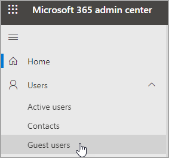
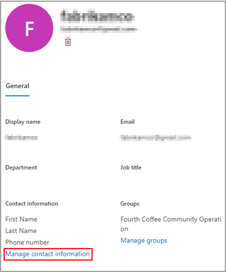
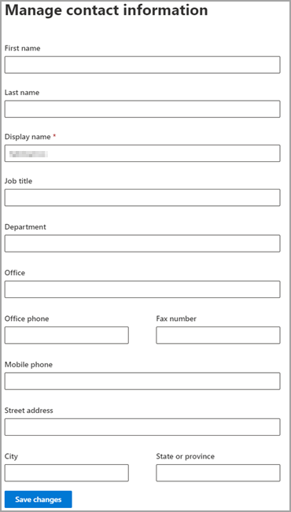

# Edit guest user information

You can edit guest information from the Microsoft 365 admin center or the Azure Active Directory portal.

## Guest users in the Microsoft 365 admin

1. To edit the guest information in the [Microsoft 365 admin center](https://admin.microsoft.com), select **Users** > **Guest Users**.

   

2. Select a user from **Guest users**.

3. In guest user information, select **Manage contact information**.

   

4. Edit any fields that you choose except for **Display name** in **Manage contact information**, and then select **Save changes**.

   

You can also edit the guest user from the [Azure Active Directory portal](https://aad.portal.azure.com/#blade/Microsoft_AAD_IAM/UsersManagementMenuBlade/MsGraphUsers).
