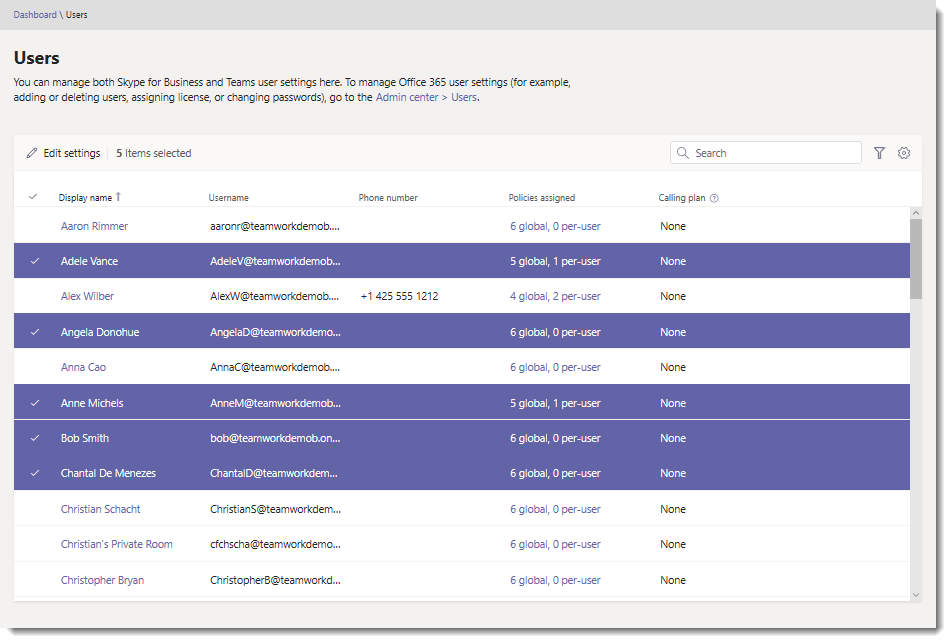
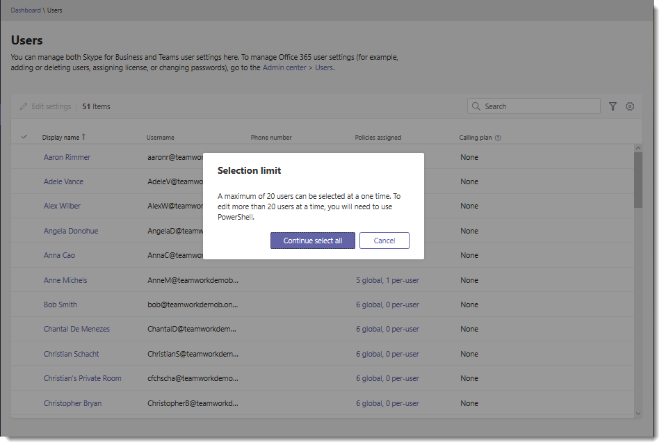
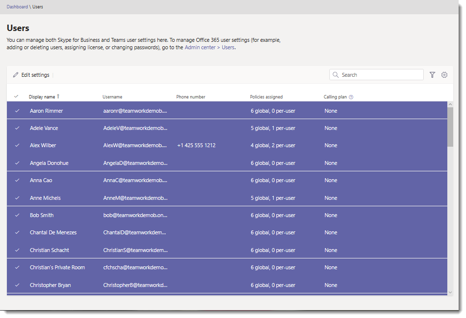
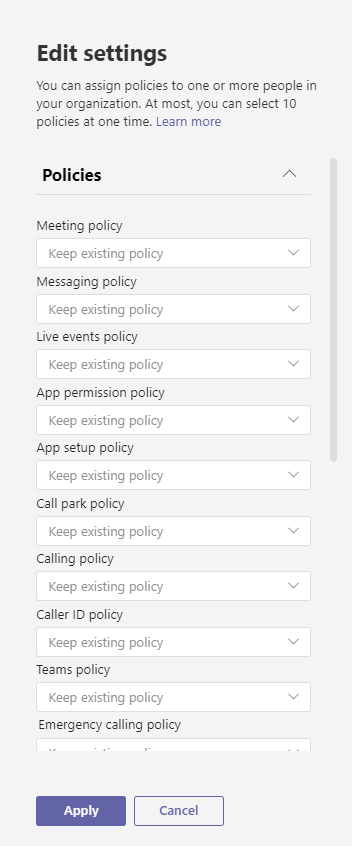

# Edit Microsoft Teams user settings in bulk

As an admin, you manage Teams user settings in the Microsoft Teams admin center. On the **Users** page, you can view information such as account and licensing details and edit policy and other settings. You can edit settings for users individually or for multiple users at the same time.

## Edit user settings in bulk

Use the Microsoft Teams admin center to edit settings for multiple users at a time. We recommend editing settings for 20 users at a time. To edit settings for a large number of users, use PowerShell. For more information, see [Teams PowerShell Overview](teams-powershell-overview.md).

1. In the left navigation of the Microsoft Teams admin center, select **Users**.
2. Search for the users you want to edit or filter the view to show the users you want to edit.
3. In the **&#x2713;** (check mark) column, select users by doing one of the following:
    - Select users one at a time. A **&#x2713;** is displayed next to each user you select. If you select more than 20 users, you won't be blocked but keep in mind that the more users you select, the operation will take longer to complete.

        

    - Click the &#x2713; (check mark) at the top of the table to select all users (up to a maximum of 20 users), and then in the **Selection limit** dialog box, click **Continue select all** to complete the selection.

           A **&#x2713;** is displayed next to the selected users.

        
4. Click **Edit settings**, make the changes that you want, and then click **Save**.

    
