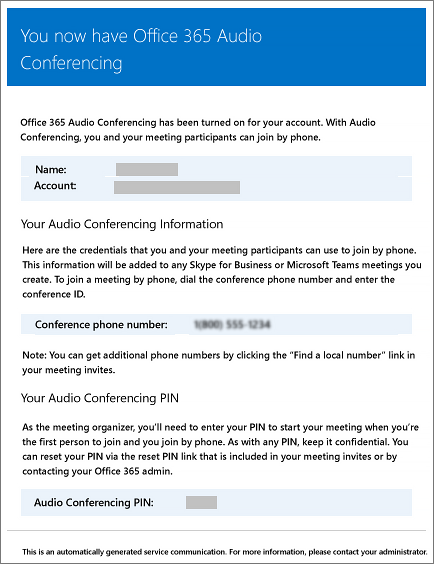
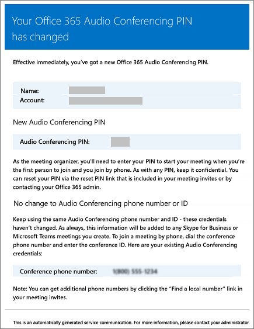
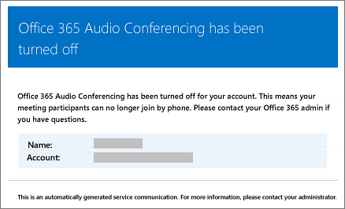

# Emails sent to users when their settings change in Microsoft Teams

Emails will be automatically sent to users who are [enabled for Audio Conferencing](set-up-audio-conferencing-in-teams.md) using Microsoft as the audio conferencing provider.

By default, there are four types of email that will be sent to your users who are enabled for Audio Conferencing. However, if you want to limit the number of emails sent to users, you can turn it off. Audio Conferencing in Office 365 will send email to your users' email when:

- **An Audio Conferencing license is assigned to them or when you are changing the audio conferencing provider to Microsoft.**

     This email includes the conference ID, the default conference phone number for the meetings, the audio conferencing PIN for the user, and the instructions and link to use the Skype for Business Online Meeting Update Tool that is used to update existing meetings for the user. See [Assign Microsoft Teams licenses](assign-teams-licenses.md) or [Assign Microsoft as the audio conferencing provider](/SkypeForBusiness/audio-conferencing-in-office-365/assign-microsoft-as-the-audio-conferencing-provider).

    > [!NOTE]
    > If your organization has been enabled for dynamic conference IDs, all of a user's meetings that they schedule will have unique conference IDs. You can set up [Audio Conferencing dynamic IDs in your organization](/skypeforbusiness/audio-conferencing-in-office-365/reset-a-conference-id-for-a-user). 

    Here is an example of this email:

     

    To find out more about licensing, see [Microsoft Teams add-on licensing](teams-add-on-licensing/microsoft-teams-add-on-licensing.md).

- **The conference ID or default conference phone number of a user changes.**

    This email contains the conference ID, default conference phone number, and the instructions and link to use the Skype for Business Online Meeting Update Tool that is used to update existing meetings for the user. But this email doesn't include the user's audio conferencing PIN. See [Reset a conference ID for a user](reset-a-conference-id-for-a-user-in-teams.md).

    Here is an example of this email:

     

- **The audio conferencing PIN of a user is reset.**

    This email contains the organizer's audio conferencing PIN, the existing conference ID, and default conference phone number for the user. See [Reset the Audio Conferencing PIN](reset-the-audio-conferencing-pin-in-teams.md).
    
     Here is an example of this email:
    
     
  
- **A user's license is removed or when audio conferencing provider changes from Microsoft to other provider or None.**

    This happens when the **Audio Conferencing** license is removed from a user or when changing the audio conferencing provider of a user from Microsoft to a third-party audio conferencing provider or when setting the provider to **None**. This email contains the instructions and information for the user to use the Skype for Business Online Meeting Update Tool to remove audio conferencing specific information, such as the default conference phone number or conference ID.

    See [Assign or remove licenses for Office 365 for business](https://support.office.com/article/997596b5-4173-4627-b915-36abac6786dc).

    Here is an example of this email:

     

> [!NOTE]
> [!INCLUDE [updating-admin-interfaces](includes/updating-admin-interfaces.md)]

## Make changes to the email messages that are sent to them

You can make changes to the email that is automatically sent to users. By default, the sender of the emails will be from Office 365, but you can change the display name using Windows PowerShell. See the [Microsoft Teams PowerShell reference](https://docs.microsoft.com/powershell/module/teams/?view=teams-ps) for more information.

## What if you don't want email to be sent to them?

When you disable sending emails to users, email won't be sent even when a user gets assigned a license. In this case, the conference ID, default conferencing phone number, and, more importantly, their audio conferencing PIN won't be sent to the user. When this happens, you must tell the user by sending them a separate email or by calling them.

By default, emails will be sent to your users, but if you want to prevent them from receiving email for audio conferencing, you can use Microsoft Teams or Windows PowerShell. 

 **Using the Microsoft Teams admin center**

1. In the left navigation, go to **Meetings** > **Conference Bridges**. 

2. At the top of the **Conference Bridges** page, click **Bridge settings**. 

3. In the **Bridge settings** pane, enable or disable **Automatically send emails to users if their dial-in settings change**.

4. Click **Save**.

> [!Note]
> [!INCLUDE [updating-admin-interfaces](includes/updating-admin-interfaces.md)]

**Using Windows PowerShell**

See the [Microsoft Teams PowerShell reference](https://docs.microsoft.com/powershell/module/teams/?view=teams-ps) for more information.

## Want to know more about Windows PowerShell?

By default, the sender of the emails will be from Office 365, but you can change the email address and display name using Windows PowerShell. 

Windows PowerShell is all about managing users and what users are allowed or not allowed to do. With Windows PowerShell, you can manage Office 365 using a single point of administration that can simplify your daily work when you have multiple tasks to do. To get started with Windows PowerShell, see these topics:

  - [Why you need to use Office 365 PowerShell](https://go.microsoft.com/fwlink/?LinkId=525041)

  - [Best ways to manage Office 365 with Windows PowerShell](https://go.microsoft.com/fwlink/?LinkId=525142)

For more information about Windows PowerShell, see the [Microsoft Teams PowerShell reference](https://docs.microsoft.com/powershell/module/teams/?view=teams-ps) for more information.

## Related topics

[Enable or disable sending emails when Audio Conferencing settings change](enable-or-disable-sending-emails-when-their-settings-change-in-teams.md)

[Send an email to a user with their Audio Conferencing information](send-an-email-to-a-user-with-their-dial-in-information-in-teams.md)
