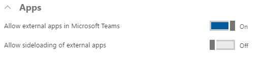
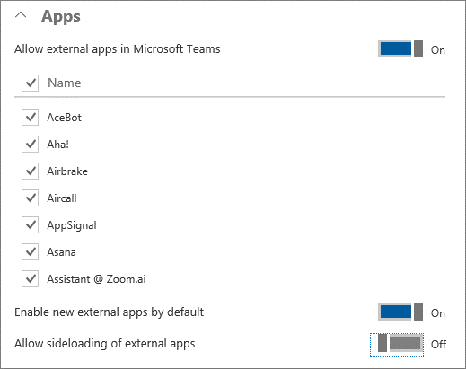

# Manage Microsoft Teams features in your Office 365 organization

> [!IMPORTANT]
> [!INCLUDE [new-teams-sfb-admin-center-notice](includes/new-teams-sfb-admin-center-notice.md)]

All Teams settings will soon be migrated to the new Microsoft Teams & Skype for Business Admin Center. The only Teams feature that is managed in the Office 365 admin center is Apps. 

Unless otherwise noted, the default value for an option is On.

> [!NOTE] 
> To manage admin settings for Teams, go to the Office 365 admin center and open **Settings** > **Services & add-ins**, then choose **Microsoft Teams**. If you're signed in as an Office 365 admin, this link should take you there: 
>  
> https://portal.office.com/adminportal/home#/Settings/ServicesAndAddIns  

## Office 365 tenant-wide settings 

In **Tenant-wide settings**, you can turn on or turn off Apps.

To edit **Tenant-wide settings** for Teams, go to the Office 365 admin center. Choose **Settings** > **Services & add-ins** > **Microsoft Teams**.

## Apps

Apps are tabs, connectors, bots, or any combination of these three, provided by a third-party service. There are Teams admin policies that can be configured in the Office 365 admin center to control which external third-party apps are allowed. These policies let you specify which apps are allowed and disallowed, new external app behavior, and whether side-loading apps is allowed. 

Under **Apps**, you can configure the following settings for your organization: 

- **Allow external apps in Microsoft Teams**: When this switch is turned on, users can add tabs and bots that are available to the Office 365 tenant. 
 
    

- **Enable new external apps by default**: When this switch is turned on, users can activate new apps as soon as they're added to the Teams app catalog. Turn off this switch if you want to control new apps. Of course, if you turn it off, you have to remember to review new apps periodically so your organization doesn't miss out on cool new apps. 

- **Allow sideloading of external apps**: When this switch is turned on, users can install and enable custom bots and tabs. 

To learn more, read [Admin settings for apps in Teams](admin-settings.md). 

