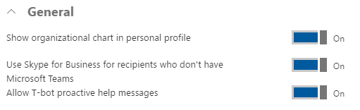
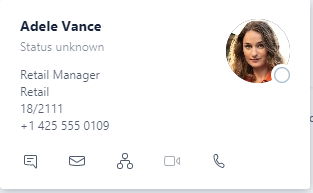
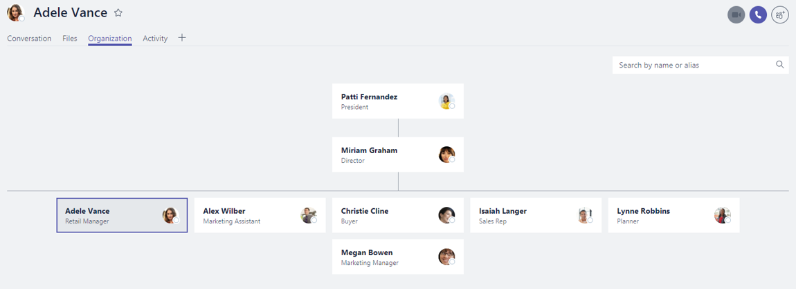
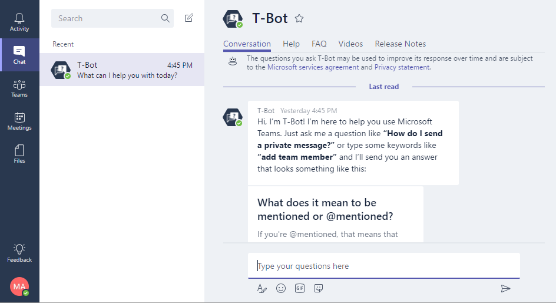
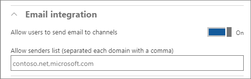
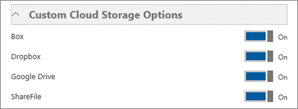
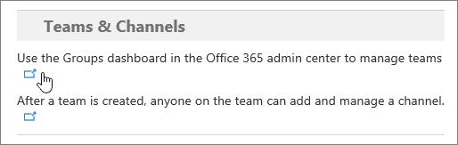
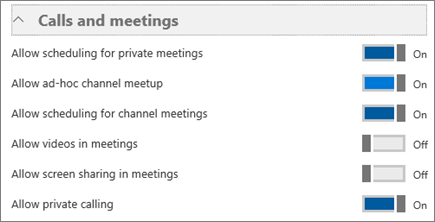

Enable Microsoft Teams features in your Office 365 organization
======================================================

Microsoft Teams has multiple settings that can be enabled or disabled at the tenant level. With Teams enabled for the tenant, any user that is also enabled for Teams will inherit the settings from the tenant level.

Below is the list of features an Office 365 administrator can choose to enable or disable in Teams.

Unless otherwise noted, the default value for an option is On.

> [!NOTE]
> An Office 365 admin can turn off Microsoft Teams at any time in the Office 365 Admin center. Be aware that users with active Microsoft Teams licenses will continue to see the Teams app tile even if you turn off Teams. For details about how to remove licenses from users, see [Manage user access to Microsoft Teams](user-access.md). After Teams is disabled, access from the Teams client is blocked, but data available through other clients and services is still available, such as files via SharePoint and OneDrive. All data remains in place unless the teams are explicitly deleted.

Tenant-wide settings 
---------------------

In **Tenant-wide settings**, you can turn on or turn off options in General, Email integration, Apps, and Custom cloud storage.

### General

The General section lets you configure the following settings for your organization:

> 

-   **Show organizational chart in personal profile:** When this setting is enabled, it shows the organizational chart icon in the user’s contact card and when clicked, it displays the detailed organizational chart.

    

    

-   **Use Skype for Business for recipients who don’t have Microsoft Teams:** When this setting is enabled, it allows Microsoft Teams users to contact other users in the organization that are not enabled for Microsoft Teams via Skype for Business.

-   **Allow T-bot proactive help messages:** When this setting is enabled, T-bot will initiate a private chat session with users to guide them in using Microsoft Teams.

    

Email integration
-----------------

Turn this feature on so that users can send an email to a channel in Microsoft Teams, using the channel email address. Users can do this for any channel belonging to a team they own. Users can also send emails to any channel in a team that has adding connectors enabled for team members. And, even if a user doesn’t have permission to create a channel email address, if someone who does have permission creates that address, the user can access it from the \<more icon\> menu for that channel.

The Email integration section lets you configure the following settings for your organization:

   

-   **Allow users to send emails to channels:** When enabled, mail hooks are enabled, and users can post messages to a channel by sending an email to the email address of Microsoft Teams channel.

> To find the channel’s e-mail address, click **More options** next to the channel name and then select **Get email address**.

-   **Restricted Senders List:** Senders domains can be further restricted to ensure that only allowed SMTP domains can send emails to the Microsoft Teams channels.

Apps
----

Apps in Microsoft Teams are a terrific way to integrate the tools and services your team cares about, right into any channel or chat.

The **Apps** section lets you configure the following settings for your organization:

-   **Allow external apps in Microsoft Teams:** When enabled, users can add tabs and bots that are available to the Office 365 tenant.

-   **Allow sideloading of external apps:** When enabled, users can install and enable custom bots and tabs.

Custom cloud storage
--------------------

Cloud storage options in Microsoft Teams currently include Box, Dropbox, Google Drive, and ShareFile. Users can upload and share files from cloud storage services in Microsoft Teams channels and chats. Click or tap the toggle switch next to the cloud storage providers that your organization wants to use.

User settings by license
------------------------

In **User settings by license**, you can turn on or turn off options in Teams and channels, Calls and meetings, and Messaging.

Teams and channels
------------------

A team is designed to bring together a group of people who work closely to get things done. Teams can be dynamic for project-based work (for example, launching a product or creating a digital war room). Or, teams can be ongoing, to reflect the internal structure of your organization.

As an admin, you can manage team owners and members by using the Groups dashboard in the Office 365 admin center portal. In the Teams and channels section, click the link for **Use the Groups dashboard in the Office 365 admin center to manage teams**.

You can control which users in your organization can create teams in Microsoft Teams. The same creation settings defined by Office 365 groups apply to Microsoft Teams. For more information about managing Office 365 groups, see [Create Office 365 groups](https://support.office.com/en-us/article/Create-Office-365-groups-74a1ef8b-3844-4d08-9980-9f8f7a36000f) and [Control who can create Office 365 Groups](https://support.office.com/en-us/article/Control-who-can-create-Office-365-Groups-4c46c8cb-17d0-44b5-9776-005fced8e618).

NOTE: You can't create teams from the Groups dashboard. Teams must be created by using the Microsoft Teams desktop client or web app.

By default, every user can create a team or group. Users can create teams by choosing Teams on the left side in the Microsoft Teams client (desktop client or web app), and then choosing Create team at the bottom of the client, below the team list.

The default maximum number of teams that an Office 365 tenant can have is currently 500,000. A global admin can create an unlimited number of teams. A user can create 250 teams. A team owner can add 2500 members to a team.

Channels are subcategories of teams. Anyone on the team can add a channel and participate in the conversations in a channel. You might create a channel for an activity or for a department. Conversations, files, and wikis are specific to each channel, but all members of the team can see them.

### Calls and meetings

The **Calls and meetings** section lets you configure the following settings for your organization:

> 

-   **Allow scheduling for private meetings:** When enabled, users can schedule private meetings that are not listed in any channel.

-   **Allow ad-hoc channel meetup:**

-   **Allow scheduling for channel meetings:** When enabled, users can schedule a meeting for a channel that all channel members can easily join with a single click.

-   **Allow videos in meetings:** Specifies whether the use of video is allowed within the meetings.

-   **Allow screen sharing in meetings:** Specifies whether screen sharing is allowed within the meetings.

-   **Allow private calling:** When enabled, users can make private calls.

The maximum number of people in a meeting is 80. There can be 20 members in a private chat, including the user who created the chat.

### Messaging 

The Messaging section lets you configure the following settings for your organization:

-   **Enable Giphy so users can add gifs to conversations:** When enabled, users can use animated pictures within the conversations.

    -   **Content Rating:** When animated images are turned on, content rating can be applied to restrict the type of animated images that can be displayed in conversations. Available content rating options are:

        -   No restriction

        -   Moderate (the default value)

        -   Strict

-   **Enable memes that users can edit and add to conversations:** When enabled, users can use internet memes to make humorous posts.

-   **Enable stickers that users can edit and add to conversations:** When enabled, users can post images with editable text to get channel members attention.

-   **Allow owners to delete all messages:** When enabled, channel owners can remove all messages in a channel.

-   **Allow users to edit their own messages:** When enabled, users can edit their own messages.

-   **Allow users to delete their own messages:** When enabled, users can delete their own messages.

-   **Allow users to chat privately:** When enabled, users can engage in private chats that are visible only to the people in the chat, instead of everyone on the team.

| |  |  |
|---------|---------|---------|
|     |Decision Point         |What settings for Microsoft Teams will your organization enable?         |
|     |Next Steps        |Document these decisions in the table in [Assign roles and permissions in Microsoft Teams](assign-roles-permissions.md).         |

