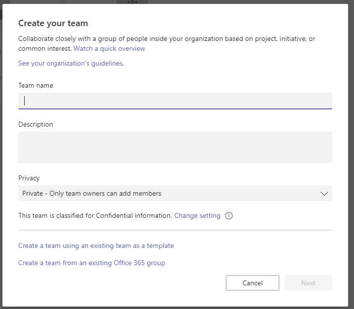

Enhance existing Office 365 groups with Microsoft Teams
=======================================================

Microsoft Teams users can enhance an existing Office 365 Group with Teams functionality. When looking at enhancing a public Office 365 Group, users can do that if the number of members is equal to or less than 5,000.

To do this, users should go through the flow of creating a new team from the Microsoft Teams client. Select **Create from** > **Office 365 group**, and then choose the existing group that you want to enhance with Teams. Existing group members will be added as members to the team automatically.

> [!IMPORTANT]
> Only Office 365 Group owners have permission to enhance an existing group  with Teams, and that group must contain less than 5,000 users. Teams that have already been enhanced will not show up in the list.
>
>The option to create a team from an Office 365 Group will not be available unless these conditions have been met.

Users can also invite a distribution list to a team, and the members of that distribution list will be added to the team. This is a one-time add, and later changes in group membership in the distribution list will not be replicated or synced to Teams.

You can also add mail-enabled security groups as members of a team. But, if you later add more members to the security group, those members are not automatically added to the team. You must add the new members separately or re-add the security group to the team. (If you re-add the security group, deduplication makes sure members are added only once.)

There are two types of privacy settings with Office 365 groups, **public and private**. Whereas both group types can be enabled for Teams, there is a slight difference when it comes to self-service.

-   Users can search for public groups and can join by themselves without a need for team owner’s approval.

-   Private groups are not searchable, and users cannot join unless a team owner add them as a member.

When creating a new team in Teams, an owner of an existing private Office 365 group has an option to use the membership in the Office 365 group to create the team. Users can add their existing SharePoint and OneNote files by adding a tab for SharePoint and merging OneNote files.
