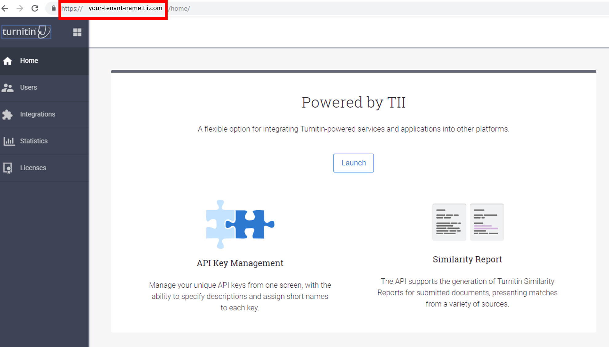
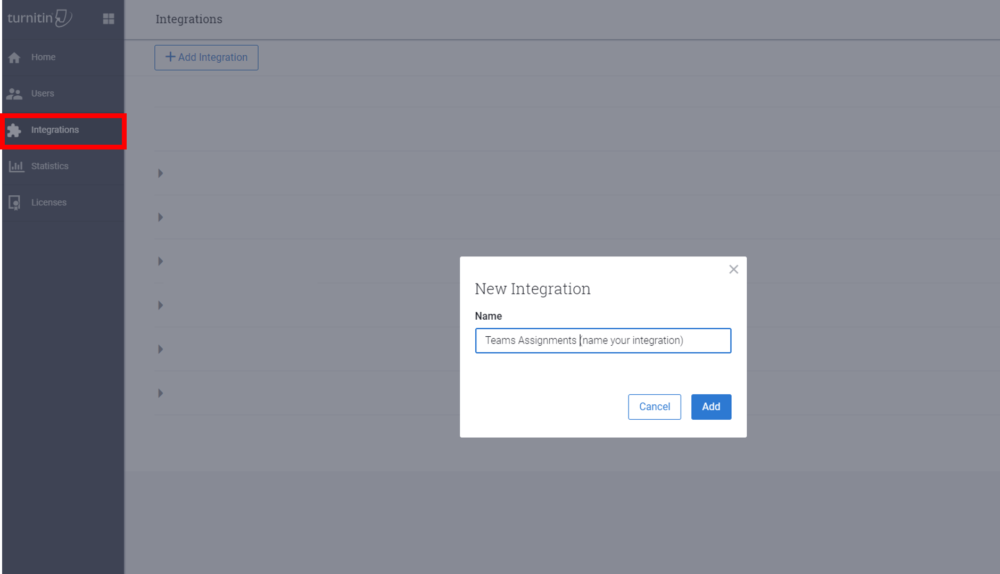
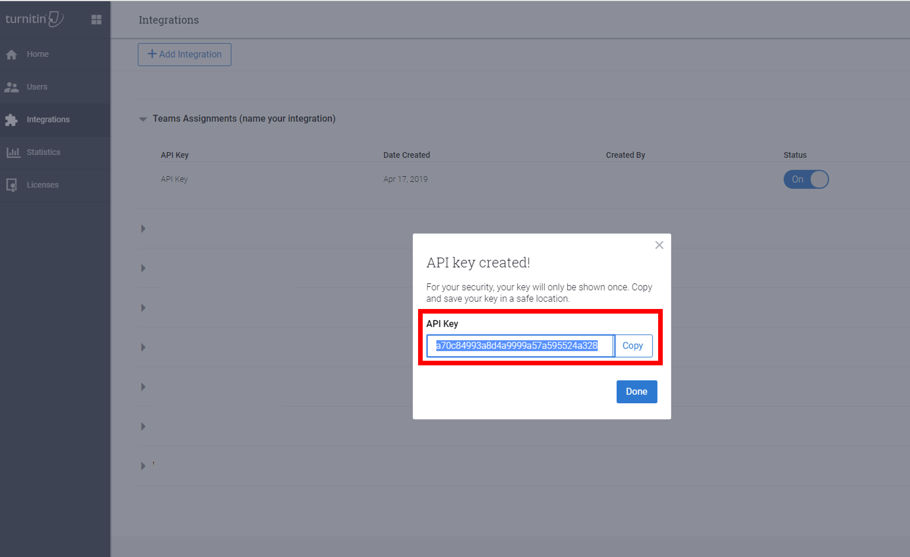

# Assignments in Teams for Education

With Teams, your school or institution can create collaborative classrooms, connect in professional learning communities, and communicate with school staff. Use the admin resources here to help you successfully deploy, adopt, and manage Teams in your school or organization.  

## Assignments in the Teams admin center
Assignments are tasks or units of work assigned to a student or team member in a class as part of their study. You can create assignments within your Teams class.

[Learn more about Assignments](https://support.office.com/article/microsoft-teams-5aa4431a-8a3c-4aa5-87a6-b6401abea114?ui=en-US&rs=en-IE&ad=IE#ID0EAABAAA=Assignments)

With the administrator settings in Teams admin center you can turn the following features on or off to be available for students and teachers within your organization. The following are settings related to Assignments:

### Weekly guardian email digest
Guardian emails are weekly emails sent to students' parents or guardians. The emails will contain information about assignments from the previous week and for the upcoming week, and will be sent over the weekend. The emails need to be updated by the admins using the School Data Sync feature.

This setting is off by default.

### MakeCode
MakeCode is a block-based coding platform that brings computer science to life for all students. 

This is a third party product or service that is subject to its own terms and privacy policy. You are responsible for your use of any third party products and services.

This setting is off by default.

[Learn more about MakeCode](https://www.microsoft.com/${locale}/makecode)

### Turnitin

Turnitin is a plagiarism detection service. This is a third party product or service that is subject to its own terms and privacy policy. You are responsible for your use of any third party products and services.

This setting is off by default.

In order to successfully enable Turnitin for your organization, you will need to already have a Turnitin subscription. You will need to input the following additional information, which can be found in your Turnitin admin console:

  * _TurnitinApiKey_: This is a 32-character GUID found in the admin console under Integrations.
  * _TurnitinApiUrl_: This is the HTTPS URL of your Turnitin admin console.

Here are some instructions to help you obtain this information.

The TurnitinApiUrl is the host address of your admin console.

Go to the Integrations tab and add an integration.

The TurnitinApiKey will be given to you after you follow the prompts. Copy this key and paste it into the Teams admin center. 

[Learn more about the integration between Turnitin and Microsoft Teams](https://www.turnitin.com/products/feedback-studio/microsoft-teams-integration)

[Learn more about Turnitin](https://www.turnitin.com/)