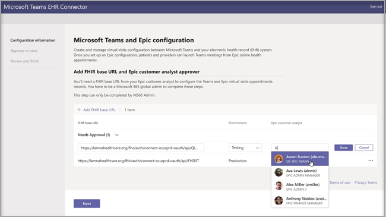
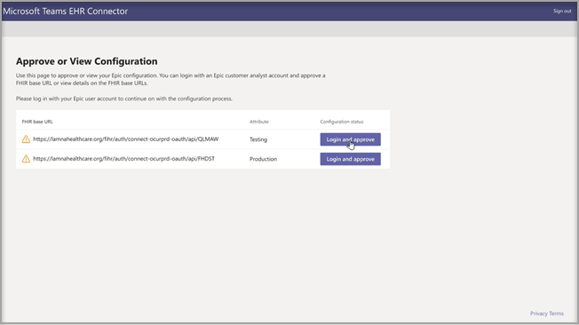
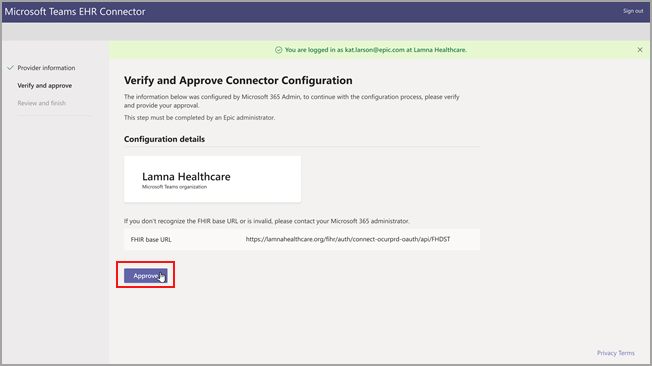
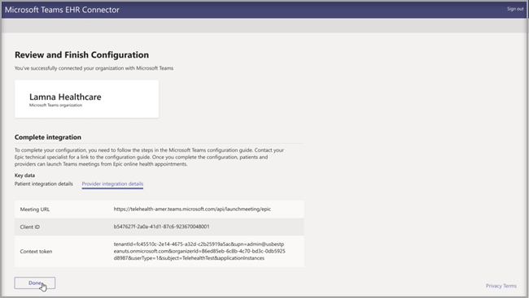
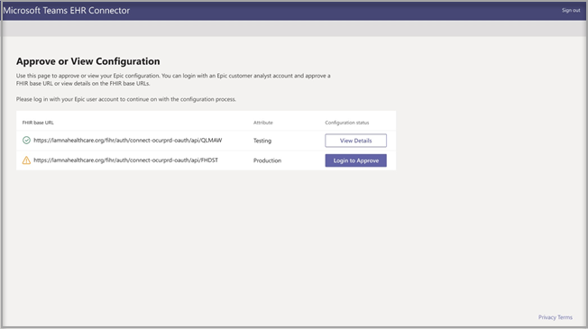

# Virtual visits with Teams - Integration into EHR

Microsoft Teams Electronic Health Record (EHR) Connector makes it easy for clinicians to launch a virtual patient visit or consultation with another provider in Teams directly from the EHR system. Built on the Microsoft 365 cloud, Microsoft Teams enables simple, secure collaboration and communication with chat, video, voice, and healthcare tools in a single hub that supports compliance with HIPAA, HITECH certification, and more.
The communication and collaboration platform of Teams makes it easy for clinicians to cut through the clutter of fragmented systems so they can spend time providing the best possible care. Microsoft Teams Electronic Health Record (EHR) Connector can:
- Launch Teams virtual visits from both provider and patient portals.
- Write back into EHR metadata on connect and disconnect events to enable automatic auditing and record keeping.
- Integrate into existing clinician and patient workflows while allowing them to use Microsoft Teams.

  Watch the video of How to manage virtual visits from the EHR portal.

> [!VIDEO https://www.microsoft.com/videoplayer/embed/RE4HAtn]

## Before you begin

You’ll need to make sure you have the following prerequisites before you can integrate the EHR connector:

- Access to use to the Microsoft Teams app in [Epic’s App Orchard marketplace](https://apporchard.epic.com/Gallery?id=6153).

- Active subscription to Microsoft Cloud for Healthcare or subscription to Microsoft Teams EHR Connector standalone offer (only enforced during production testing).

- Users must have an appropriate Microsoft 365 or Office 365 license that includes Microsoft Teams meetings.

- Microsoft Teams should be adopted and used inside the organization.

- Organizations must have with Epic version November 2018 or later.

- Your systems must meet all [software and browser prerequisites](https://docs.microsoft.com/microsoftteams/hardware-requirements-for-the-teams-app).

You’ll also need information from the following people in your organization:

- Microsoft 365 administrator

- Epic customer analyst

> [!Note]
> Request your Epic technical specialist to provide the Epic-Microsoft Teams Telehealth Integration Guide available in the Epic marketplace.

## Connector setup

The connector setup requires that you:

- [Launch the EHR Connector configuration portal](ehr-admin.md#launch-the-ehr-connector-configuration-portal)
- [Configuration information](ehr-admin.md#configuration-information)
- [Approve or view configuration](ehr-admin.md#approve-or-view-configuration)
- [Review and finish the configuration](ehr-admin.md#review-and-finish-the-configuration)

### [Launch the EHR Connector configuration portal](#launch-the-ehr-connector-configuration-portal)

Configuring your healthcare organization to launch virtual visits with Microsoft Teams starts by launching the EHR Connector configuration portal. You configure a single or multiple organizations to test the integration. Configure the test and production URL in the configuration portal. Test the integration from Epic’s test environment before moving to production.
  
- EHR connector configuration URL: [https://ehrconnector.teams.microsoft.com](https://ehrconnector.teams.microsoft.com)

The Microsoft 365 admin and Epic customer analyst from your organization must complete the information and integration steps in the configuration portal. For Epic configuration steps, contact the Epic technical specialist resource assigned to your organization.

### [Configuration information](#configuration-information)

This step is to be completed by the **Microsoft 365 administrator**. The Microsoft 365 administrator must launch the connector configuration portal and sign in with Microsoft credentials to start the configuration process.

To complete this step, the Microsoft 365 administrator must receive a valid Fast Health Interoperability Resources (FHIR) base URL from your Epic technical specialist and the username of the Epic customer analyst who will be approving the configuration. The Microsoft 365 administrator must launch the connector configuration page and sign in with Microsoft credentials to start the configuration process.

- The FHIR base URL is a static address corresponding to your server FHIR API endpoint. An example URL is `https://lamnahealthcare.org/fihr/auth/connect-ocurprd-oauth/api/FHDST`.

- Configuration approver name is the name of the Epic customer analyst who will be responsible for approving the configuration in the next step. The Epic customer analyst is a person in your organization with sign-in access to Epic.

  

### [Approve or view configuration](#approve-or-view-configuration)

The Epic customer analyst for your healthcare organization who was added as an approver must now use the same EHR Connector URL from the previous step to sign in using their Microsoft 365 credentials. After successful validation, the approver is going to be asked to sign in using their Epic credentials to validate the Epic organization.

> [!Note]
> The Microsoft 365 admin and Epic customer analyst in your organization can be the same person. In that case, add your own username as approver. You'll still need to sign in to Epic to validate your access. The Epic sign in is only used to validate your FHIR base URL. Microsoft won't store credentials or access EHR data with this sign in.

  

After a successful Epic sign in, the Epic customer analyst **must** approve the configuration. If the configuration isn't correct, the Microsoft 365 admin will have the ability to modify the original configurations by signing in to the Microsoft EHR connector portal again. 

### [Review and finish the configuration](#review-and-finish-the-configuration)

When the configuration information is approved by the Epic administrator, you'll be presented with integration records for patient and provider launch. These records are necessary to complete the virtual visit configuration in Epic. Refer to the Epic-Microsoft Teams Telehealth Integration guide for more details.

> [!Note]  
> At any time the Microsoft 365 or Epic customer analyst can sign in to the configuration portal to view integration records and modify organization configuration, if needed.

> [!Note]
> The approval process must be completed by the Epic customer analyst for every FHIR URL configured by the Microsoft admin before.

## Launch Teams virtual visits

After completing the EHR Connector steps and Epic configuration, your organization is ready to support video visits with Microsoft Teams.

### Virtual visit prerequisites

- Your systems must meet all [software and browser prerequisites](https://docs.microsoft.com/microsoftteams/hardware-requirements-for-the-teams-app).

- Healthcare organization must have completed the setup between the Epic organization and Microsoft 365 organization.

### Provider experience

Healthcare providers from your organization can also join virtual visits with Microsoft Teams from their Epic provider applications (Hyperspace, Haiku, Canto). The **Begin virtual visit** button is embedded in the provider flow.

Key features of the provider experience:

- Providers can join virtual visits using supported browsers or the Microsoft Teams application.

- Providers must do a one-time sign-in with their Microsoft 365 account when joining a virtual visit for the first time.

- After the one-time sign-in, the provider will be taken straight to the virtual appointment in Microsoft Teams. (Provider must be signed-in to Microsoft Teams).

- Provider can see real-time updates of participants connect and disconnect for a given appointment. The provider can see when the patient is connected to a virtual visit.

  

### Patient experience

The connector supports patients joining virtual visits through MyChart web and mobile. At the time of the appointment, patients can start a virtual visit from MyChart using the **Begin virtual visit** button.

Key features of the patient experience:

- Patients can join virtual visits from modern web browsers on desktop and mobile without app installation.

- Patients can join virtual visits with a single click and there is no other account or sign-in required.

- Patients aren't required to create a Microsoft account or sign in to launch a virtual visit.

- Patients will be placed in a lobby until the healthcare provider joins the appointment and admits them to the virtual visit.

- Testing of the video and microphone is available in the lobby before joining the virtual visit.

  

> [!Note]
> Epic, MyChart, Haiku, and Canto are trademarks of Epic Systems Corporation.

### Privacy and location of data

Teams integration into EHR systems optimizes the amount of data being used and stored during integration and virtual visit flows. The solution follows the overall Teams privacy and data management principles and guidelines outlined in Teams Privacy.

The Microsoft Teams EHR connector doesn't store nor transfer any identifiable personal data or any health records of patients or healthcare providers from the EHR system. The only data that is stored by the EHR connector is the EHR user’s unique ID, which is used during Teams meeting setup. The EHR user’s unique ID is stored in one of the three geographic regions described in [Where your Microsoft 365 customer data is stored](https://docs.microsoft.com/microsoft-365/enterprise/o365-data-locations?view=o365-worldwide#data-center-geographies). All chat, recordings, and other data entered into Teams by the meeting participants are stored according to existing storage policies. If you want to learn more information on the location of data in Microsoft Teams, visit [Locations of data in Teams](https://docs.microsoft.com/microsoftteams/location-of-data-in-teams).
