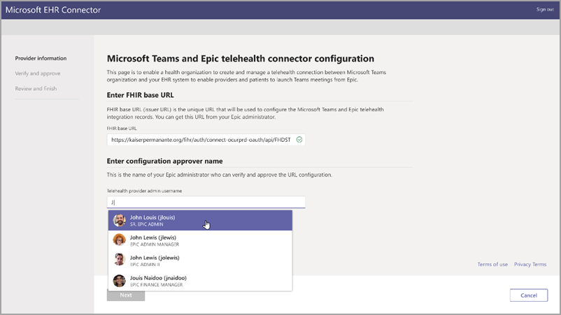
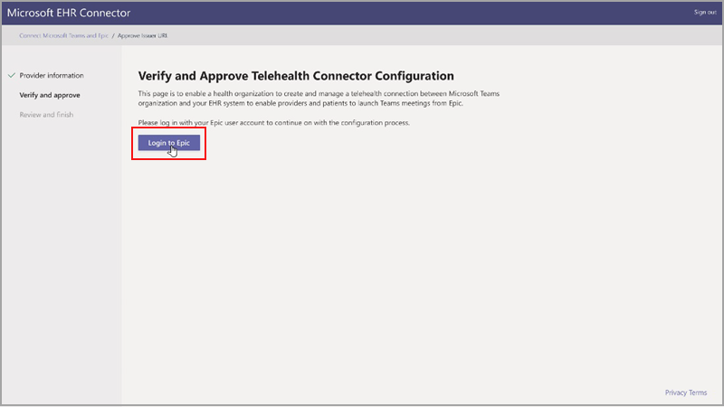
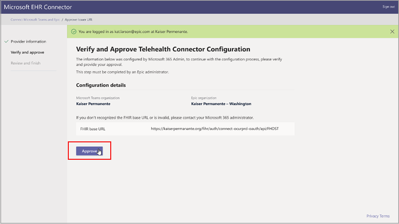
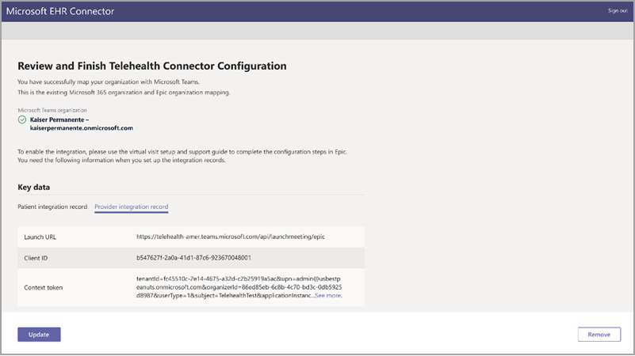
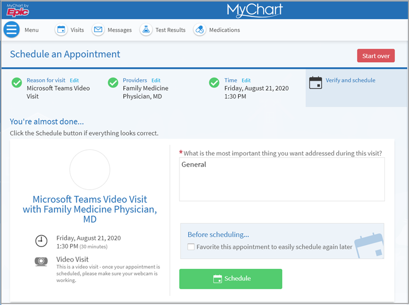
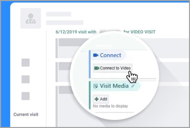
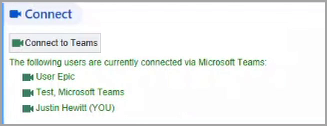

# Telehealth and Teams integration with Electronic Healthcare Record admin

Microsoft Teams Electronic Healthcare Record (EHR) connector makes it easy for clinicians to launch a virtual patient visit or consultation with another provider in Teams electronically. The communication and collaboration of Teams makes it easy for clinicians to cut through the clutter of traditionally fragmented systems so they can spend time providing the best possible care. Built on the Microsoft 365 cloud, Teams can help provide advanced security and enables healthcare customers to achieve their HIPAA, HITRUST compliance, and related requirements. The integration lets users:

- Launch Microsoft Teams meetings from both provider and patient portals.

- Write back into EHR metadata on connect and disconnect events to enable automatic auditing and record keeping.

- Integrate into clinician’s existing workflows while using Teams.

This integration supports the following virtual visit use cases in web and mobile:

- Provider to patient

- Provider to provider inside your organization

- Provider to provider between organizations

- Multi-participants appointments

## Integrate Teams with telehealth

### Prerequisites

Before you can set up the Teams and EHR collaboration, you must have:

- Active subscription to Healthcare Cloud \[LINK\] or standalone \[LINK\] subscription model.

- An appropriate supported license, such as Office 365 A3, A5, E3, and E5, as well as Microsoft 365 Business Standard, A3, A5, E3, and E5.

- Microsoft Teams should be adopted and used inside the organization.

- Organizations must have a current integration into Epic.

- Your systems must meet all [Software and browser prerequisites](https://docs.microsoft.com/microsoftteams/hardware-requirements-for-the-teams-app).

### Create mapping

The process to configure your healthcare organization to be able to launch virtual visits with Microsoft Teams starts by launching the EHR Connector that can also be found in the [Epic-Microsoft Teams Telehealth Integration Guide in AppOrchard marketplace](https://apporchard.epic.com/Gallery?id=6153). The Microsoft 365 admin and Epic admin for your organization must complete the information and integration steps in the connector. For Epic configuration steps, contact the Epic resource assigned to your organization

### Map Epic organization

Your Microsoft 365 administrator must receive a valid FHIR base URL and the admin username that will approve the configuration. The Microsoft 365 administrator must launch the connector and sign in to start the configuration process.

- FHIR base URL: is a constant address that all FHIR API endpoints for the server's default FHIR version live under. (QUESTION. What is FHIR and do we have an example of the URL?)

- Configuration approver name, which is the name of the Epic system administrator who will be responsible of approving the configuration Overall process

 

### Verify and Approve configuration

The Epic administrator for your healthcare organization that was added as an approver must use the EHR Connector URL \[link\] to sign in using their Microsoft credentials. After successful validation, the user is going to be asked to sign in to Epic to validate the level of access for the user.

 > [!Note]
 > Microsoft 365 admin and Epic admin in your organizations can be the same person. In that case, add your own username as approver in the first step. You will still need to sign in to Epic to validate your access.

After a successful Epic sign-in, the Epic administrator must approve the configuration to create the mapping. If the configuration is not correct, the Microsoft 365 admin will have the ability to modify the original configurations by signing in to the connector again.

### Review and Finish configuration

When the configuration information is approved by the Epic admin, you'll have the opportunity to review the mapping and modify any configuration if needed.

When the configuration mapping is correctly approved, you'll see key data elements that you'll need to complete the telehealth configuration in Epic.

 > [!Note]
 > Download and read the Epic-Microsoft Teams Telehealth Integration Guide found in AppOrchard for configuration steps.

### Launching Teams virtual visits

After completing the EHR connector and Epic configurations, your organization is now ready to support video visits with Microsoft Teams. DON'T UNDERSTAND HOW SOLUTION IS EMBEDDED.The solution is embedded in the patient and provider flows in their respective Epic portal, reducing the learning curve for users.

**Prerequisites**

Prior to your first video visit with a patient or colleague, you need to verify the following:

- Healthcare organization must have completed the mapping between the organization and Microsoft Teams.

- Meeting must have been schedule by either the healthcare provider in any of the provider portals (Hyperspace, Haiku, Canto) or the patient in the MyChart portal.

**Patient Experience**

In MyChart, patients will be able to schedule appointments as they regularly do. Patients must select Microsoft virtual visit during the scheduling. When it's time for the scheduled appointment, the patient can launch a virtual visit from MyChart.

Key features of the patient experience includes:

- Patients aren't required to create a Microsoft account or signin to launch a virtual visit.

- Patients are not required to download Microsoft Teams to launch a virtual visit.

- Virtual visits are supported in a browser. For a list of supported software and browsers, see the following link [Software and browser prerequisites](https://docs.microsoft.com/microsoftteams/hardware-requirements-for-the-teams-app).

- Patients will be placed in a lobby until the healthcare provider joins the appointment and allow them access to the virtual visit.

- Testing of the video and microphone is allowed before joining the virtual visit.

**Provider Experience**

Healthcare provider from your organization can also join virtual visits with Microsoft Teams from their portal (Hyperspace, Haiku, Canto). The **Begin virtual visit** button is embedded in the provider flow where patient information is displayed.

Key features of the provider experience:

- Providers can join virtual visits using supported browsers or the Microsoft Teams web application.

- Providers must perform a one-time signin to their Microsoft account when joining a virtual visit.

- After the one-time signin, the provider will be taken straight to the virtual appointment.

- Providers have the option to **End call** for all participants in the virtual appointment.

A very important feature supported by the integration is the real-time updates in the provider portal of connect and disconnect of participants for a given appointment. That way, the provider can join the virtual visit only when the patient is ready to take the consultation.

## Privacy and Location of Data

Teams integration into EHR systems optimized the process to reduce the amount of data being used and stored during integration and virtual visit flows. The solution follows the overall Teams privacy and data management principles and guidelines outlined in [Teams Privacy](https://docs.microsoft.com/microsoftteams/teams-privacy).

Throughout the integration into EHR systems, Microsoft doesn't store any identifiable personal data of patients or healthcare providers. Medical data isn't transferred or stored by any Microsoft service. For the service to work effectively, the only data that is stored by Microsoft is the healthcare provider’s Epic identifier which is used to map providers to meeting links.

Sign-in and authentication actions are handled by each EHR system. The provider's EHR identifier is stored in one of the three geographic regions: Asia Pacific, Americas and Europe, and Middle East Asia.

## Related topics

[Get started with Teams for healthcare organizations](../../expand-teams-across-your-org/healthcare/teams-in-hc)

[Microsoft Teams HIPAA Compliance](https://www.microsoft.com/microsoft-365/blog/wp-content/uploads/sites/2/2019/04/HIPAA-Compliance-Microsoft-Office-365-and-Microsoft-Teams.pdf)
