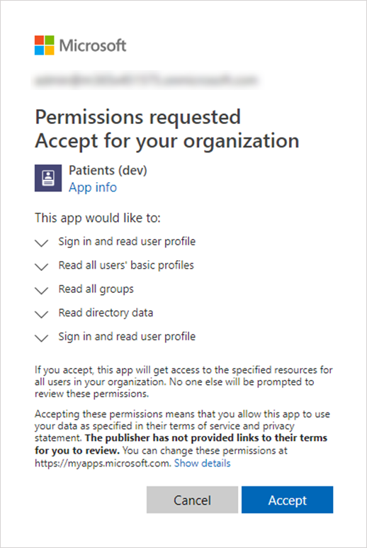
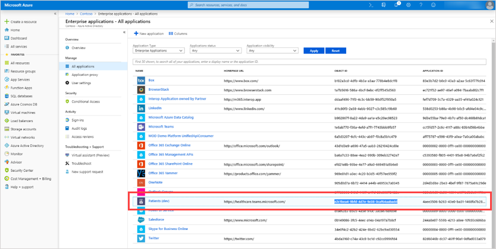
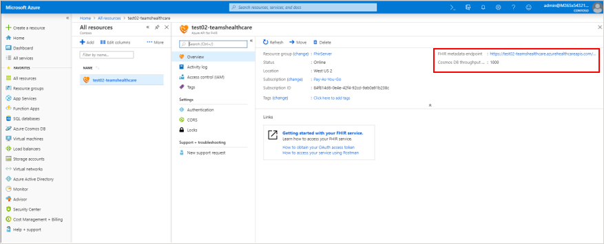
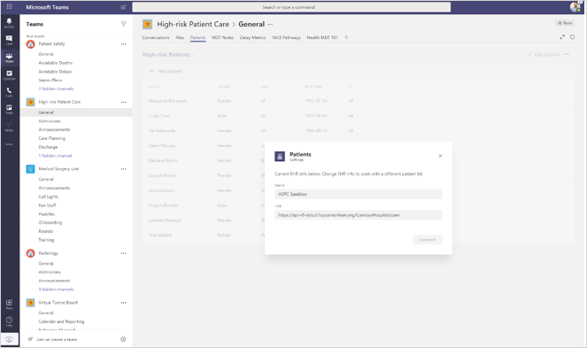

# Connect the Patients app to Azure API for FHIR

> [!NOTE]
> Effective October 30, 2020, the Patients app has been retired and replaced by the [Lists app](https://support.microsoft.com/office/get-started-with-lists-in-teams-c971e46b-b36c-491b-9c35-efeddd0297db) in Teams. Patients app data is stored in the group mailbox of the Office 365 group that backs the team. All data associated with the Patients app is retained in this group but can no longer be accessed through the user interface. Users can re-create their lists using the [Lists app](https://support.microsoft.com/office/get-started-with-lists-in-teams-c971e46b-b36c-491b-9c35-efeddd0297db).
>
>With Lists, care teams in your healthcare organization can create patient lists for scenarios ranging from rounds and interdisciplinary team meetings to general patient monitoring. Check out the Patients template in Lists to get started. To learn more about how to manage the Lists app in your organization, see [Manage the Lists app](../../manage-lists-app.md).

Follow these steps to allow the Patients app in Microsoft Teams access to an Azure API for FHIR instance. This article assumes that you have an [Azure API for FHIR instance](https://azure.microsoft.com/services/azure-api-for-fhir/) set up and configured in your tenant.  If you haven’t yet created an Azure API for FHIR instance in your tenant, see [Quickstart: Deploy Azure API for FHIR using Azure portal](https://docs.microsoft.com/azure/healthcare-apis/fhir-paas-portal-quickstart).

1. Click [here](https://login.microsoftonline.com/common/adminConsent?client_id=4aee3506-b263-43e0-ba31-1468fa7b2806) to grant admin consent for the Patients app. When prompted, sign in using your tenant admin or global admin credentials, and then click **Accept** to grant the required permissions.

    

    After you accept, close the window. You'll see a page that may look like this. You can ignore the error message on the page. It's harmless and indicates that consent is granted. (We're working on a more user-friendly page for this URL. Stay tuned!)

    

2. Sign in to the [Azure portal](https://portal.azure.com) with your admin credentials.

3. In the left navigation, select **Azure Active Directory**, and then select **Enterprise Applications**.

    Look for a row named **Patients (dev)**, and then copy the value in the **Object ID** column to your clipboard.

    

4. Go to the Azure API for FHIR resource instance to which you want to connect the Patients app (either by searching for it or by browsing through your resources), and then open the settings for that instance.

    

5. Click **Authentication**, and then paste the object ID that you copied in step 3 to the **Allowed object IDs** box. This allows the Patients app to access the FHIR server. After you paste the object ID, Azure Active Directory validates it, and a green check mark appears next to it.

    

6. Click **Save**. This redeploys the instance, which can take a few minutes.

7. Click **Overview**, and then copy the URL from **FHIR metadata endpoint**. Remove the metadata tag to get the FHIR server URL. For example, `https://test02-teamshealth.azurehealthcareapis.com/`.

    

8. In Teams, go to the Patients app instance that's loaded in your team, click **Settings**, and then in the **Link** box, enter the FHIR server endpoint URL. Then, click **Connect** to establish a connection and search and add patients to your list.  

    

    If you get an error when connecting to Teams during this step, send a detailed screenshot of the error, logs from [Fiddler](https://www.telerik.com/download/fiddler) and any other repro steps in an email with a subject line of “Patients App – EMR mode troubleshooting” to [teamsforhealthcare@service.microsoft.com](mailto:teamsforhealthcare@service.microsoft.com).

## Related topics

- [Patients app overview](patients-app-overview.md)
- [Integrating Electronic Healthcare Records into Microsoft Teams](patients-app.md)
