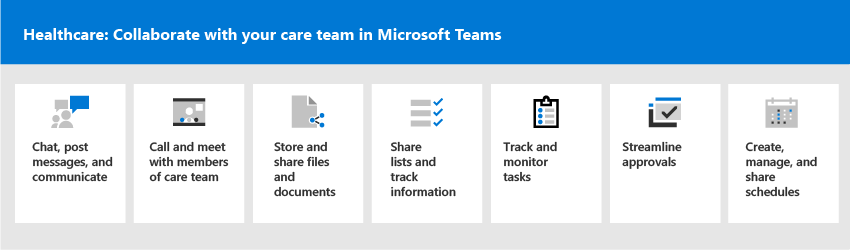

# Get started with Teams for Healthcare organizations

Microsoft Teams offers a number of features useful for hospitals and other Healthcare organizations, including:

- Virtual visits and Electronic Healthcare Record (EHR) integration
- Teams policy packages
- Secure messaging
- Teams templates
- Care coordination and collaboration

The content in this section assumes that you've already deployed Teams in your organization. If you haven't yet rolled out Teams, start by reading [How to roll out Microsoft Teams](../../How-to-roll-out-teams.md).

## Virtual visits and Electronic Healthcare Record (EHR) integration

Use the complete meetings platform in Microsoft Teams to schedule, manage, and conduct virtual visits with patients.

- If your organization already uses Electronic Health Records, or EHR, you can integrate Microsoft Teams for a more seamless experience. Microsoft Teams Electronic Health Record (EHR) Connector makes it easy for clinicians to launch a virtual patient visit or consultation with another provider in Teams directly from the EHR system. To learn more, see [Virtual visits with Teams - Integration into EHR](ehr-admin.md).
- If you aren't using a support EHR, you can use Microsoft Bookings and the Bookings app in Teams. To learn more, see [Bookings app and virtual visits in Microsoft Teams](../../bookings-app-admin.md).

## Teams policy packages

Apply Teams policy packages to define what different roles can do in Teams. For example, specify policies for:

- Clinical workers, such as registered nurses, charge nurses, physicians, and social workers, so that they can have full access to chat, calling, shift management, and meetings.
- Information workers in your healthcare organization, such as IT personnel, informatics staff, finance personnel, and compliance officers, can have full access to chat, calling, and meetings.
- Patient rooms, to control settings for patient room devices.

To learn more, see [Teams policy packages for healthcare](../../policy-packages-healthcare.md).

## Secure messaging

Secure messaging supports collaboration within care teams, including several new features:

- A message sender can set a special priority for their message, so the recipient is repeatedly notified until they read the message.
- A message sender can request a read receipt, so they are notified when a message they sent was read by the message recipient.

Together, these features allow quicker attention to urgent messages and confidence that the message was received and read. New care teams using these features can be created on a per-patient basis. These features are policy-based, and can be assigned to individuals or entire Teams.

See [Get started with Secure Messaging policies for Healthcare organizations](messaging-policies-hc.md) for further details.

Also related to secure messaging is the ability to have other tenants federated by Healthcare organizations, allowing richer inter-tenant communication. (See [Manage external access (federation) in Microsoft Teams](../../manage-external-access.md)).

## Teams templates for healthcare organizations

New templates for creating Teams were developed to apply to a Hospital setting, and more are expected soon. This makes it easier to create teams that Healthcare workers use to coordinate care for patients in various departments or wards. See [Get started with Teams templates for Healthcare organizations](healthcare-templates.md). Teams can be started for internal departments such as cardiology, or for care wards, and more templates are in development.

## Care coordination and collaboration

Bring your care team together to coordinate care and collaborate with Microsoft Teams.

Microsoft Teams enables physicians, clinicians, nurses, and other staff to collaborate efficiently with included collaboration features in Microsoft Teams, such as:

- Set up teams and channels for your care teams and information workers. Use channels with tabs as a way to structure their work, with additional help from tabs to which they can pin information sources.
- Chat, post messages, and communicate. Your team can have persistent conversations about different patients needing attention.
- Call and meet with members of the care team. Set up individual meetings, or use channel meetings to manage daily meetings, both with the power of Teams audio, video, screen sharing, recording, and transcription features.
- Store and share files and documents. Your care team is part of a single virtualized team that works and collaborates on Office documents.

In addition, your team can use apps in Teams to:

- Share lists and track information with the Lists app
- Track and monitor tasks with the Tasks app
- Streamline approvals with the Approvals app
- Create, manage, and share schedules with the Shifts app

### Share lists and track information with the Lists app

The Lists app in Teams helps teams track information and organize work. The app is pre-installed for all Teams users and is available as a tab in every team and channel. Lists can be created from scratch, from predefined templates, or by importing data to Excel.

Care teams can use the Patients template to get started. They can create lists to track the needs and status of patients. Existing patient data on Excel spreadsheets can be brought in to create a list in Teams. These lists can be used for scenarios such as rounds and patient monitoring to coordinate care.

For example, a charge nurse creates a patient list in a team that includes all care team members. During rounds, the care team access Teams on their mobile devices and update patient information in the list, which everyone on the team can view to stay in sync. At rounding sessions where the care team gathers to discuss and evaluate key health performance metrics to ensure a patient is on the right glide path to discharge, they can share this information using Teams on a large display screen. Care team members who aren't on site can join remotely.

Here's an example list which was set up for patient rounding.

:::image type="content" source="../../media/lists-patients-example.png" alt-text="Screenshot of example list for patient rounding":::

To learn more, see [Manage the Lists app for your organization in Teams](../../manage-lists-app.md).

### Track and monitor tasks with the Tasks app

Use [Tasks](https://support.microsoft.com/office/use-the-tasks-app-in-teams-e32639f3-2e07-4b62-9a8c-fd706c12c070) in Teams to track to do items for your whole care team. You care team can create, assign, and schedule tasks, categorize tasks, and update status at any time, from any device running Teams.

To learn more, see [Manage the Tasks app for your organization in Microsoft Teams](../../manage-tasks-app.md)

### Streamline approvals with the Approvals app

Use [Approvals](https://support.microsoft.com/office/what-is-approvals-a9a01c95-e0bf-4d20-9ada-f7be3fc283d3) to streamline all of your requests and processes with your team. Create, manage, and share approvals directly from your hub for teamwork. Start an approval flow from the same place you send a chat, in a channel conversation, or from the Approvals app itself. Just select an approval type, add details, attach files, and choose approvers. Once submitted, approvers are notified and can review and act on the request.

You can allow the Approvals app for your organization and add it to your teams. To learn more about managing apps, see [Manage your apps in the Microsoft Teams admin center](../../manage-apps.md).

### Create, manage, and share schedules with the Shifts app and Firstline Worker integration

Microsoft Teams integrates with the Shifts app and Firstline Worker, which can be used to coordinate shift staffing features and more. For example, in Shifts, Nurse managers can set up and coordinate schedules for their staff, and nurses can check schedules and swap shifts. Teams includes a built-in Firstline Worker app setup policy that you can assign to Firstline Workers in your organization. By default, the policy includes the Activity, Shifts, Chat, and Calling apps. This policy controls behavior for these apps, for example, pinning the Shifts app to the app bar so the team can quickly access it.

To learn more, see [Manage the Shifts app for your organization in Microsoft Teams](../shifts/manage-the-shifts-app-for-your-organization-in-teams.md).
