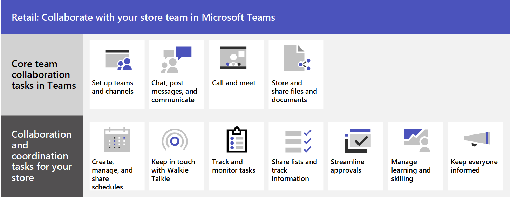

# Retail team collaboration

Bring in-store associates and management together to collaborate and streamline operations with Microsoft Teams and Teams apps.

Microsoft Teams enables in-store sales associates, managers, and other staff to collaborate efficiently with included collaboration features in Microsoft Teams, such as:

- Set up teams and channels for your store teams and managers. Use channels with tabs to share news, keep employees in touch across shifts, and build community.
- Chat, post messages, and communicate. Your in-store associates can seamlessly communicate across departments to fulfill orders, get help for customers, and manage stock needs.
- Call and meet with team members. Managers can set up individual meetings, or use channel meetings to manage daily meetings, both with the power of Teams audio, video, screen sharing, recording, and transcription features. For example, a manager could set up a morning video meeting with store associates in different departments to check their status before opening the store.
- Store and share files and documents. Sharing files allows in-store staff to easily access information such as merchandising diagrams without having to leave the sales floor or get help from a manager.

In addition, your team can use apps in Teams to:

- Create, manage, and share schedules with the Shifts app.
- Keep in touch with Walkie Talkie
- Track and monitor tasks with the Tasks app.
- Share lists and track information with the Lists app.
- Streamline approvals with the Approvals app.
- Manage learning and skilling with Viva Learning.
- Keep everyone informed with Bulletins.

[Learn how to manage apps in the Microsoft Teams admin center](/microsoftteams/manage-apps)

## Teams templates and apps

The easiest way to create a team for collaboration in Teams is to start with a template. The [Organize a store and Retail for managers templates](/microsoftteams/get-started-with-retail-teams-templates) are pre-made templates that include channels and apps designed for retail. You can also create a template based off a previously created team. Even when you start with a template, you can customize the team and channels, and add additional apps to suit your team's needs.

### Create a team based on a template

1. In Microsoft Teams, select **Join or create a team**

2. Select **Create a team** and then scroll down to see available templates.

## Create, manage and share schedules with the Shifts app

Use [Shifts](/microsoftteams/expand-teams-across-your-org/shifts/manage-the-shifts-app-for-your-organization-in-teams) to seamlessly manage and share schedules. Managers can create custom groups such as cashiers or greeters, assign shifts to employees, add custom labeling and breaks, and add open shifts that employees can request to take. Employees can use Shifts to set their availability, view their schedules, swap shifts with coworkers, and clock in and out.

[View Shifts video training](https://support.microsoft.com/office/what-is-shifts-f8efe6e4-ddb3-4d23-b81b-bb812296b821)

## Keep in touch with Walkie Talkie

The Walkie Talkie app provides instant push-to-talk communication. By using Walkie Talkie, employees and managers can communicate from anywhere in the store. For example, if a customer on one side of the store asks an employee if an item is in stock on the other side of the store, the employee can use Walkie Talkie to contact someone who works near the item. Because Walkie Talkie doesn’t have limited range, employees can also easily consult with experts in other stores or corporate offices.

[View video training for Walkie Talkie](https://support.microsoft.com/office/use-walkie-talkie-in-teams-884a008a-761e-4b62-99f8-15671d9a2f69?wt.mc_id=otc_microsoft_teams&ui=en-US&rs=en-US&ad=US)

## Track and monitor tasks with the Tasks app

Use [Tasks](https://support.microsoft.com/office/use-the-tasks-app-in-teams-e32639f3-2e07-4b62-9a8c-fd706c12c070) in Teams to track to-do items for your whole retail team. Store managers and employees can create, assign, and schedule tasks, categorize tasks, and update status at any time from any device running Teams. IT pros and admins can also publish tasks to specific teams for your organization. For example, you could publish a set of tasks for daily cleaning or steps to set up a new display.

To learn more, see [Manage the Tasks app for your organization in Microsoft Teams](/microsoftteams/manage-tasks-app).

[View video training for Tasks](https://support.microsoft.com/office/use-the-tasks-app-in-teams-e32639f3-2e07-4b62-9a8c-fd706c12c070)

## Boost morale with Praise

The Praise app allows management and in-store associates to congratulate each other and share appreciation by sending pre-made or custom badges. Praise helps employees feel recognized for achievements such as making sales goals and going above and beyond to help customers.

[View video training for Praise](https://support.microsoft.com/office/communication-and-praise-7d37ef80-542b-42e5-aa01-0fabbaa634b6)

## Share lists and track information with the Lists app

With Lists, store managers and staff can create lists for scenarios ranging from daily cleaning priorities to monitoring the success of displays.

The Lists app in Teams helps teams track information and organize work. The app is pre-installed for all Teams users and is available as a tab in every team and channel. Lists can be created from scratch, from predefined templates, or by importing data to Excel.

Retail teams can use lists such as the employee onboarding list to get started. You can create lists to track things such as inventory, sales of specific items, and customer requests. You can bring in existing sales data from Excel to create a list in Teams.

To learn more, see [Manage the Lists app for your organization in Teams.](/microsoftteams/manage-lists-app)

## Streamline approvals with the Approvals app

Use [Approvals](https://support.microsoft.com/office/what-is-approvals-a9a01c95-e0bf-4d20-9ada-f7be3fc283d3) to streamline requests and processes with your team. Create, manage, and share approvals directly from your hub for teamwork. Start an approval flow from the same place you send a chat, in a channel conversation, or from the Approvals app itself. Just select an approval type, add details, attach files, and choose approvers. Once submitted, approvers are notified and can review and act on the request.

You can allow the Approvals app for your organization and add it to Teams. To learn more, see [Teams Approvals app availability](/microsoftteams/approval-admin).

[View Approvals video training](https://support.microsoft.com/office/what-is-approvals-a9a01c95-e0bf-4d20-9ada-f7be3fc283d3?wt.mc_id=otc_microsoft_teams)

## Manage learning and skilling with Viva Learning

Use the Viva Learning app to manage learning and skilling on your team. Managers can assign learning content to individual users or groups to make sure that everyone has the skills they need. Team members can also browse learning content to find courses relevant to their interests. To learn more, see [Overview of Microsoft Viva Learning (Preview)](/microsoft-365/learning/overview-viva-learning?view=o365-worldwide).

## Keep everyone informed with Bulletins

The Bulletins app in Microsoft Teams is a central location for all company communication, such as memos, broadcasts, and news. The Bulletins app displays bulletins, FAQs, links, and contacts created in the [Manage bulletins](/powerapps/teams/bulletins#manage-bulletins-app) app. The app allows managers to make posts so team members have easy access to any relevant company communications.
