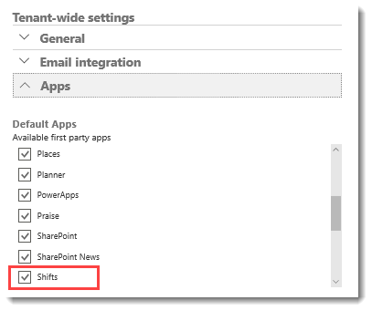
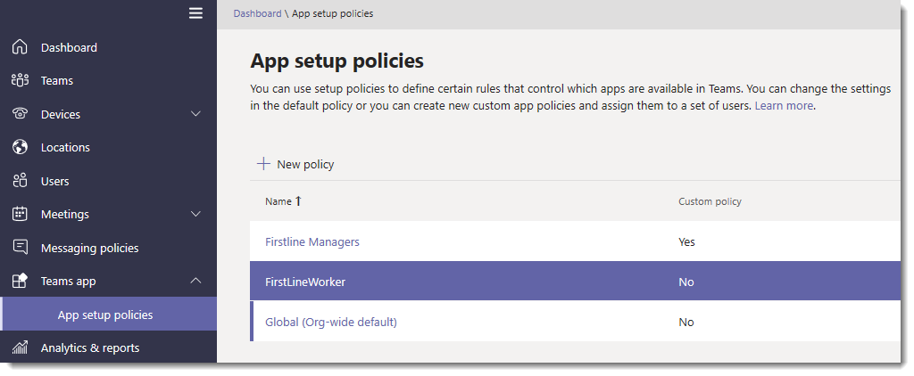

# Manage the Shifts app for your organization in Microsoft Teams

> [!IMPORTANT]
> Effective October 1, 2019, Microsoft StaffHub will be retired. We’re building StaffHub capabilities into Microsoft Teams. Today, Teams includes the Shifts app for schedule management and additional capabilities will roll out over time. StaffHub will stop working for all users on October 1, 2019. Anyone who tries to open StaffHub will be shown a message directing them to download Teams. To learn more, see [Microsoft StaffHub to be retired](microsoft-staffhub-to-be-retired.md).  

## Overview of Shifts
The Shifts app in Microsoft Teams keeps Firstline Workers connected and in sync. It's built mobile first for fast and effective time management and communication for teams. Shifts lets Firstline Workers and their managers use their mobile devices to manage schedules and keep in touch. 

- Managers create, update, and manage shift schedules for teams. They can send messages to one person ("there's a spill on the floor") or the entire team ("the regional GM is arriving in 20 minutes"). They can also send policy documents, news bulletins, and videos. 
- Employees view their upcoming shifts, can see who else is scheduled for the day, request to swap or offer a shift, and request time off. 

It's important to know that Shifts currently doesn't support guest users. This means that guests on a team can't be added to or use shift schedules when Guest access is turned on in Teams. 

## Availability of Shifts

Shifts is available in all Office 365 subscriptions that include Teams, with a couple of exceptions. The exceptions are US Government Cloud Community (GCC) and Teams free. Shifts isn't available in Office 365 US Government or Teams free offerings.

To learn more about licensing for Teams, including a list of Office 365 subscriptions that includes Teams, see [Office 365 licensing for Teams](../../Office-365-licensing.md).

## Location of Shifts data

Shifts data is currently stored in Azure in data centers in North America, Western Europe, and Asia Pacific. For more information about where data is stored, see [Where is my data](http://o365datacentermap.azurewebsites.net/)?

## Set up Shifts

### Enable or disable Shifts in your organization

Shifts is enabled by default for all Teams users in your organization. You can turn off or turn on the app for your organization in the Microsoft 365 admin center.

1. Sign in to the Microsoft 365 admin center with your Office 365 admin account.
2. Go to **Settings** > **Services & add-ins** > **Microsoft Teams**. 
3. Under **Tenant-wide settings**, select **Apps**, and then under **Default Apps**, clear or select the **Shifts** check box to turn off or turn on the app. 

    

### Use the Firstline Worker app setup policy to pin Shifts to Teams

> [!INCLUDE [Preview customer token](../../includes/preview-feature.md)]

App setup policies let you customize Teams to highlight the apps that are most important for users in your organization. The apps set in a policy are pinned to the app bar&mdash;the bar on the side of the Teams desktop client and at the bottom of the Teams mobile clients&mdash;where users can quickly and easily access them. 
 
Teams includes a built-in Firstline Worker app setup policy that you can assign to Firstline Workers in your organization. By default, the policy includes the Activity, Shifts, Chat, and Calling apps. 

To view the Firstline Worker policy, in the left navigation of the Microsoft Teams admin center, go to **Teams app** > **App setup policies**.



#### Assign the Firstline Worker policy to individual users

1. In the left navigation of the Microsoft Teams admin center, go to **Users**, and then click the user.
2. Next to **Assigned policies**, choose **Edit**.
3. Under **Teams App Setup policy**, select **FirstlineWorker**, and then choose **Save**.

#### Assign the Firstline Worker app setup policy to users in a group

You can assign the Firstline Worker app setup policy to users in a group, such as a security group, by connecting to the Azure Active Directory PowerShell for Graph module and the Skype for Business PowerShell module. For more information about using PowerShell to manage Teams, see [Teams PowerShell Overview](../../teams-powershell-overview.md).

In this example, we assign the Firstline Worker app setup policy to all users in the Contoso Firstline Team group.

> [!NOTE]
> Make sure you first connect to the Azure Active Directory PowerShell for Graph module and Skype for Business PowerShell module by following the steps in [Connect to all Office 365 services in a single Windows PowerShell window](https://docs.microsoft.com/office365/enterprise/powershell/connect-to-all-office-365-services-in-a-single-windows-powershell-window).

Get the GroupObjectId of the particular group.
```
$group = Get-AzureADGroup -SearchString "Contoso Firstline Team"
```
Get the members of the specified group.
```
$members = Get-AzureADGroupMember -ObjectId $group.ObjectId -All $true | Where-Object {$_.ObjectType -eq "User"}
```
Assign all users in the group to the FirstlineWorker app setup policy.
```
$members | ForEach-Object { Grant-CsTeamsAppSetupPolicy -PolicyName "FirstlineWorker" -Identity $_.EmailAddress}
``` 
Depending on the number of members in the group, this command may take several minutes to execute.

## Related topics
- [Shifts Help for Firstline Workers](https://support.office.com/article/apps-and-services-cc1fba57-9900-4634-8306-2360a40c665b)
