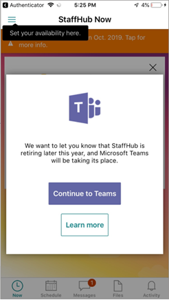

# Move your Microsoft StaffHub teams to Shifts in Microsoft Teams

> [!IMPORTANT]
> Effective October 1, 2019, Microsoft StaffHub will be retired. We’re building StaffHub capabilities into Microsoft Teams. Today, Teams includes the Shifts app for schedule management and additional capabilities will roll out over time. StaffHub will stop working for all users on October 1, 2019. Anyone who tries to open StaffHub will be shown a message directing them to download Teams. To learn more, see [Microsoft StaffHub to be retired](microsoft-staffhub-to-be-retired.md).

> The capability discussed in this article hasn't yet been released. It's been announced, and is coming soon, in early June 2019. If you're an admin, you can find out when this will be available in the Message Center (in the [Microsoft 365 admin center](https://portal.office.com/adminportal/home)).

The Shifts app in Teams provides a simple approach to managing schedules and the constant flow of shift swaps and cancellations that occur on a daily basis. Team members can access their schedule and shift information directly in the app and across their devices to set their preferences, manage their schedules, and request time off.

This article walks you through how to move your organization’s StaffHub teams and schedule data to Shifts in Teams. It covers:

- [What you need to know about the move to Teams](#what-you-need-to-know-about-the-move-to-teams)
- [Prepare for the move to Teams](#prepare)
- [Run a pilot to move a few StaffHub teams](#run-a-pilot) 
- [Move all your StaffHub teams](#make-the-transition-from-staffhub-to-teams)
- [Monitor Teams usage](#monitor-teams-usage)

Whether you’re a small business with one or two StaffHub teams or a large enterprise with hundreds of StaffHub teams, here you’ll find the admin guidance you need to help make your transition to Teams successful.

You must be a global admin to perform the steps in this article. If you haven't already done so, have a look through the [StaffHub retirement FAQ](microsoft-staffhub-to-be-retired.md) to get answers to any questions you may have.

## What you need to know about the move to Teams

### When to move to Teams

Effective October 1, 2019, StaffHub will be retired. We encourage you to start using Teams today and begin to transition your organization's teams and users from StaffHub. With schedule management being the most commonly-used feature in StaffHub, we recommend you use the Shifts app in Teams moving forward.

### What is moved to Teams

User details, schedule information, and chat and file data are transitioned to Teams. This includes team membership, team schedules, and chats and files from the last 90 days.

Every StaffHub team needs a corresponding Office 365 Group. If a StaffHub team doesn't have an Office 365 Group associated with it, one is automatically created for you to support the transition. Given the difference in team and group naming between Teams and StaffHub, you may see a different team name in Teams.

As you transition teams from StaffHub to Teams, users will no longer have access to their schedules in StaffHub and are redirected to Shifts in Teams. We recommend you communicate this change across your organization to minimize disruption and to encourage users to adopt and explore Teams. If you have Azure AD Premium, you can [run a report](run-report-to-show-staffhub-usage.md) to get a list of StaffHub users in your organization who need to know about this change.  

There's no rollback option after you move a StaffHub team to Teams.

### User experience when you move a team

There's minimal downtime (less than a second, if any at all) for users when their team is switched from StaffHub to Shifts in Teams. Users can continue using StaffHub until the move to Teams is completed. When the move is completed, team members will see a message to let them know that they need to start using Shifts in Teams to access their team schedule. Here's an example of the message that users see in StaffHub after the StaffHub team is moved to Teams.



## Prepare

Here's how to prepare for the move to Teams. We recommend you 

### Check that prerequisites are met

Before you move a StaffHub team to Teams, make sure that:

- The signed-in user is a global admin.
- Teams is enabled for all users in the tenant.
- Office 365 Groups creation is enabled in the tenant.
- The StaffHub teamId is valid.
- The StaffHub team contains members. 
- All StaffHub team members are linked to an Azure AD account. 

If these prerequisites aren't met, the move request will fail. 

### Assign Teams licenses

Each user must have an active Microsoft 365 or Office 365 license from [an eligible plan ](microsoft-staffhub-to-be-retired.md#which-plans-is-shifts-available-in) and must be assigned a Teams license. Assigning a Teams license to users gives them access to Teams.

You manage Teams licenses in the Microsoft 365 admin center. To learn more, see [Manage user access to Teams](../../user-access.md).

> [!NOTE]
> If your organization uses Skype for Business and you’re not ready to move all your users to Teams, you can enable Teams for your Firstline Workers who can then run Teams alongside Skype for Business. In this coexistence mode, called *Islands*, each client app operates as a separate solution. To learn more, see [Understand Teams and Skype for Business coexistence and interoperability](../../teams-and-skypeforbusiness-coexistence-and-interoperability.md).

### Provision accounts for StaffHub users who don't have an identity in Azure AD

Each manager and team member must have an identity in Azure Active Directory (Azure AD). If a user doesn't already have an identity in Azure AD, provision an account for them by doing one of the following.

#### Convert and link the account to a provisioned account

StaffHub team owners and managers can convert a dummy or inactive account and link it to a provisioned account in StaffHub by changing the user's email address to a valid UPN on the StaffHub team settings page.

#### Remove the non-provisioned account and then re-add the account by using the UPN

1. Run the [Remove-StaffHubUser](https://docs.microsoft.com/powershell/module/staffhub/Remove-StaffHubUser?view=staffhub-ps) cmdlet to remove the non-provisioned account from the StaffHub team.
2. Run the [Add-StaffHubMember](https://docs.microsoft.com/powershell/module/staffhub/add-staffhubmember?view=staffhub-ps) cmdlet to add the account back to the StaffHub team by using the UPN.

### Install the StaffHub PowerShell module

If you haven't already, [install the StaffHub PowerShell module](install-the-staffhub-powershell-module.md).

### Assign the Firstline Worker app setup policy to users

Teams includes a built-in Firstline Worker app setup policy that you use to customize Teams for the Firstline Workers in your organization. By default, the policy includes the Activity, Shifts, Chat, and Calling apps. When you assign this policy to users, these apps are pinned to the app bar in Teams for quick and easy access. 

To learn more, see [Use the Firstline Worker app setup policy to pin Shifts to Teams](manage-the-shifts-app-for-your-organization-in-teams.md#use-the-firstline-worker-app-setup-policy-to-pin-shifts-to-teams).

### Onboard users to Teams

For guidance on deploying Teams and driving Teams adoption, see [How to roll out Teams](../../How-to-roll-out-teams.md).

To onboard your users on Teams, use the following resources to get Teams clients, training, and support:

- [Teams web client](https://teams.microsoft.com)
- [Desktop and mobile client download links](https://teams.microsoft.com/downloads)
- [Teams training videos](https://support.office.com/article/microsoft-teams-video-training-4f108e54-240b-4351-8084-b1089f0d21d7)
- [Teams Help documentation](https://support.office.com/teams)

## Run a pilot

We recommend you start by moving two or three StaffHub teams for a select group of early adopters. Running a pilot helps you refine your transition plan and ensure you're ready to move all your organization's StaffHub teams to Teams. It also identifies champions who can help drive adoption across your organization. If you're a small business who doesn't need a phased approach, the steps in this section may be all you need to make the switch from StaffHub to Teams.

### Identify pilot teams

Reach out to identify two or three pilot teams. All team members should commit to using Shifts in Teams to manage their schedules and communicate and collaborate with each other.

### Identify team champions

Identify champions across pilot teams and enlist them to help evangelize Shifts. Team champions are passionate about what they do, sharing their own learnings to offer support and guidance to team members. Team champions can be team owners or managers.

Team champions should ensure team members are set up by dedicating time for everyone to [get Teams clients](../../get-clients.md), sign in to Teams and check out their schedules in Shifts, and start chatting with each other. Users who are already familiar with StaffHub will be up and running quickly in Shifts. You can also point them to [Shifts Help](https://support.office.com/article/apps-and-services-cc1fba57-9900-4634-8306-2360a40c665b) for additional help.

### Move a StaffHub team (coming soon)

Use these steps to move one StaffHub team at a time. We recommend this approach for your pilot teams. Later, when you're ready to move all your organization's StaffHub teams, see [Move your StaffHub teams](#move-your-staffhub-teams-coming-soon) for steps on how move multiple teams at a time.

Run the following to move a StaffHub team.

```
Move-StaffHubTeam -TeamId <String>

Sample:

Move-StaffHubTeam -TeamId "TEAM_4bbc03af-c764-497f-a8a5-1c0708475e5f"
```

Here's an example of the response you get when you submit a request to move a StaffHub team to Teams.

```
    jobId                                      teamId                                      teamAlreadyInMicrosofteams  
    ---------------------------------------    ----------------------------------------    ---------------------------          
    JOB_81b1f191-3e19-45ce-ab32-3ef51f100000   TEAM_4bbc03af-c764-497f-a8a5-1c0708475e5f   false
```

To check the status of a move request, run the following.

```
Get-TeamMigrationJobStatus <String>

Sample:
Get-TeamMigrationJobStatus -JobId "JOB_81b1f191-3e19-45ce-ab32-3ef51f100000"

```

Here's an example of the response you get when a move is in progress.

```
    jobId                                     status       teamId                                     isO365GroupCreated  Error
    ----------------------------------------  ----------   ----------------------------------------   ------------------  -----    
    JOB_81b1f191-3e19-45ce-ab32-3ef51f100000  inProgress   TEAM_4bbc03af-c764-497f-a8a5-1c0708475e5f  true                none
```

## Make the transition from StaffHub to Teams

### Raise awareness

When you're ready to go beyond your pilot teams and move your organization's StaffHub teams to Teams, it's important to first communicate the change across your organization. Spread the word about Shifts and the transition to Teams to raise awareness, generate excitement, and drive adoption.

### Move your StaffHub teams (coming soon)

Use these steps to move StaffHub teams in bulk. You can choose to move all your organization's StaffHub teams or move specific StaffHub teams. If you want to move StaffHub teams one at a time, see [Move a StaffHub team](#move-a-staffhub-team-coming-soon).

#### Move all StaffHub teams (coming soon)

Run the following to get a list of all StaffHub teams in your organization.

```
$StaffHubTeams = Get-StaffHubTeamsForTenant -ManagedBy "Staffhub"
```

Then, run the following to move all teams.

```
$StaffHubTeams | foreach {Move-StaffHubTeam -TeamId {$_.Id}}
```

Here's an example of the response.

For any team that was already moved to Teams or already exists in Teams, the jobId will be "null" as a job doesn't need to be submitted to move that team.

```
    jobId                                      teamId                                      teamAlreadyInMicrosofteams  
    ----------------------------------------   -----------------------------------------   --------------------------         
    null                                       TEAM_4bbc03af-c764-497f-a8a5-1c0708475e5f   true
    JOB_81b1f191-3e19-45ce-ab32-3ef51f100000   TEAM_81b1f191-3e19-45ce-ab32-3ef51f100000   false
```

#### Move specific StaffHub teams (coming soon)

Run the following to get a list of all StaffHub team Ids in your organization.

```
Get-StaffHubTeamsForTenant -ManagedBy "Staffhub"
```

In the results returned by the `Get-StaffHubteamsForTenant` cmdlet you ran earlier, select the Team Ids you want to move, and then add them to a comma-separated values (CSV) file.

Here's an example of how the CSV file should be formatted.

|Id  |
|---------|
|TEAM_4bbc03af-c764-497f-a8a5-1c0708475e5f<br>TEAM_81b1f191-3e19-45ce-ab32-3ef51f100000<br>TEAM_b42d0fa2-0fc9-408b-85ff-c14a26700000<br>TEAM_b42d0fa2-0fc9-408b-85ff-c14a26700000|

After you create the CSV file, run the following to move the teams you specified in the CSV file.

```
Import-Csv .\teams.txt | foreach {Move-StaffHubTeam -TeamdId {$_.Id}}
```
### Confirm that your StaffHub teams have moved to Teams (coming soon)

Run the following to get a list of all teams in Shifts in your organization. 

```
Get-StaffHubTeamsForTenant -ManagedBy "Teams"
```

## Monitor Teams usage

Usage reports can help you better understand usage patterns and give you insights on where to prioritize training and communication efforts across your organization. Because Shifts is an app in Teams, you can view usage through Teams reports. For more information, see [Teams reporting in the Microsoft Teams admin center](../../teams-analytics-and-reports/teams-reporting-reference.md) and [Teams activity reports in the Microsoft 365 admin center](../../teams-activity-reports.md).

## Related topics
- [How to roll out Microsoft Teams](../../How-to-roll-out-teams.md)
- [Microsoft StaffHub to be retired](microsoft-staffhub-to-be-retired.md)
- [Manage the Shifts app for your organization in Microsoft Teams](manage-the-shifts-app-for-your-organization-in-teams.md)
- [StaffHub PowerShell reference](https://docs.microsoft.com/powershell/module/staffhub/?view=staffhub-ps)
