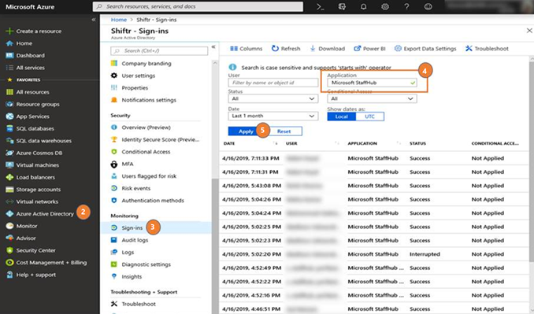

# Run a report to show active StaffHub usage

> [!IMPORTANT]
> Effective October 1, 2019, Microsoft StaffHub will be retired. We’re building StaffHub capabilities into Microsoft Teams. Today, Teams includes the Shifts app for schedule management and additional capabilities will roll out over time. StaffHub will stop working for all users on October 1, 2019. Anyone who tries to open StaffHub will be shown a message directing them to download Teams. To learn more, see [Microsoft StaffHub to be retired](microsoft-staffhub-to-be-retired.md).  

Use the steps in this article to run a report to get a list of active StaffHub users in your organization. This information may come in handy when you prepare to [move your StaffHub teams to Microsoft Teams](move-staffhub-teams-to-shifts-in-teams.md). From the report, you'll know who you need to include in your communications when you make the switch from StaffHub to Teams.

You need to have Azure AD Premium to perform the steps in this article.

1. Sign in to the Azure portal.
2. In the left pane, click the **Azure Active Directory** resource.
3. Under **Monitoring**, click **Sign-ins**.
4. Under **Application**, type **Microsoft StaffHub**.
5. Set the date range that you want for the report, and then click **Apply**. 

    

## Related topics

- [Move your Microsoft StaffHub teams to Shifts in Microsoft Teams](move-staffhub-teams-to-shifts-in-teams.md)
