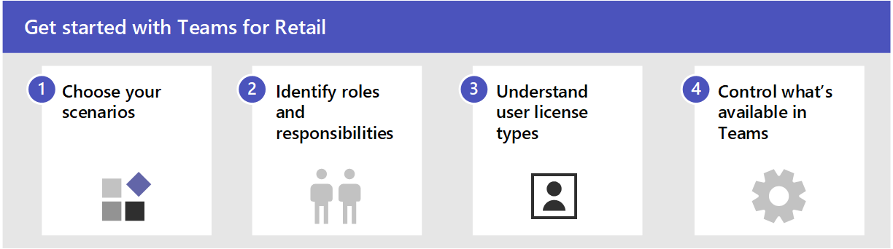
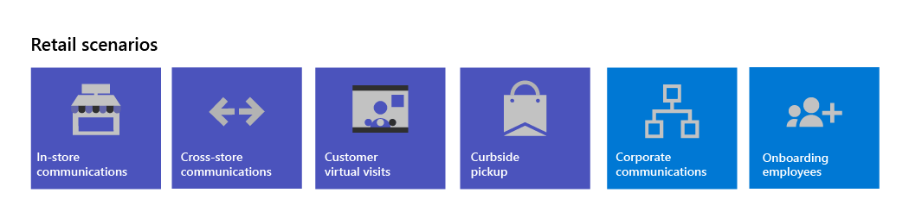

# Get started with Teams for Retail

Retail environments, with their rotating schedules and on-the-go staff, have very different needs than other organizations, and the way that you approach using Microsoft Teams in this environment differs as well. Before diving in with Teams, you'll want to do some planning, following these steps:

1. **Choose your scenarios** - Determine where Teams can help your organization communicate and collaborate, and what processes you might want to transform with the power of the digital tools in Teams for scheduling, tracking tasks, automating tasks, and sharing information.
1. **Identify roles and responsibilities** - Answer questions such as:
    - Who is responsible for creating teams?
    - Who adds users?
    - Who sets up apps or settings?
1. **Understand user license types** - Use the appropriate license for people in your organization who:
    - Work primarily from a desktop or laptop computer in an office (enterprise information workers)
    - Work primarily on mobile devices or face-to-face with customers (frontline workers).
1. **Learn about the ways to control what's available in Teams** - Answer questions such as: 
    - What apps do you want to make available?
    - What policies should you have in place?
    - Should you create custom templates for your teams?

## Choose the scenarios you want to support for your retail business

Microsoft 365 and Microsoft Teams offer several capabilities that can help retail organizations with their daily operations and digital transformation. The following scenarios are available for retail organizations:

| Scenario | Description |
| -------- | -------- |
| [Retail team operations and collaboration](retail-team-collaboration.md) | Bring in-store associates and management together to collaborate and streamline operations with Microsoft Teams and Teams apps.|
| [Curbside delivery/multichannel fulfillment](retail-fulfillment.md) | Use Teams to help your store employees communicate and deliver products directly to customers when they come to pick them up. |

These scenarios are also part of the Microsoft Cloud for Retail. You can do more with these scenarios when you also use other capabilities from the Microsoft Cloud for Retail, such as Microsoft Dynamics 365. Learn more about using this solution, which brings together capabilities from Azure, Dynamics 365, and Microsoft 365 at [Microsoft Cloud for Retail](/industry/retail).

For all of these capabilities, users must have an appropriate license. Office 365 A3, A5, E3, and E5, as well as Microsoft 365 Business Standard, Business Premium, A3, A5, E3, and E5 are supported. You can also use Microsoft 365 Frontline Worker F1 and F3 or Office 365 F3. For more information about general Teams licensing, see [Manage user access to Teams](../../user-access.md). See [Retail user types and licensing](#retail-user-types-and-licensing) for more about using Microsoft 365 Frontline Worker in combination with other licenses.

## Identify roles and responsibilities

Now that you know what scenarios you want to implement, you need to gather your team so you can plan, roll out, and monitor how they're working in your organization. For example, the following roles might be needed in your organization:

| Image | Role | Responsibilities | Department |
| ---- | ---- | ----- | ----- |
|  | IT Administrator | Work with operations and retail management staff to define scenarios and how they'll work for the organization.   Configure settings in the Teams admin center, such as policies and templates, and enable apps.   Set up app settings (such as global Shifts settings) for the organization.   Add and license users.  | IT department |
|  | Operations staff | Work with Administrators to define scenarios, and determine which settings, policies, templates, and apps are needed for Teams.   Create regional or divisional teams from templates.   Set up tasks, lists, and approval flows for coordination between stores within a region, or between stores and headquarters.   Set up learning framework for staff. | Central operations |
|  | Store manager | Work with Administrators and Operations staff to define scenarios.   Create teams for the store from templates.   Set up channels and apps for the teams, as needed. For example: a channel for shift handovers.   Set up store schedules in Shifts.   Set up tasks, lists, and approval flows that are specific to the store.   Set up learning tasks for staff. | Store management |

## Understand retail user types and licensing

In retail environments, you most likely have a mix of user types in your organization:

- Information workers, who probably have desktop or laptop computers, and likely work more on documents than directly with customers, such as corporate staff and managers.
- Frontline workers, who work on tablets or phones, and work either directly with customers or in store operations, such as sales associates, stockers, and pickers.

Microsoft 365 and Microsoft Teams have features and a licensing model to support both types of users for your Retail organization. [Microsoft 365 for Frontline Workers](https://www.microsoft.com/microsoft-365/enterprise/frontline) is optimized for a mobile workforce that primarily interacts with customers, but also needs to stay connected to the rest of your organization. 

### Assign appropriate licenses to support frontline worker and information worker user types

If it makes sense for your organization, you can assign different licenses to these different types of users. The following illustration shows one way to apply licenses and policies for Retail workers:

:::image type="content" source="../media/retail-license-options.png" alt-text="Mix license types to support the different roles in your organization. Use Enterprise licenses for your information workers, such as corporate staff and managers, and Frontline Worker licenses for mobile workers, such as sales associates, shipping staff, stockers, and pickers.":::

With this example, you can mix license types for the two types of workers in your organization, like in the following table:

| Information workers have an Enterprise license and can: | Frontline workers have a Frontline Worker license and can: |
| ----- | ----- |
| Use full Office apps on desktops or laptops, as well as mobile apps on phones and tablets | Use mobile apps on phones or tablets (not desktops or laptops) |
| Use all Teams functionality (depending on the specific license) | Use Teams to: chat, meet, see notifications, use Lists, use Shifts and store documents |
| Use all included Microsoft 365 services (depending on the specific license) | Use SharePoint, OneDrive, Yammer, Stream |

For a detailed comparison of what's included in Microsoft 365 with various licenses, see this [Comparison table](https://go.microsoft.com/fwlink/?linkid=2139145).

Additional capabilities for retail environments are available with the Microsoft Cloud for Retail, which includes capabilities from Dynamics 365 and Microsoft Azure as well as the Microsoft 365 features. For more information, see [Microsoft Cloud for Retail](https://www.microsoft.com/industry/retail/microsoft-cloud-for-retail).

Of course, for simplicity, or if your workers all need access to the full capabilities of Microsoft 365, you can use the same Enterprise license for all of your worker types, and still target capabilities to different user roles using Teams policy packages, such as the Frontline Worker [policy package](../manage-policy-packages.md).

## Manage Teams for Retail

You can use the following methods to control what's available in Teams in your organization:

:::image type="content" source="../media/retail-manage-teams.png" alt-text="Tools to manage Teams for your retail organization":::

| Tool | Description | More information |
| -------- | -------- | -------- |
| Teams app for retail | Ensure that your workers can communicate, collaborate, and deliver great customer service with apps like Shifts, Walkie Talkie, Tasks, Lists, Praise, and so on. You can determine which apps are available for your users by enabling them in the Microsoft Teams admin center or by including them in a Team template. | [Manage Teams apps](../manage-apps.md) |
| Teams templates for retail | Create teams that include a predefined set of settings, channels, tabs, and pre-installed apps for communication and collaboration within an individual store, with a region, or between headquarters and your staff wherever they are.   The Retail **Organize a store** template includes channels for General, Shift Handoff, and Learning, and includes the Approvals, Tasks, and Wiki apps.   The **Retail for managers** template includes channels for General, Operations, and Learning, and includes a Wiki tab.   You can also [create a custom template](create-a-team-template.md) to include the apps your store needs. | [Get started with Retail teams templates](../get-started-with-retail-teams-templates.md)|
| Teams policy packages | Ensure that your sales associates and other frontline workers have the appropriate access to Teams functionality by configuring the appropriate policy packages.   Microsoft Teams integrates with the Shifts app and Frontline Worker, which can be used to coordinate shift staffing features and more. For example, in Shifts, store managers can set up and coordinate schedules for their staff, and employees can check schedules and swap shifts. Teams includes a built-in Frontline Worker app setup policy that you can assign to Frontline Workers in your organization. By default, the policy includes the Activity, Shifts, Chat, and Calling apps. This policy controls behavior for these apps, for example, pinning the Shifts app to the app bar so the team can quickly access it. To learn more, see [Manage the Shifts app for your organization in Microsoft Teams](/shifts/manage-the-shifts-app-for-your-organization-in-teams.md).| [Manage policy packages](../manage-policy-packages.md) |
| Scripted deployment | Quickly provision users and teams and assign all relevant policies with a scripted deployment. <!-- add delegated user management when ready and provisioning users from a workforce management or HR system --> | [Scripted deployment for frontline worksers](../flw-scripted-deployment.md)|
| Shift-based access (Preview) | The presence of Frontline Workers is often less predictable than other staff as their working hours are typically not the same each day. As an admin, you can configure Teams to show a set of shift-based presence states for the Frontline Workers in your organization to indicate when they are on and off shift. | [Manage shift-based access for Frontline Workers](shifts/manage-shift-based-access-flw.md) |

<!-- ## Manage devices for retail teams

- Shared devices
- SMS sign-in -->