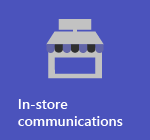
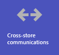
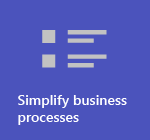
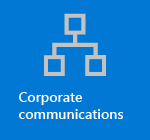
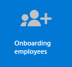

# Get started with Teams for Retail

Retail environments, with their rotating schedules and on-the-go staff, have very different needs than other organizations. To get the most benefit for your retail organization, you first choose which scenarios Teams can help you with in your day to day business operations, and then make sure that you prepare your teams environment with the right fundamentals, teams, and apps to support those scenarios.

1. [Choose the scenarios](#choose-your-scenarios) you want to implement for your business.
:::image type="content" source="../media/retail-teams-scenarios.png" alt-text="Diagram of Teams scenarios for retail.":::
1. [Set up fundamentals](#set-up-the-fundamentals) - Support your workforce with the fundamentals: managing accounts and devices, and making sure that the appropriate Teams policies are applied.
:::image type="content" source="../media/retail-teams-fundamentals.png" alt-text="Diagram of teams, team templates and apps that can be included.":::
1. [Set up teams and apps](#set-up-teams-and-apps) - Use team templates to set up the teams you need quickly, including the channels and apps you need for your business. Add in other apps from Microsoft as needed to support your scenarios.
:::image type="content" source="../media/retail-teams-apps.png" alt-text="Diagram of teams, team templates and apps that can be included.":::

<!-- Additional capabilities for retail environments are available with the Microsoft Cloud for Retail, which includes capabilities from Dynamics 365 and Microsoft Azure as well as the Microsoft 365 features. For more information, see [Microsoft Cloud for Retail](/industry/retail/). -->

## Choose your scenarios

Microsoft 365 and Microsoft Teams offer several capabilities that can help retail organizations with their daily operations and digital transformation. We recommend the following scenarios for retail organizations:

     

### In-store communication and collaboration

Bring in-store associates and management together to collaborate and streamline operations with Microsoft Teams and Teams apps.

**Key apps:** Shifts, Walkie Talkie, Tasks, Approvals, Chat, Praise, Lists, Files

**Additional services:** Power Platform and Power Apps

More information: [Retail team collaboration](retail-team-collaboration.md)

### Cross-store communication and collaboration

Staff members can communicate and collaboration across multiple stores in a region, or with headquarters using the same tools and apps you use within your store.

**Key apps:** Shifts, Walkie Talkie, Tasks, Approvals, Chat, Praise, Lists, Files

**Additional services:** Power Platform and Power Apps

More information: [Retail team collaboration](retail-team-collaboration.md)

### Virtual fittings and consultations

The Bookings app in Microsoft Teams gives organizations a simple way to schedule and manage virtual appointments for staff and attendees. Use it to schedule virtual appointments such virtual shopping experiences.

**Key apps:** Meet, Bookings

More information: [Virtual visits with Microsoft Teams and the Bookings app](bookings-virtual-visits.md)

### Curbside pickup

Use Teams to help your store employees communicate and deliver products directly to customers when they come to pick them up.

**Key apps:** Tasks, Approvals, Chat, Walkie Talkie

More information: [Retail curbside delivery](retail-curbside.md)

### Corporate communications

Employee engagement is a significant contributor to workplace satisfaction, loyalty, and productivity at any organization. Learn how to keep everyone informed and engaged using SharePoint, Microsoft Teams, Yammer, Stream, and Viva Connections.

**Additional services:** Viva Connections, SharePoint, Stream, Yammer

More information: [Organizational communications: Guidance, methods, and products](/sharepoint/corporate-communications-overview)

### Onboarding new employees

Make new employee onboarding (NEO) a great experience by fostering an all-in-one hybrid work environment where new employees can find important resources, meet people in their organization, and prepare to be successful in their new role.

**Key apps:** Lists, Live Meetings

**Additional services:** Viva Learning, SharePoint, Yammer

More information: [Onboard new employees](/sharepoint/onboard-employees)

<!-- These scenarios are also part of the Microsoft Cloud for Retail. You can do more with these scenarios when you also use other capabilities from the Microsoft Cloud for Retail, such as Microsoft Dynamics 365. Learn more about using this solution, which brings together capabilities from Azure, Dynamics 365, and Microsoft 365 at [Microsoft Cloud for Retail](/industry/retail). -->

> [!NOTE]
> For all of these capabilities, users must have an appropriate license. Microsoft 365 for frontline workers F1 and F3 or Office 365 F3, Office 365 A3, A5, E3, and E5, as well as Microsoft 365 Business Standard, Business Premium, A3, A5, E3, and E5 are all supported. For more information about general Teams licensing, see [Manage user access to Teams](../user-access.md). See [Licensing options for frontline workers](../flw-licensing-options.md) for more about using Microsoft 365 for frontline workers in combination with other licenses.

## Set up the fundamentals

Lay the right foundation for your workers by choosing appropriate licenses for them, managing their accounts, and managing their devices so that you can provide a secure, compliant way to get their work done.

:::image type="content" source="../media/retail-teams-fundamentals.png" alt-text="Diagram of the Fundamentals that support scenarios for Teams, such as Teams policies and Accounts and devices.":::

### Licensing

Retail staff is typically a mobile workforce: frontline workers and managers who aren't tied to computers all day, unlike corporate staff. So the tools and apps they need are different. Microsoft 365 for frontline workers provides a feature set tailored to this audience. See more at [Licensing options for frontline workers](../flw-licensing-options.md).

### Accounts

With high turnover, the ability to add and remove accounts quickly, and get the right policies assigned is key. Get started with the Frontline Worker Onboarding wizard in the Microsoft 365 admin center. The wizard sets up a team for your frontline workers and assigns licenses and policy packages to each team member. For more information, see [Use the Frontline Worker onboarding wizard to get your frontline workforce up and running](../flw-onboarding-wizard.md).

If you have a lot of users to add (more than 100), you can quickly provision users and teams and assign all relevant policies with a [scripted deployment for frontline workers](../flw-scripted-deployment.md).

The presence of Frontline Workers is often less predictable than other staff as their working hours are typically not the same each day. As an admin, you can configure Teams with Shift-based access (Preview) to show a set of shift-based presence states for the Frontline Workers in your organization to indicate when they are on and off shift. For more information, see [Manage shift-based access for Frontline Workers](shifts/manage-shift-based-access-flw.md).

### Devices

Because the workforce is largely mobile, managing accounts and devices is a key fundamental for retail environments. You need to set a secure, compliant baseline with managed devices for your workforce to use, whether that's a shared device or an employee's own device. See more at [TBD - Point to Azure AD, InTune, RealWear info.]().

### Policies

Ensure that your sales associates and other frontline workers have the appropriate access to Teams functionality by configuring the appropriate policy packages. Teams policies help control what users in specific roles can do. The [Frontline worker and Frontline manager policy packages](../manage-policy-packages.md#policy-packages-included-in-teams) are tailored to be appropriate for frontline workforces like those in retail stores.

Microsoft Teams integrates with the Shifts app and Frontline Worker, which can be used to coordinate shift staffing features and more. For example, in Shifts, store managers can set up and coordinate schedules for their staff, and employees can check schedules and swap shifts.

## Set up Teams and apps

:::image type="content" source="../media/retail-teams-apps.png" alt-text="Diagram of teams, team templates and apps that can be included.":::

### Apps and services for retail

Ensure that your workers can communicate, collaborate, and deliver great customer service with apps like Shifts, Walkie Talkie, Tasks, Lists, Praise, and so on. You can determine which apps are available for your users by enabling them in the Microsoft Teams admin center or by including them in a Team template. More information about [managing Teams apps](../manage-apps.md).

For retail environments, the following apps and services can help you transform your business processes and support communication:

| App | Description | Manage | Help |
| ----- | ----- | ----- | ----- |
| Shifts | Manage schedules and clock in and out with Shifts. | [Manage Shifts](shifts-for-teams-landing-page.md) | [Use Shifts](https://support.microsoft.com/office/what-is-shifts-f8efe6e4-ddb3-4d23-b81b-bb812296b821) |
| Tasks | Help employees know what they should focus on when not with customers by assigning tasks. Operations can use [task publishing](../manage-tasks-app.md#task-publishing) to send out tasks to locations and track progress across those locations. | [Manage the Tasks app](../manage-tasks-app.md) | [Use Tasks](https://support.microsoft.com/office/use-the-tasks-app-in-teams-e32639f3-2e07-4b62-9a8c-fd706c12c070) |
| Approvals | Approvals can be integrated into chat for easy sign off. | [Manage Approvals](../approval-admin.md) | [Use Approvals](https://support.microsoft.com/office/what-is-approvals-a9a01c95-e0bf-4d20-9ada-f7be3fc283d3) |
| Chat | Enable quick conversations and checkins between staff with secure, enterprise-grade communications tools, instead of consumer grade apps or SMS. | [Chat, teams, channels & apps in Microsoft Teams](/deploy-chat-teams-channels-microsoft-teams-landing-page.md) | [Chat in Teams](https://support.microsoft.com/office/start-and-pin-chats-a864b052-5e4b-4ccf-b046-2e26f40e21b5?wt.mc_id=otc_microsoft_teams) |
| Documents | Share standard operating procedures, store policies, plans, and more. | [How SharePoint and OneDrive interact with Microsoft Teams](../sharepoint-onedrive-interact.md) | [Share files](https://support.microsoft.com/office/upload-and-share-files-57b669db-678e-424e-b0a0-15d19215cb12) |
| Walkie Talkie | Push to talk quick communication that's not constrained by geography like standard 2-way radios.| [Manage the Walkie Talkie app](../walkie-talkie.md) | [Use Walkie Talkie](https://support.microsoft.com/office/get-started-with-teams-walkie-talkie-25bdc3d5-bbb2-41b7-89bf-650fae0c8e0c) |
| RealWear devices | Handsfree communication with devices. | [Microsoft Teams for RealWear](../flw-realwear.md) | [Use Microsoft Teams for RealWear](https://support.microsoft.com/office/using-microsoft-teams-for-realwear-af20d232-d18c-476f-8031-843a4edccd5f) |
| Praise | Recognize coworkers for great teamwork with the Praise app. | [Manage the Praise app](../manage-praise-app.md) | [Send Praise to people](https://support.microsoft.com/office/send-praise-to-people-50f26b47-565f-40fe-8642-5ca2a5ed261e) |
| Viva Learning | Provide training when needed, right in the flow of their work. | [Manage Viva Learning](/microsoft-365/learning/) | [Use Viva Learning (Preview)](https://support.microsoft.com/office/viva-learning-preview-01bfed12-c327-41e0-a68f-7fa527dcc98a) |
| Bookings | Enable virtual fittings and consultations. | [Virtual visits with Microsoft Teams and the Bookings app](bookings-virtual-visits.md) | [Use Bookings](https://support.microsoft.com/en-us/office/what-is-bookings-42d4e852-8e99-4d8f-9b70-d7fc93973cb5) |
| Yammer | Connect your organization and allow communication across departments and regions with Yammer. | [Manage Yammer](/yammer) | [Use Yammer](https://support.microsoft.com/office/what-is-yammer-1b0f3b3e-89ee-4b66-aac5-30def12f287c) |
| Power Apps and the Power Platform | Integrate business processes and enable quick updates to data, such as store inventory, sales numbers, incident reports, and more. | [Teams integration with Microsoft Power Platform](../teams-power-platfom-integration.md) and [Manage Microsoft Power Platform apps in the Microsoft Teams admin center](../manage-power-platform-apps.md) | -  |

### Use templates to set up teams

Create teams that include a predefined set of settings, channels, tabs, and pre-installed apps for communication and collaboration within an individual store, with a region, or between headquarters and your staff wherever they are. 

- The Retail **Organize a store** template includes channels for General, Shift Handoff, Store Readiness, and Learning, and includes the Approvals, Tasks, and Wiki apps.
- The **Retail for managers** template includes channels for General, Operations, and Learning, and includes a Wiki tab.

You can also [create a custom template](../create-a-team-template.md) to include the apps your store needs. More information: [Get started with Retail teams templates](../get-started-with-retail-teams-templates.md)

Aside from teams templates, you can also set up other sites and services to help with communication: SharePoint sites and Viva Connections.

- Set up SharePoint sites to create a home page for your organization, distribute news across your company, and provide a place with resources for onboarding users. Learn more about using SharePoint sites for corporate communications scenarios at [/sharepoint/corporate-communications-overview](/sharepoint/corporate-communications-overview).
- Use Viva Connections to bring it all together. With Viva Connections as your employee's home in Teams, they can get updates on their tasks, organizational news, and more. For more information, see [Overview: Viva Connections (Preview)](/sharepoint/viva-connections-overview) and [Add the Viva Connections app in the Teams Admin Center (Preview)](/sharepoint/add-viva-connections-app.md).

## Get ready to roll out your scenarios - identify roles and responsibilities for scenarios

Now that you know what scenarios you want to implement and what you need to support them, you can gather your team so you can plan, roll out, and monitor how they're working in your organization. For example, the following roles might be needed to roll out these scenarios in your organization:

| Image | Role | Responsibilities | Department |
| ---- | ---- | ----- | ----- |
|  | IT Administrator | Work with operations and retail management staff to define scenarios and how they'll work for the organization.   Configure settings in the Teams admin center, such as policies and templates, and enable apps.   Set up app settings (such as global Shifts settings) for the organization.   Add and license users.  | IT department |
|  | Operations staff | Work with Administrators to define scenarios, and determine which settings, policies, templates, and apps are needed for Teams.   Create regional or divisional teams from templates.   Set up tasks, lists, and approval flows for coordination between stores within a region, or between stores and headquarters.   Set up learning framework for staff. | Central operations |
|  | Store manager | Work with Administrators and Operations staff to define scenarios.   Create teams for the store from templates.   Set up channels and apps for the teams, as needed. For example: a channel for shift handovers.   Set up store schedules in Shifts.   Set up tasks, lists, and approval flows that are specific to the store.   Set up learning tasks for staff. | Store management |

For more about successfully implementing and adopting Teams, see [Adopt Microsoft Teams](../adopt-microsoft-teams-landing-page.md).