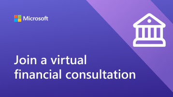
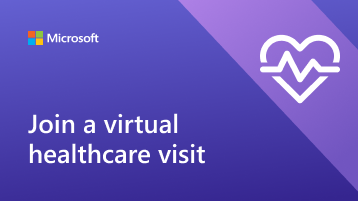

# Help your clients and customers use Virtual Visits

Now that your organization has begun using Microsoft Teams and the Bookings app for Virtual Visits, you'll need to make sure that your clients and customers understand how to book and join these appointments.

Watch this video for a quick overview of what Virtual Visits can do for your organization.

> [!VIDEO https://www.microsoft.com/videoplayer/embed/<RWEJii>]  

## What's included in this toolkit

This toolkit is intended to help you help your customers and clients successfully join a Virtual Visit. You can customize the resources we provide and include links to them in your communications about Virtual Visits. This toolkit includes:

[Guidance for your website](#guidance-for-your-website):   An FAQ about Virtual Visits that you can customize and then host on your website. Make sure to add your own links, and any additional information that your customers need to know about your policies.

[Resources for your team](#resources-for-your-team):   Articles and videos to help your team get more comfortable conducting Virtual Visits.

[Resources for your clients](#resources-for-your-clients):  
A link to Microsoft's support content, which includes a video about joining a Virtual Visit. 
An infographic that you can customize for your organization.

## Guidance for your website

Let your customers know what to expect with Virtual Visits by answering common questions. All you need to do is edit this Q&A to align with your virtual appointment policies, and paste it on your website.

### Virtual Visits basics

**What is a Virtual Visit?**

A Virtual Visit is an online appointment conducted over Microsoft Teams. You’ll be speaking one-on-one with one of our staff members, just like you would for an in-person visit.

**How are Virtual Visits different than in-person visits?**

Let your customers know if there are differences in the services you provide virtually and in person. You can also describe any fee differences between virtual and in-person Visits.

**How does a Virtual Visit go?**

When you join from the link in the email confirmation, you'll enter a virtual waiting room. Once a staff member joins the call, you'll enter a virtual room with them where your one-on-one visit will take place.

**How does payment work for Virtual Visits?**

Let your customers know if you accept different types of payment for virtual Visits.

### Booking a visit

**How do I make an appointment?**

Link to your organization’s booking page. Let your customers know if there are alternative ways of making virtual appointments, such as over the phone, through email, or through social media.

**Who can I make an appointment with?**

Make sure your clients can maintain relationships with their preferred providers by sharing which, if any, staff are operating exclusively virtually or in-person.

**How do I cancel or reschedule a Virtual Visit?**

You can link to your organization’s cancellation and rescheduling policy here, or describe any differences in the policy between virtual and in-person appointments.

### Technology

**What equipment do I need for a Virtual Visit?**

Customers can join a Virtual Visit from any web browser or through the Microsoft Teams app. List here if your organization has additional specifications, such as a high-quality webcam or microphone. If your healthcare organization has EHR integrated into teams, patients can join visits from your healthcare portal.

**How do I join a Virtual Visit?**

You can link your customers here Join a Bookings appointment as an attendee (microsoft.com) to show them a detailed video and step-by-step process of how to join an appointment.

## Resources for your team

Make the most of Virtual Visits by making sure your staff members know how to conduct them. You can share this with your team members to help them better understand Virtual Visits.

- [Learn how to use the Bookings app in Teams](https://support.microsoft.com/office/what-is-bookings-42d4e852-8e99-4d8f-9b70-d7fc93973cb5)
- [Learn how to join a Bookings appointment](https://support.microsoft.com/office/join-a-bookings-appointment-attendees-3deb7bde-3ea3-4b41-8a06-741ad0db9fc0)
- [Conduct a virtual visit](/microsoftteams/expand-teams-across-your-org/bookings-virtual-visits#conduct-a-visit)
- [Watch a video about Virtual Visits](#help-your-clients-and-customers-use-virtual-visits)

## Resources for your clients

You can link out to this article to show your clients how to join Virtual Visits:
[Learn how to join a virtual visit](https://support.microsoft.com/office/join-a-bookings-appointment-as-an-attendee-95cea12d-2220-421f-a663-6efb20913c7f)

Download and [customize](#customize-your-infographic) one of these infographics to feature on your website. These give your clients a quick and visually engaging way to understand how Virtual Visits with your organization work.

| Graphic                | Description              |
| :------------------- | -------------------: |
|    [Download as a PDF](//download.microsoft.com/download/a/b/5/ab5c07d9-cf7a-47b3-ba54-05a8a0a2a1bd/VirtualVisit_Financial_Infographic.pdf) [Download as a PowerPoint](//download.microsoft.com/download/a/b/5/ab5c07d9-cf7a-47b3-ba54-05a8a0a2a1bd/VirtualVisit_Financial_Infographic.pptx) | Customizable infographic for your financial services organization |
|    [Download as a PDF]() [Download as a PowerPoint]() | Customizable infographic for your retail organization |
|    [Download as a PDF]() [Download as a PowerPoint]() | Customizable infographic for your healthcare organization |

### Customize your infographic

1. Choose one of three pre-made infographics depending on your organization's needs:
    1. Healthcare
    2. Financial services
    3. Retail

2. Customize the infographic in PowerPoint.
    1. Use your organization's colors and preferred fonts.
    2. Add your organization's logo or branded images.
    3. Link to pages on your website such as your booking page, billing information, or homepage.
    4. Add any additional information that your customers need to know before joining a Virtual Visit.

3. Export your customized infographic as a PDF.
