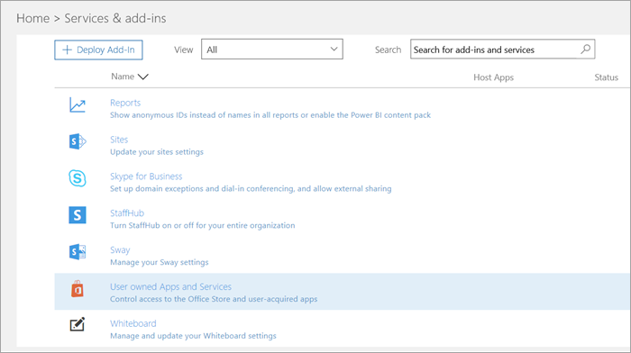

Manage the Microsoft Teams Exploratory Experience offer
=======================================================

The Microsoft Teams Exploratory offers existing Office 365 users in your organization who are not licensed for Microsoft Teams to initiate an exploratory experience of the product. Admins can switch this feature on or off for users in their organization. This is an enhancement to the earlier [Microsoft Commercial Cloud Trial](iw-trial-teams.md).

[!INCLUDE [preview-feature](includes/preview-feature.md)]

## What's in the offer

The service plans included in this offer are:
 - Exchange Online (Plan 1)
 - Flow for Office 365
 - Insights by MyAnalytics
 - Microsoft Forms (Plan E1)
 - Microsoft Planner
 - Microsoft Search
 - Microsoft StaffHub
 - Microsoft Stream for O365 E1 SKU
 - Microsoft Teams
 - Mobile Device Management for Office 365
 - Office Mobile Apps for Office 365 
 - Office Online
 - PowerApps for Office 365
 - SharePoint Online (Plan 1)
 - Sway
 - To-Do (Plan 1)
 - Whiteboard (Plan 1)
 - Yammer Enterprise

## Who is eligible

Users must be enabled to sign up for apps and trials (in the Microsoft 365 admin center). For more information, see [Manage the trial](#manage-the-trial), later in this article. 

Users who do not have an Office 365 license that includes Teams can initiate the Microsoft Teams Exploratory Experience offer. For example, if a user has Office 365 Business (which doesn't include Teams), they are eligible for the trial.

## Who isn't eligible

Your organization is not eligible for this offer if you are a Syndication Partner Customer or if you are a GCC, GCC High, DoD, or EDU customer.

## How users sign up for the trial

Eligible users can sign up for offer by directly signing in to Teams [teams.microsoft.com](https://teams.microsoft.com). They will be assigned this license automatically and the tenant admin will receive an email notification the first time a user redeems this offer.

## Manage the offer

The Microsoft Teams Exploratory Experience offer is meant to be initiated by individual end users, and you may not initiate this offer on behalf of end-user employees.

This offer comes with an Exchange Online license but it will not be assigned to the user until the admin assigns it. If the user doesn't have an Exchange license already and the admin has yet to assign the Exchange 
Online license, the user will not be able to schedule meetings in Teams and may be missing other Teams functionality.

Admins can disable the ability for end users to claim this offer within their organization through the trial apps and services switch.

### Prevent users from installing trial apps and services

You can turn off a user’s ability to install trial apps and services, would prevent the user from redeeming this offer.

1. From the [Microsoft 365 admin center](https://portal.office.com/adminportal/home), go to **Settings** > **Services & add-ins** > **User owned Apps and Services**.

    

2. Turn off **Let users install trial apps and services**.

    
> [!NOTE]
> If your organization is ineligible for the Microsoft Teams Exploratory Experience offer, you won't see the **Let users install trial apps and services** switch.

### Manage trial availability for a user with a license that includes Teams

A user who is assigned a license that includes Teams is not eligible for this offer. When the Teams service plan is enabled, the user can sign in and use Teams. If the service plan is disabled, the user cannot sign in and this offer isn't available.

To turn off access to Teams:

1. In the Microsoft 365 admin center, select **Users** > **Active users**.

2. Select the box next to the name of the user.

3. On the right, in the **Product licenses** row, choose **Edit**.

4. In the **Product licenses** pane, switch the toggle to **Off**.

    

### Manage Teams availability for users who already claimed the offer

If a user has claimed a Teams exploratory experience license, you can remove it by removing the license or service plan.

To turn off the exploratory license:

1. In the Microsoft 365 admin center, select **Users** > **Active users**.

2. Select the box next to the name of the user.

3. On the right, in the **Product licenses** row, choose **Edit**.

4. In the **Product licenses** pane, switch the toggle for this exploratory license to **Off**.

    
>[!Note]
>The Microsoft Teams Exploratory Experience toggle switch will appear after the first user in the organization signs up for the offer.

### Manage Teams for users who have the trial license

You can manage users who have the exploratory license just like you manage users who have a regular paid license. For more information, see [Manage Microsoft Teams settings for your organization](enable-features-office-365.md).

### Upgrade users from the trial license

To upgrade users from the exploratory license, do the following:

1. Purchase a subscription that includes Teams.

2. Remove the Teams exploratory subscription from the user.

3. Assign the newly purchased license.

For more information, see [Office 365 licensing for Microsoft Teams](Office-365-licensing.md).

> [!NOTE]
> If the trial ends and a user is not immediately upgraded to a subscription that includes teams, the user data is not removed. The user still exists in Azure Active Directory and all data within Teams still remains. Once a new license is assigned to the user to enable Teams functionality again, all content will still exist. 

## What happens to legacy Microsoft Teams Commercial Cloud Trial licenses

As of mid January, 2020, eligible users can begin claiming the latest Microsoft Teams Exploratory Experience license. All legacy Teams Commercial Cloud Trial licenses will be automatically converted to the new offer before their trial expires.

### Remove a Microsoft Teams Exploratory Experience license

- If you would like to remove this license via PowerShell, see:
[Remove licenses from user accounts with Office 365 PowerShell](https://docs.microsoft.com/office365/enterprise/powershell/remove-licenses-from-user-accounts-with-office-365-powershell)

- If you would like to remove this license through the admin portal, see:
[Remove licenses from users in Office 365 for business](https://docs.microsoft.com/office365/admin/subscriptions-and-billing/remove-licenses-from-users?view=o365-worldwide)
