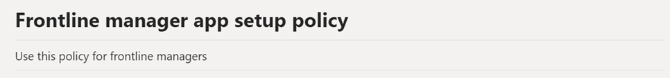
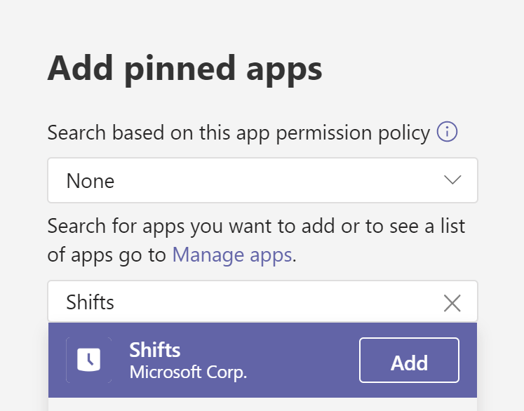
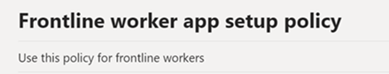
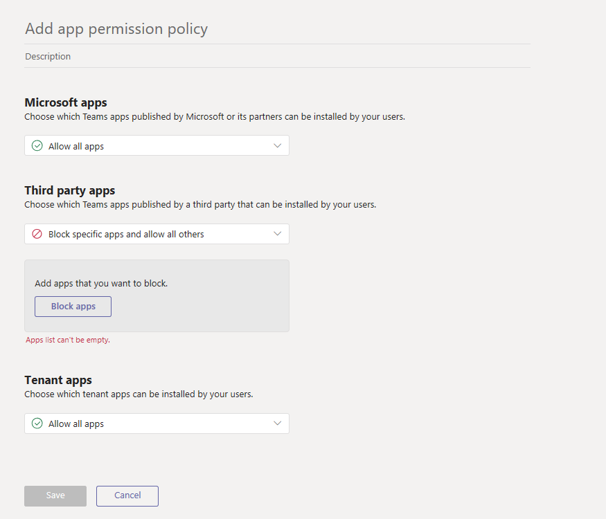

# How to provisions Teams at scale for Firstline Workers

Do you need to rapidly onboard a large number of users to Microsoft Teams and configure a streamlined experience for them? You can quickly provision identities, provision teams, and assign all relevant policies to control the end user experience by walking through the following instructions.

In this walkthrough, you'll learn how to:

- Create a large number of users.
- Create a large number of teams and set up the appropriate channels.
- Assign licensing at scale.
- Create appropriate Teams Messaging Policies, App Setup Policies, and App Permission Policies.
- Apply those policies to users at scale.
- Assign a large number of users into a designated team.

## Prerequisites

Download the assets from [this location](https://github.com/MicrosoftDocs/OfficeDocs-SkypeForBusiness/blob/live/Teams/downloads/FLWTeamsScale.zip?raw=true).

> [!IMPORTANT]
> The scripts in the link provided above are provided as-is by Microsoft, and must be modified for your individual needs.

## Technical requirements

- Your tenant must have the appropriate number of licenses available that include Microsoft Teams. If you do not already have these licenses, follow the instructions here to activate the [Office 365 E1 Free Trial](e1-trial-license.md).
- The user taking these steps must do so in the role of Global Admin or User Admin in Azure AD.
- User must have the rights to install and configure software on their local machine.

## Step-by-step process overview

1. **Setup Your Environment**
    1. Download the ZIP file containing the sample PowerShell scripts and documentation
    1. Setup credentials
    1. Configure local environment
    1. Configure PowerShell Modules and Environmental Variables
    1. Create App Registration
1. **Create and Setup Teams**
    1. Create Teams
    1. Create Channels for Teams
1. **Create Teams Policies**
    1. Create Teams Messaging Policies
    1. Create Teams App Setup Policies
    1. Create Teams App Permission Policies
1. **Create and Setup Users**
    1. Create users and security groups
    1. Assign licensing to users via group-based licensing
1. **Assign Users and Policies**
    1. Assign users to Teams
    1. Assign policies to User and Groups
1. **Test and Validate**
    1. Check for errors
    1. Login to Teams with a test user

## Set up your environment

The following steps will allow you to set up your environment:

### Download .zip file containing sample PowerShell scripts

Before you can proceed, you'll need to download the scripts at [this location](https://github.com/MicrosoftDocs/OfficeDocs-SkypeForBusiness/blob/live/Teams/downloads/FLWTeamsScale.zip?raw=true).

### Setup Credentials

In this document and the sample scripts we've chosen to create a reference file that contains your credentials in order to make things easier. This technique removes the need for you to authenticate to all the various service endpoints while maintaining the credentials in a local store. In order to run the subsequent scripts, you'll need to update that reference file with the credentials that are unique to you and your environment. From within each subsequent script, the appropriate credentials are read with the helper function  we've called **GetCreds**, and those credentials are used to connect to the various services.

It's not uncommon for different services to require different credentials. For example you might have different credentials for MicrosoftTeams, AzureAD, and MSonline, in which case you can run SetCred saving each credential file with its own meaningful name.

Examples:
SetCreds msol-cred.xml
SetCreds azuread-cred.xml
SetCreds teams-cred.xml

> [!NOTE]
> The account used for the credentials cannot require MFA.

Here is an example of how the various scripts then use the saved credentials to authenticate:

```azurepowershell
# Connect to MicrosoftTeams
$teams_cred = GetCreds teams-cred.xml
Connect-MicrosoftTeams -Credential $teams_cred
```

In order to set your credentials, complete the following:

1. Find the **SetCreds.ps1** in the .zip file assets.
1. From PowerShell run the **SetCreds.ps1** script to save your credentials.
    1. You'll be prompted with "Performing the operation "Export-Clixml"..." and you'll need to enter 'Y' to approve.

### Configure the local environment

1. Find the **SetConfig.ps1** in the .zip file assets.
1. From PowerShell run the following command, replacing the bracketed entries with your specific information.
    1. **SetConfig.ps1** -tenantName [your tenant name] -rootPath "[full path to the root of the git repo]"

For example:
`.\SetConfig.ps1 -tenantName contoso.onmicrosoft.com -rootPath "C:\data\source\FLWTeamsScale"`

### Configure PowerShell modules and environmental variables

Before you go further, you'll need to install and connect to several PowerShell modules, including Azure AD, MSAL, MSCloudUtils, and MicrosoftTeams.

1. Find the **ConfigurePowerShellModules.ps1** in the .zip file assets.
1. Edit and replace the following environmental variables with your variables:
1. From PowerShell, run the **ConfigurePowerShellModules.ps1** script.

## Create and set up Teams

In order to communicate and collaborate with your Firstline Workers, you will first need to establish a series of Teams and add standard Channels to those teams, which we'll walk through next.

### Create teams

Teams are a collection of people, content, and tools within your organization. For most Firstline Worker-centric organizations, it is best practice to anchor a Team around a physical location. For example, a Team for each of the following:

- Store
- Distribution Center
- Manufacturing Plant
- Hospital
- Grocery Store

*Best Practice Discussion*: When designing your teams, it's important to keep in mind [Teams limits and specifications](limits-specifications-teams.md). For smaller organizations, an org-wide team can be used to streamline communication and complement a physical location structure. For others, a structured physical location Team naming convention helps assist Corporate Communications with Cross Posting to multiple teams simultaneously with ease. For example, you can search and cross-post to all Teams with US in the name to target all US locations. More information on cross-posting can be found [here](https://support.office.com/article/cross-post-a-channel-conversation-in-teams-9c1252a3-67ef-498e-a7c1-dd7147b3d295).

#### Steps to create teams

1. Find the **Teams Information.csv** file in the assets.
1. Update the information in the **Teams Information.csv** file with your organization's specific information. Keep in mind our best practices above.
1. Find the **CreateTeams.ps1** script.
1. From PowerShell, run the **CreateTeams.ps1** script.

### Create channels for teams

Channels are dedicated sections within a team to keep conversations organized by specific topic, project, discipline, and more. Every Team automatically gets a General channel, but from there you can customize your structure according to the needs of your business. For example, your additional channel structure could include:

- **Manufacturing** - Safety, Line 1, Line 2, Corporate Communications, Training
- **Grocery** - Bakery, Produce, Meat, Corporate Communications, Training
- **Healthcare** - Nurses, Doctors, Critical Care Unit 1, Critical Care Unit 2
- **Hospitality** - Front Desk, Maintenance, Housekeeping, Valet and Baggage, Corporate Communications, Training
- **Retail** - Front of Store, Back of Store, Corporate Communications, Training

> [!NOTE]
> Channels should not be thought of as a security boundary. They are a means of organizing your workers for the purposes of collaboration.

*Best Practice Discussion*: When designing your channel structure, it's important to keep things simple, especially when you're looking to onboard a lot of users. Resist the urge to create channels for every situation, role, or topic in order to minimize the need for training. Pick 3-5 channels at most to get started. Additional channels can easily be created as the need arises. In fact, it's okay to just use the General channel alone for now!

#### Steps to Create Channels for Teams

1. Find the **TeamsChannels.csv** file in the .zip file assets.
1. Update the **TeamsChannels.csv** file with your organization's specific information. Keep in mind our best practices above.
1. Find the **CreateTeamsChannels.ps1** script in the .zip file assets.
1. From PowerShell, run the **TeamsChannels.ps1** script.

## Create Teams policies

As an admin, you can use teams policies in Microsoft Teams to control what users in your organization see and can. For example, you can control which applications are pinned to the left rail on your Desktop or Web browser, or the bottom bar on mobile devices, in order to simplify the end user experience when onboarding a large amount of users. Some of these policies can be created with PowerShell, and others have to be manually created in the Teams Admin Console.

*Best Practice Discussion*: For each of the following policies, we're choosing to actually create two policies: one for Firstline Workers and one for Firstline Managers. You can choose to create as many or as few as you like. For most customers, two is a good place to start, even if you give the same settings to each group initially. As your experience with Teams grows, you may choose to differentiate their experience further and having the two separate policies already created can make that simpler.

### Create Teams message policies

Messaging policies are used to control which chat and channel messaging features are available to users in Microsoft Teams.

*Best Practice Discussion*: While you can use the default Global policy that is created automatically, we have opted to create a custom policy using the steps below to provide a more locked down, simple, and differentiated experience for Firstline Managers and Firstline Workers.

#### Steps to Create Teams Message Policies

1. Find the **TeamsMessagingPolicies.csv** file in the .zip file assets.
1. Update the **TeamsMessagingPolicies.csv** file with your organization's specific information. Additional information on some of the various options can be found [here](https://docs.microsoft.com/microsoftteams/messaging-policies-in-teams#messaging-policy-settings).
1. Find the **CreateTeamsMessagePolicies.ps1** script in the assets.
1. From PowerShell, run the **TeamsMessagePolicies.ps1** script.

### Create Teams app setup policies

As an admin, you can use app setup policies to do the following:

- Customize Teams to highlight the apps that are most important for your users. You choose the apps to pin and set the order in which they appear. Pinning apps lets you showcase apps that users in your organization need, including those built by third parties or by developers in your organization.
- Control whether users can pin apps to Teams.

Apps are pinned to the app bar. This is the bar on the side of the Teams desktop client and at the bottom of the Teams mobile clients (iOS and Android).

|Teams Desktop Client  |         |Teams Mobile Client  |
|---------|---------|---------|
|         |         | |

*Best Practice Discussion*: You manage app setup policies in the Microsoft Teams admin center. They aren't able to be created with PowerShell. You can use the global (Org-wide default) policy or create custom policies and assign them to users. Users in your organization will automatically be assigned to the global policy unless you create and assign a custom policy. For our purposes, we are creating two new policies for Firstline Workers and Firstline Managers, in order to provide them a simpler and more streamlined experience to ease onboarding a large number of users simultaneously. You can choose to customize the experience as your business needs.

#### Create the Firstline Manager app setup policy

The following settings can be customized to meet your business needs. We have chosen some recommended options based on best practices and to improve the ease of onboarding new users at scale. For more information, click [here](https://docs.microsoft.com/MicrosoftTeams/teams-app-setup-policies#create-a-custom-app-setup-policy).

1. In the left navigation of the Microsoft Teams admin center, go to **Teams apps** > **Setup policies**.
2. Click **Add**.  
3. Enter a name and description for the policy. As an example: **Firstline Manager App Setup Policy**.


4. Turn off **Upload custom apps**.
5. Turn off **Allow user pinning**.


6. If it's not already listed, add the **Shifts** app. For more information about **Shifts**, click [here](expand-teams-across-your-org/shifts/manage-the-shifts-app-for-your-organization-in-teams.md).


7. Remove Calling, if it appears. Note: removing this feature will not disable it for the user, but will prevent it from appearing on the app bar to simplify the end user experience.
8. Arrange the apps in the following order to dictate their order in the Teams App Bar, and then click **Save**.
    1. Activity
    1. Chat
    1. Teams
    1. Calendar
    1. Shifts
    

#### Create the Firstline Worker app setup policy

The following settings can be customized to meet your business needs. We have chosen some recommended options based on best practices and to improve the ease of onboarding new users at scale. For more information, click [here](https://docs.microsoft.com/MicrosoftTeams/teams-app-setup-policies#create-a-custom-app-setup-policy).

1. In the left navigation of the Microsoft Teams admin center, go to **Teams apps** > **Setup policies**.
2. Click **Add**.
3. Enter a name and description for the policy. As an example: **Firstline Worker App Setup Policy**.


4. Turn off **Upload custom apps**.
5. Turn off **Allow user pinning**.


6. If it's not already listed, add the **Shifts** app. For more information about **Shifts**, click here.


7. Remove Meetings and Calling, if they appear. Note: removing these features will not disable them for the user, but will prevent them from appearing on the app bar to simplify the end user experience.
8. Arrange the apps in the following order to dictate their order in the Teams App Bar, and then click **Save**.
    1. Activity
    1. Chat
    1. Teams
    1. Shifts
    

### Create app permission policies

As an admin, you can use app permission policies to control what apps are available to Microsoft Teams users in your organization. You can allow or block all apps, or specific apps published by Microsoft, third-parties, and your organization. When you block an app, users who have the policy are unable to install it from the Teams app store. You must be a global admin or Teams service admin to manage these policies.

*Best Practice Discussion*: You manage app setup policies in the Microsoft Teams admin center. They aren't able to be created with PowerShell. You can use the global (Org-wide default) policy or create custom policies and assign them to users. Users in your organization will automatically get the global policy unless you create and assign a custom policy. For our purposes, we are creating two new policies for Firstline Workers and Firstline Managers in order to provide a secure and more streamlined experience to ease onboarding a large number of users simultaneously. You can of course choose to customize the experience as your business needs.

#### Create the Firstline Manager app permission policy

The following settings can be customized to meet your business needs. These are some recommended options based on best practices that can improve the ease of onboarding new users at scale. For more information, click [here](teams-app-permission-policies.md).

1. In the left navigation of the Microsoft Teams admin center, go to **Teams apps** > **Permission policies**.
2. Click **Add**.


3. Enter a name and description for the policy. As an example: Firstline Manager App Permission Policy.
4. Under Microsoft apps, select **Allow all apps**.
5. Under Third-party apps, select **Allow all apps**.
6. Under Tenant apps, select **Allow all apps**.
7. Click **Save**.

#### Create the Firstline Worker App Permission Policy

The following settings can be customized to meet your business needs. These are some recommended options based on best practices that can improve the ease of onboarding new users at scale. For more information, click [here](teams-app-permission-policies.md).

1. In the left navigation of the Microsoft Teams admin center, go to **Teams apps** > **Permission policies**.
2. Click **Add**.


3. Enter a name and description for the policy. As an example: Firstline Worker App Permission Policy.
4. Under Microsoft apps, select **Allow all apps**.
5. Under Third-party apps, select **Block all apps**.
6. Under Tenant apps, select **Allow all apps**.
7. Click **Save**.

## Create and set up users

### Create user and security groups

To work with a large amount of users in Teams you first need to have the users created in Azure AD. There are many ways to provision a large number of users, but we're going to highlight the following:

- If these users already exist in one of the following HR systems, use the following links to set up user provisioning:
  - SAP Success Factors - [Tutorial: Configure SAP SuccessFactors to Active Directory user provisioning](https://docs.microsoft.com/azure/active-directory/saas-apps/sap-successfactors-inbound-provisioning-tutorial).
  - Workday - [Tutorial: Configure Workday for automatic user provisioning](https://docs.microsoft.com/azure/active-directory/saas-apps/workday-inbound-tutorial).
- If you have your user information in other systems, proceed with the following steps.

In order to manage these users at scale more effectively, you need to create two security groups for Firstline Workers and Firstline Managers, and provision those users into the security groups directly, following these steps:

1. Find the **SecurityGroups.csv** file in the .zip file assets.
1. Update the **SecurityGroups.csv** file with your organization's specific information.
    1. Make sure to update the **MessagePolicy**, **AppPermissionPolicy**, and **AppSetupPolicy** fields to map to the appropriate policies you created earlier.
    1. Make sure to update the **LicensePlan** field to reflect the licensing that you intend to give each of these users. For more information on product names and service plan identifiers, review the documentation [here](https://docs.microsoft.com/azure/active-directory/users-groups-roles/licensing-service-plan-reference).
1. Find the **Users.csv** file in the .zip file assets.
1. Update the **Users.csv** file with your organization's specific information.
    1. By default, the script we've provided will create a user with a temporary password that must be changed on first login. If you don't want to use the default password, edit the **CreateUsers.ps1** script to meet your requirements.
    1. Make sure to update the SecurityGroup field to reflect the appropriate name created earlier.
1. From PowerShell, run the script **CreateUsers.ps1** from assets.

### Assign licensing to users by Group-Based licensing

Microsoft paid cloud services, such as Office 365, Enterprise Mobility + Security, Dynamics 365, and other similar products, require licenses. These licenses are assigned to each user who needs access to these services. To manage licenses, administrators use one of the management portals (Office or Azure) and PowerShell cmdlets. Azure Active Directory (Azure AD) is the underlying infrastructure that supports identity management for all Microsoft cloud services. Azure AD stores information about license assignment states for users.

In order to enable licensing at scale, Azure AD now includes group-based licensing, and for this reason we created the security groups earlier in this article. You can assign one or more product licenses to a group. Azure AD ensures that the licenses are assigned to all members of the group. Any new members who join the group are assigned the appropriate licenses. Licenses are removed from members who leave the group. This licensing management eliminates the need for automating license management via PowerShell to reflect changes in the organization and departmental structure on a per-user basis.

## Assign Users and Policies

### Assigning users to teams

Now that you've created the users and created the Teams, it's time to put all the users in the appropriate Teams.

1. Find the **Users.csv** file in the .zip file assets and make sure you have accurate mapping to Teams in this file.
1. From PowerShell, run the script **AssignUserstoTeams.ps1** from the .zip file assets.

### Assign Teams policies to users

Now that you've created the users and the policies to modify their experience in Teams, it's time to assign those policies to the correct users.

1. Find the **SecurityGroups.csv** file in the .zip file assets and make sure you have accurate mapping of the policies to the groups.
1. From PowerShell, run the script **AssignPoliciestoUsers.ps1** from the .zip file assets.

## Test and validate

### Check for errors

As you ran the earlier scripts, errors or exceptions were written to a .csv file located in the logs folder of the .zip file assets. This file can be used to investigate any issues that may have occurred.

An example of an exception could be if you tried to create a team that already existed in your tenant.

1. Find the **Logs** folder and review any .csv file it may contain. If there are no exceptions, you may not find an exception file here.

### Login to Teams with a test user

Now that you've completed all the steps, it's time to verify the work you've completed.

1. Select a user from your earlier list and log into Teams with that user's credentials.
1. Verify the look and feel of Teams is what you expected. If not, review the **Create Teams Policies** and the **Assign Teams Policies to Users** sections.
1. Verify the user is in the correct team. If not, review the **Create and Setup Users** and **Assign Users to Teams** sections.
