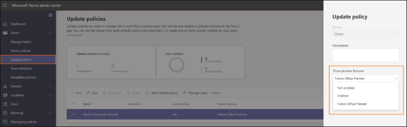

# Force Public Preview  

Teams Public Preview channel allow customers to easily preview and evaluate pre-release Teams features. There are no program requirements or commitments. This is an opt-in channel controlled via IT admin policy (`AllowPublicPreview`). Public preview is enabled on a per-user basis.  

IT admins have three options to configure their users' public preview setting: 

 - **Follow Office Preview** (default): This default option will automatically enable Teams Public Preview features for any user enrolled in Office Current Channel (Preview). There are no more actions required by the end user. 

 - **Enabled**: This option enables Teams Public Preview regardless of whether a user is enrolled in Office Current Channel (Preview). The end user must also opt-in to Teams public preview in their Teams app. 

 - **Not enabled**: Teams Public Preview features will not be available to end users. 
 
IT admins can update this policy from Teams admin center (as shown below) or via PowerShell cmdlet (`CsTeamsUpdateManagementPolicy`). 

 

Here is an example cmdlet to set the Teams global policy to Enabled:  

```
Set-CsTeamsUpdateManagementPolicy -Identity Global -AllowPublicPreview "Enabled" 
```

