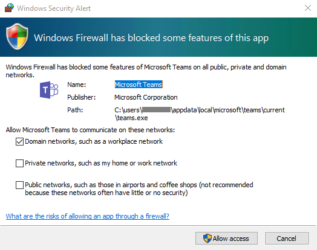
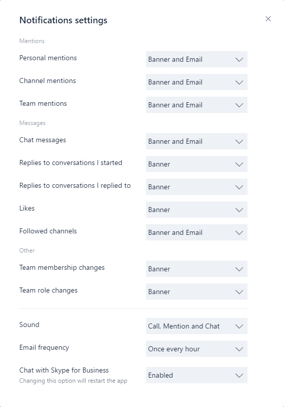

Get clients for Microsoft Teams 
===========================

Microsoft Teams has clients available for desktop (Windows and Mac), web, and mobile (Android and  iOS). These clients all require an active internet connection and do not support an offline mode.

> [!NOTE]
> Effective November 29, 2018, you'll no longer be able to use the Microsoft Teams for Windows 10 S (Preview) app, available from the Microsoft Store. Instead, you can now download and install the desktop client on devices running Windows 10 S mode. To download the desktop client, go to [https://teams.microsoft.com/downloads](https://go.microsoft.com/fwlink/?linkid=855754). 
>
> MSI builds of the Teams desktop client are not yet available for devices running Windows 10 S mode.  

Desktop client
--------------

> [!Tip]
> Watch the following session to learn about the benefits of the Windows Desktop Client, how to plan for it, and how to deploy it: [Teams Windows Desktop Client](https://aka.ms/teams-clients)

The Microsoft Teams desktop client is a standalone application and currently not part of Office 365 ProPlus. Teams is available for both Windows (7+), both 32-bit and 64-bit versions, and macOS (10.10+). On Windows, Teams requires .NET Framework 4.5 or later; the Teams installer will offer to install it for you if you don't have it. 

The desktop clients provide real-time communications support (audio, video, and content sharing) for team meetings, group calling, and private one-on-one calls.

Desktop clients can be downloaded and installed by end users directly from [https://teams.microsoft.com/downloads](https://go.microsoft.com/fwlink/?linkid=855754) if they have the appropriate local permissions (admin rights are not required to install the Teams client on a PC but are required on a Mac).

IT admins can choose their preferred method to distribute the installation files to computers in their organization, such as System Center Configuration Manager (Windows) or Jamf Pro (macOS). To get the MSI package for Windows distribution, see [Install Microsoft Teams using MSI](msi-deployment.md).

> [!NOTE]
> Distribution of the client via these mechanisms is only for the initial installation of Microsoft Team clients and not for future updates.

### Windows

The Microsoft Teams installation for Windows provides downloadable installers in 32-bit and 64-bit architecture.

> [!NOTE]
> The architecture (32-bit vs. 64-bit) of Microsoft Teams is agnostic to the architecture of Windows and Office that is installed.

The Windows client is deployed to the AppData folder located in the user’s profile. Deploying to the user’s local profile allows the client to be installed without requiring elevated rights. The Windows client leverages the following locations:

- %LocalAppData%\\Microsoft\\Teams

- %LocalAppData%\\Microsoft\\TeamsMeetingsAddin

- %AppData%\\Microsoft\\Teams

- %LocalAppData%\\SquirrelTemp

When users initiate a call using the Microsoft Teams client for the first time, they might notice a warning with the Windows firewall settings that asks for users to allow communication. Users might be instructed to ignore this message because the call will work, even when the warning is dismissed.



> [!NOTE]
> Windows Firewall configuration will be altered even when the prompt is dismissed by selecting “Cancel”. Two inbound rules for teams.exe will be created with Block action for both TCP and UDP protocols.

### Mac

Mac users can install Teams by using a PKG installation file for macOS computers. Administrative access is required to install the Mac client. The macOS client is installed to the /Applications folder.

#### Install Teams by using the PKG file

1. From the [Teams download page](https://teams.microsoft.com/downloads), under **Mac**, click **Download**.
2. Double click the PKG file.
3. Follow the installation wizard to complete the installation.
4. Teams will be installed to /Applications folder. It is a machine-wide installation.

> [!NOTE]
> During the installation, the PKG will prompt for admin credentials. The user needs to enter the admin credentials, regardless of whether or not the user is an admin.

If a user currently has a DMG installation of Teams and wants to replace it with the PKG installation, the user should:

1. Exit the Teams app.
2. Uninstall the Teams app.
3. Install the PKG file.

IT admins can use managed deployment of Teams to distribute the installation files to all Macs in their organization, such as Jamf Pro.

> [!NOTE]
> If you experience issues installing the PKG, let us know. In the **Feedback** section at the end of this article, click **Product feedback**.

Web client 
----------

The web client ([https://teams.microsoft.com](https://go.microsoft.com/fwlink/?linkid=855753)) is a full, functional client that can be used from a variety of browsers. The web client supports Calling and Meetings by using webRTC, so there is no plug-in or download required to run Teams in a web browser. The browser must be configured to allow third-party cookies. 

[!INCLUDE [browser-support](includes/browser-support.md)]

The web client performs browser version detection upon connecting to [https://teams.microsoft.com](https://go.microsoft.com/fwlink/?linkid=855753). If an unsupported browser version is detected, it will block access to the web interface and recommend that the user download the desktop client or mobile app.

Mobile clients
--------------

The Microsoft Teams mobile apps are available for Android and iOS, and are geared for on-the-go users participating in chat-based conversations and allow peer-to-peer audio calls. For mobile apps, go to the relevant mobile stores Google Play and the Apple App Store. The Windows Phone App was retired July 20, 2018 and may no longer work. 

Supported mobile platforms for Microsoft Teams mobile apps are the following:

-   **Android**: 4.4 or later

-   **iOS**: 10.0 or later

> [!NOTE]
> The mobile version must be available to the public in order for Teams to work as expected.

Mobile apps are distributed and updated through the respective mobile platform’s app store only, and are not available to be distributed through MDM (mobile device management) solutions or side-loaded.


| | | |
|---------|---------|---------|
|      |Decision Point         |Are there any restrictions preventing users from installing the appropriate Microsoft Teams client on their devices?         |
|     |Next Steps         |If your organization restricts software installation, make sure that process is compatible with Microsoft Teams. Note: Admin rights are not required for PC client installation but are required for installation on a Mac.         |

Client update management
------------------------

Clients are currently updated automatically by the Microsoft Teams service with no IT administrator intervention required. If an update is available, the client will automatically download the update and when the app has idled for a period of time, the update process will kick off.

Client-side configurations
---------------------------

Currently, there are no supported options available to configure the client either through the tenant admin, PowerShell, Group Policy Objects or the registry.

Notification settings
----------------------------

There are currently no options available for IT administrators to configure client-side notification settings. All notification options are set by the user. The figure below outlines the default client settings.



Sample PowerShell Script
----------------------------

This sample script, which needs to run on client computers in the context of an elevated administrator account, will create a new inbound firewall rule for each user folder found in c:\users. When Teams finds this rule, it will prevent the Teams application from prompting users to create firewall rules when the users make their first call from Teams. 

```

<#
.Synopsis
   Creates firewall rules for Teams.
.DESCRIPTION
   (c) Microsoft Corporation 2018. All rights reserved. Script provided as-is without any warranty of any kind. Use it freely at your own risks.
   Must be run with elevated permissions. Can be run as a GPO Computer Startup script, or as a Scheduled Task with elevated permissions. 
   The script will create a new inbound firewall rule for each user folder found in c:\users. 
   Requires PowerShell 3.0.
#>

#Requires -Version 3

$users = Get-ChildItem (Join-Path -Path $env:SystemDrive -ChildPath 'Users') -Exclude 'Public', 'ADMINI~*'
if ($users.Length -gt 0)
{
    foreach ($user in $users)
    {
        $progPath = Join-Path -Path $user.FullName -ChildPath "AppData\Local\Microsoft\Teams\Current\Teams.exe"
        if (Test-Path $progPath)
	    {
	        if (-not (Get-NetFirewallApplicationFilter -Program $progPath -ErrorAction SilentlyContinue))
		    {
                $ruleName = "Teams.exe for user $($user.Name)"
                "UDP", "TCP" | ForEach-Object { New-NetFirewallRule -DisplayName $ruleName -Direction Inbound -Profile Domain -Program $progPath -Action Allow -Protocol $_ }
                Clear-Variable ruleName
		    }
	    }
        Clear-Variable progPath
    }
}

```
