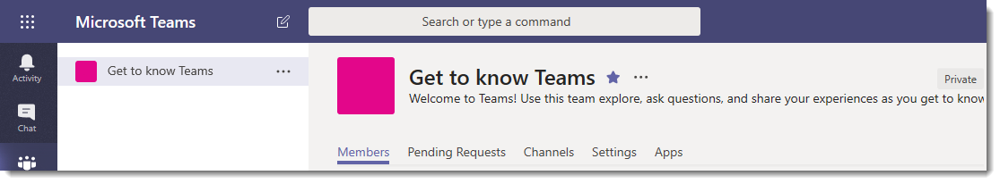
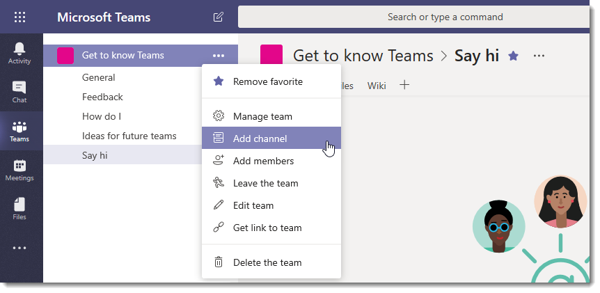
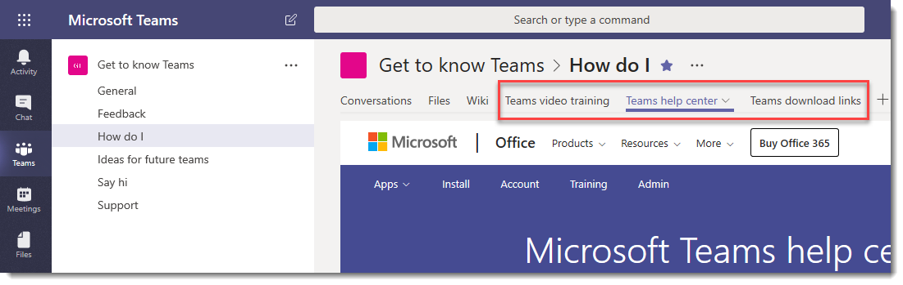

# Create your first teams and channels in Microsoft Teams

Setting up and using your first set of teams and channels builds your experience with Teams and identifies champions who can help drive Teams adoption across your organization. 
If you haven't installed Teams yet, check out [Get Teams clients](get-clients.md) and [Sign in to Teams using modern authentication](sign-in-teams.md).

## Suggestions for your first teams and channels

 A team is a collection of people who gather together around a common goal. Channels are the collaboration spaces within a team where the actual work gets done. 

To learn more, see [Overview of teams and channels in Teams](teams-channels-overview.md) and [Best practices for organizing teams in Teams](best-practices-organizing.md).

 We suggest you start with a “Get to know Teams” team where your early adopters can play around, ask questions, and discover the capabilities of Teams. This team can be essential to your success as you begin to experiment with Teams. 

### "Get to know Teams" team
Your project team can use the “Getting to know Teams” team to ensure they're set up with Teams clients, have some initial conversations, and explore what Teams can do. You may already have a group of people in your organization who enjoy getting early access to new capabilities. This can be one of their initial teams when you bring them on board and will help you get early feedback.

Here's a suggested structure for the team.

| Channel | Description and usage | Pinned tabs, bots, and apps |
| ------------ | -------------------- | -------------------- |
| General | All teams start with a General channel. Use this channel to make announcements as you start getting to know Teams. |  |
| Say hi | Introduce yourself to the team and share what you want to get from Teams. |  |
| How do I | A channel to ask how-to questions. Step 1 – install the desktop and mobile clients. Step 2 – jump into Teams.| Pinned tab that links to the [Teams help center](https://support.office.com/teams) Pinned tab that links to [Teams training videos](https://support.office.com/article/microsoft-teams-video-training-4f108e54-240b-4351-8084-b1089f0d21d7) Pinned tab that links to [Teams desktop and mobile client download links](https://teams.microsoft.com/downloads) |
| Feedback | Share your thoughts on your Teams experiences. | Pinned tab with Polly Poll|
| Ideas for future teams | Share your thoughts on where Teams can drive additional value in your organization. What could these teams be called? Who would be members? ||
| Support | If something isn't working as expected, use this channel to get help. ||

## Get your first teams up and running
As an admin, you can create and manage teams and channels in the Teams client or the Microsoft Teams admin center. You can create teams as public or private. You can also create an [org-wide team](create-an-org-wide-team.md). Anyone using Teams in your organization can join a public team. For private teams, team owners manage team membership. And for an org-wide team, everyone in your organization is automatically added. 

To get started, we recommend you create private teams and add another owner to manage team settings and membership. 

> [!NOTE]
> In the steps that follow, we use the Teams desktop client to create teams and channels. Keep in mind that as an admin, you can also do these tasks in the Microsoft Teams admin center.

### Create a team

On the left side of Teams, click **Teams**, at the bottom of the teams list, click **Join or create a team**, and then click **Create a new team**.

Once you've created the team, invite people to join it. You can add individual users, groups, and even entire contact groups (formerly known as "distribution lists"). 

 

### Add a team owner
Find the team that you created, click **More options ˙˙˙** > **Manage team**. Then go to the **Members** tab. Find the people you want to designate as team owners. Under **Role**, click **Owner**.

### Create a channel in a team
Find the team that you created, click **More options ...** > **Add channel**. You can also click **Manage team** and add a channel in the **Channels** tab. 

 

Give the channel a descriptive name to make it easier for users to understand the purpose of the channel. 

As a team owner, you can automatically favorite channels for the whole team, making the channels more visible for everyone on the team. You can also pin tabs to the channel to add tools, such as OneNote, links to webpages, and other content to make it easy for users to find what they need and share their thoughts.  

Here's an example of the "How do I" channel in the "Get to know Teams" team, showing pinned tabs that link to Teams webpages &ndash; Teams video training, Teams help center, and Teams download links. 

 

## Next steps
Go to [Onboard your early adopters](get-started-with-teams-onboard-early-adopters.md).
